# 参考链接

[fall20备份网站](https://www.learncs.site/docs/curriculum-resource/cs61c/syllabus)

[课程视频bilibili(字幕翻译比较难绷)](https://www.bilibili.com/video/BV1fC4y147iZ/?share_source=copy_web&vd_source=7c3823b46a52fbbef42b79e01d55c300)

[课程视频youtube](https://www.youtube.com/playlist?list=PL0j-r-omG7i0-mnsxN5T4UcVS1Di0isqf)

[课程作业仓库](https://github.com/InsideEmpire/CS61C-Assignment#)

[我的作业仓库](https://github.com/Moonhalf383/Moonhalf-CS61C-Assignment#)

[csdiy介绍](https://web.archive.org/web/20220120134001/https://inst.eecs.berkeley.edu/~cs61c/fa20/)

# 前言

在经过了折腾计算机设计比赛的两个月后，感觉有必要学点更底层的东西。于是开坑CS61C。CS61B一定会找时间补完的（但愿如此）。

选fall20自学原因是fall20的时间点属于卡上疫情红利了，ucb线上授课导致网络资料前无古人后无来者的丰富（做梦都想去ucb上学😢）。CS61C主要关注的内容是计算机的硬件细节，以下直接搬运csdiy的内容简介：

> 伯克利 CS61 系列的最后一门课程，深入计算机的硬件细节，带领学生逐步理解 C 语言是如何一步步转化为 RISC-V 汇编并在 CPU 上执行的。和 Nand2Tetris 不同，这门课 在难度和深度上都会提高很多，具体会涉及到流水线、Cache、虚存以及并发相关的内容。
>
> 这门课的 Project 也非常新颖有趣。Project1 会让你用 C 语言写一个小程序，20 年秋季学期是著名的游戏 Game of Life。Project2 会让你用 RISC-V 汇编编写一个神经网络，用来 识别 MNIST 手写数字，非常锻炼你对汇编代码的理解和运用。Project3 中你会用 Logisim 这个数字电路模拟软件搭建出一个二级流水线的 CPU，并在上面运行 RISC-V 汇编代码。Project4 会让你使用 OpenMP, SIMD 等方法并行优化矩阵运算，实现一个简易的 Numpy。

需要注意的是，homwork似乎目前没有人有相关资源。目前能做的只有lab和project。

找理由环节到此结束，我们快速步入正题。

# Lecture 01

bilibili上的课程视频中文字幕配的还不如直接看英文原文，建议看youtube版。（Dan教授未免太有激情了）

CS61C - 计算机架构中的伟大思想：

伟大思想一： Abstraction (Levels of Representation / Interpretation)，建立一堆相互隔离的抽象层，这样写高级语言的时候不用关心底层的门电路。

伟大思想二： Moore's law， 半导体晶体管(transistor)数量每两年左右翻一倍。

A's law（？）你的后代在上ucb的时候都会得A（并非）。


伟大思想三： Principle of locality / memory hierarchy 局部性原理和内存层次结构。

伟大思想四： Parallelism 并行思想

伟大思想五： Performance Measurement & Inprovement

伟大思想六： Dependability via Redundancy 通过冗余（？）获取可靠性

# Lecture 02

模拟信号转数字信号，bit可以表示所有事物，数制转换。

常见的颜色代码为6位，每两位代表rgb中一个颜色的十六进制数值。比如#FF0000表示红色，FF即红色数值为255，其余两个00表示绿色和蓝色为0。（头一次知道，成丈育了）

# Lab 00

## setup

经典的配置环境环节。学习本课程需要你会一些基本技能：

- git & github
- 会用类unix的command line工具
- ssh和scp（如果你是ucb的学生）
- vim基础（喜）

本课程对于ide没有任何要求，甚至鼓励使用tui text editor。

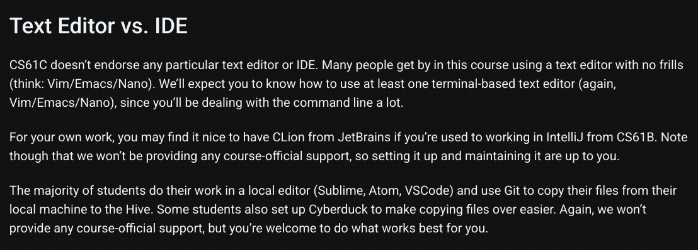

对于非ucb的学生，fork一份[这个仓库](https://github.com/InsideEmpire/CS61C-Assignment#%E4%B8%AD%E6%96%87%E8%AF%B4%E6%98%8E)克隆到本地就可以开始写代码了。

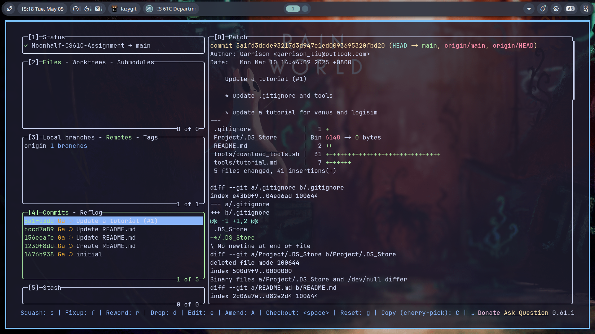

> Which command walks a file hierarchy in search of a keyword?

```sh
grep -r "keyword" /path/to/directory
```

> Which command displays information about processes running on your machine?

显示进程：

```sh
ps
```

显示所有进程：

```sh
ps aux
```

> Which command terminates a process?

根据进程id停止进程：

```sh
kill 12345
```

根据进程名称杀死进程。`pkill`使用部分匹配，`killall`使用完全匹配。

```sh
killall qq
```

> Which command can help you find the difference between two files?

```sh
diff file1 file2
```

# Lecture 03

C语言的编译过程分为两步： 先将`xx.c`的C语言文件编译为`xx.o`的机器码，之后将`.o`文件链接成一个可执行文件。

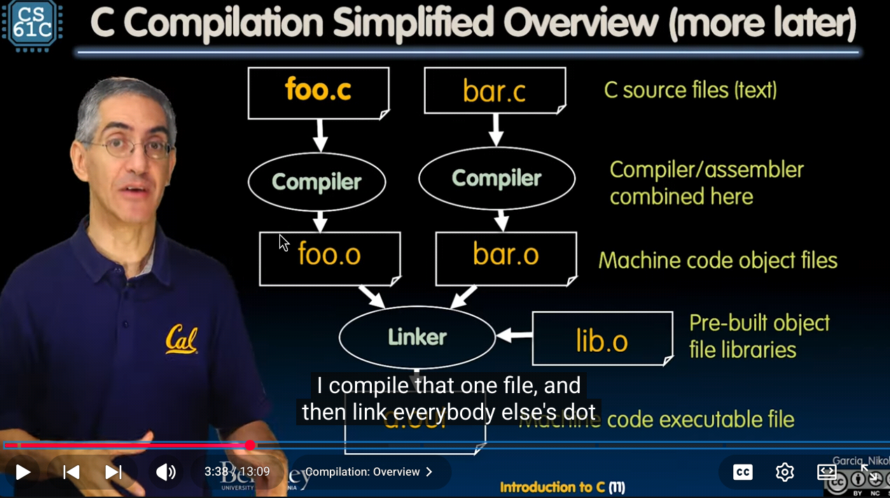

先编译为汇编代码之后链接为可执行文件的模式提高了编译效率，因为每次修改代码只需要重新编译修改的`.c`文件之后重新链接，而不需要从头编译整个项目。此外，编译代码极大提高了runtime performance。对机器来说读低级语言比读高级语言省力的多。

缺点如下：

- 不同处理器或操作系统可能采用不同的架构，不同架构必须采用对应的编译方式，所以可执行文件必须在所有操作系统上重建一遍。
- 每次迭代都必须把经历修改、编译、运行的全过程，开发速度比较慢。

C Pre-Processor，简称CPP（并非C++)，会处理所有预处理指令。比如：

```c
#include "files.h"
```

在经过CPP的时候，CPP会用`files.h`的内容直接替换掉`#include`这一行，得到一个`xx.i`文件。同理，`#include <stdio.h>`做的是一样的事情，只不过是从标准库里获取文件; `#define PI 3` 可以在预处理期将所有PI替换为3，`#if`、`#endif`负责控制部分条件下include文件。

`#define xx`定义的是一个所谓的**宏**（即macro）。如前文所说，macro的作用是CPP中直接进行文本替换。你可以用它来做很多事情，但是它并不是真正的函数，在一些时候会导致意外情况。

比如：

```c
#include <stdio.h>

#define min(X, Y) X < Y ? X : Y

int x = 0;

int y = 3;

int main(int argc, char *argv[]) {
  for (int i = 0; i < 5; i++)
    printf("%d\n", min(x++, y));
  return 0;
}
```

我们会期待：重复进行5次比较，每次都打印x和y中最小的那个数字，之后x自增1。所以我们会期待结果为：

```sh
0
1
2
3
3
```

但是实际的输出为：

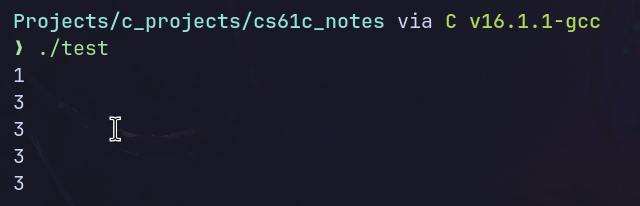

原因在于CPP将`min(x++, y)`直接替换为了`x++ < y?x++:y`。这就导致第一次输出前x已经进行了一次自增，所以第一个数字为1而非0，输出之后x又自增了1。导致之后输出结果只有3。

一些gcc的指令如下：

```sh
gcc -E hello.c -o hello.i # 预处理得到.i文件
```

```sh
gcc -S hello.i -o hello.s # 翻译得到汇编语言
```

```sh
gcc -c hello.s -o hello.o # 翻译为机器指令
```

```sh
gcc hello.o -o hello # 生成可执行文件
```

所以我们不妨来看一下`test.i`的内容：

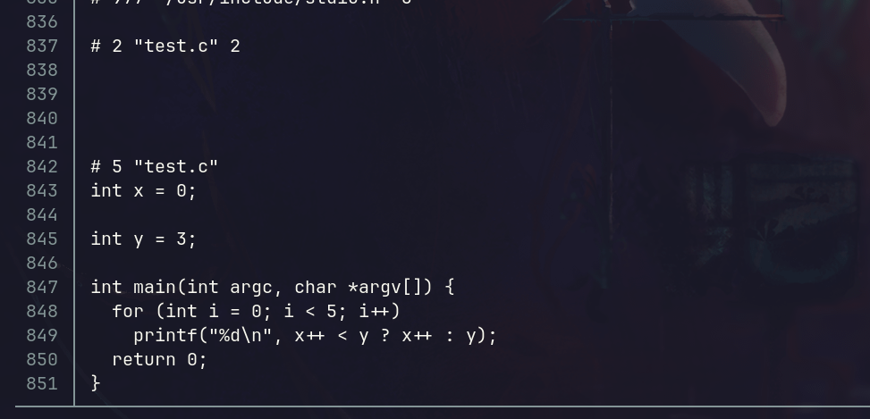

只节选最后一部分的原因是如我们前文所说的，`#include <stdio>`会把这个头文件的所有内容直接插入进来，所以前面出现了大量看不懂的神秘代码。只看尾部可以看到，`min(x++, y)`确实被替换为了`x++ < y ? x++ : y`。这就导致出现了不符合预期的结果。

# Lecture 3 & 4 & 5

讲的是C语言的基本语法，直接跳过。

# lab 01

```bash
sudo apt install build-essential cgdb valgrind
```

本地安装C语言的编译和调试工具。gdb意为GNU debugger。使用gdb要求编译时加上`-g`参数，如下：

```bash
gcc -g hello.c -o hello
```

CS61C中使用的是cgdb，相比于gdb有更高级的终端前端界面。cgdb的操作逻辑非常vim，normal模式即查看源代码，insert模式即输入gdb指令。

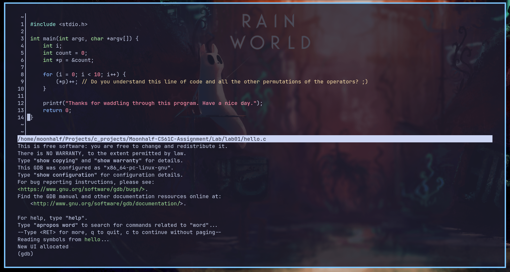

一些基本使用方法如下：

- Esc切换到源码窗口
- i切换回gdb命令行模式
- 空格键增减断点
- F5运行程序
- F6继续执行
- F7单步步进
- F8单步跳过
- F10退出

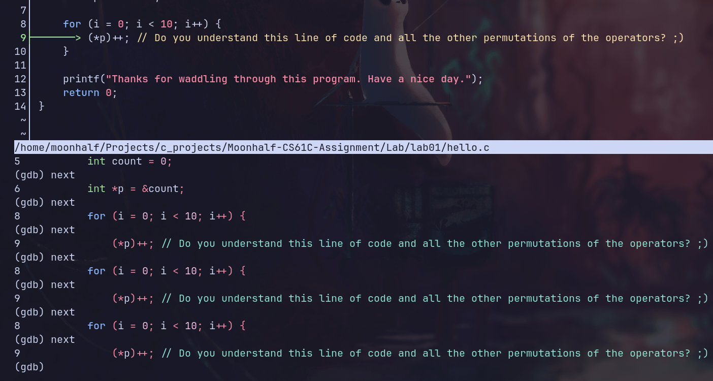

> 1. While you’re in a gdb session, how do you **set the arguments** that will be passed to the program when it’s run?
> 2. How do you **create a breakpoint**?
> 3. How do you **execute the next line of C code** in the program after stopping at a breakpoint?
> 4. If the next line of code is a function call, you’ll execute the whole function call at once if you use your answer to #3. (If not, consider a different command for #3!) How do you tell GDB that you **want to debug the code inside the function** (i.e. step into the function) instead? (If you changed your answer to #3, then that answer is most likely now applicable here.)
> 5. How do you **continue the program after stopping** at a breakpoint?
> 6. How can you **print the value of a variable** (or even an expression like 1+2) in gdb?
> 7. How do you configure gdb so it **displays the value of a variable after every step**?
> 8. How do you **show a list of all variables and their values** in the current function?
> 9. How do you **quit** out of gdb?

1. 在gdb会话中`set args [arg0] [arg1] ...`
2. 空格键，或者break n
3. F8，或者next
4. F7，或者step
5. F6，或者continue
6. print var_name
7. display var_name
8. info locals
9. q

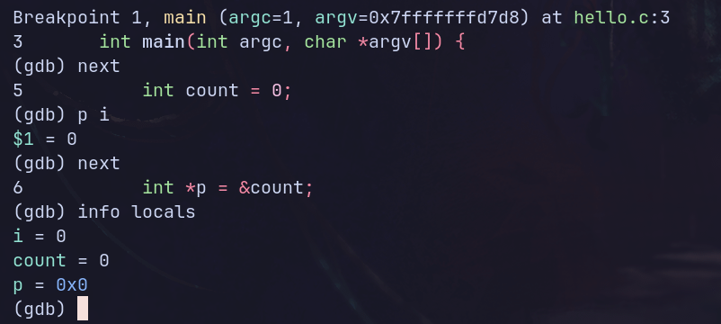

通过`set args < name.txt`将参数设置为重定向符与文本文件，并在同一目录下放一个写入名字的文本文件，我们就允许在cgdb调试时输入内容。

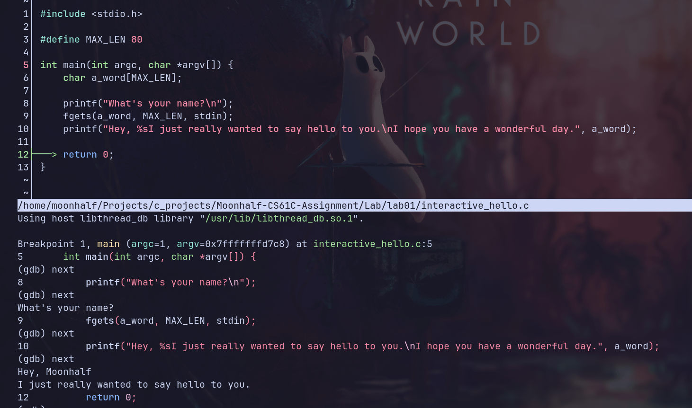

```c
int main() {
    int a[20];
    for (int i = 0; ; i++) {
        a[i] = i;
    }
}
```

valgrind可以用来模拟cpu并追踪内存访问。以上代码显然存在非法访存问题，`valgrind ./segfault`输出结果如下：

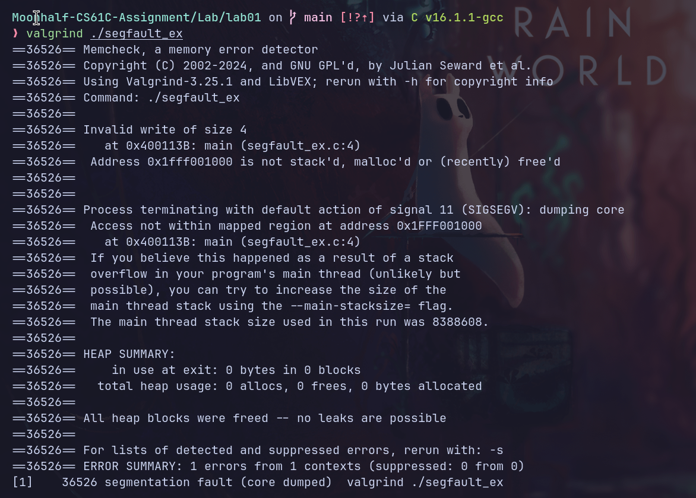

以上信息中，valgrind抛出Invalid write of size 4，表面有一个大小为4的非法写入，试图访问的内存地址为0x1fff001000，而valgrind检查后发现该地址即不在栈上，也不在堆上，也不是最近free的内存。

```c
#include "ll_cycle.h"
#include <stddef.h>

int ll_has_cycle(node *head) {
  /* your code here */
  if (!head)
    return 0;
  node *tortoise = head;
  node *hare = head;
  if (!hare->next)
    return 0;
  while (1) {
    hare = hare->next;
    if (!hare)
      return 0;
    hare = hare->next;
    if (!hare)
      return 0;
    tortoise = tortoise->next;
    if (tortoise == hare)
      return 1;
  }
  return 0;
}
```

exercise 5，用C语言检查一个单向链表是否成环。注意head可以为空，head->next可以为空。

# Project 1

## Part A

```c
// Opens a .ppm P3 image file, and constructs an Image object.
// You may find the function fscanf useful.
// Make sure that you close the file with fclose before returning.
Image *readData(char *filename) {
  Image *imageData = (Image *)malloc(sizeof(Image));
  FILE *fp = fopen(filename, "r");
  char format[2];
  int color_range = 255;
  fscanf(fp, "%s", format);
  fscanf(fp, "%d %d", &imageData->cols, &imageData->rows);
  fscanf(fp, "%d", &color_range);
  imageData->image = (Color **)malloc(imageData->rows * sizeof(Color *));
  for (int i = 0; i < imageData->rows; i++) {
    imageData->image[i] = (Color *)malloc(imageData->cols * sizeof(Color));
  }
  for (int i = 0; i < imageData->cols * imageData->rows; i++) {
    Color *target_image =
        &imageData->image[i / imageData->cols][i % imageData->cols];
    fscanf(fp, "%hhu", &target_image->R);
    fscanf(fp, "%hhu", &target_image->G);
    fscanf(fp, "%hhu", &target_image->B);
  }
  fclose(fp);
  return imageData;
}
```

读取ppm文件得到Image object。注意通过malloc动态分配内存，二维数组要分配两次。（好久没写C语言导致这些概念完全不记得了）

```c
// Given an image, prints to stdout (e.g. with printf) a .ppm P3 file with the
// image's data.
void writeData(Image *image) {
  // YOUR CODE HERE
  printf("P3\n");
  printf("%d %d\n", image->cols, image->rows);
  printf("%d\n", 255);
  for (int row = 0; row < image->rows; row++) {
    for (int col = 0; col < image->cols; col++) {
      Color *target_color = &image->image[row][col];
      printf("%hhu %hhu %hhu", target_color->R, target_color->G,
             target_color->B);
      if (col == image->cols - 1)
        printf("\n");
      else
        printf("   ");
    }
  }
}

// Frees an image
void freeImage(Image *image) {
  // YOUR CODE HERE
  for (int i = 0; i < image->rows; i++) {
    free(image->image[i]);
  }
  free(image->image);
  free(image);
}
```

输出和释放内存。释放内存同样需要依次释放所有指针，避免内存泄漏。

### steganography

```c
// Given an image, creates a new image extracting the LSB of the B channel.
Image *steganography(Image *image) {
  Image *newImage = (Image *)malloc(sizeof(Image));
  newImage->rows = image->rows;
  newImage->cols = image->cols;
  newImage->image = (Color **)malloc(sizeof(Color *) * image->rows);
  for (int i = 0; i < image->rows; i++) {
    newImage->image[i] = (Color *)malloc(sizeof(Color) * image->cols);
  }
  for (int i = 0; i < image->rows; i++) {
    for (int j = 0; j < image->cols; j++) {
      Color *newColor = evaluateOnePixel(image, i, j);
      newImage->image[i][j] = *newColor;
      free(newColor);
    }
  }
  return newImage;
  // YOUR CODE HERE
}
```

读取一个ppm图像的B数值的最后一个bit，若为1则该像素替换为白色，若为0则替换为黑色，最后可以解析得到一个新的图像。

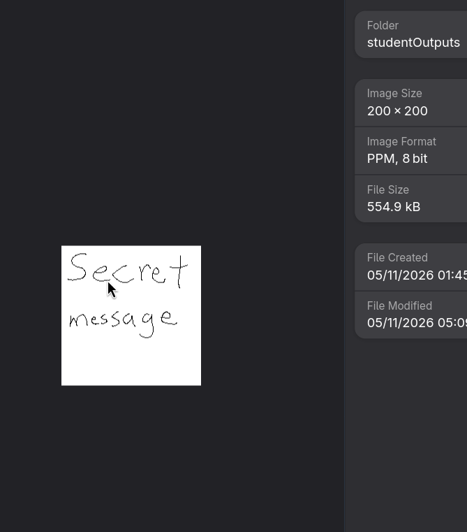

（迫真scret message）

## Part B

彩色生命游戏的规则是：每个颜色通道有8个bit，RGB三个颜色即有24个bit，对于每个像素的每个bit，单独运行一个康威生命游戏。

```c
Color *evaluateOneCell(Image *image, int row, int col, uint32_t rule) {
  Color *newColor = (Color *)malloc(sizeof(Color));
  Color curColor = image->image[row][col];
  int width = image->cols;
  int height = image->rows;
  // 对三个通道、每个通道8个bit统计邻居数量。
  int neighbourCount[3][8] = {0};
  // 对目标格子周围8个格子统计其三个通道的数值。
  uint8_t grid[8][3] = {0};
  int index = 0;
  for (int i = -1; i < 2; i++) {
    for (int j = -1; j < 2; j++) {
      int targetRow = (row + i + height) % height;
      int targetCol = (col + j + width) % width;
      if (targetRow == row && targetCol == col)
        continue;
      grid[index][0] = image->image[targetRow][targetCol].R;
      grid[index][1] = image->image[targetRow][targetCol].G;
      grid[index][2] = image->image[targetRow][targetCol].B;
      index++;
    }
  }
  for (int chan = 0; chan < 3; chan++) {
    for (int bit = 0; bit < 8; bit++) {
      uint8_t target = 1 << bit;
      for (int i = 0; i < 8; i++) {
        if (grid[i][chan] & target)
          neighbourCount[chan][bit]++;
      }
      // printf("chan: %d  bit: %d neighbour: %d", chan, bit,
      // neighbourCount[chan][bit]);
    }
  }
  uint8_t curChan[3] = {curColor.R, curColor.G, curColor.B};
  for (int chan = 0; chan < 3; chan++) {
    for (int bit = 0; bit < 8; bit++) {
      int ptr = neighbourCount[chan][bit];
      if (curChan[chan] & (1 << bit))
        ptr += 9;
      if (rule & (1 << ptr))
        curChan[chan] |= (1 << bit);
      else
        curChan[chan] &= ~(1 << bit);
    }
  }
  newColor->R = curChan[0];
  newColor->G = curChan[1];
  newColor->B = curChan[2];
  return newColor;
  // YOUR CODE HERE
}
```

（本人非算法竞赛圈内人，实现不够优雅还请见谅）

用来根据rule推断一个像素下一回合会是什么颜色。写的过程中遇到了一万个错误。其中`targetRow`和`targetCol`的计算上需要先加width或height再求余数，原因在于C语言中求余结果符号与第一个值保持一致，而我们不希望负数。

此外，rule虽然读取的是一个0x1808这样的四位16进制数，按理只有16个位，但是我们用`uint32_t`类型存储，使得实际上有32个位，而我们实际需要至少18个位。（因为对于活着和死了的情况，周围邻居都有0～8个不等）。`ptr`在该bit活着的情况下需要自加9。

其余部分和steganography差异不大，遍历所有像素得到新的图像即可。

最后得到的一个效果图：


