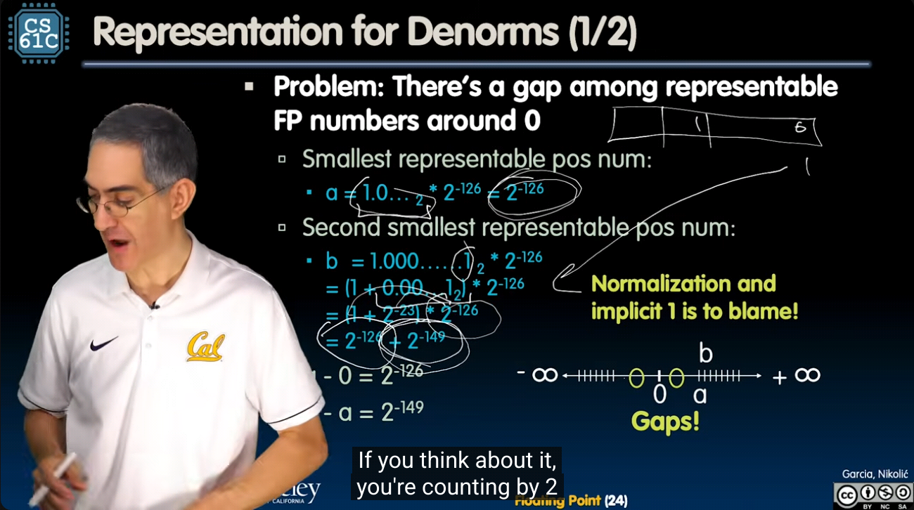
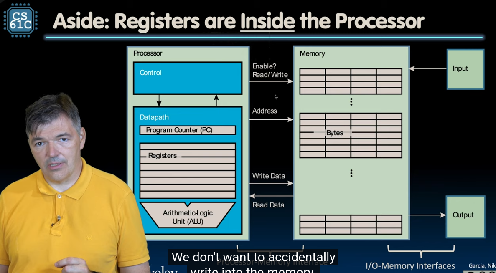
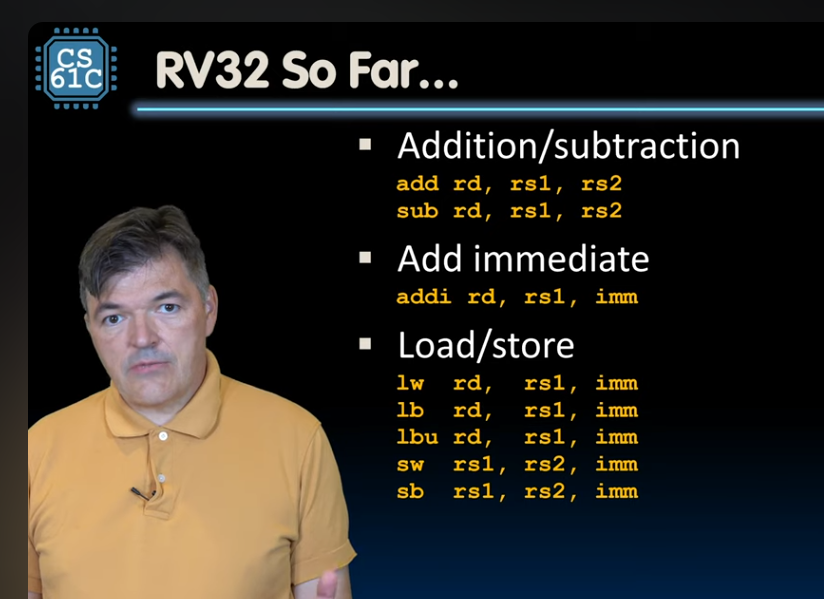
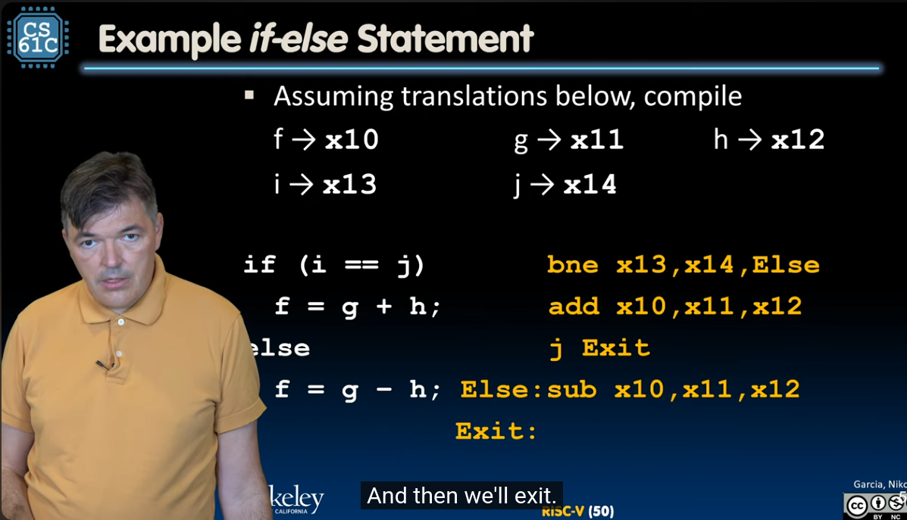
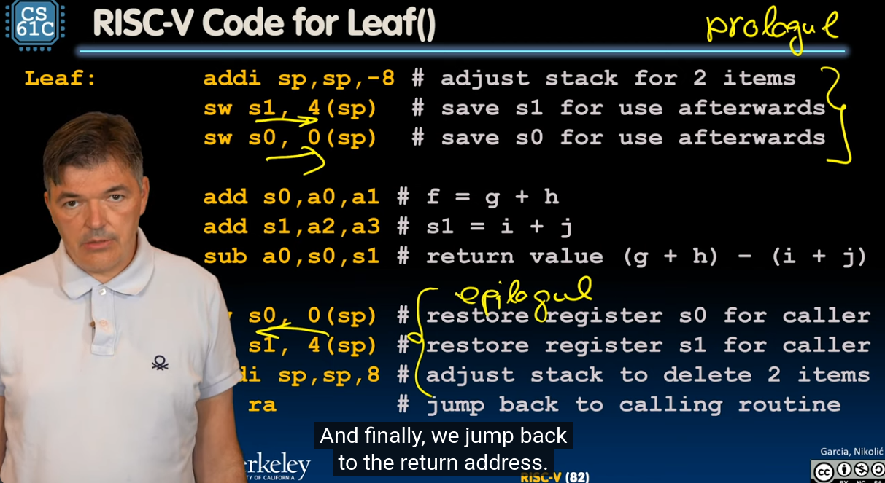
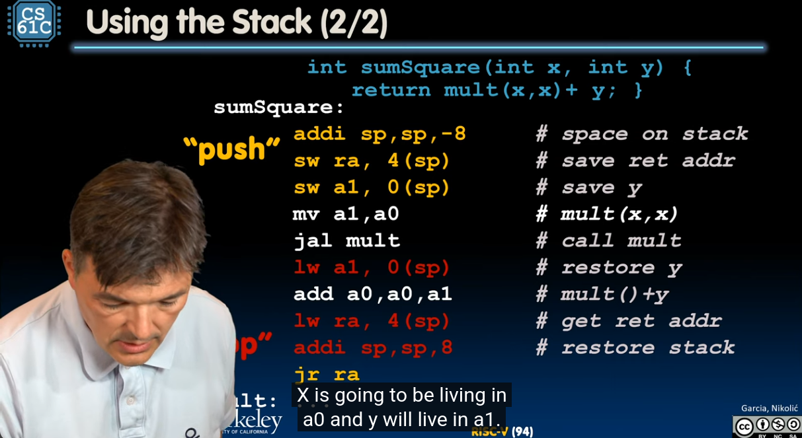
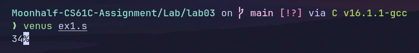
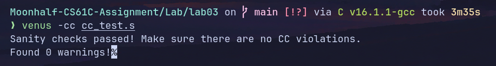

# 参考链接

[fall20备份网站](https://www.learncs.site/docs/curriculum-resource/cs61c/syllabus)

[课程视频youtube](https://www.youtube.com/playlist?list=PL0j-r-omG7i0-mnsxN5T4UcVS1Di0isqf)

[课程作业仓库](https://github.com/InsideEmpire/CS61C-Assignment#)

[csdiy介绍](https://web.archive.org/web/20220120134001/https://inst.eecs.berkeley.edu/~cs61c/fa20/)

# 本篇要素

- Lecture 6, 7, 8, 9, 10
- Lab 2, 3

# 神秘的学习路径规划

因为对硬件知识不太感兴趣，所以规划了一条有点邪修的学习路径：

- CS61C做到汇编实现手写数字识别，之后跳过CPU直接去学内存与并行，做proj4。
- CSAPP同样跳过硬件部分，做完bomblab、cachelab、attacklab、malloclab。
- jyyos全推。
- 准备进入CS336。

仅供参考，不建议一比一复刻。

# Lecture 6 浮点数表示

计算机中的浮点数可以完全类比科学记数法表示，只不过把底数的10换成2。


IEEE 754标准，任何一个浮点数可以表示如下：
$$
 V = (-1)^S \cdot M \cdot 2^E
$$
其中$S$表示符号位，$M$表示尾数，即有效数字，$E$表示指数位，即二进制下小数点的位置。存储结构上，单精度浮点数`float`总位数为32，包含一个符号位、8个指数位以及23个尾数位；双精度浮点数`double`总位数64，包含一个符号位，11个指数位以及52个尾数位。

IEEE 754的设计非常精妙。比如，对二进制来说，用科学记数法计数时整数位肯定是1，所以IEEE 754的规格化数字只会存储小数部分。其次，比较大小最方便的还是直接套用整数比较的逻辑，IEEE使用偏移量来表示指数正负：对于单精度浮点数，内存中实际存储的值是实际指数值加上127。比如当如E为$-126$实际存储的就是1，当E为0的时候存储的就是127，当E为127的时候存储的就是254。这样做的好处是直接将指数与位数连起来看作一个完整的整数即可比较两者大小。

不同于整数的补码规则，E和M均为0的时候表示浮点数0，即存在$+0和-0$。IEEE 754还有以下特殊数字：

- E全为1而M全为0：$\infty或-\infty$
- E全为1而M不全为0：非法运算，即NaN（Not a Numble）
- E全为0而M不为0：非规格化数字

IEEE 754标准的很多特殊规则实际并不是因为硬件实现上简洁。比如，对于NaN来说，M最高位为1时表示**静默浮点数qNaN**，它与任何其他数字计算得到的结果都是qNaN，而这个规律并不是二进制运算原生特有的规则，在实现上是通过浮点运算单元来强制保障实现的。

你会注意到NaN有非常多的变种。只要E全为0，M不全为0，表示的数字都为NaN。这样做的意义在于计算机可以把产生NaN的原因写入尾数中方便排错。



对于规格化的数字，我们默认隐藏位为1，但是当E存储值为1的时候，我们可以看到隐藏位的数值和M表示的数值之间相差了相当大的数量级差距，因此我们采用非规格化数字来逐步下溢。举个例子：

`0 00000001 00000000000000000000000` 这是一个float32。这是最小的规格化数，其值为$1\cdot{2}^{-126}$。假如我们让数字再小一点，规格化就无法继续表示数字，因此数字会直接下溢为0，导致精度损失。为了进一步压榨可利用的精度，我们规定，对于更小的数字，我们将隐含的前导位由1改为0，并将E固定为$1-bias = -126$。即对于非规格化float32数，其值表示为：
  $$
  (-1)^s \times 0.\text{fraction} \times 2^{1-\text{bias}}
  $$
这样当数字低于最小规格化数之后，我们仍然可以表示一部分更小的数字，只不过其中指数每减一，精度就会损失一位。比如`0 00000000 00000000000000000000001`是最小的非规格数，其值为$2^{-149}$。此时有效位数只剩1位了。

[本节lecture提供了IEEE 754模拟器](https://www.h-schmidt.net/FloatConverter/IEEE754.html)，非常直观的展示了IEEE 754的机制。

一些examples：

> `1 10000001 111 0000 0000 0000 0000 0000`对应的十进制数是什么？

对应的二进制数为$- 1.111\times 10^2$，对应于十进制$- 7.5$。

> $\frac{1}{3}$如何用IEEE 754表示？

$\frac{1}{3}$二进制表示为`0.01010101...`，因此IEEE 754下表示为`0 01111101 010 1010 1010 1010 1010 1010`

### 一些浮点数的问题

- 浮点数可能不遵循结合律。

比如：
$$
\begin{aligned}
& x = -1.5\times 10^{38} \\
& y = 1.5\times 10^{38} \\
& z = 1.0
\end{aligned}
$$
因为$x, y$数量级远大于$z$，所以$x + (y + z)$计算结果为$0$，因为$y+z$时$z$直接超出了有效位数而被忽略了，而$(x + y) + z$结果为$1.0$，因为$(x + y)$计算结果为$0$，不再影响结果位数。

- 浮点型与整型相互转换可能丢失精度。

比如`int32`转为`float32`时因为`float32`尾数只有23位，转换时会丢失精度。浮点转整型时因为整型无法表示小数所以同样存在精度丢失。

# Lab 02 Advanced C

> For large, complex, programs, most C programmers write what’s called a “makefile” to help with compilation. A makefile is a text file (literally labelled “Makefile”) in the code directory that contains a set of rules, each of which has commands that compile the C program for them. Each makefile can contain multiple rules that each compile one or more targets (e.g. an executable) or do a different objective. To compile a target, the programmer just needs to type “make " into their command terminal.

## Exercise 1: Bit Operations

```c
#include "bit_ops.h"
#include <stdio.h>

unsigned get_bit(unsigned x, unsigned n) {
  return (x >> n) & 1;
}
void set_bit(unsigned *x, unsigned n, unsigned v) {
  *x = *x ^ ((*x & (1 << n)) ^ (v << n));
}
void flip_bit(unsigned *x, unsigned n) {
  *x = *x ^ (1 << n);
}
```

获取、设置、翻转bit。其中设置bit的原理是判断对应位置是否需要翻转。

## Exercise 2: Linear Feedback Shift Register


Linear Feedback Shift Register，移位寄存器，每个时钟周期移位一次，用于产出伪随机的比特序列。输入位为寄存器中某些位的线性函数，通常是XOR。

```c
void lfsr_calculate(uint16_t *reg) { /* YOUR CODE HERE */
  *reg =
      *reg >> 1 |
      (((*reg & 1) ^ ((*reg >> 2) & 1) ^ ((*reg >> 3) & 1) ^ ((*reg >> 5) & 1))
       << 15);
}
```

## Exercise 3: Memory Management

实现一个`vector`动态数组。

```c
/* Define what our struct is */
struct vector_t {
    size_t size;
    int *data;
};
```

两个不好的实现示例：

```c
/* Bad example of how to create a new vector */
vector_t *bad_vector_new() {
    /* Create the vector and a pointer to it */
    vector_t *retval, v;
    retval = &v;

    /* Initialize attributes */
    retval->size = 1;
    retval->data = malloc(sizeof(int));
    if (retval->data == NULL) {
        allocation_failed();
    }

    retval->data[0] = 0;
    return retval;
}
```

**Why bad**: `v`是一个在栈上的局部变量，虽然`retval`指向了它并对它的成员进行了`malloc`，但是整个事情毫无意义，`v`会在函数调用返回后被回收，`retval`指向的地方即使可以暂时工作，但是会被随时覆盖，因为这块内存不再属于该函数了，一切读写行为都是未定义行为。

```c
/* Another suboptimal way of creating a vector */
vector_t also_bad_vector_new() {
  /* Create the vector */
  vector_t v;

  /* Initialize attributes */
  v.size = 1;
  v.data = malloc(sizeof(int));
  if (v.data == NULL) {
    allocation_failed();
  }
  v.data[0] = 0;
  return v;
}
```

**Why bad**: 直接按值拷贝返回了一个结构体，和其他函数的接口不一致，存在性能问题，同时因为是按值拷贝，故存在双重释放问题。

正解实现：

```c
vector_t *vector_new() {
  vector_t *retval;
  retval = (vector_t *)malloc(sizeof(vector_t));
  if (retval == NULL) {
    allocation_failed();
  }
  retval->size = 1;
  retval->data = (int *)malloc(sizeof(int));
  if (retval->data == NULL) {
    free(retval);
    allocation_failed();
  }
  retval->data[0] = 0;
  return retval;
}
int vector_get(vector_t *v, size_t loc) {
  if (v == NULL) {
    fprintf(stderr, "vector_get: passed a NULL vector.\n");
    abort();
  }
  if (loc < v->size) {
    return v->data[loc];
  } else {
    return 0;
  }
}

void vector_delete(vector_t *v) {
  free(v->data);
  free(v);
}

void vector_set(vector_t *v, size_t loc, int value) {
  if (v == NULL)
    abort();
  if (loc < v->size) {
    v->data[loc] = value;
    return;
  }
  int *new_data = (int *)malloc(sizeof(int) * 2 * v->size);
  if (new_data == NULL)
    allocation_failed();
  for (int i = 0; i < v->size; i++) {
    new_data[i] = v->data[i];
  }
  for (int i = v->size; i < v->size * 2; i++) {
    new_data[i] = 0;
  }
  free(v->data);
  v->data = new_data;
  v->size *= 2;
  vector_set(v, loc, value);
}
```

注意`vector_set()`中需要初始化新分配的`new_data`。

# Lecture 7 RISC-V intro

CPU的基本功能是**执行一系列指令**。不同架构的CPU处理不同的指令，一个CPU所能处理的指令被称作一个**指令集**。

为CPU设计架构时有两种截然不同的设计理念：CISC（Complex  Instruction Set Computer）和RISC（Reduced Instruction Set Computer），前者代表复杂指令集计算机，后者代表精简指令集计算机。CISC的特征为指令庞大且复杂，硬件负责实现复杂的逻辑，代码体积较小，代表架构为x86架构；RISC的特征为指令精简，但是要求编译器足够聪明。代码体积较大。RISC-V是RISC类指令集中的一个开源指令集（此处的V是罗马数字的5的含义，读作five）。

不同于高级语言，汇编中没有变量，只有寄存器（register）。



处理器中有两个核心部分：Control（控制单元）和Datapath（数据通路）。前者负责读取指令，解码，并向其他部件发送信号；后者包含三个组件：

- Program Conter，程序计数器，一个特殊的寄存器，用于存储**下一个执行的指令所在的内存地址**
- Register，寄存器，CPU内部计算速度**最快的存储单元**，CPU的所有计算必须先把内存中的数据加载到register，算完之后在由registers写入内存。
- ALU，算术逻辑单元，负责进行**数学运算和逻辑运算**。直接读写寄存器。

RISC-V架构包含32个寄存器，每个寄存器大小为32bit。依次记作x0，x1，...，x31。x0的数值永远为0。

Register本身并不存储“类型”信息。虽然我们希望对不同类别的信息做不同的处理，在汇编中Register只能存储变量的二进制数值。

一些简单的assembly：

```gas
add x1, x2, x3
```

把`x2`和`x3`寄存器的数据加起来塞进`x1`。

```gas
sub x1, x2, x3
```

将`x2`减去`x3`赋给`x1`。

```gas
addi x1, x2, 10
```

立即数计算，表示CPU直接读取硬编码的数字，不用去内存读取。将`x2`加上10，赋给`x1`。

# Lecture 8 读写内存

显然寄存器存不下所有数据，所以我们需要频繁读写内存。此处我们遇到了一个问题：多字节数据应该怎么存放呢？我们知道`char`只占一个字节。但是`int`却占4个字节。我们不妨举一个简单的例子：`0x12345678`，这是一个十六进制整数，现在我要把它塞进内存中。我们将它按照字节拆分为4块：其中`12`位数最大，我们称之为**大端**；`78`位数最小，我们称之为**小端**。

RISC-V遵循的规则是：低位存低址。这就是所谓的**小端序**，即**Little-Endian**。

在小端序计算机中，`0x12345678`如此存放：

- `0x78`存放在`1000`
- `0x56`存放在`1001`
- `0x34`存放在`1002`
- `0x12`存放在`1003`

这样做的好处是计算机硬件处理起来非常方便。虽然确实存在大端序架构，后文我们仍然主要讨论小端序。

在RISC-V中，我们通过`lw`语句从内存中读取数据进入寄存器：

```gas
lw x5, 12(x10)
```

这句代码的意思是：读取`x10`存储的内存地址，加上12个字节的偏移量，之后将对应位置的数据读入`x5`中。而我们知道一个寄存器大小4个字节，所以`lw`会一次性读取4个字节的数据。比如若`x10`存入的内存地址为`1000`，该语句就会读取`1012`，`1013`，`1014`，`1015`四个字节的数据存入寄存器中。我们仍然按照小端序的规则在寄存器中将四个字节拼成一个完整的数字。

```gas
sw x5, 12(x10)
```

参数格式和`lw`完全一致，做是事情是把`x5`的数据写入内存中对应于`x10`所存储的内存地址加上`12`个字节偏移量后的位置。

`lw`和`sw`都会一次性操作4个字节。

```gas
lb x5, 12(x10)
```

格式依然一致，但是表示只加载一个字节。该语句专门用于处理1字节长的数据类型，比如C语言中的`signed char`。加载之后会存放在寄存器的低位。

但是`signed char`显然是有符号的，假如我们读取之后高位保持为0，这就会导致出现数值错误。比如，`-2`的8位二进制下表示为`1111 1110`，直接写入寄存器低位字节后寄存器存储的数据就变为了`00000000 00000000 00000000 11111110`，表示的数字变成了254。解决方法是：`lb`指令自带识别符号的措施：寄存器高位24个bit自动填充加载字节的符号位，因此`lb`后寄存器的实际存储数据为`11111111 11111111 11111111 11111110`，数据仍然为`-2`。

对于无符号数，使用`lb`又会导致数值表示错误，因为我们不需要自动填充。RISC-V提供了`lbu`语句来处理此类情况，语法和`lb`一致。

`sb`同理，写入字节。

以上语句处理的对象涵盖4字节长和1字节长的数据类型。对于像`double`这样的64位数据类型，显然32位的寄存器无法直接存放。此时如果CPU是64位的，这意味着你的寄存器是64位的，此时读写逻辑原生支持；假如真的只有32位寄存器，汇编能做的就是蚂蚁搬家，把数据分块处理。大部分时候这个工作由编译器完成。

一个简单的例子：

```gas
addi x11, x0, 0x3F5
sw x11, 0(x5)
lb x12, 1(x5)
```

这段代码做的事情是：将`x11`赋值为`0x3F5`，此时`x11`中实际的数据为`0x000003F5`，整个寄存器的数据写入`x5`指向的地址，之后将`x5`指向地址后一位字节读入`x12`。因此`x12`中的数据应为`0x00000003`。



分支结构：

```gas
beq x1,x2,L1
```

**B**ranch **Eq**ual。当`x1`中存储的数据等于`x2`时，跳转到`L1`语句。`bne`表示两者不等；`blt`表示前者小于后者；`bge`表示大于等于；`bltu`同样表示小于，但是处理的是无符号数。

> 需要注意的是，按照对于英语的理解来看似乎应该存在一个`bgt`来表示大于，然而实际上对机器而言并不存在`bgt`或者`ble`（后记：即“伪指令”，你可以这么写，但是并不存在直接对应的机器码，汇编器会帮你换成对应的机器能处理的写法）。老师的说法是因为"BLT stands for bacon lettuce tomato."



`j L1`语句表示跳转。左侧为C语言实现，右侧为RISC-V等价实现。总而言之，汇编中没有C语言`if`、`while`等复杂的逻辑判断语句，只有跳转。后面会详细介绍分支结构和循环结构的具体实现。

# Lecture 9 More about RISC-V

```gas
and x1, x2, x3 # x1 = x2 & x3
xor x1, x2, x3 # x1 = x2 ^ x3
sll x1, x2, x3 # x1 = x2 << x3
slli x1, x2, 3 # x1 = x2 << 3
sra x1, x2, x3 # x1 = x2 >> x3
srai x1, x2, 3 # x1 = x2 >> 3
```

此处`sll`表示Shifting Left Logical，表示逻辑位移，存在对应的反向操作`srl`表示逻辑右移，行为为无脑将空出的bit填充为0；`sra`表示Shifting Right Arithmetic，表示算术右移，没有对应的左移操作，会将空出的bit填充为符号位。

在C语言中，`signed`类型右移时使用算术右移，`unsigned`类型右移时采用逻辑右移。

risc-v中`j`和`jr`都是伪指令，最后会转换为基本的跳转指令`jal`和`jalr`。`jal`的全称为**J**ump **A**nd **L**ink，`jal rd, label`会将下一条指令的地址`PC + 4`写入`rd`，之后跳转到label；`jalr`全称为**J**ump **A**nd **L**ink **R**egister，`jalr rd, offset(rs1)`行为和`jal`类似，只不过跳转到的指令地址通过读取另一个寄存器的数据获取，通常为`ra`寄存器。

`j label`在经过汇编器之后会转变为`jal x0, label`，即无条件跳转，不会留下返回此处的链接；`jr ra`等价于`jalr x0, 0(ra)`，直接跳转到`ra`存储的地址，通常用于表示函数返回。（伪指令`ret`直接等价于`jalr x0, 0(ra)`。

# Lecture 10 RISC-V Procedures

risc-v中调用函数有6个基本步骤：

- 把函数需要知道的参数写到寄存器中
- 通过`jal`将控制权交给函数
- 让函数获取所需的存储空间
- 执行函数功能
- 函数将返回值写在规定的寄存器中，并释放获取的存储空间
- 将控制权还给原点。

在RISC-V中我们有32个寄存器，但是实际编写汇编代码的时候我们并不会直接写`x0`到`x31`的硬件编号，而是写对应的ABI名：

| 编号  |    **ABI 名**    | 用途                   |
| :-: | :-------------: | :------------------- |
| x0  |    **zero**     | 硬连线为 0，写入无效          |
| x1  |     **ra**      | 返回地址（Return Address） |
| x2  |     **sp**      | 栈指针（Stack Pointer）   |
| x3  |     **gp**      | 全局指针（Global Pointer） |
| x4  |     **tp**      | 线程指针（Thread Pointer） |
| x5  |     **t0**      | 临时变量 0               |
| x6  |     **t1**      | 临时变量 1               |
| x7  |     **t2**      | 临时变量 2               |
| x8  | **s0** 或 **fp** | 保存寄存器 0 / 帧指针        |
| x9  |     **s1**      | 保存寄存器 1              |
| x10 |     **a0**      | 函数参数 0 / 返回值 0       |
| x11 |     **a1**      | 函数参数 1 / 返回值 1       |
| x12 |     **a2**      | 函数参数 2               |
| x13 |     **a3**      | 函数参数 3               |
| x14 |     **a4**      | 函数参数 4               |
| x15 |     **a5**      | 函数参数 5               |
| x16 |     **a6**      | 函数参数 6               |
| x17 |     **a7**      | 函数参数 7               |
| x18 |     **s2**      | 保存寄存器 2              |
| x19 |     **s3**      | 保存寄存器 3              |
| x20 |     **s4**      | 保存寄存器 4              |
| x21 |     **s5**      | 保存寄存器 5              |
| x22 |     **s6**      | 保存寄存器 6              |
| x23 |     **s7**      | 保存寄存器 7              |
| x24 |     **s8**      | 保存寄存器 8              |
| x25 |     **s9**      | 保存寄存器 9              |
| x26 |     **s10**     | 保存寄存器 10             |
| x27 |     **s11**     | 保存寄存器 11             |
| x28 |     **t3**      | 临时变量 3               |
| x29 |     **t4**      | 临时变量 4               |
| x30 |     **t5**      | 临时变量 5               |
| x31 |     **t6**      | 临时变量 6               |

组成如下：

- `t0`~`t6`，7个临时寄存器，函数随意使用
 	- 函数A和函数B完全可以使用同一个临时寄存器，因此临时寄存器不可用于长期存储数据。
- `a0`~`a7`，8个参数寄存器，用于传递函数参数，其中`a0`和`a1`同时用于返回值
 	- 用于函数与函数之间通讯。
- `s0`~`s11`，12个保存寄存器，函数必须保存并恢复这些寄存器的值
 	- 寄存器之间没有本质区别，所以程序员当然可以直接修改这些寄存器。
 	- “必须恢复”特指的是当某个函数计算任务较大导致临时寄存器不够用的时候，它可以使用这些保存寄存器，但是使用之前必须把保存寄存器的内容存到栈上，等计算完再从栈上读取数据并恢复这些寄存器。
 	- 意义在于寄存器的读写速度是内存的上百倍。能利用寄存器保存的数据不应该交给内存。
- `ra`，**R**eturn **A**ddress，记录函数调用完应该返回到哪一行代码继续。
- `sp`，**S**tack **A**ddress，栈指针，指向栈顶。
- `gp`，**G**lobal **P**ointer，全局指针，用于访问全局变量，程序员基本不用修改。
- `tp`，**T**hread **P**ointer，线程指针，指向每个线程自己的私有数据。切换线程时会改变。
- `zero`。永远为0的寄存器。



函数调用开头和结尾分别需要Prologue和Epiogue部分负责保存和恢复s系寄存器数值。同时，为了方便函数嵌套调用，我们也需要将`ra`保存在栈上，在一个函数的生命周期始末`ra`应该保持一致，这样函数返回时才能知道从哪里继续执行。



# Lab 03 RISC-V Assembly

本课程使用venus进行risc-v教学，所以环境配置上需要安装venus cli：

```sh
wget https://venus.cs61c.org/jvm/venus-jvm-latest.jar -O ~/.local/share/venus/venus.jar

cat > ~/.local/bin/venus << 'EOF'
#!/usr/bin/env bash
java -jar "$HOME/.local/share/venus/venus.jar" "$@"
EOF
chmod +x ~/.local/bin/venus
```

需要配置java运行环境。

尝试配置asm-lsp自动补全但是失败。反正risc-v指令也短，纯手搓问题不太大。

## Exercise 1 Familiarizing yourself with Venus

[risc-v wiki，写代码的时候一边对着翻指令集一边写，享受古法编程](https://en.wikipedia.org/wiki/RISC-V_instruction_listings)

在开始之前，我们最好补充一些关于ELF的知识。ELF全称为**E**xecutable and **L**inkable **F**ormat，汇编代码经过汇编器得到的`a.out`就是一个ELF文件。

一个ELF文件包含以下结构：

- ELF头：用于描述文件结构
- `.rodata`段：只读数据，比如直接汇编为二进制的字符串常量
- `.text`段：代码，存放CPU要执行的指令
- `.data`段：有初始值的变量
- `.bss`段：未初始化的变量

当程序被加载到内存中时，不同段会被放到不同的内存区域，地址由高到低依次如下：

- 栈：存放局部变量和函数调用
- 堆：malloc分配的内存
- `.bss`：变量占位。
- `.data`：有初始值的变量。
- `.rodata`：只读常量
- `.text`：CPU运行的指令

其中`.bss`和`.data`存放在可读写内存**RAM**中，`.rodata`和`.text`存放在只读存储器**ROM**中来节省内存。`.bss`与`.data`存储的都是变量，但是含义和栈中的局部变量不同，它们存储的是全局变量，生命周期自程序开始持续到程序结束。在C语言的层面上，`.bss`&`.data`、栈、堆分别对应于`static`静态变量、栈变量与`malloc`申请的堆变量。

在高级语言中，我们最多需要关心堆栈即可，但是汇编要求我们手动管理不同的ELF段。

```gas
.data
.word 2, 4, 6, 8
n: .word 9

.text
main:
    add t0, x0, x0
    addi t1, x0, 1
    la t3, n
    lw t3, 0(t3)
fib:
    beq t3, x0, finish
    add t2, t1, t0
    mv t0, t1
    mv t1, t2
    addi t3, t3, -1
    j fib
finish:
    addi a0, x0, 1
    addi a1, t0, 0
    ecall # print integer ecall
    addi a0, x0, 10
    ecall # terminate ecall
```

以上是Exercise 1的代码。其中`.data`，`.word`和`.text`均为**伪操作**，用来管理汇编器行为。`.data`表示切换到`.data`段，即有初始值的变量。`.word`表示4个字节长的字，可以看作是C语言中的`uint32_t`。我们在`.data`中写入了4个没有标签的变量`2, 4, 6, 8`（并没有被使用），最后写入了一个有标签的变量`n`为`9`。

`.text`表示切换到`.text`段，即CPU执行的指令。我们在其中建立了3个标签。接下来就相当易懂了：`t0`写入0，`t1`写入1，`t3`先写入`n`标签的地址，之后写入n对应位置的word，即`t3`写入9；之后进入斐波那契计算，重复执行`t3`次，最后`t0`为第9个斐波那契数。

`ecall`用于表示系统调用，因为打印输出的功能本身超出了汇编代码的能力，必须调用系统api。`a0`写入1，表示打印输出，`a1`写入`t0`的数值，`ecall`就会将其打印出来；`a0`改为10，表示退出程序，而退出程序同样超出了汇编代码的能力范围，需要调用系统api。再次`ecall`，程序退出。

输出值为34。



## Exercise 2 Translate C to RISC-V

```c
int source[] = {3, 1, 4, 1, 5, 9, 0};
int dest[10];

int fun(int x) {
 return -x * (x + 1);
}

int main() {
    int k;
    int sum = 0;
    for (k = 0; source[k] != 0; k++) {
        dest[k] = fun(source[k]);
        sum += dest[k];
    }
    return sum;
}
```

（还是C语言看起来亲切）

本ex直接提供了risc-v翻译版：

```gas
.globl main

.data
source:
    .word   3
    .word   1
    .word   4
    .word   1
    .word   5
    .word   9
    .word   0
dest:
    .word   0
    .word   0
    .word   0
    .word   0
    .word   0
    .word   0
    .word   0
    .word   0
    .word   0
    .word   0

.text
fun:
    addi t0, a0, 1
    sub t1, x0, a0
    mul a0, t0, t1
    jr ra

main:
    # BEGIN PROLOGUE
    addi sp, sp, -20
    sw s0, 0(sp)
    sw s1, 4(sp)
    sw s2, 8(sp)
    sw s3, 12(sp)
    sw ra, 16(sp)
    # END PROLOGUE
    addi t0, x0, 0
    addi s0, x0, 0
    la s1, source
    la s2, dest
loop:
    slli s3, t0, 2
    add t1, s1, s3
    lw t2, 0(t1)
    beq t2, x0, exit
    add a0, x0, t2
    addi sp, sp, -8
    sw t0, 0(sp)
    sw t2, 4(sp)
    jal fun
    lw t0, 0(sp)
    lw t2, 4(sp)
    addi sp, sp, 8
    add t2, x0, a0
    add t3, s2, s3
    sw t2, 0(t3)
    add s0, s0, t2
    addi t0, t0, 1
    jal x0, loop
exit:
    add a0, x0, s0
    # BEGIN EPILOGUE
    lw s0, 0(sp)
    lw s1, 4(sp)
    lw s2, 8(sp)
    lw s3, 12(sp)
    lw ra, 16(sp)
    addi sp, sp, 20
    # END EPILOGUE
    jr ra
```

- C语言中`k`变量对应于risc-v中的`t0`寄存器
- C语言中`sum`变量对应于risc-v中的`s0`寄存器
- C语言中的`source`和`dest`对应于risc-v中的`s1`和`s2`寄存器
- `loop`标签段对应于C语言中的for循环

`s1`和`s2`在初始化之后即保持不变，分别指向`source`和`dest`。`t0`存储索引值k。每次循环中，`s3`都先写入`t0`乘4的乘积，因为一个word的长度是4个字节。这样，访问`source[k]`就可以写作`add t1, s1, s3`，本质上就是将`s1`后移k个word处存储的word写入`t1`。访问`dest[k]`同理为`add t3, s2, s3`。

## Exercise 3 Factorial

在C语言中实现一个阶乘函数，无论是使用循环还是递归都非常简单。

```c
int fact(int x){
 if (x <= 0)return 1;
 return x*fact(x - 1);
}
```

或者：

```c
int fact(int x){
 int result = 1;
 do{
  result *= x;
  x --;
 }while(x > 0);
 return result;
}
```

在risc-v中无论是分支结构还是循环结构都必须要通过新建标签实现（除非写个死循环）。花了半个小时无法想出不新建标签的解法。risc-v实现如下：

```gas
.globl factorial

.data
n: .word 8

.text
main:
    la t0, n
    lw a0, 0(t0)
    jal ra, factorial

    addi a1, a0, 0
    addi a0, x0, 1
    ecall # Print Result

    addi a1, x0, '\n'
    addi a0, x0, 11
    ecall # Print newline

    addi a0, x0, 10
    ecall # Exit

factorial:
    # YOUR CODE HERE
    li t0, 1
    add t1, a0, x0
loop:
    mul t0, t0, t1
    addi t1, t1, -1
    bgt t1, x0, loop 
    mv a0, t0
    ret
```


## Exercise 4 Calling Convention Checker

如我们前文所说，RISC-V中不同的寄存器被赋予不同的功能，我们称之为**调用规范**。当撰写复杂的risc-v代码时，程序员难免会不小心违背调用规范。通过`venus -cc xx.s`可以在运行时检查调用规范。

```sh
❯ venus -cc cc_test.s
[CC Violation]: (PC=0x00000080) Usage of unset register t0! cc_test.s:58 mv a0, t0
[CC Violation]: (PC=0x0000008C) Setting of a saved register (s0) which has not been saved! cc_test.s:80 li s0, 1
[CC Violation]: (PC=0x00000094) Setting of a saved register (s0) which has not been saved! cc_test.s:83 mul s0, s0, a0
[CC Violation]: (PC=0x00000094) Setting of a saved register (s0) which has not been saved! cc_test.s:83 mul s0, s0, a0
[CC Violation]: (PC=0x00000094) Setting of a saved register (s0) which has not been saved! cc_test.s:83 mul s0, s0, a0
[CC Violation]: (PC=0x00000094) Setting of a saved register (s0) which has not been saved! cc_test.s:83 mul s0, s0, a0
[CC Violation]: (PC=0x00000094) Setting of a saved register (s0) which has not been saved! cc_test.s:83 mul s0, s0, a0
[CC Violation]: (PC=0x00000094) Setting of a saved register (s0) which has not been saved! cc_test.s:83 mul s0, s0, a0
[CC Violation]: (PC=0x00000094) Setting of a saved register (s0) which has not been saved! cc_test.s:83 mul s0, s0, a0
[CC Violation]: (PC=0x000000A4) Save register s0 not correctly restored before return! Expected 0x00000A3F, Actual 0x00000080. cc_test.s:90 ret
[CC Violation]: (PC=0x000000B0) Setting of a saved register (s0) which has not been saved! cc_test.s:106 mv s0, a0 # Copy start of array to saved register
[CC Violation]: (PC=0x000000B4) Setting of a saved register (s1) which has not been saved! cc_test.s:107 mv s1, a1 # Copy length of array to saved register
[CC Violation]: (PC=0x000000E4) Setting of a saved register (s0) which has not been saved! cc_test.s:142 addi s0, t1, 1
Venus ran into a simulator error!
Attempting to access uninitialized memory between the stack and heap. Attempting to access '4' bytes at address '0x14B7A3FD'.
```

正解：

```gas
# Just a simple function. Returns 1.
#
# FIXME Fix the reported error in this function (you can delete lines
# if necessary, as long as the function still returns 1 in a0).
simple_fn:
    # mv a0, t0
    li a0, 1
    ret

# Computes a0 to the power of a1.
# This is analogous to the following C pseudocode:
#
# uint32_t naive_pow(uint32_t a0, uint32_t a1) {
#     uint32_t s0 = 1;
#     while (a1 != 0) {
#         s0 *= a0;
#         a1 -= 1;
#     }
#     return s0;
# }
#
# FIXME There's a CC error with this function!
# The big all-caps comments should give you a hint about what's
# missing. Another hint: what does the "s" in "s0" stand for?
naive_pow:
    # BEGIN PROLOGUE
    addi sp, sp, -4
    sw s0, 0(sp)
    # END PROLOGUE
    li s0, 1
naive_pow_loop:
    beq a1, zero, naive_pow_end
    mul s0, s0, a0
    addi a1, a1, -1
    j naive_pow_loop
naive_pow_end:
    mv a0, s0
    # BEGIN EPILOGUE
    lw s0, 0(sp)
    addi sp, sp, 4
    # END EPILOGUE
    ret

# Increments the elements of an array in-place.
# a0 holds the address of the start of the array, and a1 holds
# the number of elements it contains.
#
# This function calls the "helper_fn" function, which takes in an
# address as argument and increments the 32-bit value stored there.
inc_arr:
    # BEGIN PROLOGUE
    #
    # FIXME What other registers need to be saved?
    #
    addi sp, sp, -16
    sw ra, 0(sp)
    sw s0, 4(sp)
    sw s1, 8(sp)
    sw s2, 12(sp)
    # END PROLOGUE
    mv s0, a0 # Copy start of array to saved register
    mv s1, a1 # Copy length of array to saved register
    li t0, 0 # Initialize counter to 0
inc_arr_loop:
    beq t0, s1, inc_arr_end
    slli t1, t0, 2 # Convert array index to byte offset
    add a0, s0, t1 # Add offset to start of array
    # Prepare to call helper_fn
    #
    # FIXME Add code to preserve the value in t0 before we call helper_fn
    # Hint: What does the "t" in "t0" stand for?
    # Also ask yourself this: why don't we need to preserve t1?
    #
    mv s2, t0

    jal helper_fn
    # Finished call for helper_fn
    mv t0, s2

    addi t0, t0, 1 # Increment counter
    j inc_arr_loop
inc_arr_end:
    # BEGIN EPILOGUE
    lw ra, 0(sp)
    lw s0, 4(sp)
    lw s1, 8(sp)
    lw s2, 12(sp)
    addi sp, sp, 16
    # END EPILOGUE
    ret

# This helper function adds 1 to the value at the memory address in a0.
# It doesn't return anything.
# C pseudocode for what it does: "*a0 = *a0 + 1"
#
# FIXME This function also violates calling convention, but it might not
# be reported by the Venus CC checker (try and figure out why).
# You should fix the bug anyway by filling in the prologue and epilogue
# as appropriate.
helper_fn:
    # BEGIN PROLOGUE
    addi sp, sp, -4
    sw s0, 0(sp)
    # END PROLOGUE
    lw t1, 0(a0)
    addi s0, t1, 1
    sw s0, 0(a0)
    # BEGIN EPILOGUE
    lw s0, 0(sp)
    addi sp, sp, 4
    # END EPILOGUE
    ret
```

总之就是该存的东西要存，函数要有**PROLOGUE**和**EPILOGUE**。



## Exercise 5 RISC-V function calling with `map`

在risc-v中实现一个链表的`map`：接受一个链表和一个函数指针，将链表的所有元素替换为经过函数运算得到的结果。

```c
struct node {
 int value;
 struct node* next;
}

void map(struct node *head, int (*f)(int))
{
    if (!head) { return; }
    head->value = f(head->value);
    map(head->next,f);
}
```

risc-v实现：

```gas
.globl map

.text
main:
    jal ra, create_default_list
    add s0, a0, x0  # a0 = s0 is head of node list

    #print the list
    add a0, s0, x0
    jal ra, print_list

    # print a newline
    jal ra, print_newline

    # load your args
    add a0, s0, x0  # load the address of the first node into a0

    # load the address of the function in question into a1 (check out la on the green sheet)
    ### YOUR CODE HERE ###
   
    la a1, square 

    # issue the call to map
    jal ra, map

    # print the list
    add a0, s0, x0
    jal ra, print_list

    # print another newline
    jal ra, print_newline

    addi a0, x0, 10
    ecall #Terminate the program

map:
    # Prologue: Make space on the stack and back-up registers
    ### YOUR CODE HERE ###
    addi sp, sp, -12
    sw ra, 0(sp)
    sw s0, 4(sp)
    sw s1, 8(sp)

    beq a0, x0, done    # If we were given a null pointer (address 0), we're done.

    add s0, a0, x0  # Save address of this node in s0
    add s1, a1, x0  # Save address of function in s1

    # Remember that each node is 8 bytes long: 4 for the value followed by 4 for the pointer to next.
    # What does this tell you about how you access the value and how you access the pointer to next?

    # load the value of the current node into a0
    # THINK: why a0?
    ### YOUR CODE HERE ###
    lw a0, 0(s0)

    # Call the function in question on that value. DO NOT use a label (be prepared to answer why).
    # What function? Recall the parameters of "map"
    ### YOUR CODE HERE ###
    jalr ra, s1, 0

    # store the returned value back into the node
    # Where can you assume the returned value is?
    ### YOUR CODE HERE ###
    sw a0, 0(s0)

    # Load the address of the next node into a0
    # The Address of the next node is an attribute of the current node.
    # Think about how structs are organized in memory.
    ### YOUR CODE HERE ###
    lw a0, 4(s0)

    # Put the address of the function back into a1 to prepare for the recursion
    # THINK: why a1? What about a0?
    ### YOUR CODE HERE ###
    mv a1, s1

    # recurse
    ### YOUR CODE HERE ###
    jal ra, map

done:
    # Epilogue: Restore register values and free space from the stack
    ### YOUR CODE HERE ###
    lw ra, 0(sp)
    lw s0, 4(sp)
    lw s1, 8(sp)
    addi sp, sp, 12


    jr ra # Return to caller

square:
    mul a0 ,a0, a0
    jr ra

create_default_list:
    addi sp, sp, -12
    sw  ra, 0(sp)
    sw  s0, 4(sp)
    sw  s1, 8(sp)
    li  s0, 0       # pointer to the last node we handled
    li  s1, 0       # number of nodes handled
loop:   #do...
    li  a0, 8
    jal ra, malloc      # get memory for the next node
    sw  s1, 0(a0)   # node->value = i
    sw  s0, 4(a0)   # node->next = last
    add s0, a0, x0  # last = node
    addi    s1, s1, 1   # i++
    addi t0, x0, 10
    bne s1, t0, loop    # ... while i!= 10
    lw  ra, 0(sp)
    lw  s0, 4(sp)
    lw  s1, 8(sp)
    addi sp, sp, 12
    jr ra

print_list:
    bne a0, x0, printMeAndRecurse
    jr ra       # nothing to print
printMeAndRecurse:
    add t0, a0, x0  # t0 gets current node address
    lw  a1, 0(t0)   # a1 gets value in current node
    addi a0, x0, 1      # prepare for print integer ecall
    ecall
    addi    a1, x0, ' '     # a0 gets address of string containing space
    addi    a0, x0, 11      # prepare for print string syscall
    ecall
    lw  a0, 4(t0)   # a0 gets address of next node
    jal x0, print_list  # recurse. We don't have to use jal because we already have where we want to return to in ra

print_newline:
    addi    a1, x0, '\n' # Load in ascii code for newline
    addi    a0, x0, 11
    ecall
    jr  ra

malloc:
    addi    a1, a0, 0
    addi    a0, x0 9
    ecall
    jr  ra
```

需要注意`map`函数调用时需要保存`ra`寄存器，不然会无法返回到正确的位置导致无限递归。


