# 参考链接

[fall20备份网站](https://www.learncs.site/docs/curriculum-resource/cs61c/syllabus)

[课程视频bilibili(字幕翻译比较难绷)](https://www.bilibili.com/video/BV1fC4y147iZ/?share_source=copy_web&vd_source=7c3823b46a52fbbef42b79e01d55c300)

[课程视频youtube](https://www.youtube.com/playlist?list=PL0j-r-omG7i0-mnsxN5T4UcVS1Di0isqf)

[课程作业仓库](https://github.com/InsideEmpire/CS61C-Assignment#)

[csdiy介绍](https://web.archive.org/web/20220120134001/https://inst.eecs.berkeley.edu/~cs61c/fa20/)

# 本篇要素

- Lecture 11, 12, 13
- Lab 4
- Project 2

因为觉得看lecture太墨迹了，所以本篇的笔记直接从slide中提取得到。

# Lecture 11 RISC-V Instruction Format

计算机系统通过多层抽象来表示程序，从高到低：

| 层次     | 示例                                                |
| ------ | ------------------------------------------------- |
| 高级语言程序 | C 代码：`temp = v[k]; v[k] = v[k+1]; v[k+1] = temp;` |
| 汇编语言程序 | RISC-V：`lw x3,0(x10)` / `sw x4,4(x10)` 等          |
| 机器语言程序 | 二进制：`1000 1101 1110 0010 ...`                     |
| 硬件架构描述 | 模块框图                                              |
| 逻辑电路描述 | 电路原理图                                             |

在计算机中，所有数据都可以表示为数字。指令和数据都存储在内存中，因此都有内存地址。C语言中的指针存放的就是内存地址。程序计数器PC保存的则是正在执行的指令的地址。

在risc-v中，所有的指令都是32位的。我们可以将这32位分为若干个“字段”，每个字段都分别告诉了编译器一些该指令的行为。

根据字段的不同，我们可以将risc-v指令分为以下6个基本类型：

- R-Format，用于表示从寄存器到寄存器的计算；
- I-Format，用于表示寄存器和立即数之间的计算；
- S-Format，用于存储数据；
- B-Format，用于分支；
- U-Format，用于20位高位立即数；
- J-Format，用于跳转。

其中，我们来看看R-Format的字段组成：

```
31       25  24   20  19   15  14  12  11    7  6      0
+---------+-------+-------+------+-------+---------+
| funct7  |  rs2  |  rs1  |funct3|  rd   | opcode  |
|  7 bit  | 5 bit | 5 bit |3 bit | 5 bit |  7 bit  |
+---------+-------+-------+------+-------+---------+
```

其中`20-24`、`15-19`以及`7-11`分别表示rs2，rs1以及rd，即两个源寄存器和一个目标寄存器，每个寄存器分5位，因为总共32个寄存器，刚好足够表示所有寄存器。rs1和rd的字段位置在所有基本类型中保持不变。

# Lecture 12 运行程序

## 编译器

将高级语言翻译为汇编语言代码，可能包含伪指令。

## 汇编器

### 汇编器伪操作 (Directives)

不产生机器指令，给汇编器提供方向：

| 伪操作             | 功能              |
| --------------- | --------------- |
| `.text`         | 后续内容放在代码段       |
| `.data`         | 后续内容放在数据段       |
| `.globl sym`    | 声明符号为全局可见       |
| `.string str`   | 存储以 null 结尾的字符串 |
| `.word w1...wn` | 存储 n 个 32 位数据   |

### 伪指令替换

| 伪指令             | 替换为                                             |
| --------------- | ----------------------------------------------- |
| `mv t0, t1`     | `addi t0, t1, 0`                                |
| `neg t0, t1`    | `sub t0, zero, t1`                              |
| `li t0, imm`    | `addi t0, zero, imm`（小立即数）或 `lui`+`addi`（大立即数）  |
| `not t0, t1`    | `xori t0, t1, -1`                               |
| `beqz t0, loop` | `beq t0, zero, loop`                            |
| `la t0, str`    | `lui t0, str[31:12]` + `addi t0, t0, str[11:0]` |

### 两次扫描（two-pass assembly）

第一遍扫描标签位置，第二扫描生成代码。

## 目标文件

汇编器输出的 `.o` 文件包含：

- 文件头：文件大小和各部分位置
- text代码段
- data数据段
- 重定向表
 	- 需要链接器修补的代码行
- 符号表
 	- 本文件中可供其他文件使用的项目（函数标签、全局数据）
- 调试信息

## 链接器

将多个目标文件`.o`链接为一个可执行文件`.out`。

链接器的工作步骤如下：

1. 将每个`.o`文件的代码段拼接在一起。
2. 将数据段拼接在一起，附加在代码段后面。
3. 遍历重定向表，填入绝对地址。

因为数据拼接会导致代码段和数据段中内容的内存地址变化，链接器需要负责重定向内存地址。但是并不是所有地址都需要重定向。链接器中有四类基本地址：

- PC相对寻址。
 	- `beq`和`jal`跳转。
 	- 无需重定向。
- 绝对函数地址。
 	- 目标函数太远的时候，编译器生成两步跳转`auipc`和`jalr`。
 	- 因为此时使用的是函数绝对地址，所以需要重定向。
- 外部函数引用
 	- 需要重定向。
- 静态数据引用
 	- 访问全局变量
 	- 需要重定向

#### 链接方式

- 静态链接：
 	- 库更新时需要重新编译，包含整个库，但是没有运行时开销。  
- 动态链接：
 	- 库更新时只需要更换`.so`文件即可。磁盘占用更小，但是运行时存在链接开销。

## 加载器

由操作系统完成。

1. 读取可执行文件头部，确定代码段和数据段大小
2. 创建新的地址空间（足够容纳代码段、数据段和栈段）
3. 将指令和数据从磁盘复制到内存
4. 将程序参数复制到栈上
5. 初始化寄存器（大部分清零，栈指针指向栈顶）
6. 跳转到启动例程，将参数从栈传到寄存器，设置 PC

# Lecture 13 函数调用&栈

risc-v中栈向低位地址增长，有专门的寄存器`sp`存储栈顶地址。

寄存器的职责在上一篇笔记中有讲过，略过。

函数调用的基本流程如下：

函数调用者：

1. 将参数放入 `a0-a7`
2. 如果参数超过 8 个，多余参数放栈上
3. 保存需要保留的 caller-saved 寄存器
4. 执行 `jal ra, func_name`（返回地址自动保存到 `ra`）
5. 函数返回后，恢复保存的寄存器
6. 返回值在 `a0`（和 `a1`）

被调用函数：

1. 分配栈帧：`addi sp, sp, -N`
2. 保存 `ra` 和需要使用的 callee-saved 寄存器到栈
3. 执行函数体
4. 将返回值放入 `a0`
5. 恢复 `ra` 和 callee-saved 寄存器
6. 释放栈帧：`addi sp, sp, N`
7. 执行 `ret`（即 `jalr x0, ra, 0`）

栈为递归提供了可能。但是因为栈空间有限，无限递归最终会导致栈空间溢出。

# Lab 04 RISC-V Functions, Pointers

## Exercise 1: Debugging

实现一个**超级链表**，每个链表元素为一个数组。我们仍然需要实现一个`map`函数，对链表中每个数组元素的每个元素映射为新的元素。

```gas
map:
    addi sp, sp, -12
    sw ra, 0(sp)
    sw s1, 4(sp)
    sw s0, 8(sp)

    beq a0, x0, done    # if we were given a null pointer, we're done.

    add s0, a0, x0      # save address of this node in s0
    add s1, a1, x0      # save address of function in s1
    add t0, x0, x0      # t0 is a counter

    # remember that each node is 12 bytes long:
    # - 4 for the array pointer
    # - 4 for the size of the array
    # - 4 more for the pointer to the next node

    # also keep in mind that we should not make ANY assumption on which registers
    # are modified by the callees, even when we know the content inside the functions 
    # we call. this is to enforce the abstraction barrier of calling convention.
mapLoop:
    # add t1, s0, x0      # load the address of the array of current node into t1
    lw t1, 0(s0)

    lw t2, 4(s0)        # load the size of the node's array into t2

    # add t1, t1, t0      # offset the array address by the count
    slli t3, t0, 2
    add t1, t1, t3

    lw a0, 0(t1)        # load the value at that address into a0

    addi sp, sp, -8     # save t0 and t1 before calling the function
    sw t0, 0(sp)
    sw t1, 4(sp)
    jalr s1             # call the function on that value.
    lw t1, 4(sp)        # restore t1 (array element address)
    lw t0, 0(sp)        # restore t0 (loop counter)
    addi sp, sp, 8

    sw a0, 0(t1)        # store the returned value back into the array
    addi t0, t0, 1      # increment the count
    bne t0, t2, mapLoop # repeat if we haven't reached the array size yet

    # la a0, 8(s0)        # load the address of the next node into a0
    lw a0, 8(s0)
    # lw a1, 0(s1)        # put the address of the function back into a1 to prepare for the recursion
    mv a1, s1

    jal  map            # recurse
done:
    lw s0, 8(sp)
    lw s1, 4(sp)
    lw ra, 0(sp)
    addi sp, sp, 12
    jr ra

mystery:
    mul t1, a0, a0
    add a0, t1, a0
    jr ra

```

虽然没有要从头开始写一个map，但是非常坑。坑点如下：

- 需要注意结构体中不同元素的类型，有的是地址，有的是数据。
- 被调用函数只负责存储保存寄存器的数值，假如临时寄存器中有仍然需要使用的数据，需要调用方主动保存临时寄存器数据。
 	- 此处调用`mystery`就必须保存`t0`和`t1`的数据到栈中。

原实现的错误如下：

- `s0`存的是结构体的地址而不是结构体第一个元素的内容。需要使用`lw`加载数据。
- `t1`地址偏移不能直接加上计数器，需要计数器乘以数据类型大小才能得到正确的偏移量。
- 下一个结构体的地址直接读取第三个元素的内容而不应该读取第三个元素的地址。
- 传参函数指针应该传函数地址而非函数地址上的数据。
- 临时寄存器需要caller保存。

# Exercise 2: Write a function without branches

```python
f(-3) = 6
f(-2) = 61
f(-1) = 17
f(0) = -38
f(1) = 19
f(2) = 42
f(3) = 5
```

想了半个小时没找到规律，结果发现压根没让找规律。答案直接读表即可。

```gas
f:
    # YOUR CODE GOES HERE!
    addi a0, a0, 3
    li t0, 4
    mul a0, a0, t0
    add a1, a1, a0
    lw a0, 0(a1)
    jr ra               # Always remember to jr ra after your function!
```

# Project 2 ANN in RISC-V

> At the end of this project you will have written all RISC-V assembly code necessary to run a simple Artificial Neural Network (ANN) on the Venus RISC-V simulator. In part A you will implement the basic operations such as a vector dot product, matrix-matrix multiplication, the argmax and an activation function. In part B you will combine these basic functions in order to load a pretrained network and execute it to classify handwritten digets from the MNIST benchmark set.

在本proj中，我们会需要用汇编来实现手写数字识别。（可惜权重是预训练好的，本篇并不包含反向传播。）

[venus网站。才发现这个网站是公开的。](https://venus.cs61c.org/)提供了语法诊断和断点测试，坏处是没有vim模式，所以写代码还是在nvim里进行。

```makefile
TEST ?=
VENUS_LOG ?= .venus.log

test:
ifdef TEST
 cd unittests && python3 -m unittest unittests.$(TEST) -v
else
 cd unittests && python3 -m unittest unittests.py -v
endif

debug:
 @nohup venus . -dm > $(VENUS_LOG) 2>&1 &
 @sleep 2
 @echo "Venus started in background (PID $$!), log: $(VENUS_LOG)"
 @head -n 10 $(VENUS_LOG)
 @echo "(showing first 10 lines, check log for more)"

stop:
 @pkill -f "java.*venus" && echo "Venus stopped" || echo "No Venus process found"

.PHONY: test debug stop
```

写了一个简单的Makefile方便后续调试。

venus的调试界面。右边可以查看寄存器和内存的具体存储值，非常直观。

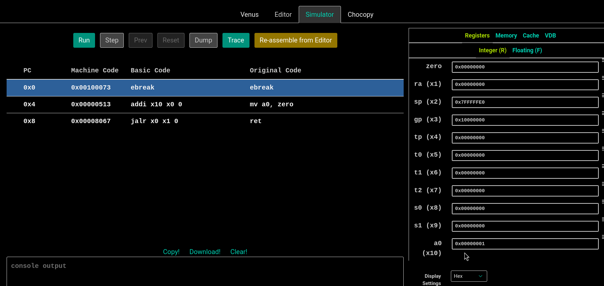

abs工具函数：

```gas
abs:
    # Prologue
    
    # return 0
    bge a0, zero, done
    sub a0, zero, a0
    # Epilogue
done:
    ret
```

## Task A1: ReLU

一个朴实无华的激活函数，把所有小于0的数值归零。一般套在隐藏层后面，用来将一次函数转换为折线函数，更好的拟合数据分布。

```gas
relu:
    # Prologue
  addi sp, sp, -12
  sw ra, 0(sp) 
  sw s0, 4(sp)
  sw s1, 8(sp)

loop_begin:

  mv s0, a0 
  mv s1, a1
  add t0, x0, x0
  ble s1, x0, length_error

loop_continue:

  slli t1, t0, 2
  add t2, s0, t1
  lw t3, 0(t2)
  addi t0,t0, 1
  bgt t3, x0, loop_continue
  bgt t0, s1, loop_end
  sw x0, 0(t2)
  j loop_continue

loop_end:
  
  lw ra, 0(sp) 
  lw s0, 4(sp)
  lw s1, 8(sp)
  addi sp, sp, 12
    
 ret

length_error:

  li a0, 17
  li a1, 78
  ecall
```

Project 2 要求自己完善单元测试，所以以下附上我的单元测试：

```python
class TestRelu(TestCase):
    def test_simple(self):
        t = AssemblyTest(self, "relu.s")
        # create an array in the data section
        array0 = t.array([1, -2, 3, -4, 5, -6, 7, -8, 9])
        # load address of `array0` into register a0
        t.input_array("a0", array0)
        # set a1 to the length of our array
        t.input_scalar("a1", len(array0))
        # call the relu function
        t.call("relu")
        # check that the array0 was changed appropriately
        t.check_array(array0, [1, 0, 3, 0, 5, 0, 7, 0, 9])
        # generate the `assembly/TestRelu_test_simple.s` file and run it through venus
        t.execute()

    def test_zero(self):
        t = AssemblyTest(self, "relu.s")
        array0 = t.array([])
        t.input_array("a0", array0)
        t.input_scalar("a1", 0)
        t.call("relu")
        t.execute(code=78)

    def test_neg(self):
        t = AssemblyTest(self, "relu.s")
        array0 = t.array([1, 2, 3])
        t.input_array("a0", array0)
        t.input_scalar("a1", -1)
        t.call("relu")
        t.execute(code=78)

    def test_massive_data(self):
        for _ in range(100):
            t = AssemblyTest(self, "relu.s")
            length = random.randint(10, 100)
            input_array = [random.randint(-100, 100) for _ in range(length)]
            array0 = t.array(input_array)
            t.input_array("a0", array0)
            t.input_scalar("a1", length)
            t.call("relu")
            t.check_array(array0, [(i if i > 0 else 0) for i in input_array])
            t.execute()

    @classmethod
    def tearDownClass(cls):
        print_coverage("relu.s", verbose=False)
```

测试结果：

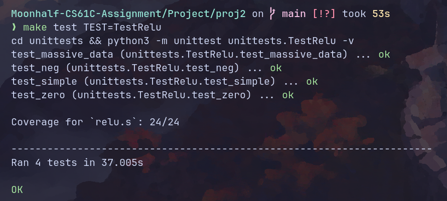

## Task A2: Argmax

返回一个vector中最大元素的索引。用来进行最终的分类。

```gas
.globl argmax

.text

argmax:

  addi sp, sp, -12
  sw ra, 0(sp) 
  sw s0, 4(sp)
  sw s1, 8(sp)

loop_start:

  mv s0, a0 
  mv s1, a1
  add t0, x0, x0 # counter
  lw t1, 0(s0) # max
  add t5, x0, x0 # argmax
  ble s1, x0, length_error

loop_continue:

  bge t0, s1, loop_end
  slli t2, t0, 2
  addi t0, t0, 1
  add t3, t2, s0
  lw t4, 0(t3)
  ble t4, t1, loop_continue
  mv t1, t4
  addi t5, t0, -1
  j loop_continue

loop_end:

  mv a0, t5
  lw ra, 0(sp) 
  lw s0, 4(sp)
  lw s1, 8(sp)
  addi sp, sp, 12

  ret

length_error:

  li a0, 17
  li a1, 77
  ecall
```

单元测试：

```python
class TestArgmax(TestCase):
    def test_simple(self):
        t = AssemblyTest(self, "argmax.s")
        array0 = t.array([1, -2, 3, -4, 5, -6, 7, -8, 9])
        t.input_array("a0", array0)
        t.input_scalar("a1", len(array0))
        t.call("argmax")
        t.check_scalar("a0", 8)
        t.execute()

    def test_simple_02(self):
        t = AssemblyTest(self, "argmax.s")
        array0 = t.array([1, -2, 3, -4, 9, 5, -6, 7, -8])
        t.input_array("a0", array0)
        t.input_scalar("a1", len(array0))
        t.call("argmax")
        t.check_scalar("a0", 4)
        t.execute()

    def test_massive_data(self):
        for _ in range(100):
            t = AssemblyTest(self, "argmax.s")
            length = random.randint(10, 100)
            input_array = [random.randint(-100, 100) for _ in range(length)]
            array0 = t.array(input_array)
            # logging.debug({key: value for key, value in enumerate(input_array)})
            t.input_array("a0", array0)
            t.input_scalar("a1", length)
            t.call("argmax")
            t.check_scalar("a0", input_array.index(max(input_array)))
            t.execute()

    @classmethod
    def tearDownClass(cls):
        print_coverage("argmax.s", verbose=False)
```

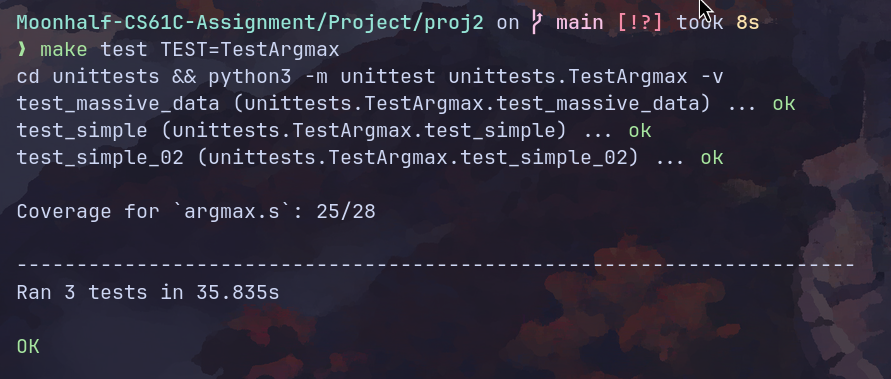

因为没有检测error分支导致测试覆盖率不达100%。修改单元测试：

```python
def test_error(self):
 t = AssemblyTest(self, "argmax.s")
 array0 = t.array([1, -2, 3, -4, 9, 5, -6, 7, -8])
 t.input_array("a0", array0)
 t.input_scalar("a1", -1)
 t.call("argmax")
 t.execute(code=77)
```

添加以上测试，结果如下：

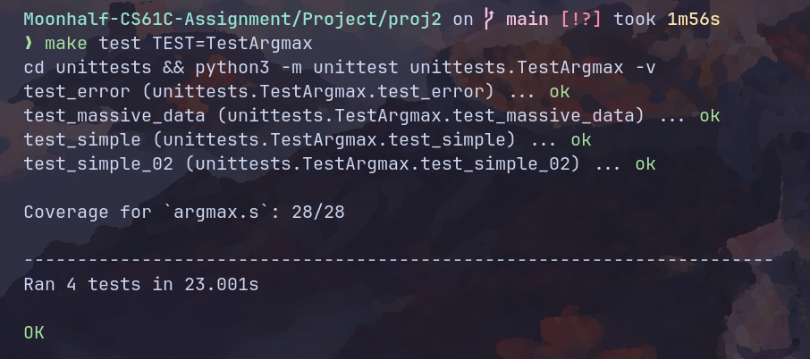

## Task A3.1: Dot Product

向量点积。需要注意的是，在汇编中没有像C语言那样现成的多维数组，内存地址按照一维线性排布。所以，我们需要传入一个跨度参数用来辅助计算。

```gas
.globl dot

.text

dot:

  addi sp, sp, -24
  sw ra, 0(sp) 
  sw s0, 4(sp)
  sw s1, 8(sp)
  sw s2, 12(sp)
  sw s3, 16(sp)
  sw s4, 20(sp)

  mv s0, a0 # ptr of vec0 
  mv s1, a1 # ptr of vec1
  mv s2, a2 # length 
  ble s2, x0, error-length 
  mv s3, a3 # stride of vec0
  mv s4, a4 # stride of vec1
  ble s3, x0, error-stride
  ble s4, x0, error-stride

  add t0, x0, x0 # counter 
  add t1, x0, x0 # accumulator

  add t2, x0, x0 # head 0 
  add t3, x0, x0 # head 1 
  
loop_start:
  
  bge t0, s2, loop_end

  slli t4, t0, 2 
  slli t5, t0, 2 

  mul t4, t4, s3
  mul t5, t5, s4

  add t2, t4, s0 
  add t3, t5, s1 

  lw t4, 0(t2)
  lw t5, 0(t3)

  mul t6, t4, t5

  add t1, t1, t6

  addi t0, t0, 1 
  
  j loop_start 

loop_end:

  mv a0, t1

  lw ra, 0(sp) 
  lw s0, 4(sp)
  lw s1, 8(sp)
  lw s2, 12(sp)
  lw s3, 16(sp)
  lw s4, 20(sp)
  addi sp, sp, 24

  ret

error-length:
  
  li a0, 17
  li a1, 75
  ecall

error-stride:
  
  li a0, 17
  li a1, 76
  ecall

```

单元测试：

```python
class TestDot(TestCase):
    def test_simple(self):
        t = AssemblyTest(self, "dot.s")
        array0 = t.array([1, -2, 3, -4, 5, -6, 7, -8, 9])
        array1 = t.array([1, -2, 3, -4, 5, -6, 7, -8, 9])
        t.input_array("a0", array0)
        t.input_array("a1", array1)
        t.input_scalar("a2", 9)
        t.input_scalar("a3", 1)
        t.input_scalar("a4", 1)
        t.call("dot")
        t.check_scalar("a0", sum([i**2 for i in range(1, 10)]))
        t.execute()

    def test_error(self):
        t = AssemblyTest(self, "dot.s")
        array0 = t.array([1, -2, 3, -4, 5, -6, 7, -8, 9])
        array1 = t.array([1, -2, 3, -4, 5, -6, 7, -8, 9])
        t.input_array("a0", array0)
        t.input_array("a1", array1)
        t.input_scalar("a2", -1)
        t.input_scalar("a3", 1)
        t.input_scalar("a4", 1)
        t.call("dot")
        t.check_scalar("a0", sum([i**2 for i in range(1, 10)]))
        t.execute(code=75)
        t = AssemblyTest(self, "dot.s")
        array0 = t.array([1, -2, 3, -4, 5, -6, 7, -8, 9])
        array1 = t.array([1, -2, 3, -4, 5, -6, 7, -8, 9])
        t.input_array("a0", array0)
        t.input_array("a1", array1)
        t.input_scalar("a2", 9)
        t.input_scalar("a3", -1)
        t.input_scalar("a4", 1)
        t.call("dot")
        t.check_scalar("a0", sum([i**2 for i in range(1, 10)]))
        t.execute(code=76)
        t = AssemblyTest(self, "dot.s")
        array0 = t.array([1, -2, 3, -4, 5, -6, 7, -8, 9])
        array1 = t.array([1, -2, 3, -4, 5, -6, 7, -8, 9])
        t.input_array("a0", array0)
        t.input_array("a1", array1)
        t.input_scalar("a2", 9)
        t.input_scalar("a3", 1)
        t.input_scalar("a4", -1)
        t.call("dot")
        t.check_scalar("a0", sum([i**2 for i in range(1, 10)]))
        t.execute(code=76)

    def test_massive_data(self):
        for _ in range(100):
            t = AssemblyTest(self, "dot.s")
            length = random.randint(1, 100)
            stride0 = random.randint(1, 100)
            stride1 = random.randint(1, 100)
            input_array_0 = [random.randint(-100, 100) for _ in range(length * stride0)]
            input_array_1 = [random.randint(-100, 100) for _ in range(length * stride1)]
            array0 = t.array(input_array_0)
            array1 = t.array(input_array_1)
            t.input_array("a0", array0)
            t.input_array("a1", array1)
            t.input_scalar("a2", length)
            t.input_scalar("a3", stride0)
            t.input_scalar("a4", stride1)
            t.call("dot")
            t.check_scalar(
                "a0",
                sum(
                    [
                        i * j
                        for i, j in zip(
                            [input_array_0[k * stride0] for k in range(length)],
                            [input_array_1[k * stride1] for k in range(length)],
                        )
                    ]
                ),
            )
            t.execute()

    @classmethod
    def tearDownClass(cls):
        print_coverage("dot.s", verbose=False)

```

（力大砖飞式单元测试）

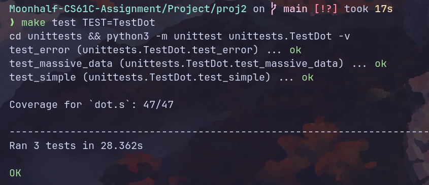

## Task A3.2: Matrix Multiplication

矩阵乘法。

```gas
.globl matmul

.text

matmul:

  # Error checks
  ble a1, x0, error_m0
  ble a2, x0, error_m0
  ble a4, x0, error_m1
  ble a5, x0, error_m1
  bne a2, a4, error_not_match
  # Prologue
  addi sp, sp, -32
  sw ra, 0(sp) 
  sw s0, 4(sp)
  sw s1, 8(sp)
  sw s2, 12(sp)
  sw s3, 16(sp)
  sw s4, 20(sp)
  sw s5, 24(sp)
  sw s6, 28(sp)

  mv s0, a0 # ptr of m0 
  mv s1, a1 # rows of m0 
  mv s2, a2 # columns of m0 
  mv s3, a3 # ptr of m1 
  mv s4, a4 # rows of m1
  mv s5, a5 # columns of m1
  mv s6, a6 # ptr of d 
  
  li t0, 0 # row counter
  li t1, 0 # column counter

outer_loop_start:

  bge t0, s1, outer_loop_end
  li t1, 0 # column counter

inner_loop_start:

  bge t1, s5, inner_loop_end

  # call vec dot
  mul t2, s2, t0 
  slli t3, t1, 2
  slli t4, t2, 2
  add a0, s0, t4
  add a1, s3, t3

  mv a2, s2
  li a3, 1 
  mv a4, s5

  addi sp, sp, -8 
  sw t0, 0(sp)
  sw t1, 4(sp)
  
  jal dot

  lw t0, 0(sp)
  lw t1, 4(sp)
  addi sp, sp, 8 

  mul t2, s5, t0 
  # call dot end
  add t2, t2, t1
  slli t2, t2, 2
  add t2, t2, s6
  sw a0, 0(t2)

  addi t1, t1, 1
  j inner_loop_start

inner_loop_end:

  addi t0, t0, 1
  j outer_loop_start

outer_loop_end:

  # Epilogue
  lw ra, 0(sp) 
  lw s0, 4(sp)
  lw s1, 8(sp)
  lw s2, 12(sp)
  lw s3, 16(sp)
  lw s4, 20(sp)
  lw s5, 24(sp)
  lw s6, 28(sp)
  addi sp, sp, 32

  ret

error_m0:

  li a0, 17
  li a1, 72
  ecall
  
error_m1:

  li a0, 17
  li a1, 73
  ecall

error_not_match:

  li a0, 17
  li a1, 74
  ecall
```

单元测试。需要手动拉高venus的栈空间大小，不然会爆栈。

```python
class TestMatmul(TestCase):
    def do_matmul(self, m0, m0_rows, m0_cols, m1, m1_rows, m1_cols, result, code=0):
        t = AssemblyTest(self, "matmul.s")
        # we need to include (aka import) the dot.s file since it is used by matmul.s
        t.include("dot.s")
        # create arrays for the arguments and to store the result
        array0 = t.array(m0)
        array1 = t.array(m1)
        array_out = t.array([0] * len(result))
        # load address of input matrices and set their dimensions
        t.input_array("a0", array0)
        t.input_scalar("a1", m0_rows)
        t.input_scalar("a2", m0_cols)
        t.input_array("a3", array1)
        t.input_scalar("a4", m1_rows)
        t.input_scalar("a5", m1_cols)
        t.input_array("a6", array_out)
        # call the matmul function
        t.call("matmul")
        # check the content of the output array
        t.check_array(array_out, result)
        # generate the assembly file and run it through venus, we expect the simulation to exit with code `code`
        t.execute(code=code)

    def test_simple(self):
        self.do_matmul(
            [1, 2, 3, 4, 5, 6, 7, 8, 9],
            3,
            3,
            [1, 2, 3, 4, 5, 6, 7, 8, 9],
            3,
            3,
            [30, 36, 42, 66, 81, 96, 102, 126, 150],
        )

    def test_error(self):
        self.do_matmul(
            [1, 2, 3, 4, 5, 6, 7, 8, 9],
            0,
            3,
            [1, 2, 3, 4, 5, 6, 7, 8, 9],
            3,
            3,
            [30, 36, 42, 66, 81, 96, 102, 126, 150],
            code=72,
        )
        self.do_matmul(
            [1, 2, 3, 4, 5, 6, 7, 8, 9],
            3,
            3,
            [1, 2, 3, 4, 5, 6, 7, 8, 9],
            0,
            3,
            [30, 36, 42, 66, 81, 96, 102, 126, 150],
            code=73,
        )
        self.do_matmul(
            [1, 2, 3, 4, 5, 6, 7, 8, 9],
            3,
            3,
            [1, 2, 3, 4, 5, 6, 7, 8, 9],
            1,
            9,
            [30, 36, 42, 66, 81, 96, 102, 126, 150],
            code=74,
        )

    def test_massive_data(self):
        for _ in range(20):
            row_0 = random.randint(10, 20)
            col_0 = random.randint(10, 20)
            col_1 = random.randint(10, 20)
            array_0 = [random.randint(-20, 20) for _ in range(row_0 * col_0)]
            array_1 = [random.randint(-20, 20) for _ in range(col_1 * col_0)]
            result = [
                sum(
                    [
                        array_0[i * col_0 + k] * array_1[j + col_1 * k]
                        for k in range(col_0)
                    ]
                )
                for i in range(row_0)
                for j in range(col_1)
            ]
            self.do_matmul(array_0, row_0, col_0, array_1, col_0, col_1, result)

    @classmethod
    def tearDownClass(cls):
        print_coverage("matmul.s", verbose=False)
```

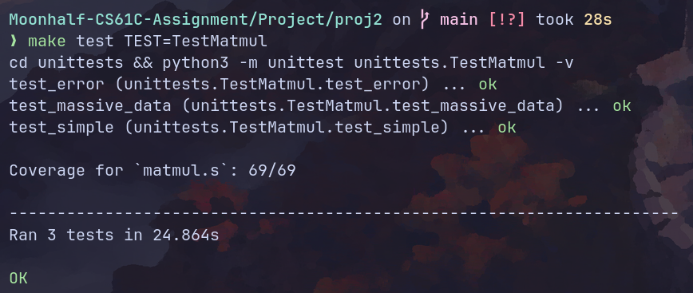

（现在突然发现没有使用`utils`中提供的退出程序函数。懒得修改了。）

## Task B1: Read Matrix

从一个矩阵二进制文件中读取矩阵内容并存储在内存上。需要分配堆内存。

```gas
.globl read_matrix

.text

read_matrix:

  # Prologue
  addi sp, sp, -16
  sw ra, 0(sp) 
  sw s0, 4(sp)
  sw s1, 8(sp)
  sw s2, 12(sp)

  mv s0, a0 # ptr of filename 
  mv s1, a1 # ptr of rows 
  mv s2, a2 # ptr of columns 


  # fopen
  mv a1, s0
  li a2, 0
  jal fopen 
  blt a0, x0, error_fopen
  addi sp, sp, -4
  sw s4, 0(sp)
  mv s4, a0 # file discriptor 

  # fread rows and columns information
  mv a1, s4
  mv a2, s1 # read row number into s1's target 
  li a3, 4
  jal fread 
  li t0, 4
  blt a0, t0, error_fread 
  mv a1, s4
  mv a2, s2 # read col number into s2's target 
  li a3, 4
  jal fread 
  li t0, 4
  blt a0, t0, error_fread 

  # malloc heap space
  lw t1, 0(s1)
  lw t2, 0(s2)
  mul t0, t1, t2 # matrix size
  addi sp, sp, -4
  sw s5, 0(sp)
  mv s5, t0
  slli a0, t0, 2 

  jal malloc  
  beq a0, x0, error_malloc  
  addi sp, sp, -4
  sw s3, 0(sp)
  mv s3, a0 # ptr to the heap space 

  addi sp, sp, -4
  sw s6, 0(sp)
  mv s6, a0 # ptr to the buffer 

  # read data 
read_loop_start:
  
  ble s5, x0, read_loop_end 
  mv a1, s4
  mv a2, s6  
  li a3, 4
  jal fread 
  li t0, 4

  blt a0, t0, error_fread 
  addi s6, s6, 4
  addi s5, s5, -1
  j read_loop_start

read_loop_end: 

  mv a0, s4
  jal fclose 
  bne a0, x0, error_fclose

  mv a0, s3

  lw ra, 0(sp) 
  lw s0, 4(sp)
  lw s1, 8(sp)
  lw s2, 12(sp)
  lw s3, 16(sp)
  lw s4, 20(sp)
  lw s5, 24(sp)
  lw s6, 28(sp)
  addi sp, sp, 32 
  ret

error_malloc:

  li a1, 88
  jal exit2

error_fopen:

  li a1, 90
  jal exit2

error_fread:

  li a1, 91 
  jal exit2

error_fclose:

  li a1, 92
  jal exit2
```

单元测试：

```python
class TestReadMatrix(TestCase):
    def do_read_matrix(self, fail="", code=0):
        t = AssemblyTest(self, "read_matrix.s")
        t.include("utils.s")
        # load address to the name of the input file into register a0
        t.input_read_filename("a0", "inputs/test_read_matrix/test_input.bin")

        # allocate space to hold the rows and cols output parameters
        rows = t.array([-1])
        cols = t.array([-1])

        # load the addresses to the output parameters into the argument registers
        t.input_array("a1", rows)
        t.input_array("a2", cols)
        # TODO

        # call the read_matrix function
        t.call("read_matrix")

        # check the output from the function
        t.check_array_pointer("a0", [i for i in range(1, 10)])
        t.check_array(rows, [3])
        t.check_array(cols, [3])
        # TODO

        # generate assembly and run it through venus
        t.execute(fail=fail, code=code)

    def test_error(self):
        self.do_read_matrix("malloc", 88)
        self.do_read_matrix("fopen", 90)
        self.do_read_matrix("fread", 91)
        self.do_read_matrix("fclose", 92)

    def test_simple(self):
        self.do_read_matrix()

    @classmethod
    def tearDownClass(cls):
        print_coverage("read_matrix.s", verbose=False)
```

## Task B2: Write Matrix

将内存中的矩阵写入文件中。

```gas
.globl write_matrix

.text

write_matrix:

  # Prologue
  addi sp, sp, -24
  sw ra, 0(sp) 
  sw s0, 4(sp)
  sw s1, 8(sp)
  sw s2, 12(sp)
  sw s3, 16(sp)
  sw s4, 20(sp)

  mv s0, a0 # ptr to the filename
  mv s1, a1 # ptr to the beginning
  mv s2, a2 # num of rows
  mv s3, a3 # num of cols

  # open a file  
  mv a1, s0
  li a2, 1
  jal fopen
  blt a0, x0, error_fopen
  mv s4, a0 # file discriptor 

  # write content
  addi sp, sp, -8
  sw s2, 0(sp)
  sw s3, 4(sp)

  mv a1, s4
  mv a2, sp 
  li a3, 2
  li a4, 4
  jal fwrite 
  li t0, 2
  blt a0, t0, error_fwrite

  lw s2, 0(sp)
  lw s3, 4(sp)
  addi sp, sp, 8

  mv a1, s4
  mv a2, s1
  mul a3, s2, s3
  li a4, 4
  jal fwrite 
  mul t0, s2, s3
  blt a0, t0, error_fwrite

  # close file
  mv a0, s4
  jal fclose 
  bne a0, x0, error_fclose
  
  # Epilogue
  lw ra, 0(sp) 
  lw s0, 4(sp)
  lw s1, 8(sp)
  lw s2, 12(sp)
  lw s3, 16(sp)
  lw s4, 20(sp)
  addi sp, sp, 24

  ret

error_fopen:

  li a1, 93
  jal exit2

error_fwrite:

  li a1, 94 
  jal exit2

error_fclose:

  li a1, 95
  jal exit2


```

栈操作应该尽可能简单，塞数据一时爽，改错火葬场。

单元测试：

```python
class TestWriteMatrix(TestCase):
    def do_write_matrix(self, fail="", code=0):
        t = AssemblyTest(self, "write_matrix.s")
        outfile = "outputs/test_write_matrix/student.bin"
        # load output file name into a0 register
        t.input_write_filename("a0", outfile)
        # load input array and other arguments
        array0 = t.array([i for i in range(1, 10)])
        t.input_array("a1", array0)
        t.input_scalar("a2", 3)
        t.input_scalar("a3", 3)
        # TODO
        # call `write_matrix` function
        t.call("write_matrix")
        # generate assembly and run it through venus
        t.execute(fail=fail, code=code)
        # compare the output file against the reference (skip for error tests since no file is written)
        if not fail:
            t.check_file_output(outfile, "outputs/test_write_matrix/reference.bin")

    def test_simple(self):
        self.do_write_matrix()

    def test_error(self):
        self.do_write_matrix(fail="fopen", code=93)
        self.do_write_matrix(fail="fwrite", code=94)
        self.do_write_matrix(fail="fclose", code=95)

    @classmethod
    def tearDownClass(cls):
        print_coverage("write_matrix.s", verbose=False)
```

## Task B3: Classify

把前面的所有函数组合成我们需要的图像分类器。图像分类的原理很简单：读取图像矩阵，经过一些矩阵计算之后得到该图像与不同分类之间关联性的分值，我们从中直接选出分数最高的分类作为结果。打分的步骤本质mlp，激活函数为relu。线性层权重为预训练权重。

在使用汇编实现该函数的时候，因为数据量太大，数据全部塞在栈上非常难管理，比如中间两个线性层以及输入的图像矩阵需要我们将矩阵长宽和数据指针找地方存起来，光这些数据就有9个word。所以，我们需要单独malloc一块堆空间来存放这些数据。除此之外，每一个中间矩阵也需要我们提前分配堆空间来存放，因为我们前面的matmul实现并没有关心算出来的矩阵存在哪。

另外一个坑点是：`argc`会比输入的参数数大1，`argv[0]`通常是程序自身的名字。因此所有参数读取都需要后移4个字节。

代码实现如下：

```gas
.globl classify

.text
classify:

  addi sp, sp, -28
  sw ra, 0(sp) 
  sw s0, 4(sp)
  sw s1, 8(sp)
  sw s2, 12(sp)
  sw s3, 16(sp) # ptr of matrix data 
  sw s4, 20(sp)
  sw s5, 24(sp)

  mv s0, a0 # argc 
  mv s1, a1 # **argv 
  mv s2, a2 # print 

  # check argc 
  li t0, 5
  bne s0, t0, error_argc

  # malloc space for matrix data
  
  li a0, 40 
  jal malloc
  beq a0, x0, error_malloc 
  mv s3, a0

  # Load pretrained m0
  
  lw a0, 4(s1) 
  addi t0, s3, 4
  addi t1, s3, 8
  mv a1, t0 
  mv a2, t1 
  jal read_matrix 
  sw a0, 0(s3)

  # Load pretrained m1

  lw a0, 8(s1) 
  addi t0, s3, 16
  addi t1, s3, 20
  mv a1, t0
  mv a2, t1 
  jal read_matrix 
  sw a0, 12(s3)

  # Load input matrix

  lw a0, 12(s1) 
  addi t0, s3, 28 
  addi t1, s3, 32 
  mv a1, t0
  mv a2, t1 
  jal read_matrix 
  sw a0, 24(s3)

  # malloc space for mid-matrix
  
  lw t0, 4(s3)
  lw t1, 32(s3)
  mul a0, t0, t1
  slli a0, a0, 2 
  jal malloc 
  beq a0, x0, error_malloc
  mv s4, a0

  lw t0, 16(s3)
  lw t1, 32(s3)
  mul a0, t0, t1
  slli a0, a0, 2 
  jal malloc 
  beq a0, x0, error_malloc
  mv s5, a0

  # 1. LINEAR LAYER:    m0 * input
  # 2. NONLINEAR LAYER: ReLU(m0 * input)
  # 3. LINEAR LAYER:    m1 * ReLU(m0 * input)

  # matmul 01
  lw a0, 0(s3)  
  lw a1, 4(s3) 
  lw a2, 8(s3) 
  lw a3, 24(s3) 
  lw a4, 28(s3)
  lw a5, 32(s3) 
  mv a6, s4
  jal matmul 

  # relu
  mv a0, s4
  lw t0, 4(s3)
  lw t1, 32(s3)
  mul a1, t0, t1
  jal relu

  # matmul 02
  lw a0, 12(s3)  
  lw a1, 16(s3) 
  lw a2, 20(s3) 
  mv a3, s4
  lw a4, 4(s3)
  lw a5, 32(s3) 
  mv a6, s5
  jal matmul 

  # Write output matrix
  
  lw a0, 16(s1)
  mv a1, s5
  lw a2, 16(s3)
  lw a3, 32(s3)
  jal write_matrix  

  # Call argmax

  mv a0, s5
  lw t0, 16(s3)
  lw t1, 32(s3)
  mul a1, t0, t1
  jal argmax 

  sw a0, 36(s3)
  
  # Print classification
  
  bne s2, x0, continue 
  lw a1, 36(s3)
  jal print_int
  
  # Print newline afterwards for clarity

continue:

  lw a0, 36(s3)

  lw ra, 0(sp) 
  lw s0, 4(sp)
  lw s1, 8(sp)
  lw s2, 12(sp)
  lw s3, 16(sp)
  lw s4, 20(sp)
  lw s5, 24(sp)
  addi sp, sp, 28

  ret

error_argc:

  li a1, 89 
  jal exit2

error_malloc:

  li a1, 88 
  jal exit2
```

单元测试：

```python
class TestClassify(TestCase):
    def make_test(self):
        t = AssemblyTest(self, "classify.s")
        t.include("argmax.s")
        t.include("dot.s")
        t.include("matmul.s")
        t.include("read_matrix.s")
        t.include("relu.s")
        t.include("write_matrix.s")
        return t

    def test_simple0_input0(self):
        t = self.make_test()
        out_file = "outputs/test_basic_main/student0.bin"
        ref_file = "outputs/test_basic_main/reference0.bin"
        args = [
            "inputs/simple0/bin/m0.bin",
            "inputs/simple0/bin/m1.bin",
            "inputs/simple0/bin/inputs/input0.bin",
            out_file,
        ]
        # call classify function
        t.input_scalar("a2", 0)
        t.call("classify")
        # generate assembly and pass program arguments directly to venus
        t.execute(args=args)

        # compare the output file and
        t.check_file_output(out_file, ref_file)
        t.check_stdout("2")
        # compare the classification output with `check_stdout`

    @classmethod
    def tearDownClass(cls):
        print_coverage("classify.s", verbose=False)
```

只补全了简单测试，多的测试懒得设计了。

测试结果：

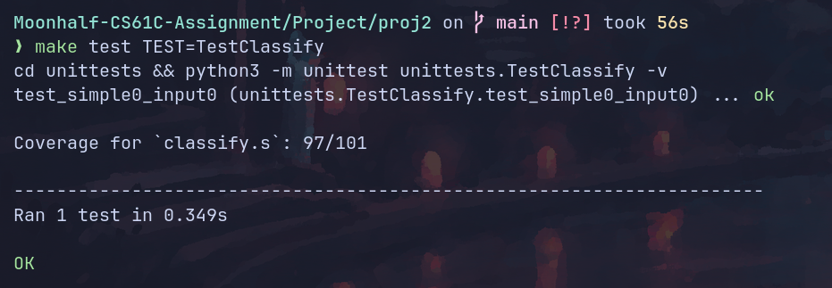

全测试：

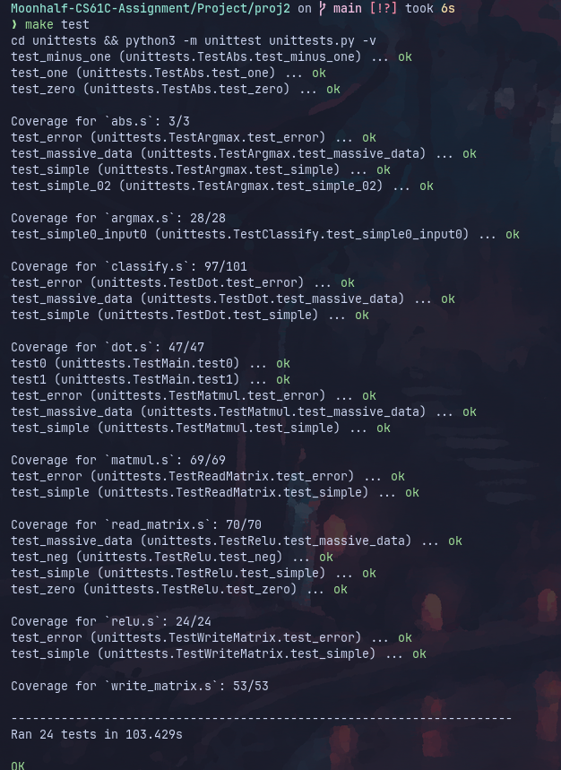

## MNIST测试

cs61c提供了一系列手写数字样例，并提供了图像预览脚本。

手写6：


预测结果：

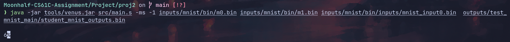

输出结果为6。预测正确。

手写9：

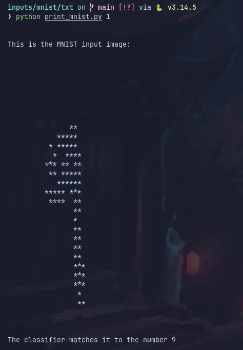

预测结果：

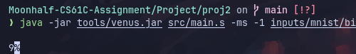

输出结果为9。预测正确。

我的真迹：


预测结果：

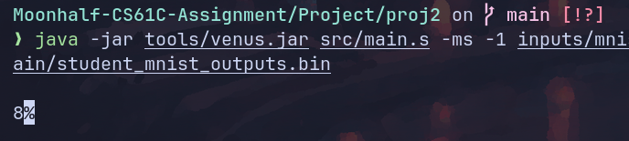

猜错了。残念。

