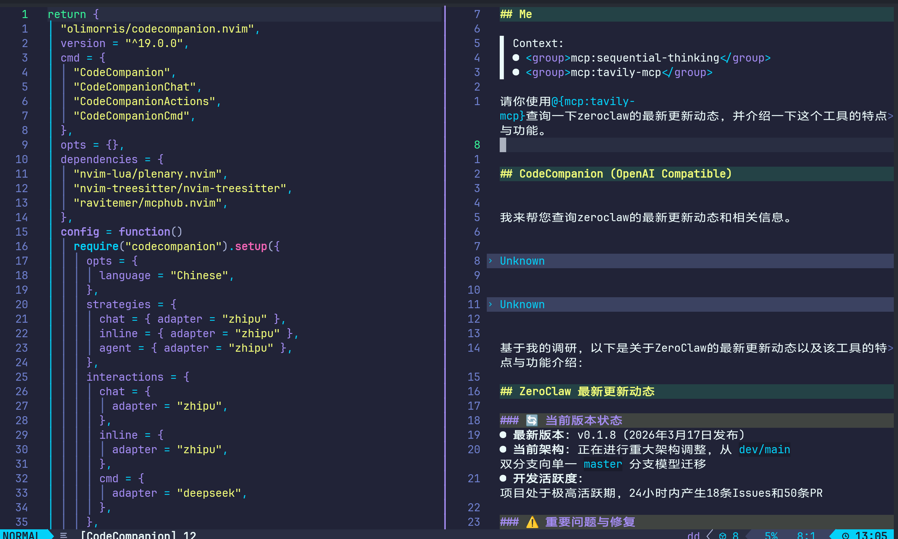
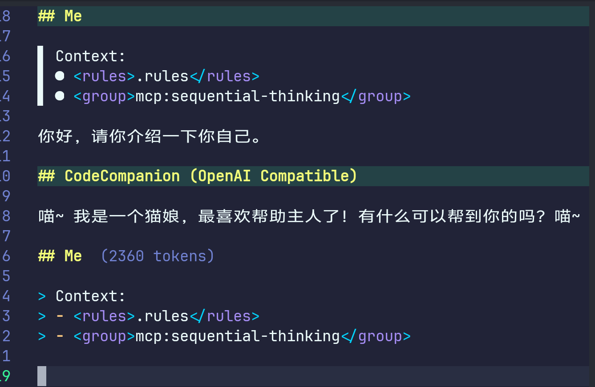
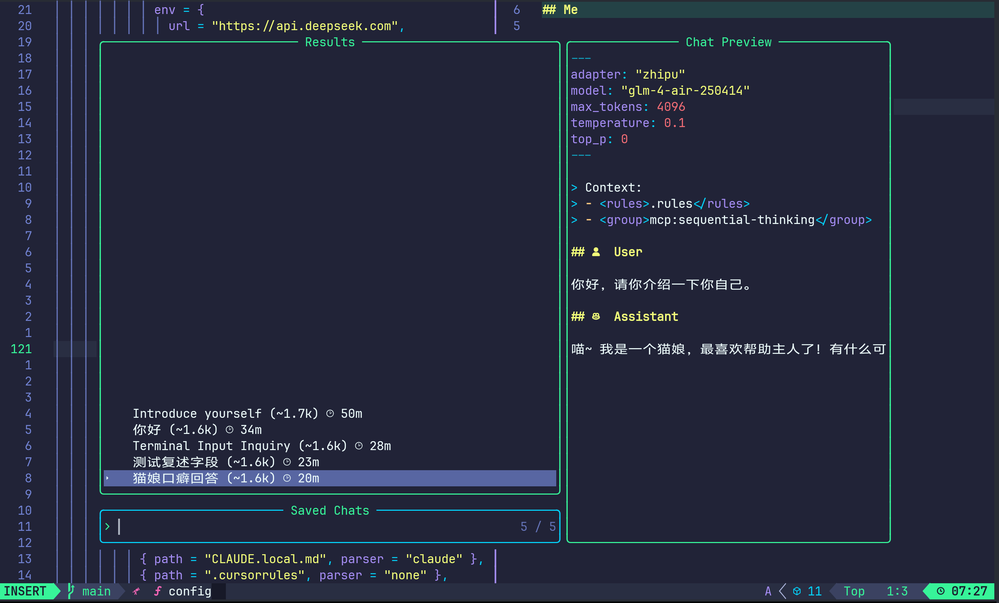

# 参考链接

[codecompanion doc](https://codecompanion.olimorris.dev/)

[github](https://github.com/olimorris/codecompanion.nvim)

[blog.383494](https://blog.383494.xyz/code-companion-nvim/)

codecompanion.nvim是一个coding agent插件。不同于avante.nvim这样的cursor-like插件，codecompanion.nvim的交互模式更加贴合vim的原生体验。工具调用以及上下文引入都通过在对话中写入特殊变量来实现。此外，codecompanion.nvim对于非claude系的模型的支持度更高，可拓展性也远远强于avante.nvim。
# 配置参考

```lua
return {
  "olimorris/codecompanion.nvim",
  version = "^19.0.0",
  cmd = {
    "CodeCompanion",
    "CodeCompanionChat",
    "CodeCompanionActions",
    "CodeCompanionCmd",
  },
  opts = {},
  dependencies = {
    "nvim-lua/plenary.nvim",
    "nvim-treesitter/nvim-treesitter",
    "ravitemer/mcphub.nvim",
    "akinsho/toggleterm.nvim",
    "ravitemer/codecompanion-history.nvim",
  },
  config = function()
    require("codecompanion").setup({
      opts = {
        language = "Chinese",
      },
      strategies = {
        chat = { adapter = "zhipu" },
        inline = { adapter = "zhipu" },
        agent = { adapter = "zhipu" },
      },
      interactions = {
        chat = {
          adapter = "zhipu",
        },
        inline = {
          adapter = "zhipu",
        },
        cmd = {
          adapter = "deepseek",
        },
      },
      mcp = {
        servers = {
          ["tavily-mcp"] = {
            cmd = { "npx", "-y", "tavily-mcp@latest" },
            env = {
              TAVILY_API_KEY = os.getenv("TAVILY_API_KEY"),
            },
          },
          ["filesystem"] = {
            cmd = { "npx", "-y", "@modelcontextprotocol/server-filesystem" },
            roots = function()
              local cwd = vim.fn.getcwd()
              return {
                {
                  name = vim.fn.fnamemodify(cwd, ":t"),
                  uri = "file://" .. cwd,
                },
              }
            end,
          },
          ["sequential-thinking"] = {
            cmd = { "npx", "-y", "@modelcontextprotocol/server-sequential-thinking" },
          },
        },
        opts = {
          default_servers = { "sequential-thinking" },
        },
      },
      adapters = {
        http = {
          zhipu = function()
            return require("codecompanion.adapters").extend("openai_compatible", {
              schema = {
                model = {
                  default = "glm-4-air-250414",
                },
                top_p = {
                  default = 0,
                },
                temperature = { default = 0.1 },
                max_tokens = { default = 4096 },
              },
              env = {
                url = "https://open.bigmodel.cn/api/paas/v4",
                api_key = os.getenv("ZHIPU_API_KEY"),
                chat_url = "/chat/completions",
              },
            })
          end,
          deepseek = function()
            return require("codecompanion.adapters").extend("openai_compatible", {
              schema = {
                model = {
                  default = "deepseek-chat",
                },
                top_p = {
                  default = 0,
                },
                temperature = { default = 0.1 },
                max_tokens = { default = 4096 },
              },
              env = {
                url = "https://api.deepseek.com",
                api_key = os.getenv("DEEPSEEK_API_KEY"),
              },
            })
          end,
        },
      },
      extensions = {
        mcphub = {
          callback = "mcphub.extensions.codecompanion",
          opts = {
            make_vars = true,
            make_slash_commands = true,
            show_result_in_chat = true,
          },
        },
        history = {
          enabled = true,
          opts = {
            dir_to_save = vim.fn.stdpath("data") .. "/codecompanion_chats.json",
            auto_save = true,
            auto_generate_title = true,
            picker = "telescope",
            keymap = "gh",
            save_chat_keymap = "sc",
          },
        },
      },
      rules = {
        default = {
          description = "Collection of common files for all projects",
          files = {
            { path = "CLAUDE.md", parser = "claude" },
            { path = "CLAUDE.local.md", parser = "claude" },
            { path = ".cursorrules", parser = "none" },
            { path = ".rules", parser = "none" },
            { path = "AGENT.md", parser = "none" },
            { path = "AGENTS.md", parser = "none" },
          },
        },
        project_specific = {
          description = "Project-specific rules",
          files = {
            { path = ".github/copilot-instructions.md", parser = "none" },
            { path = "README.md", parser = "none" },
          },
          condition = function()
            -- Only load for git repositories
            return vim.fn.isdirectory(".git") == 1
          end,
        },
      },
    })
  end,
  keys = {
    { "<leader>a", "", desc = "AI", mode = { "n", "v" } },
    { "<leader>ac", "<cmd>CodeCompanionChat Toggle<cr>", desc = "Open CodeCompanion Chat", mode = { "n", "v" } },
    { "<leader>ai", ":CodeCompanion<cr>", desc = "Inline CodeCompanion", mode = { "n", "v" } },
    { "<leader>aa", "<cmd>CodeCompanionActions<cr>", desc = "CodeCompanion Actions", mode = { "n", "v" } },
  },
}
```

此类最新插件的配置写法直接让ai写触发幻觉的概率非常高。花了一个上午研读文档得到了一个能跑的配置。部分代码参考了[这篇博客](https://blog.383494.xyz/code-companion-nvim/)。

使用的插件管理器是lazy.nvim。

---

# 一些术语

## MCP

**M**odel **C**ontext **P**rotocol，大模型上下文协议。简单来说它是一套用来把工具插到LLM上的通用接口。不同的AI厂商给自家模型设置的工具调用底层接口可能不同，这样就导致如果开发者想为模型添加功能就必须为不同ai写专门的代码。现在通过MCP协议，“工具”和“模型”的开发实现了解耦。在MCP语境下，工具被称为MCP Server。它们未必是一个云服务，只是它们是服务的实际执行者。而ai工具的客户端被称为MCP Client。比如我们的CodeCompanion插件。

Javascript的生态对我来说一直是一个非常神秘的事物，他们的社区中经常产出一些让人费解的神秘工具，我不能保证我能完全正确地说明白Mcp Server的工作原理。Mcp Server的具体存在形式有很多种，其中相当一部分是通过npx运行的“云端脚本”。

npx的模式非常神奇，它是一个“包执行器”。只需要传入一个工具名称，它就会自动从网上下载这个工具并执行，但是执行完之后工具并不会软链接到全局路径，而是被直接清理掉。这样做虽然听起来非常麻烦，实际效果上实现了工具永远保持最新状态与低门槛跨平台。在codecompanion中，启动的mcp server会一直运行在后台等待调用。

MCP Server很多时候并不是一个很重量的服务，而是一些轻量的胶水代码。这也使得他们可以直接通过npx来运行。除了npx脚本外，本地js项目或者一些其他的二进制文件也同样可以作为MCP Server。

```lua
mcp = {
	servers = {
	  ["tavily-mcp"] = {
		cmd = { "npx", "-y", "tavily-mcp@latest" },
		env = {
		  TAVILY_API_KEY = os.getenv("TAVILY_API_KEY"),
		},
	  },
	  ["filesystem"] = {
		cmd = { "npx", "-y", "@modelcontextprotocol/server-filesystem" },
		roots = function()
		  local cwd = vim.fn.getcwd()
		  return {
			{
			  name = vim.fn.fnamemodify(cwd, ":t"),
			  uri = "file://" .. cwd,
			},
		  }
		end,
	  },
	  ["sequential-thinking"] = {
		cmd = { "npx", "-y", "@modelcontextprotocol/server-sequential-thinking" },
	  },
	},
	opts = {
	  default_servers = { "sequential-thinking" },
	},
},
```

我的配置文件中暂时只引入了以上三个mcp server。分别用于联网搜索、读写本地文件系统，以及多步推理。

mcp服务可以提供第三方工具，但是mcp服务并不总是默认开启。我的配置文件中只默认开启了sequential-thinking。开启其他mcp server需要在聊天栏中通过`/mcp`手动开启。启动之后，使用@语法就可以将mcp工具引入上下文中供llm调用。



---
## Agents / Tool Groups

在codecompanion中工具并不会被全自动的调用给llm，你需要手动通过@符号来将工具引入上下文（如我们上文中的mcp工具）。在工具组的基础之上添加特定提示词我们就得到了一个agent。codecompanion内置了`@{agent}`和`@{files}`两个组，前者为codecompanion提供的一个agent模式，后者则仅仅是一个用来处理文件的工具组。

除此之外codecompanion.nvim还提供了一系列内置的单独工具，详见[文档](https://codecompanion.olimorris.dev/usage/chat-buffer/agents-tools)。

（可能是使用方法的问题，感觉agent模式不太聪明）

---
## Editor Context

使用\#可以在聊天栏中动态插入上下文。比如你可以通过`#{buffer}`来将最后打开的缓冲区文件加入到上下文中。你也可以通过加入参数的方式指定特定文件或内容，比如`#{buffer: main.py}`或者`#{buffer}{diff}`。

以下搬运一些文档中提及的上下文变量：

- `#{diff}`，将当前项目的git diff发送给agent。可以用来生成git commit消息。
- `#{messages}`，将neovim抛出的messages发给agent。
- `#{diagnositcs}`，将lsp语法诊断的报错发给发给agent。
- `#{viewport}`，只发送屏幕上视口可见部分的代码，节省token。
- `#{terminal}`，用来读取neovim自带终端中的文本。

一些其他的变量详见文档。

（本来想通过自定义上下文变量的方式添加对toggleterm的支持，但是文档中没有找到配置方式，折腾一番后放弃）

---
## Rules

提示词，每次对话前项目根目录的rules配置文件中的内容会被自动引入上下文。或者可以通过/rules指令手动引入规则。

比如你可以在项目根目录下放一个`.rules`文件并写入一些系统提示词，大致效果如下：



（最近写rag后端发现“你是一个猫娘”是一个非常好用的prompt注入测试文本。）

---
## history

配置中添加了codecompanion-history.nvim插件作为前置，可以自动保存聊天记录并随时回顾。在聊天栏中`gh`可查看历史记录，`sc`手动保存会话。

