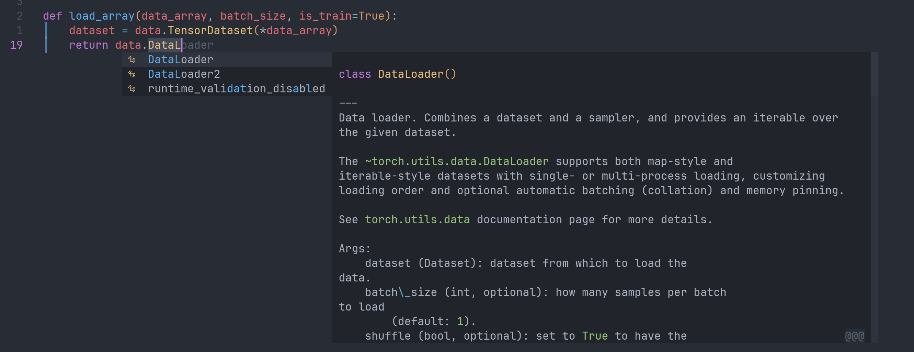
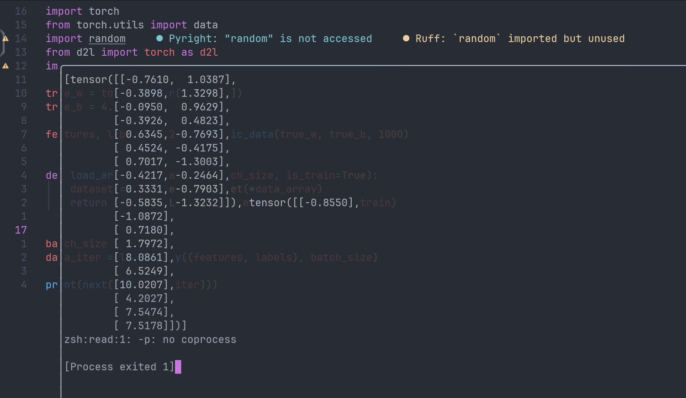
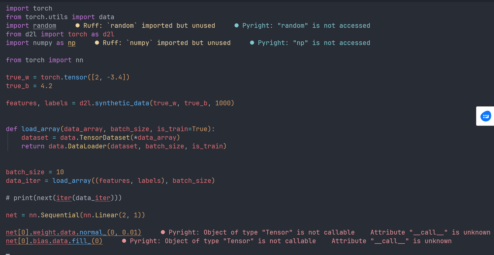
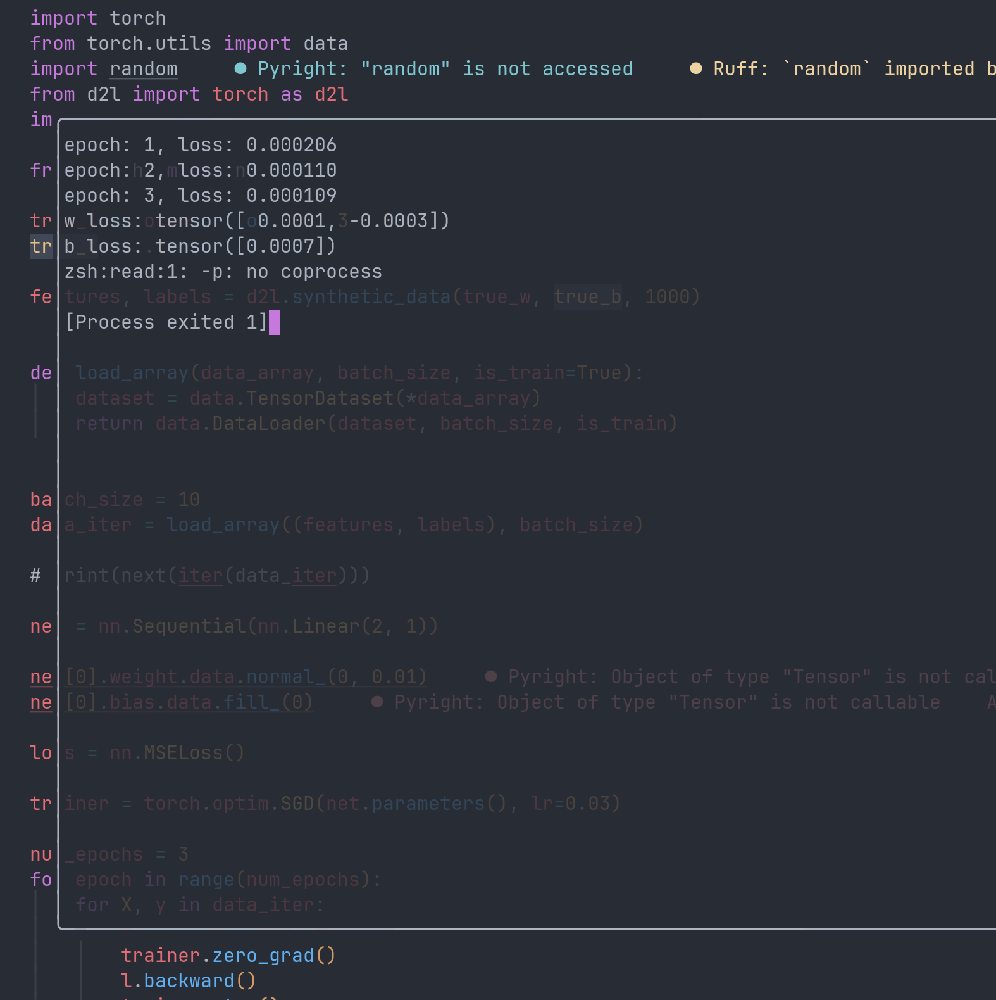
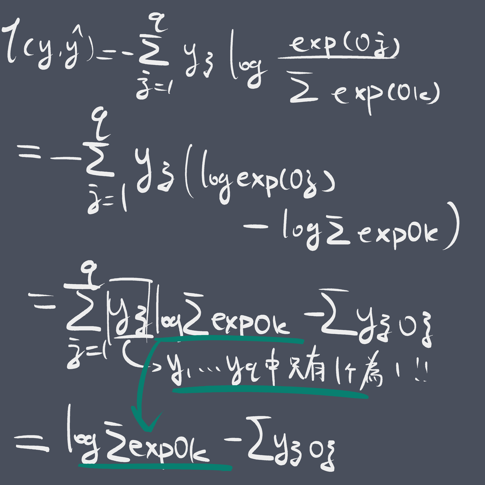
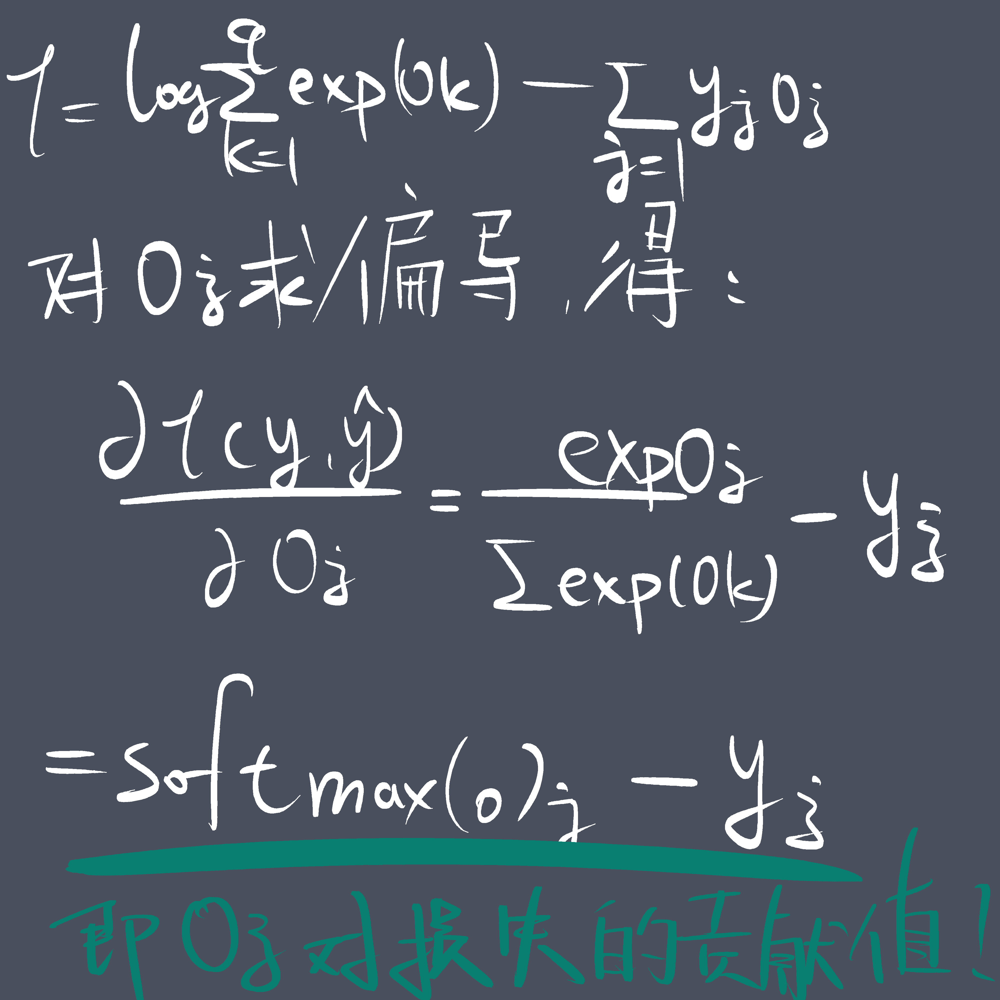
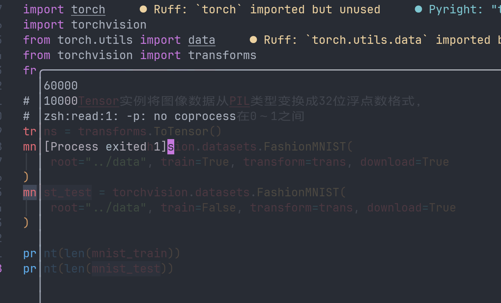
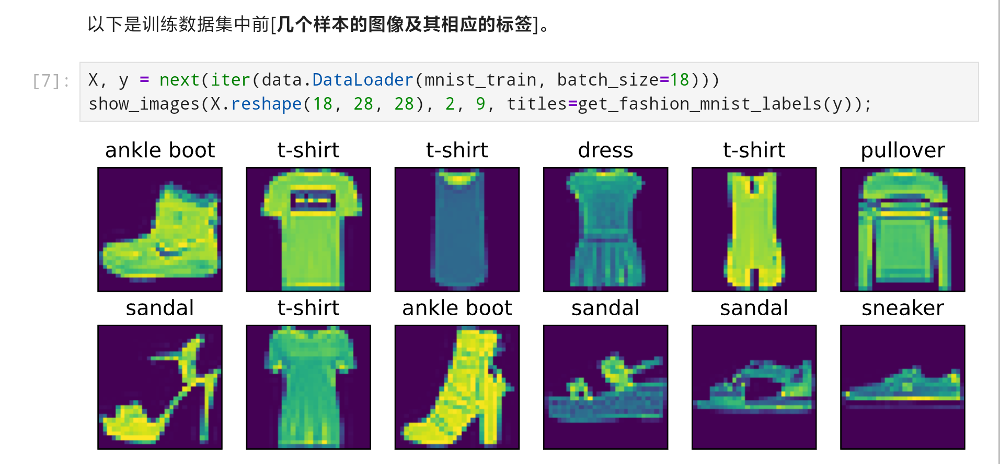

忙了大半个月考试，今天终于要回归主线了。考完试的这几天大概做了一些准备工作，试了下vivopencil，感觉效果不尽如人意，又退货了。前天尝试配了zerotier虚拟组网，效果还行，本来也想发篇博客（因为配置的过程中也在记录），但是感觉写的太水了，可能之后考虑搭建moon节点的时候会完善一下发出来。

因为本科导师下了kpi一个寒假推完d2l，动用了简单的小学数学知识，我惊讶地发现如果我要一个寒假学完D2L，我可能每2～3天就必须推完一章。这下不得不开工了。
## 线性神经网络回顾

从零开始的线性神经网络实现：

1. 生成数据集；
	1. 两个特征，三个参数
	2. 生成若干个随机的符合正态分布的特征，算出严格符合指定参数的预测值，再加上一个随机数得到标签。
2. 读取数据集
	1. 打乱索引列表，实现不重不漏的随机读取。
	2. 使用生成器语法。
3. 初始化模型参数
4. 定义模型
5. 定义损失函数
6. 定义优化算法
7. 训练

```python
import torch
import random


def synthetic_data(w, b, num_examples):
    # 生成一个长为num_examples，宽为w长度的随机张量，其中的数值分布符合正态分布。
    X = torch.normal(0, 1, (num_examples, len(w)))
    y = torch.matmul(X, w) + b
    y += torch.normal(0, 0.01, y.shape)
    return X, y.reshape(-1, 1)


true_w = torch.tensor([2, -3.4])
true_b = 4.2
features, labels = synthetic_data(true_w, true_b, 1000)


def data_iter(batch_size, features, labels):
    num_examples = len(labels)
    indices = list(range(num_examples))
    random.shuffle(indices)
    for i in range(0, num_examples, batch_size):
        batch_indices = indices[i : min(i + batch_size, num_examples)]
        yield features[batch_indices], labels[batch_indices]


BATCH_SIZE = 10

w = torch.normal(0, 0.01, size=(2, 1), requires_grad=True)
b = torch.zeros(1, requires_grad=True)


def linreg(X, w, b):
    return torch.matmul(X, w) + b


def squared_loss(y_hat, y):
    return (y_hat - y) ** 2 / 2


def sgd(params, lr, batch_size):
    with torch.no_grad():
        for param in params:
            param -= lr * param.grad / batch_size
            param.grad.zero_()


lr = 0.03
num_epochs = 3
net = linreg
loss = squared_loss

for epoch in range(num_epochs):
    for X, y in data_iter(BATCH_SIZE, features, labels):
        l = loss(net(X, w, b), y)
        l.sum().backward()
        sgd([w, b], lr, BATCH_SIZE)
    with torch.no_grad():
        train_l = loss(net(features, w, b), labels)
        print(f"epoch:{epoch + 1}, loss:{float(train_l.mean())}")

print(f"w误差：{true_w - w.reshape(true_w.shape)}")
print(f"b误差：{true_b - b}")
```

*重新照着答案敲了一遍，毕竟一个月没写了。*

对于一个简单的线性神经网络，首先我们可以先来明确它的模型：$X \cdot w + b$。明确了模型，其实具体的实现方法是大同小异的。我们需要定义什么样的预测结果是好的，什么样的是不好的，此处我们的选择是以预测值和真实值的差的平方作为误差，误差越大模型预测的效果越不好。每个参数在当前的数值下对于这个预测的误差有着不同的贡献值（即误差对参数的梯度），贡献值越大，我们就朝着相反的方向对这个参数调整越多。最后，我们可以得到一个误差相当小的参数组合。

其中，学习速率lr以及迭代周期数都属于所谓的**超参数**，和$w,b$不同，它们决定的是训练的效果，无法通过训练得到最优数值。

但是，假如我们要做的不再是这样的简单的线性模型，而是更加复杂的模型，我们会发现其实很多部分的实现实际上是重复性工作，比如我们将误差描述为差的绝对值的平方，这样的描述实际上相当普遍，对于很多模型我们都可以用这个方法去描述误差；再比如我们所写的`for epoch in range(num_epoches):`循环，其实即使我们去替换其中的优化函数、误差函数，这个训练过程照样可以完成。所以，为什么不把这些重复性较高的框架封装起来呢？

## 读取数据

```python
import torch
from torch.utils import data
import random 
from d2l import torch as d2l
import numpy as np 

true_w = torch.tensor([2, -3.4])
true_b = 4.2

features, labels = d2l.synthetic_data(true_w, true_b, 1000)
```

依然先生成数据集。（这里直接使用了d2l保存的上一次定义的synthetic_data函数）

对于读取数据，我们可以直接使用`torch.utils`中提供的接口。


`torch.utils.data`中提供了一个`TensorDataset`类，作用是将若干个张量绑定为一个数据集，前提是这几个张量的第一维大小一致。



`DataLoader`类，顾名思义是一个“数据加载器”，是数据集和采样器的结合。一个DataLoader和迭代器的行为类似，每次调用都会吐出一批数据。

我们最终可以得到这样的代码：

```python
def load_array(data_array, batch_size, is_train=True):
    dataset = data.TensorDataset(*data_array)
    return data.DataLoader(dataset, batch_size, is_train)
batch_size = 10
data_iter = load_array((features, labels), batch_size)
```

这段代码的功能和我们开始的`data_iter`函数的功能完全一致，只不过没有使用python原本的生成器语法。当然，尽管DataLoader的行为和python原生iter类似，如果我们想要直接使用的话还是需要`iter(load_array(...))`来转换一下。

我们随便打印一个看看：



符合预期，第一个tensor是特征，有两个特征；第二个tensor是标签。

## 定义模型

```python
# nn是神经网络的缩写
from torch import nn

net = nn.Sequential(nn.Linear(2, 1))
```


`Sequential`类，顺序的类。可以想见，每个模型的计算都免不了挨个进行一个个的计算步骤，Sequential描述的就是这样的过程。一个`Sequential`的实例就是一个神经网络net。Sequential会自动为我们把这些net串联起来，当我们把数据喂给第一层后，Sequential会自动把第一层的输出喂给第二层，以此类推。对于我们已经做成的“线性神经网络”，本质上是一个单层神经网络，没有所谓的顺序计算。但是在可以预见的未来，大多数模型都会使用多层的结构。这就像我们终于学会了1+1，现在我们要学1+1+1。这里的所谓的“层”，我个人觉得本质就是某种映射，将输出映射到结果的过程。

在我们的线性层中，每一个输出经过了这个层的计算后都会有一个输出与之对应（如果不知道为什么建议重修线性代数），因此我们称这样的一个层为*全连接层*。


`nn.Linear`类定义了一个线性变换。在`net = nn.Sequential(nn.Linear(2, 1))`中，第一个参数`2`表示的是输入特征的形状，我们此处定义了两个特征，所以为2；第二个参数`1`表示输出特征形状，输出特征形状为单个标量，所以填1。

定义了net之后，net本身就成为了一个映射。我们可以用`net(X)`由特征X得到一个预测的结果。
## 初始化模型参数

```python
net[0].weight.data.normal_(0, 0.01)
net[0].bias.data.fill_(0)
```

`net`是一个`nn.Sequential`实例，对`net`做下标索引得到的是`nn.Module`，也就是所有的“层”的基类。而weight和bias是`nn.Linear`的特有的attribute。因为我们现在确定了`net[0]`就是一个nn.Linear层，所以我们这样写程序是可以正常工作的。然而pyright（你可能在使用的静态语法检测器）看不出来这里实际上没有问题，它会给你的程序标上语法错误。



解决方法是无视即可。程序仍然可以正常运行。

## 定义损失函数

```python
loss = nn.MSELoss()
```

计算均方误差使用`MSEloss`类，也称平方L2范数，默认情况下返回所有样本损失的均值。后续使用中可以通过`loss(net(X), y)`来计算误差。

## 定义优化算法

```python
trainer = torch.optim.SGD(net.parameters(),lr = 0.03)
```

训练器是参数和超参数以及训练算法的整合。在计算得到的损失backward之后，我们无需自己手写小批量随机梯度下降，直接调用trainer的`step()`方法即可实现。

## 训练

```python
num_epochs = 3
for epoch in range(num_epochs):
    for X, y in data_iter:
        l = loss(net(X), y)
        trainer.zero_grad()
        l.backward()
        trainer.step()
    l = loss(net(features), labels)
    print(f"epoch: {epoch + 1}, loss: {l:f}")
```

我们原本更加繁琐的实现：

```python
for epoch in range(num_epochs):
    for X, y in data_iter(BATCH_SIZE, features, labels):
        l = loss(net(X, w, b), y)
        l.sum().backward()
        sgd([w, b], lr, BATCH_SIZE)
    with torch.no_grad():
        train_l = loss(net(features, w, b), labels)
        print(f"epoch:{epoch + 1}, loss:{float(train_l.mean())}")
```

## 完整代码：

```python
import torch
from torch.utils import data
import random
from d2l import torch as d2l
import numpy as np

from torch import nn

true_w = torch.tensor([2, -3.4])
true_b = 4.2

features, labels = d2l.synthetic_data(true_w, true_b, 1000)


def load_array(data_array, batch_size, is_train=True):
    dataset = data.TensorDataset(*data_array)
    return data.DataLoader(dataset, batch_size, is_train)


batch_size = 10
data_iter = load_array((features, labels), batch_size)

# print(next(iter(data_iter)))

net = nn.Sequential(nn.Linear(2, 1))

net[0].weight.data.normal_(0, 0.01)
net[0].bias.data.fill_(0)

loss = nn.MSELoss()

trainer = torch.optim.SGD(net.parameters(), lr=0.03)

num_epochs = 3
for epoch in range(num_epochs):
    for X, y in data_iter:
        l = loss(net(X), y)
        trainer.zero_grad()
        l.backward()
        trainer.step()
    l = loss(net(features), labels)
    print(f"epoch: {epoch + 1}, loss: {l:f}")

w = net[0].weight.data
b = net[0].bias.data

print("w loss:", true_w - w.reshape(true_w.shape))
print("b loss:", true_b - b)
```

输出结果:



## 课后练习

### Q1：如果用小批量的总损失替代平均值，应该如何修改学习率？


reduce在这个语境下的意思是**收敛**。在这里，`nn.MSEloss`提供了一个可选的参数`reduction`表示的是这个损失函数最终收敛到一个值的方法。默认方法`mean`表示的是求损失的平均值。如果我们想用总损失代替这个平均值，我们就应该手动设置reduction = 'sum'。

然而改成`reduction = sum`之后似乎结果的误差的数量级没有什么变化。可能题目的意思是怎样调整学习率可以使修改前后数学上等价。由于我们前面在`DataLoader`中设置了一个batch大小为10，所以此处若取误差总和，得到的误差大小会变为原来的10倍。如果我们希望得到和原本一致的训练效果，我们应该将学习率设置为原来的0.1倍，即0.003。

### Q2：查看深度学习框架，它们提供了哪些损失函数和初始化方法？

[Pytorch doc](https://docs.pytorch.org/docs/stable/index.html)

[LOSS](https://docs.pytorch.org/docs/stable/search.html?q=loss)

初始化方法不知道是什么意思，遂不找。

#### Huber loss

huber loss定义为：
$$l(y,y') = \begin{cases}|y-y'| -\frac{\sigma}{2} & \text{ if } |y-y'| > \sigma \\ \frac{1}{2 \sigma} (y-y')^2 & \text{ 其它情况}\end{cases}$$
简单来说，就是在误差较大的时候使用线性惩罚，误差较小的时候使用平方惩罚。事实上，误差的大小可以通过多种方式描述，而如何选取只取决于我们希望模型对于误差持什么样的态度。

在机器学习中，有这样的两种经典的误差定义方式，一种是MSE，计算的是误差的L2范数，另一种则是MAE，计算的是误差的L1范数。其中前者的优点是0点处可导，意味着优化过程相对稳定，但是缺点是对于异常值很敏感，容易被少数极端大小的数字打破平衡；后者的优点是对异常值不那么敏感，但缺点是0点处不可导，很容易在0点左右震荡。

总之，huber loss是二者的折衷方案。我们可以稍微修改一下我们原有的代码来实验一下huber和mse的训练效果：

```python
def train_loss(loss, num_epochs):
    data_iter = load_array((features, labels), batch_size)
    net[0].weight.data.normal_(0, 0.01)
    net[0].bias.data.fill_(0)

    trainer = torch.optim.SGD(net.parameters(), lr=0.03)

    for epoch in range(num_epochs):
        for X, y in data_iter:
            l = loss(net(X), y)
            trainer.zero_grad()
            l.backward()
            trainer.step()
        l = loss(net(features), labels)
        # print(f"epoch: {epoch + 1}, loss: {l:f}")

    w = net[0].weight.data
    b = net[0].bias.data

    print("w loss:", true_w - w.reshape(true_w.shape))
    print("b loss:", true_b - b)
    return true_w - w.reshape(true_w.shape), true_b - b


num_epochs_list = [3, 5, 10, 20, 50, 100]
for num_epochs in num_epochs_list:
    MSE_loss_w, MSE_loss_b = train_loss(nn.MSELoss(), num_epochs)
    Huber_loss_w, Huber_loss_b = train_loss(nn.HuberLoss(), num_epochs)
    print("    w loss diff: ", MSE_loss_w - Huber_loss_w)
    print("    b loss diff: ", MSE_loss_b - Huber_loss_b)
    print("\n")
```

使用了传统的print大法，对于随便看几组数据足够了。我们测试了各种训练周期次数下两种损失函数的表现，某次结果如下：

```python
w loss: tensor([ 0.0006, -0.0005])
b loss: tensor([0.0001])
w loss: tensor([ 0.0248, -0.0281])
b loss: tensor([0.0288])
    w loss diff:  tensor([-0.0242,  0.0276])
    b loss diff:  tensor([-0.0287])


w loss: tensor([0.0003, 0.0004])
b loss: tensor([0.0002])
w loss: tensor([-0.0001,  0.0002])
b loss: tensor([0.0004])
    w loss diff:  tensor([0.0004, 0.0002])
    b loss diff:  tensor([-0.0002])


w loss: tensor([-3.4857e-04, -1.9312e-05])
b loss: tensor([-0.0002])
w loss: tensor([3.9601e-04, 3.5524e-05])
b loss: tensor([0.0003])
    w loss diff:  tensor([-7.4458e-04, -5.4836e-05])
    b loss diff:  tensor([-0.0006])


w loss: tensor([-3.4618e-04,  1.0967e-05])
b loss: tensor([-8.9645e-05])
w loss: tensor([-0.0003,  0.0002])
b loss: tensor([0.0001])
    w loss diff:  tensor([-3.0756e-05, -1.4496e-04])
    b loss diff:  tensor([-0.0002])


w loss: tensor([1.7715e-04, 3.4809e-05])
b loss: tensor([0.0003])
w loss: tensor([-9.1076e-05,  2.3127e-04])
b loss: tensor([-0.0002])
    w loss diff:  tensor([ 0.0003, -0.0002])
    b loss diff:  tensor([0.0005])


w loss: tensor([0.0001, 0.0004])
b loss: tensor([0.0009])
w loss: tensor([ 9.8348e-05, -5.8103e-04])
b loss: tensor([0.0005])
    w loss diff:  tensor([7.7486e-06, 1.0133e-03])
    b loss diff:  tensor([0.0004])
```

粗略看下来虽然huber训练速度相对慢一些，但是优化过程较mse更加稳定。

## Q3：如何访问线性回归的梯度?

在旧有的实现方式中，我们可以直接使用`param.grad`来访问一个参数的梯度，但是在新的实现方式中，trainer直接替我们完成了这一步骤。

---

# Softmax回归

很多时候，我们需要的不只是一个预测值的大小，而是对于一个事物的归类。比如，某个电子邮件是不是垃圾邮件？某个图像中描绘的是什么动物？或者对于一个大语言模型的后处理采样器(专业对口)，下一个字选哪什么最合适？

在这种问题中，我们需要得到的往往不是一个模糊的概率，我们只对最终的“硬性分类”感兴趣。然而即便如此，具体的实现过程中，我们仍然要通过计算概率的方式来实现这种分类。

举个例子，假如我们要判断一个图像中显示的是狗、猫还是鸡，我们从中提取了4个特征，那么我们就可以用这样的式子来表示从特征到分类的映射关系：
$$
\begin{aligned}
o_1 &= x_1 w_{11} + x_2 w_{12} + x_3 w_{13} + x_4 w_{14} + b_1,\\
o_2 &= x_1 w_{21} + x_2 w_{22} + x_3 w_{23} + x_4 w_{24} + b_2,\\
o_3 &= x_1 w_{31} + x_2 w_{32} + x_3 w_{33} + x_4 w_{34} + b_3.
\end{aligned}
$$
其中$o_{1},o_{2},o_{3}$为所谓的**logit**，即**未规范化的预测**，反映的是目标匹配的程度。比如假如狗、猫、鸡分别对应$o_{1}=0.1,o_{2}=0.8,o_{3}=0.1$，那么我们就可以这样来决定最后的分类：按照logit来投骰子，80%的概率投到猫，10%的概率投到狗或者鸡。

但是，假如我们要投骰子，我们就必须先知道不同事物对应的概率，但是logits的计算过程并不能确保它的总和总是1。此时我们需要某种方法来由logits得到我们所需要的总和为1的概率。不仅如此，我们还希望最后得到的概率分布有助于激励模型选中最正确的那个选项，比如虽然我们的logits比例为1:8:1，但是我们希望最后得分占8份的那个选项被抽中的概率比80%更大。

softmax函数做的正是这样的事情。softmax函数能够将未规范化的预测变换为非负数并且总和为1，同时让模型保持可导的性质。 为了完成这一目标，我们首先对每个未规范化的预测求幂，这样可以确保输出非负。 为了确保最终输出的概率值总和为1，我们再让每个求幂后的结果除以它们的总和。如下式：
$$
\hat{\mathbf{y}} = \mathrm{softmax}(\mathbf{o})\quad \text{其中}\quad \hat{y}_j = \frac{\exp(o_j)}{\sum_k \exp(o_k)}
$$
尽管softmax函数本身并不是线性的，但是softmax回归的输出仍然由特征的仿射变换决定，所以softmax回归是一个线性模型。

说白了，softmax做的事情就是把打分映射成概率。

## 对数似然

我们仍然尝试去分类狗、猫和鸡。设想我们造出了这样一个机器，我们喂给它一张图片，它就会吐出这张图片是狗、猫和鸡的概率。现在，我们喂给机器一张猫的图片，调节旋钮，机器吐出猫的概率为0.1；再调节旋钮，机器吐出猫的概率是0.8。那么对于我们已经知道结果的实验者来说，后者对于事实的判断是更加准确的。

旋钮的比喻实际上指的就是机器学习中的参数。所谓的**最大似然**，说的就是找到这样的一个旋钮位置，使得所有正确答案发生的概率之和（或之积）最大。

比如，仍然举我们的图片机器比喻，我们喂给机器一张猫的图片，机器认为图片上是猫的概率是80%，但是这不代表每张猫的图片机器都认为它是猫的概率是80%，机器完全可以认为某张图是猫的概率是99.9%，也可以认为是0.01%。此外在这个例子中，我们也完全没有谈到对于狗和鸡的辨别。我们希望的最理想的状态是，我们手头有很多图片，上面是狗、猫还是鸡我们自己清楚，我们希望喂给机器后“机器可以正确判断所有样本”的这个总概率最大。也就是说某张猫图机器正确概率80%，另一张猫图机器正确概率70%，再一张狗图机器正确概率90%，那么机器判断全部正确的概率就是$80\% \cdot70 \% \cdot 90\%$。这个总概率会随着参数变化而变化，所以我们希望通过调整参数来让这个总概率最大。总概率越大，机器的准确度也就越大。

所谓的**对数似然**，说的就是：我们不直接计算$P(\mathbf{Y} \mid \mathbf{X}) = \prod_{i=1}^n P(\mathbf{y}^{(i)} \mid \mathbf{x}^{(i)})$这个连乘计算，而是计算$\log P(\mathbf{Y} \mid \mathbf{X}) = \sum_{i=1}^n \log P(\mathbf{y}^{(i)} \mid \mathbf{x}^{(i)})$。一方面在样本很多的时候，直接对概率求积很可能最后非常趋近于0而导致向下溢出，另一方面对于机器来说虽然将这些概率乘起来很容易，但是求导的时候会很痛苦。

然而因为概率总是0～1之间的数字，加上对数之后就总是一个负数。所以为了凑出一个正的损失值，我们实际计算的是$-\log P(\mathbf{Y} \mid \mathbf{X}) = -\sum_{i=1}^n \log P(\mathbf{y}^{(i)} \mid \mathbf{x}^{(i)})$，将最大化似然转化为最小化负似然，将总概率对数的负数视作这个模型的损失，这样我们就可以继续套用我们线性回归模型的训练流程。

规范的损失函数表述：
$$ l(\mathbf{y}, \hat{\mathbf{y}}) = - \sum_{j=1}^q y_j \log \hat{y}_j. $$
其中$y_j$是第$j$个分类对应的**独热编码**，即标准答案中的概率：假如一个图片中是猫，猫对应的$y_2$，则$y_2 = 1$，而图中的东西不是狗也不是鸡，所以$y_{1}=0,y_{3}=0$，所以最后得到的损失值就是$-y_{2}\log \hat{y_{2}}$实际的意义也就是找到机器判断正确的概率的负对数。在使用小批量随机下降法时，我们就可以直接对一个小批量的损失求和或平均得到这个batch的总损失。

## softmax及其导数






为了最终计算每个参数对于损失的贡献值，我们先计算每个logit对于损失的贡献，因为参数对于logits的损失贡献我们可以直接套用线性回归模型中的损失函数。

通过如上的推导，我们惊讶地发现每个logit对于损失的贡献竟然也可以用softmax来计算，这样就极大地方便了对数似然的梯度计算。

## 信息论基础

信息论的核心思想是量化数据中的信息内容。D2L讲义里给的东西实在有点太难懂了，这里用相对浅显的语言叙述一遍。

信息论认为信息量的大小取决于这段信息的“惊异程度”。比如我说“程序员一定要会写代码”，你会说这不是废话吗。这句话的信息量就很低，因为它发生的概率约等于100%。但是假如我说“从明天开始所有程序员的代码水平下降100倍而我不受影响”，这句话的信息量就很大了，因为这句话发生的概率非常低，发生时会带来极大的惊异。

我们设事件$A$为“程序员一定要会写代码”，事件$B$为“从明天开始所有程序员的代码水平下降100倍而我不受影响”。在信息论中有这样的公式：
$$H[P] = \sum_j - P(j) \log P(j).$$
其中，$-\log P(j)$描述的是**信息量**，$P(j)$越大信息量越小，反之越大。信息量再乘以发生概率，描述的就是这个信息整体的**混乱程度**，即**信息熵**。

比如，假如事件$A$的概率为99%，概率非常大，但是相应的$-\log P(A)$的数值会非常小，动用卡西欧之力我们可以算出$A$的信息熵约$9.95 \cdot 10^{-3}$。概率非常大，导致我们预测这个事件的把握非常大，这个事件一点都不混乱。

但是对于事件$B$，假如$B$的概率为0.01%，概率非常的小，但是相应的$-\log P(B)$的数值会非常大，我们可以算出B的信息熵约为$9.21 \cdot 10^{-4}$。因为概率很小，所以我们也同样很容易预测，所以虽然惊异，但是混乱程度也很低。

通过这两个例子，你会发现信息熵描述的实际上是一个系统内所以可能发生的事件平均下来能带给你多少惊异。什么样的系统信息熵很大呢？比如投个硬币，正面反面概率都是50%，你几乎无法预测下一次投出来是什么，每次投硬币都会给你一点新的信息，局势很混乱，熵也比较高。

### 交叉熵

回到我们的机器学习话题，假如我们希望用机器判断一个图片是狗、猫还是鸡，有一点是可以确认的：“图片描绘的是狗、猫还是鸡”这个问题是有一个客观的答案的。假如图片就是我们在现实中拍的，那么它一定对应一个动物；假如图片是一个画家画的，画的东西做到了同时像狗像猫还像鸡，那么至少宇宙万法那个源头会知道这个图描绘的是狗猫鸡的概率分别是多少。

对于随便的某张图，假如真实的情况是这张图片描绘的是猫的概率是99%，但是我的机器认为是猫的概率为1%，所以当结果真的是猫的时候，机器就会非常惊讶；假如回回是猫，机器就会回回惊讶，这样一来平均惊异度就会很高，也就意味着系统的信息熵很高。我们为这种熵取一个专有的名词，叫做**交叉熵**。设真实的概率为$P$，预测的概率为$Q$，那么交叉熵可以表示为：
$$
H(P,Q) = \sum-P \cdot \log(Q)
$$
我们的目标是让模型尽最大可能的准确预测这个事件，翻译过来就是：在模型进行了预测后面对真实答案时尽可能的不意外，也就是我们希望**交叉熵越小越好**。

这时候你会有这样的疑问：看起来好像假如我们希望模型看到真实结果时不意外，我们只需要让模型预测的结果尽可能大就可以了？这就好像考完试估分的时候考虑最差的情况而不是最可能的情况，这样即使出现意外自己也不会很惊讶。

但是实际情况是模型做不到把概率预测的尽可能高，原因在于logits经过softamax加工之后总和被锁定为1，模型没办法既给狗判定为90%，同时又给猫和鸡也判90%。我们假设一个图片描绘的是狗、猫和鸡的真实概率为$P_{1},P_{2},P_{3}$，模型预测的概率为$Q_1,Q_2,Q_3$，那么我们有如下方程：
$$
\begin{cases}
Q_1 + Q_2 + Q_3 = 1 \\
P_1 + P_2 + P_3 = 1 \\
H(P, Q) = \sum_{i = 1}^{3}-P_i \log(Q_i)
\end{cases}
$$
我们希望$H(P,Q)$的数值最低。经过计算，我们得到当$Q_{1},Q_{2},Q_{3}$分别和$P_{1},P_{2},P_{3}$相等的时候，$H(P,Q)$取到最小值。

绕了这么一大圈，我们其实最终得到的结论就是：我们希望模型预测的结果能尽可能的符合实际，本质上就是希望模型能尽可能准确的找到那个潜在的客观概率，而过程中的交叉熵就可以用来作为衡量误差的误差函数。交叉熵越大，我们便可以认为误差越大，进而优化模型。

## 课后练习

鸽了。

# 图像分类数据集

在经过了漫长的理论分析之后，我们终于要自己动手写一下图像分类了。（泪目）

总之，我们使用的图像分类数据集为fashion-mnist。Fashion-MNIST数据集由10个类别组成，每个类别由训练数据集的6000个图像和测试数据集的1000个图像组成。每个图像的长度和宽度均为28。（tui狂喜）

```python
import torch
import torchvision
from torch.utils import data
from torchvision import transforms
from d2l import torch as d2l

# 通过ToTensor实例将图像数据从PIL类型变换成32位浮点数格式，
# 并除以255使得所有像素的数值均在0～1之间
trans = transforms.ToTensor()
mnist_train = torchvision.datasets.FashionMNIST(
    root="../data", train=True, transform=trans, download=True
)
mnist_test = torchvision.datasets.FashionMNIST(
    root="../data", train=False, transform=trans, download=True
)
```

运行这段代码会自动下载测试数据集。有的时候因为网络问题可能会下载失败，你可以选择手动去github上下载，但是必须自己组织和FashionMNIST方法一致的文件结构。

推荐的手动安装链接：[fashion-mnist官网](http://fashion-mnist.s3-website.eu-central-1.amazonaws.com/train-images-idx3-ubyte.gz)


打印一下训练数据集和测试数据集的大小，分别为60000和10000。符合预期。



`mnist_train`和`mnist_test`的数据类型为`torchvision.datasets.mnist.FashionMNIST'`，为数据集对象，均继承自PyTorch的Dataset类。它们的行为像一个列表，可以使用下标索引来访问某一个样本，也可以使用`len()`来获取总长度。比如，你可以通过`mnist_train[0]`来获取第一个样本的内容，对应的文件类型为一个元组。

在任意一个`mnist_train`的样本元组中，第一个元素存储的是图像张量，第二个元素存储的是图像的类别标签。比如对于某个T恤样本元组，第一个元素就是用来描述这个图像的一个形状为$[1,28,28]$的PyTorch张量，第二个元素则是T恤对应的索引值。

我们来看看这段代码会输出什么：

```python
print(type(mnist_train))
print(type(mnist_train[0]))
print(len(mnist_train[0]))
print(type(mnist_train[0][0]))
print(mnist_train[0][0].shape)
print(mnist_train[0][1])
print(type(mnist_train[0][0][0]))
print(type(mnist_train[0][0][0][0]))
print(type(mnist_train[0][0][0][0][0]))
```

结果为：

```python
<class 'torchvision.datasets.mnist.FashionMNIST'>
<class 'tuple'>
2
<class 'torch.Tensor'>
torch.Size([1, 28, 28])
9
<class 'torch.Tensor'>
<class 'torch.Tensor'>
<class 'torch.Tensor'>
```

图像的形状之所以形状为$[1,28,28]$是因为FashionMNIST数据集选取的图像并不是彩色图像，而是黑白灰度图，描述图像的元素只需要一个数字即可，所以通道数为1。而对于一般的图片，我们可能需要三个颜色通道才能描述，所以假如FashionMNIST选取的图片是彩色的，可能描述图片的张量形状就是$[3,28,28]$。

Fashion-MNIST中包含的10个类别，分别为t-shirt（T恤）、trouser（裤子）、pullover（套衫）、dress（连衣裙）、coat（外套）、sandal（凉鞋）、shirt（衬衫）、sneaker（运动鞋）、bag（包）和ankle boot（短靴）。 以下函数用于在数字标签索引及其文本名称之间进行转换。

```python
def get_fashion_mnist_labels(labels):  #@save
    """返回Fashion-MNIST数据集的文本标签"""
    text_labels = ['t-shirt', 'trouser', 'pullover', 'dress', 'coat',
                   'sandal', 'shirt', 'sneaker', 'bag', 'ankle boot']
    return [text_labels[int(i)] for i in labels]
```

D2L中提供了这样的脚本来可视化样本。

```python
def show_images(imgs, num_rows, num_cols, titles=None, scale=1.5):  #@save
    """绘制图像列表"""
    figsize = (num_cols * scale, num_rows * scale)
    _, axes = d2l.plt.subplots(num_rows, num_cols, figsize=figsize)
    axes = axes.flatten()
    for i, (ax, img) in enumerate(zip(axes, imgs)):
        if torch.is_tensor(img):
            # 图片张量
            ax.imshow(img.numpy())
        else:
            # PIL图片
            ax.imshow(img)
        ax.axes.get_xaxis().set_visible(False)
        ax.axes.get_yaxis().set_visible(False)
        if titles:
            ax.set_title(titles[i])
    return axes
```

这段脚本的工作原理搞不明白的话也无所谓，总之之后想在jupyter notebook中显示tensor格式的图像用它就可以了。

在jupyter lab中呈现的效果：



尝试了一段时间想在plotext上复刻这种效果，感觉有点吃力不讨好。看来还是不得不用jupyter notebook做机器学习。

## 读取小批量

```python
BATCH_SIZE = 256

def get_dataloader_workers():
    return 4

train_iter = data.DataLoader(
    mnist_train, batch_size=BATCH_SIZE, shuffle=True, num_workers=4
)

timer = d2l.Timer()
for X, y in train_iter:
    continue
print(f"{timer.stop():.2f} sec")
```

GPU处理数据的一个基本单元是batch，由于打包batch需要涉及GPU并不擅长的相对复杂的逻辑运算以及磁盘读写，这部分工作基本由CPU来完成，而CPU的计算速度乏善可陈。很多时候当GPU已经处理完了一个batch，CPU还在忙着打包，这样GPU就会处在空闲状态，导致计算速度下降。此处我们手动设置了`num_workers`参数，即设定了启动的CPU进程数，让四个进程一块打包batch，提高总体效率。

通常，对于一个8核CPU，`num_workers`设置为4或者8是相对合理的。

输出结果：


整合以上的代码得到一个集成了数据集下载、图形预处理以及随机采样的数据集加载器：

```python
def load_data_fashion_mnist(batch_size, resize=None):
    trans = [transforms.ToTensor()]
    if resize:
        trans.insert(0, transforms.Resize(resize))
    trans = transforms.Compose(trans)
    mnist_train = torchvision.datasets.FashionMNIST(root="../data/", train=True, download=True, transform=trans)
    mnist_test = torchvision.datasets.FashionMNIST(root="../data", train=False, download=True, transform=trans)
    return (
        data.DataLoader(dataset=mnist_train, batch_size=batch_size, shuffle=True, num_workers=get_dataloader_workers()),
        data.DataLoader(dataset=mnist_test, batch_size=batch_size, shuffle=False, num_workers=get_dataloader_workers())
    )

```

其中返回值为一个元组，第二个元素为对测试集的批量采样。看起来有点复杂，但是实际自己动手写一遍感觉思路就通了。这里之所以需要塞一个resize的变换，是因为有一些深度学习模型是为特定尺寸的图片设计的，经过池化层或者一些步长大于1的卷积层会导致图像尺寸缩小，可能传着传着图就没了，所以传入模型之前对图像尺寸做手动适配可以提高加载器的灵活性。

使用例：

```python
train_iter, test_iter = load_data_fashion_mnist(batch_size=32, resize=64)
for X, y in train_iter:
    print(X.shape, X.dtype, y.shape, y.dtype)
    break
```

加载数据集并从中按32个样本为一个批次采样，并把图像长宽拉伸为64。输出结果如下：

```python
torch.Size([32, 1, 64, 64]) torch.float32 torch.Size([32]) torch.int64
```

## 课后习题：

### Q1：减少batch_size是否会影响读取性能?

测试代码：

```python
def batch_size_test(batch_size):
    timer.start()
    train_iter, test_iter = load_data_fashion_mnist(batch_size=batch_size, resize=64)
    for i, (X, y) in enumerate(train_iter):
        pass
    print(f"{timer.stop():.2f} sec")


for batch_size in [1, 4, 8, 16, 32, 64]:
    batch_size_test(batch_size)
```

运行结果：

```python
45.01 sec
11.19 sec
5.76 sec
3.07 sec
1.75 sec
1.25 sec
```

可以看到随着batch_size增大，读取数据的用时显著减少。原因在于batch_size越大，打包batch的次数越少，CPU访存次数越少。读取数据的主要用时就在于此。

我们还可以基于此添加num_workers对性能的影响，脚本如下：

```python
def load_data_fashion_mnist(batch_size, resize=None, num_workers=None):
    trans = [transforms.ToTensor()]
    if resize:
        trans.insert(0, transforms.Resize(resize))
    trans = transforms.Compose(trans)
    mnist_train = torchvision.datasets.FashionMNIST(
        root="../data/", train=True, download=True, transform=trans
    )
    mnist_test = torchvision.datasets.FashionMNIST(
        root="../data", train=False, download=True, transform=trans
    )
    if num_workers:
        return (
            data.DataLoader(
                dataset=mnist_train,
                batch_size=batch_size,
                shuffle=True,
                num_workers=num_workers,
            ),
            data.DataLoader(
                dataset=mnist_test,
                batch_size=batch_size,
                shuffle=False,
                num_workers=num_workers,
            ),
        )
    return (
        data.DataLoader(
            dataset=mnist_train,
            batch_size=batch_size,
            shuffle=True,
            num_workers=get_dataloader_workers(),
        ),
        data.DataLoader(
            dataset=mnist_test,
            batch_size=batch_size,
            shuffle=False,
            num_workers=get_dataloader_workers(),
        ),
    )


def batch_size_test(batch_size, num_workers):
    timer.start()
    train_iter, test_iter = load_data_fashion_mnist(
        batch_size=batch_size, resize=64, num_workers=num_workers
    )
    for i, (X, y) in enumerate(train_iter):
        pass
    print(
        f"batch size: {batch_size}, num of workers: {num_workers}, {timer.stop():.2f} sec"
    )


for batch_size in [1, 4, 8, 16, 32, 64]:
    for num_workers in [1, 2, 4, 8]:
        batch_size_test(batch_size, num_workers)
```

（略微修改了数据加载器的代码来适配对num_workers的调整。）

输出结果如下：

```python
batch size: 1, num of workers: 1, 66.35 sec
batch size: 1, num of workers: 2, 45.15 sec
batch size: 1, num of workers: 4, 50.05 sec
batch size: 1, num of workers: 8, 50.57 sec
batch size: 4, num of workers: 1, 22.39 sec
batch size: 4, num of workers: 2, 12.79 sec
batch size: 4, num of workers: 4, 12.86 sec
batch size: 4, num of workers: 8, 13.59 sec
batch size: 8, num of workers: 1, 13.08 sec
batch size: 8, num of workers: 2, 8.41 sec
batch size: 8, num of workers: 4, 6.79 sec
batch size: 8, num of workers: 8, 6.93 sec
batch size: 16, num of workers: 1, 8.33 sec
batch size: 16, num of workers: 2, 5.09 sec
batch size: 16, num of workers: 4, 3.85 sec
batch size: 16, num of workers: 8, 3.92 sec
batch size: 32, num of workers: 1, 5.91 sec
batch size: 32, num of workers: 2, 3.65 sec
batch size: 32, num of workers: 4, 2.40 sec
batch size: 32, num of workers: 8, 2.40 sec
batch size: 64, num of workers: 1, 4.62 sec
batch size: 64, num of workers: 2, 2.73 sec
batch size: 64, num of workers: 4, 1.75 sec
batch size: 64, num of workers: 8, 1.44 sec
```

随着num_workers增加，数据读取效率通常也会增加，但是这会取决于batch_size的大小。比如，当num_workers从1增加到2的时候，数据读取用时显著减少，从2到4也有进步，但是4到8则性能提升较少，甚至一些bs下8workers用时反而会变长。

原因在于CPU的核心数是有限的。随着线程数量增大，CPU调度本身也在增加性能成本。当性能成本的增长高过多线程带来的速度收益，数据读取用时就会负增长。

总之，实际训练的时候应该尽量的使用更大的batch_size，除非过大导致爆显存（此事在triton sampler中亦有记载）；此外，num_workers的数值往往存在一个甜品点，比如在我的机器上num_workers设置为4就是多数情况下最稳健且速度较优的配置。

### Q2：数据迭代器的性能非常重要。当前的实现足够快吗？探索各种选择来改进它。

- `pin_memory = True`开启显存锁定内存。如果想要GPU直接读取内存数据，内存中数据对应的地址必须固定。假如不开启pin_memory，每次GPU想要读取数据的时候，系统都必须把普通内存中的数据先移动到GPU能读取的锁页内存，然后GPU才能读取。开启之后，CPU打包好的数据会直接放在锁页内存中，这样GPU读取的时候就可以省略一步复制操作。
- `persistent_workers = True`，在每个epoch结束之后保留workers进程，避免反复创建内存的开销。
- 预处理训练集，如果需要resize则提前写一个脚本生成一个已经resize过的数据集，这样训练过程中就不用CPU反复resize，减少CPU负载。
- 直接读取整个数据集，将所有样本都用张量的形式直接放在内存中，消除磁盘读写时间。

总之我们先来尝试一下添加显存锁定内存以及保留线程。修改后的数据加载器：

```python
def load_data_fashion_mnist(batch_size, resize=None, num_workers=None):
    trans = [transforms.ToTensor()]
    if resize:
        trans.insert(0, transforms.Resize(resize))
    trans = transforms.Compose(trans)
    mnist_train = torchvision.datasets.FashionMNIST(
        root="../data/", train=True, download=True, transform=trans
    )
    mnist_test = torchvision.datasets.FashionMNIST(
        root="../data", train=False, download=True, transform=trans
    )
    if num_workers:
        return (
            data.DataLoader(
                dataset=mnist_train,
                batch_size=batch_size,
                shuffle=True,
                pin_memory = True,
                persistent_workers = True,
                num_workers=num_workers,
            ),
            data.DataLoader(
                dataset=mnist_test,
                batch_size=batch_size,
                shuffle=False,
                pin_memory = True,
                persistent_workers = True,
                num_workers=num_workers,
            ),
        )
    return (
        data.DataLoader(
            dataset=mnist_train,
            batch_size=batch_size,
            shuffle=True,
            pin_memory = True,
            persistent_workers = True,
            num_workers=get_dataloader_workers(),
        ),
        data.DataLoader(
            dataset=mnist_test,
            batch_size=batch_size,
            shuffle=False,
            pin_memory = True,
            persistent_workers = True,
            num_workers=get_dataloader_workers(),
        ),
    )

```

（做到这里的时候发现torch版本太旧，加了`pin_memory`出现了不支持当前硬件的情况，索性重新配了一个新的环境，jupyter lab感觉配置有点反人类，回头写篇博客专门研究一下。）

运行结果：

```python
batch size: 1, num of workers: 1, 67.36 sec
batch size: 1, num of workers: 2, 45.86 sec
batch size: 1, num of workers: 4, 48.19 sec
batch size: 1, num of workers: 8, 50.56 sec
batch size: 4, num of workers: 1, 21.34 sec
batch size: 4, num of workers: 2, 13.26 sec
batch size: 4, num of workers: 4, 13.15 sec
batch size: 4, num of workers: 8, 13.04 sec
batch size: 8, num of workers: 1, 13.00 sec
batch size: 8, num of workers: 2, 8.06 sec
batch size: 8, num of workers: 4, 6.77 sec
batch size: 8, num of workers: 8, 7.26 sec
batch size: 16, num of workers: 1, 8.42 sec
batch size: 16, num of workers: 2, 4.96 sec
batch size: 16, num of workers: 4, 3.88 sec
batch size: 16, num of workers: 8, 3.93 sec
batch size: 32, num of workers: 1, 5.87 sec
batch size: 32, num of workers: 2, 3.58 sec
batch size: 32, num of workers: 4, 2.42 sec
batch size: 32, num of workers: 8, 2.37 sec
batch size: 64, num of workers: 1, 4.79 sec
batch size: 64, num of workers: 2, 2.61 sec
batch size: 64, num of workers: 4, 1.77 sec
batch size: 64, num of workers: 8, 1.51 sec
```

（好像没什么优化，我怀疑可能是自己硬件太超前了导致torch支持还没跟上...）

尝试使用离线处理，原理是`transforms.Resize(64)`非常吃CPU，每个epoch都要计算一次的话会很浪费性能。幸运的是PyTorch支持你把一个张量存储为一个`.pt`文件存在硬盘上，我们可以写一个脚本预处理图像，把尺寸伸缩后的图像全部塞在这个张量文件中，这样数据加载的时候就可以省略这一步骤。

```python
def preprocess_and_save(root="../data/", resize=64):
    trans = transforms.Compose([transforms.ToTensor(), transforms.Resize(size=resize)])
    mnist_train = torchvision.datasets.FashionMNIST(
        root=root, train=True, transform=trans, download=True
    )
    mnist_test = torchvision.datasets.FashionMNIST(
        root=root, train=False, transform=trans, download=True
    )
    train_loader = data.DataLoader(dataset=mnist_train, batch_size=len(mnist_train))
    test_loader = data.DataLoader(dataset=mnist_test, batch_size=len(mnist_test))
    train_data, train_target = next(iter(train_loader))
    test_data, test_target = next(iter(test_loader))
    torch.save((train_data, train_target), "mnist_train_resize.pt")
    torch.save((test_data, test_target), "mnist_test_resize.pt")
    print("Saved successfully.")

preprocess_and_save()
```

工作原理是一次读取一个和数据集一样大的batch，然后把读取的data和target张量打包成一个元组塞进`.pt`文件中。

对于读取操作，我们可以通过自己写一个dataset类来实现，完整代码实现如下：

```python
def preprocess_and_save(root="../data/", resize=64):
    trans = transforms.Compose([transforms.ToTensor(), transforms.Resize(size=resize)])
    mnist_train = torchvision.datasets.FashionMNIST(
        root=root, train=True, transform=trans, download=True
    )
    mnist_test = torchvision.datasets.FashionMNIST(
        root=root, train=False, transform=trans, download=True
    )
    train_loader = data.DataLoader(dataset=mnist_train, batch_size=len(mnist_train))
    test_loader = data.DataLoader(dataset=mnist_test, batch_size=len(mnist_test))
    train_data, train_target = next(iter(train_loader))
    test_data, test_target = next(iter(test_loader))
    torch.save((train_data, train_target), "mnist_train_resize.pt")
    torch.save((test_data, test_target), "mnist_test_resize.pt")
    print("Saved successfully.")


class OfflineDataset(data.Dataset):
    def __init__(self, pt_file) -> None:
        self.data, self.targets = torch.load(pt_file)

    def __len__(self):
        return len(self.targets)

    def __getitem__(self, index):
        return self.data[index], self.targets[index]


preprocess_and_save()

train_iter = data.DataLoader(
    OfflineDataset("mnist_train_resize.pt"),
    batch_size=BATCH_SIZE,
    shuffle=True,
    num_workers=get_dataloader_workers(),
)

test_iter = data.DataLoader(
    OfflineDataset("mnist_test_resize.pt"),
    batch_size=BATCH_SIZE,
    shuffle=False,
    num_workers=get_dataloader_workers(),
)
```

我们还可以把它打包成和原本的`load_data_fashion_mnist`行为一致的加载器：

```python
def load_data_offline(batch_size, num_workers=None):
    if not num_workers:
        num_workers = get_dataloader_workers()
    return (
        data.DataLoader(
            OfflineDataset("mnist_train_resize.pt"),
            batch_size=batch_size,
            shuffle=True,
            num_workers=num_workers,
        ),
        data.DataLoader(
            OfflineDataset("mnist_test_resize.pt"),
            batch_size=batch_size,
            shuffle=False,
            num_workers=num_workers,
        ),
    )
```

测试脚本：

```python
def batch_size_test_offline(batch_size, num_workers):
    timer.start()
    train_iter, test_iter = load_data_offline(batch_size, num_workers)
    for i, (X, y) in enumerate(train_iter):
        pass
    t = timer.stop()
    print(
        f"offline: batch size: {batch_size}, num of workers: {num_workers}, {t:.2f} sec"
    )
    return t


def batch_size_test(batch_size, num_workers):
    timer.start()
    train_iter, test_iter = load_data_fashion_mnist(
        batch_size=batch_size, resize=64, num_workers=num_workers
    )
    for i, (X, y) in enumerate(train_iter):
        pass
    t = timer.stop()
    print(
        f"online: batch size: {batch_size}, num of workers: {num_workers}, {t:.2f} sec"
    )
    return t


batch_size_list = [1, 2, 4, 8, 16, 32, 64]
num_workers_list = [1, 2, 4, 8]

for batch_size in batch_size_list:
    for num_workers in num_workers_list:
        t_offline = batch_size_test_offline(batch_size, num_workers)
        t_online = batch_size_test(batch_size, num_workers)
        print(f"    Speedup ratio:{(t_online / t_offline):.2f}")
```

输出结果：

```sh
Saved successfully.
offline: batch size: 1, num of workers: 1, 50.77 sec
online: batch size: 1, num of workers: 1, 61.14 sec
    Speedup ratio:1.20
offline: batch size: 1, num of workers: 2, 38.74 sec
online: batch size: 1, num of workers: 2, 43.12 sec
    Speedup ratio:1.11
offline: batch size: 1, num of workers: 4, 41.70 sec
online: batch size: 1, num of workers: 4, 42.30 sec
    Speedup ratio:1.01
offline: batch size: 1, num of workers: 8, 42.96 sec
online: batch size: 1, num of workers: 8, 43.82 sec
    Speedup ratio:1.02
offline: batch size: 2, num of workers: 1, 26.88 sec
online: batch size: 2, num of workers: 1, 35.11 sec
    Speedup ratio:1.31
offline: batch size: 2, num of workers: 2, 20.78 sec
online: batch size: 2, num of workers: 2, 21.45 sec
    Speedup ratio:1.03
offline: batch size: 2, num of workers: 4, 22.06 sec
online: batch size: 2, num of workers: 4, 21.86 sec
    Speedup ratio:0.99
offline: batch size: 2, num of workers: 8, 21.27 sec
online: batch size: 2, num of workers: 8, 22.73 sec
    Speedup ratio:1.07
offline: batch size: 4, num of workers: 1, 14.37 sec
online: batch size: 4, num of workers: 1, 20.35 sec
    Speedup ratio:1.42
offline: batch size: 4, num of workers: 2, 11.23 sec
online: batch size: 4, num of workers: 2, 10.90 sec
    Speedup ratio:0.97
offline: batch size: 4, num of workers: 4, 11.27 sec
online: batch size: 4, num of workers: 4, 11.97 sec
    Speedup ratio:1.06
offline: batch size: 4, num of workers: 8, 10.54 sec
online: batch size: 4, num of workers: 8, 11.94 sec
    Speedup ratio:1.13
offline: batch size: 8, num of workers: 1, 7.77 sec
online: batch size: 8, num of workers: 1, 12.62 sec
    Speedup ratio:1.62
offline: batch size: 8, num of workers: 2, 5.91 sec
online: batch size: 8, num of workers: 2, 8.09 sec
    Speedup ratio:1.37
offline: batch size: 8, num of workers: 4, 6.13 sec
online: batch size: 8, num of workers: 4, 5.19 sec
    Speedup ratio:0.85
offline: batch size: 8, num of workers: 8, 6.25 sec
online: batch size: 8, num of workers: 8, 6.36 sec
    Speedup ratio:1.02
offline: batch size: 16, num of workers: 1, 4.12 sec
online: batch size: 16, num of workers: 1, 7.64 sec
    Speedup ratio:1.85
offline: batch size: 16, num of workers: 2, 3.50 sec
online: batch size: 16, num of workers: 2, 4.89 sec
    Speedup ratio:1.40
offline: batch size: 16, num of workers: 4, 3.28 sec
online: batch size: 16, num of workers: 4, 3.38 sec
    Speedup ratio:1.03
offline: batch size: 16, num of workers: 8, 3.39 sec
online: batch size: 16, num of workers: 8, 3.44 sec
    Speedup ratio:1.02
offline: batch size: 32, num of workers: 1, 2.37 sec
online: batch size: 32, num of workers: 1, 5.19 sec
    Speedup ratio:2.19
offline: batch size: 32, num of workers: 2, 1.91 sec
online: batch size: 32, num of workers: 2, 3.67 sec
    Speedup ratio:1.92
offline: batch size: 32, num of workers: 4, 1.93 sec
online: batch size: 32, num of workers: 4, 2.48 sec
    Speedup ratio:1.29
offline: batch size: 32, num of workers: 8, 1.98 sec
online: batch size: 32, num of workers: 8, 2.05 sec
    Speedup ratio:1.03
offline: batch size: 64, num of workers: 1, 1.59 sec
online: batch size: 64, num of workers: 1, 4.84 sec
    Speedup ratio:3.04
offline: batch size: 64, num of workers: 2, 1.32 sec
online: batch size: 64, num of workers: 2, 2.91 sec
    Speedup ratio:2.21
offline: batch size: 64, num of workers: 4, 1.28 sec
online: batch size: 64, num of workers: 4, 1.78 sec
    Speedup ratio:1.39
offline: batch size: 64, num of workers: 8, 0.36 sec
online: batch size: 64, num of workers: 8, 1.27 sec
    Speedup ratio:3.54
```

在batch_size较小的时候，使用离线加载的策略优化效果并不明显，但是当batch_size达到64时，1线程下离线加载可以达到3.04的加速比，可知计算量越大，离线加载的收益越大。此外，当batch_size为32时随着workers数变大，离线加载用时基本不变甚至有所增长，意味着num_workers的边界收益在离线加载下会更早体现。最神迹的是，当batch_size为64，num_workers为8时，离线加载整个数据集只需要用0.36秒。相较于开始时的接近1分钟，速度提升了两个数量级。

### Q3：查阅框架的在线API文档。还有哪些其他数据集可用？

[torchvision](https://docs.pytorch.org/vision/stable/datasets.html#built-in-datasets)
# softmax回归的从零开始实现

```python
import torch
from IPython import display
from d2l import torch as d2l

BATCH_SIZE = 256
train_iter, test_iter = d2l.load_data_fashion_mnist(BATCH_SIZE)
```

d2l库直接帮我们省略了加载fashion_mnist的具体实现步骤。

在我们本节的softmax回归模型中，我们并没有去讨论像素点空间位置对于结果判断的影响，这意味着对我们而言，所有的像素点都是等价的。一个$28 \cdot 28$的张量对我们而言和一个长784的向量没有什么区别。所以，我们直接展平每个图像，并把每个像素点看成一个特征。
$$
\hat{y} = X \cdot W + b
$$
因为我们最后会将这个图像进行分类，有10个目标类别，所以回顾我们前面的线性模型知识，我们可以知道在本模型中权重将会构成一个$784 \cdot 10$的矩阵，而偏置则会构成一个$1 \cdot 10$的行向量。（注意如上公式中的$X$为一个batch，每一行为一个图片向量。b会进行广播计算，$\hat{y}$的形状会是$batch size \cdot 10$。）

```python
num_input = 784
num_output = 10

W = torch.normal(0, 0.01, size=(num_input, num_output), requires_grad=True)
b = torch.zeros(num_output, requires_grad=True)
```

经过上面的计算，$\hat{y}$的每一行代表一个样本对于每种分类的原始打分，即logits。现在我们需要对$\hat{y}$的每一行进行softmax计算。即：先对$\hat{y}$的所有元素求exp，随后对于每一行求和得到规范化常数，随后对每一行的所有元素除以该行的规范化常数，得到概率。

```python
def softmax(X):
    X_exp = torch.exp(X)
    partiton = X_exp.sum(dim=1, keepdim=True)
    return X_exp/partiton
```

虽然这样做也可以运行，但是当矩阵中出现了非常大或者非常小的数字很可能会导致数据溢出。此时我们可以使用一种叫做**Log-Sum-Exp**的技巧（此事在triton自学笔记中亦有记载），先寻找每个样本中最大的logit，然后让所有样本的所有元素减去该样本中最大元素的值，再进行softmax计算，得到的结果是一致的，同时防止了数据过大导致的潜在溢出。

改进版：

```python
def softmax(X: torch.Tensor):
    X = X - X.max(dim=1, keepdim=True).values
    X_exp = torch.exp(X)
    partition = X_exp.sum(dim=1, keepdim=True)
    return X_exp / partition
```

随便一个测试代码：

```python
X = torch.normal(0, 1, (2, 5))
X_prob = softmax(X)
print(X, '\n',X_prob)
```

输出结果：

```python
tensor([[ 1.2374, -1.4810,  0.2318, -0.8470, -0.6407],
        [-0.1617,  0.6448,  1.3492,  0.0251,  0.7857]]) 
 tensor([[0.5851, 0.0386, 0.2140, 0.0728, 0.0895],
        [0.0865, 0.1939, 0.3921, 0.1043, 0.2232]])
```

符合预期。

定义模型。我们使用数据集加载器加载的图像并没有进行展开，此处我们需要手动reshape一下。

```python
def net(X:torch.Tensor):
    return softmax(torch.matmul(X.reshape((-1, W.shape[0])), W) + b)
```

定义损失函数。正如我们前面花大篇幅铺垫的，我们会尝试实现交叉熵损失函数。交叉熵越大，表示模型预测的混乱程度越大，而只有当模型对分类计算得到的概率与真实概率一致时，交叉熵才会达到最低值。具体实现即所谓的负对数似然。

在我们的训练集中，真实概率就是独热标签，记作$y$，而预测概率记作$\hat{y}$。而独热标签有一个特点：只有答案是1，其他都是0。在真实的数据集中，$y$的存在形式为一个一维张量，每个元素表示该样本中真实分类对应的索引。以防你忘记，交叉熵表示为$H=-y\log \hat{y}$，其中$y$对应的概率永远为1，所以我们只需要对对应的$\hat{y}$值进行负对数计算即可。

具体实现：

```python
def cross_entropy(y_hat:torch.Tensor, y:torch.Tensor):
    return -torch.log(y_hat[range(len(y_hat)), y])
```

如上的代码用到了一些高级索引技巧，总之最终的效果就是从每一行都选取了那个真实分类处的预测概率。因为分类问题远多于回归问题，交叉熵损失可以说是机器学习中最常用的损失函数表示法。

除此之外，我们还需要衡量模型的分类精度。我们直接将每个样本中概率最大的分类视作预测值（虽然实际应用中我们可能会投骰子，但是topk截断也是一个经典策略。此处可以视作top1截断。）。假如预测值和真实值一致，我们就认为预测正确。这样，我们就可以得到总的预测正确率。

```python
def accuracy(y_hat:torch.Tensor, y:torch.Tensor):
    if len(y_hat.shape) > 1 and y_hat.shape[1] > 1:
        y_hat = y_hat.argmax(dim=1)
    cmp = y_hat.type(y.dtype) == y
    return float(cmp.type(y.dtype).sum())
```

`torch.argmax`的功能是得到一个由最大值的索引构成的张量。通过对$\hat{y}$做argmax计算，我们实际得到了我们的top1预测结果。因为双等号类型敏感，所以我们先将`y_hat`强制转换为和y一样的数据类型再进行比较，随后求和即得到预测正确的个数。

同样，对于任意数据迭代器`data_iter`可访问的数据集， 我们可以评估在任意模型`net`的精度。

```python
class Accumulator:  #@save
    """在n个变量上累加"""
    def __init__(self, n):
        self.data = [0.0] * n

    def add(self, *args):
        self.data = [a + float(b) for a, b in zip(self.data, args)]

    def reset(self):
        self.data = [0.0] * len(self.data)

    def __getitem__(self, idx):
        return self.data[idx]


def evaluate_accuracy(net, data_iter):
    if isinstance(net, torch.nn.Module):
        net.eval()
    metric = d2l.Accumulator(2)
    with torch.no_grad():
        for X, y in data_iter:
            metric.add(accuracy(net(X), y), y.numel())
    return metric[0]/metric[1]
```

此处定义了一个辅助类累加器，专门用来处理多变量的累加问题。

由于我们使用随机权重初始化`net`模型，尚未进行任何训练，此时模型的准确度应该近似于随机猜测。因为我们有10个类别，所以此时的准确率应该大概在0.1左右。

```python
for _ in range(10):
    with torch.no_grad():
        W = torch.normal(0, 0.01, size=(num_input, num_output), requires_grad=True)
        b = torch.zeros(num_output, requires_grad=True)
    print(evaluate_accuracy(net, test_iter))
```

某次输出：

```python
0.0996
0.1085
0.0554
0.0962
0.0662
0.0427
0.1133
0.111
0.1262
0.1091
```

符合预期。

## 训练

训练部分代码很大程度上和线性回归模型类似，训练函数会接受四个参数：`net`，表示神经网络，期待的数据类型为`torch.nn.Module`或者一个普通的函数，如果是`torch.nn.Module`则将其设置为训练模式；`train_iter`，表示数据加载器调用得到的迭代器，每次调用返回一个batch的训练数据；`loss`，表示损失函数，接受一个$\hat{y}$张量和$y$张量，计算总的标量损失值；`updater`，表示优化器，用来优化参数。

具体的实现如下：

```python
def train_epoch_ch3(net, train_iter, loss, updater):
    if isinstance(net, torch.nn.Module):
        net.train()
    metric = Accumulator(3)
    for X, y in train_iter:
        y_hat = net(X)
        l: torch.Tensor = loss(y_hat, y)
        if isinstance(updater, torch.optim.Optimizer):
            updater.zero_grad()
            l.mean().backward()
            updater.step()
        else:
            l.sum().backward()
            updater(X.shape[0])
        metric.add(float(l.sum()), accuracy(y_hat, y), y.numel())
    return metric[0] / metric[2], metric[1] / metric[2]
```

这里使用了一个`Accumulator`来存储训练过程中的总损失、总命中个数，以及总的样本数（`torch.numel()`得到的是一个张量的总元素数）。最终`metric[0]/metric[2]`得到的是每个样本的平均损失，`metric[1]/metric[2]`得到的则是命中率。

d2l中给出了一个`Animator`类，这个类的作用是绘制图像，但是过程是动态的，向其中添加新数据并不会生成新的静态图片而是会实现动画的效果，同时支持多曲线、自动配置范围和缩放比例。但是这个类的设计完全面向jupyter notebook环境，普通的py文件运行不会有任何效果。

以下是使用plotext重写过的`Animator`类，并且行为和原型一致。

```python
class Animator:
    """在终端中使用 plotext 动态绘制数据"""

    def __init__(
        self,
        xlabel=None,
        ylabel=None,
        legend=None,
        xlim=None,
        ylim=None,
        xscale="linear",
        yscale="linear",
        fmts=None,
        nrows=1,
        ncols=1,
        figsize=None,
        theme="pro",
    ):
        # 初始化存储
        self.xlabel = xlabel
        self.ylabel = ylabel
        self.legend = legend if legend else []
        self.xlim = xlim
        self.ylim = ylim
        self.xscale = xscale
        self.yscale = yscale
        self.theme = theme
        # 存储所有历史点，以便重绘
        self.X, self.Y = None, None

        # 终端不需要 figsize，但可以设置 plotsize (宽, 高)
        if figsize:
            # 将 matplotlib 的 figsize(英寸) 粗略转换为终端字符行列数
            plt.plotsize(int(figsize[0] * 20), int(figsize[1] * 8))

    def add(self, x, y):
        # 1. 数据格式标准化 (与原代码逻辑一致)
        if not hasattr(y, "__len__"):
            y = [y]
        n = len(y)
        if not hasattr(x, "__len__"):
            x = [x] * n
        if not self.X:
            self.X = [[] for _ in range(n)]
        if not self.Y:
            self.Y = [[] for _ in range(n)]

        # 2. 存入新数据
        for i, (a, b) in enumerate(zip(x, y)):
            if a is not None and b is not None:
                self.X[i].append(a)
                self.Y[i].append(b)

        # 3. 核心绘制逻辑
        plt.clf()  # 清除当前的数据
        plt.clear_terminal()  # 清除终端屏幕，实现“原地更新”动画效果

        # 4. 绘制所有曲线
        for i in range(len(self.X)):
            lbl = self.legend[i] if i < len(self.legend) else None
            plt.plot(self.X[i], self.Y[i], label=lbl)

        # 5. 配置坐标轴 (复刻 config_axes)
        if self.xlabel:
            plt.xlabel(self.xlabel)
        if self.ylabel:
            plt.ylabel(self.ylabel)
        if self.xlim:
            plt.xlim(self.xlim[0], self.xlim[1])
        if self.ylim:
            plt.ylim(self.ylim[0], self.ylim[1])
        if self.xscale:
            plt.xscale(self.xscale)
        if self.yscale:
            plt.yscale(self.yscale)
        if self.theme:
            plt.theme(self.theme)

        # 6. 显示
        plt.show()
```

接下来我们还需要实现一个整体的训练函数，用来自动完成多个迭代周期并评估模型和进行animator可视化。（懒得解释了，总是就是这么写然后就能工作了）

```python
def train_ch3(net, train_iter, test_iter, loss, num_epoches, updater):
    animator = Animator(
        xlabel="epoch",
        xlim=[1, num_epoches],
        ylim=[0.3, 0.9],
        legend=["train_loss", "train_acc", "test_acc"],
    )
    for epoch in range(num_epoches):
        train_metrics = train_epoch_ch3(net, train_iter, loss, updater)
        test_acc = evaluate_accuracy(net, test_iter)
        animator.add(epoch + 1, train_metrics + (test_acc,))
    train_loss, train_acc = train_metrics
```

进行训练：

```python
lr = 0.1

def updater(batch_size):
    return d2l.sgd([W, b], lr, batch_size)

NUM_EPOCHES = 10

train_ch3(net, train_iter, test_iter, cross_entropy, NUM_EPOCHES, updater)
```

效果：

![[index-20260204-1.png]]

经过10次迭代，模型对训练数据预测的命中率达到了约85%，并且对于测试集的命中率也基本保持在相同水平。

# Softmax回归的简洁实现

使用torch高级api的实现。

```python
import torch
from torch import nn
from d2l import torch as d2l

BATCH_SIZE = 256
train_iter, test_iter = d2l.load_data_fashion_mnist(batch_size=BATCH_SIZE)
```

我们的模型实际由两层组成：展平层，负责把图像降维打击；全连接层，实现softmax回归。因此，通过如下方式初始化模型参数：

```python
net = nn.Sequential(nn.Flatten(), nn.Linear(784, 10))

def init_weight(m:nn.Module):
    if type(m) is nn.Linear:
        nn.init.normal_(m.weight, mean=0, std=0.01)

net.apply(init_weight)
```

此处使用了`Sequential`的`apply`方法，可以递归地让所有子模型执行这个函数来初始化参数。

![[index-20260204-2.png]]

d2l这里终于提到safe softmax的思想了，但是话说的疑似有点过于详细了。此处偷一下d2l里的数学表达式。

$$
\begin{aligned}
\hat y_j & =  \frac{\exp(o_j - \max(o_k))\exp(\max(o_k))}{\sum_k \exp(o_k - \max(o_k))\exp(\max(o_k))} \\
& = \frac{\exp(o_j - \max(o_k))}{\sum_k \exp(o_k - \max(o_k))}.
\end{aligned}
$$
简单来说，$softmax(x)=softmax(x-c)$，我们可以对所有数据添加一个共同的位移，得到的softmax结果并不会发生改变。当计算exp数值时，一些极端大的数据可能会超出数据类型允许的范围（虽然python原生的数字几乎没有位数限制，但是torch出于性能考量，其数据大多都有位数限制）。所以，在计算exp之前减去所有数据中最大的那一项，我们就可以避免exp数值上溢的问题。这就是所谓的safe softmax。

然而，尽管说是safe，当所有数据减去最大值之后又会出现另一问题：有的数据疑似负的有点多了，导致exp算出来的结果和0太接近，数据类型精度不够，导致向下溢出。

对此我们的解决方法是，虽然我们期望模型的概率输出要按照softmax计算的结果来，得到的数字是$e$指数的分式，但是训练的过程中损失计算并不直接使用这个值，而是使用其对数。对数+exp不就消掉了吗。所以我们实际上可以完全逃掉exp计算可能导致的上下溢出问题。
$$
\begin{aligned}
\log{(\hat y_j)} & = \log\left( \frac{\exp(o_j - \max(o_k))}{\sum_k \exp(o_k - \max(o_k))}\right) \\
& = \log{(\exp(o_j - \max(o_k)))}-\log{\left( \sum_k \exp(o_k - \max(o_k)) \right)} \\
& = o_j - \max(o_k) -\log{\left( \sum_k \exp(o_k - \max(o_k)) \right)}.
\end{aligned}
$$

此处放送一段`nn.CrossEntropyLoss`的文档描述。

> This criterion computes the cross entropy loss between input logits
> and target.
> 
> It is useful when training a classification problem with `C` classes.
> If provided, the optional argument `weight` should be a 1D `Tensor`
> assigning weight to each of the classes.
> This is particularly useful when you have an unbalanced training set.
> 
> The `input` is expected to contain the unnormalized logits for each class (which do `not` need
> to be positive or sum to 1, in general).
> `input` has to be a Tensor of size $(C)$ for unbatched input,
> $(minibatch, C)$ or $(minibatch, C, d_1, d_2, ..., d_K)$ with $K \geq 1$ for the
> `K`-dimensional case. The last being useful for higher dimension inputs, such
> as computing cross entropy loss per-pixel for 2D images.
> 
> The `target` that this criterion expects should contain either:
> 
> - Class indices in the range $[0, C)$ where $C$ is the number of classes; if
>   `ignore_index` is specified, this loss also accepts this class index (this index
>   may not necessarily be in the class range). The unreduced (i.e. with `reduction`
>   set to `'none'`) loss for this case can be described as:
> 
>   $$
   \ell(x, y) = L = \{l_1,\dots,l_N\}^\top, \quad
   l_n = - w_{y_n} \log \frac{\exp(x_{n,y_n})}{\sum_{c=1}^C \exp(x_{n,c})}
   \cdot \mathbb{1}\{y_n \not= \text{ignore\_index}\}
   $$
> 
>   where $x$ is the input, $y$ is the target, $w$ is the weight,
>   $C$ is the number of classes, and $N$ spans the minibatch dimension as well as
>   $d_1, ..., d_k$ for the `K`-dimensional case. If
>   `reduction` is not `'none'` (default `'mean'`), then
> 
>   $$
   \ell(x, y) = \begin{cases}
       \sum_{n=1}^N \frac{1}{\sum_{n=1}^N w_{y_n} \cdot \mathbb{1}\{y_n \not= \text{ignore\_index}\}} l_n, &
        \text{if reduction} = \text{`mean';}\\
         \sum_{n=1}^N l_n,  &
         \text{if reduction} = \text{`sum'.}
     \end{cases}
   $$
> 
>   Note that this case is equivalent to applying `LogSoftmax`
>   on an input, followed by `NLLLoss`.
> 
> - Probabilities for each class; useful when labels beyond a single class per minibatch item
>   are required, such as for blended labels, label smoothing, etc. The unreduced (i.e. with
>   `reduction` set to `'none'`) loss for this case can be described as:
> 
>   $$
   \ell(x, y) = L = \{l_1,\dots,l_N\}^\top, \quad
   l_n = - \sum_{c=1}^C w_c \log \frac{\exp(x_{n,c})}{\sum_{i=1}^C \exp(x_{n,i})} y_{n,c}
   $$
> 
>   where $x$ is the input, $y$ is the target, $w$ is the weight,
>   $C$ is the number of classes, and $N$ spans the minibatch dimension as well as
>   $d_1, ..., d_k$ for the `K`-dimensional case. If
>   `reduction` is not `'none'` (default `'mean'`), then
> 
>   $$
   \ell(x, y) = \begin{cases}
       \frac{\sum_{n=1}^N l_n}{N}, &
        \text{if reduction} = \text{`mean';}\\
         \sum_{n=1}^N l_n,  &
         \text{if reduction} = \text{`sum'.}
     \end{cases}
   $$
> 
> Note:
> The performance of this criterion is generally better when `target` contains class
> indices, as this allows for optimized computation. Consider providing `target` as
> class probabilities only when a single class label per minibatch item is too restrictive.

简单来说，这是一个专门用来进行交叉熵计算的模型（`nn.Module`的曾孙子类），轮到它计算的时候，它会接受一个`input`张量和一个`target`张量，其中`input`张量包含的内容是未标准化的原始打分。其内部的具体实现就应用了我们刚提到的数学原理。

总之，精简实现的代码如下：

```python
import torch
from torch import nn
from d2l import torch as d2l
from softmax_scratch import train_ch3

BATCH_SIZE = 256
train_iter, test_iter = d2l.load_data_fashion_mnist(batch_size=BATCH_SIZE)

net = nn.Sequential(nn.Flatten(), nn.Linear(784, 10))

def init_weight(m:nn.Module):
    if type(m) is nn.Linear:
        nn.init.normal_(m.weight, mean=0, std=0.01)

net.apply(init_weight)

loss = nn.CrossEntropyLoss(reduction='none')

trainer = torch.optim.SGD(net.parameters(), lr = 0.1)

num_epochs = 10

train_ch3(net, train_iter, test_iter, loss, num_epochs, trainer)
```

（看起来很精简，实际上调用了前面写好的训练流程。）

结果和前面基本一致，不再演示。

## 课后练习

### Q2（Q1跳了）：增加迭代周期的数量。为什么测试精度会在一段时间后降低？我们怎么解决这个问题？ 

我们训练个1000次看看。

![[index-20260204-3.png]]

可以看到虽然一开始的一段时间（其实看不太到）`test_acc`和`train_acc`基本重合，但是之后两者趋于稳定后`test_acc`就稳定的低于`train_acc`了。直观的理解是，当迭代次数过多后，模型会出现**过拟合**现象，模型记住了过多的训练集中的偶然细节，导致虽然对训练集命中概率高，但是泛化能力下降。这就好像把数学书上的例题都背下来，虽然例题会做了，到了考试的时候还是什么都不会。

过拟合最简单的解决方法就是提前终止训练，不训练就不会过拟合。此外常见的方法有正则化，在损失函数里加上权重的L1或L2范数，这样权重的数值就会被约束在一定范围内，限制了模型的复杂度；训练过程中随机丢弃神经元，防止神经元之间相互依赖；在训练模型中加随机噪声；降低模型复杂度。

---
# 后记：

这一篇超级长文在便秘了一周左右终于写完了。感觉这样边写博客边学习的策略虽然印象是挺深刻，但是效率未免太低了。为了这个月能学完d2l（现在看来不太可能），后面的日志只好水一点了（悲）。