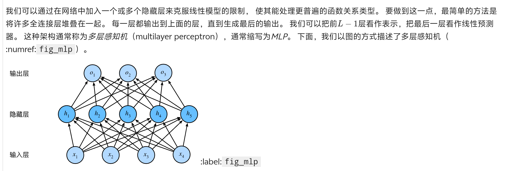
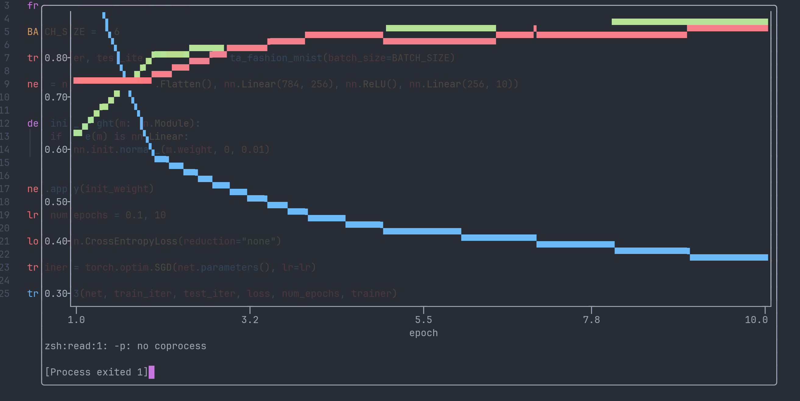
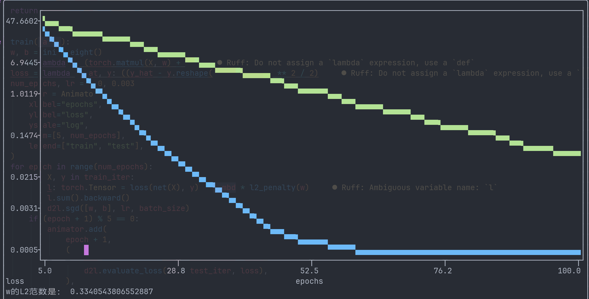
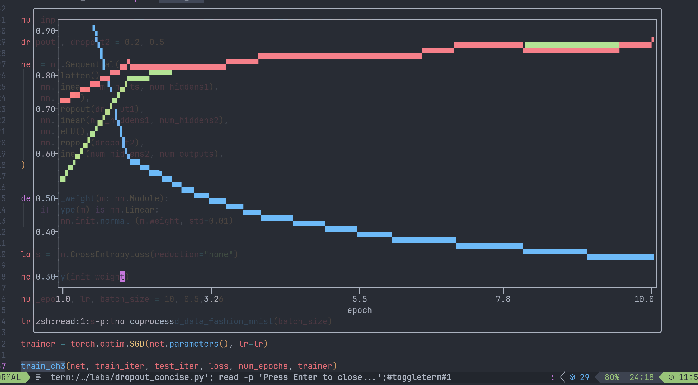

# 本篇要素：

因为之前的学习方法效率一言难尽，本篇尝试探索新的学习方法。

- 多层感知机
	- 从零实现
	- 简洁实现
- 模型选择、欠拟合、过拟合
- 权重衰减
- 暂退法（Dropout)
- 向前传播、反向传播和计算图
- 数值稳定性与模型初始化
- 环境与分布偏移
- 实战：Kaggle房价预测比赛

# 多层感知机

在我们之前的模型中，我们使用了仿射变换来表示从特征到目标的映射，然而仿射变换的*线性*是很强的假设。虽然我们总是能通过回归运算找到最贴合实际的线性表示，但是当事实数据本来就并非线性时，线性回归就不免会出现系统性的误差。举个最简单的例子，假如你想用机器学习来探究自由落体运动中位移随时间的变化关系，假如你仍然在使用单层的线性回归模型，那么你永远都预测不到正确的结果。

一个克服模型限制的尝试是在神经网络中塞若干“隐藏层”，使模型能处理更加普遍的函数关系。（其实意思就是除了输入和输出层之外的层都叫做隐藏层...）如图：



但是仅仅添加几个隐藏层几乎没有什么意义。首先，全连接层的参数开销非常大，其次是添加了隐藏层没有给我们带来任何好处，因为输入层到隐藏层是一个仿射变换，隐藏层到输出层还是仿射变换，那么整体依然是一个仿射变换，线性性一点没变，隐藏层再多也只是复杂的加减法。

解决方法是，我们可以在仿射变换之后对每个隐藏层应用一个非线性的*激活函数*$\sigma$，其输出称为*活性值*。激活函数实际上是一个非常顾名思义的东西，它的功能就是“视情况地选择性激活一些神经元”，没有激活的神经元无法传出信号，对应的输出值为0。

## 一些常见的激活函数

### ReLU函数

假如这个神经元计算得到的值为负数，则关闭这个神经元。即保留所有的非负数而丢弃所有的负数。
$$
ReLU(x) = max(x, 0)
$$
### sigmoid函数

也称“挤压函数”，它可以将实数域中的任何一个数字压缩到$(0, 1)$之间。
$$
sigmoid(x) = \frac{1}{1 + \exp(-x)}
$$
易证其上界为1，下界为0，关于$x=0, y=0.5$对称。

### tanh函数

双曲正切函数，和sigmoid类似，但是是把所有数字压缩到$(-1,1)$的区间内。
$$
\tanh(x) = \frac{1 - \exp(-2x)}{1 + \exp(-2x)}
$$
关于$(0,0)$对称。

## 课后练习

### Q1：计算pReLU激活函数的导数。

pReLU为ReLU的变体，添加了一个线性项：
$$
pReLu(x) = max(0, x) + \alpha min(0,x)
$$
导数：
$$
\frac{d}{dx}pReLU(x) = 
\begin{cases}
1, & x \ge 0 \\
\alpha,  & x < 0
\end{cases}
$$

### Q2：证明一个仅使用ReLU（或pReLU）的多层感知机构造了一个连续的分段线性函数。

以下简记$ReLU$为$\sigma$。

为了理解这个问题，我们不妨先想想一个仿射变换做了什么事情。假如我们只考察特征$X$的其中一个分量$x_{1}$，我们输入了若干个样本，随后经过仿射变换我们可以得到分量$x_{1}$对应的数值$y_{1}$，而$y_{1}$和$x_{1}$之间符合严格的一次函数关系，不管$x_{1}$取何值。

现在我们对这个结果进行了一次$\sigma$变换，所有负数全部磨平为0，我们将结果记为$z_{1}$，则$z_{1}$关于$x_{1}$的关系便是分段线性函数。此后我们再将$z_{1}$经过一次线性变换得到$w_{1}$，这就是含有一个隐藏层的多层感知机的输出结果。因为$z_{1}$又经过了一次线性变换，$w_{1}$的具体表现形式不再是一个一侧只能和x轴重合的分段线性函数，而是一个自由的分段函数。

虽然论证的非常不严谨，但是总之随着ReLU层的增加，分段函数的转折点个数会指数级增长，而每个输出分量和每个输入分量之间的关系都有独立的分段函数可以表示，这就使得我们可以用相对少的神经元描述复杂的模型形状。理论上我们可以通过无限套ReLU来近似表示任何数字关系，只不过那样做成本太高了。

### Q3：证明$\operatorname{tanh}(x) + 1 = 2 \operatorname{sigmoid}(2x)$。

略。

### Q4：假设我们有一个非线性单元，将它一次应用于一个小批量的数据。这会导致什么样的问题？

看不懂题目，遂不答。

# 多层感知机的从零实现

仍然使用Fashion_mnist数据集，我们在此例中尝试构建一个单隐藏层、256隐藏单元的Fashion_MNIST图像分类模型。

以下为具体实现，又手搓了一遍训练过程。

```python
import torch
from torch import nn
from d2l import torch as d2l

BATCH_SIZE = 256
train_iter, test_iter = d2l.load_data_fashion_mnist(BATCH_SIZE)

num_inputs, num_hiddens, num_outputs = 784, 256, 10

W1 = nn.Parameter(torch.normal(0, 0.01, (num_inputs, num_hiddens), requires_grad=True))
b1 = nn.Parameter(torch.zeros(num_hiddens, requires_grad=True))
W2 = nn.Parameter(torch.normal(0, 0.01, (num_hiddens, num_outputs), requires_grad=True))
b2 = nn.Parameter(torch.zeros(num_outputs, requires_grad=True))


def relu(X: torch.Tensor):
    a = torch.zeros_like(X)
    return torch.max(X, a)


def net(X: torch.Tensor):
    X = X.reshape((-1, num_inputs))
    H = relu(X @ W1 + b1)
    return H @ W2 + b2


loss = nn.CrossEntropyLoss(reduction="none")

num_epochs, lr = 10, 0.1

updater = torch.optim.SGD(params=(W1, b1, W2, b2), lr=0.1)


class Accumulator:  # @save
    """在n个变量上累加"""

    def __init__(self, n):
        self.data = [0.0] * n

    def add(self, *args):
        self.data = [a + float(b) for a, b in zip(self.data, args)]

    def reset(self):
        self.data = [0.0] * len(self.data)

    def __getitem__(self, idx):
        return self.data[idx]


def train(
    net,
    train_iter,
    loss: nn.CrossEntropyLoss,
    updater: torch.optim.SGD,
    num_epochs,
    test_iter,
):
    for epoch in range(num_epochs):
        for X, y in train_iter:
            y_hat = net(X)
            l: torch.Tensor = loss(y_hat, y)
            updater.zero_grad()
            l.mean().backward()
            updater.step()
        with torch.no_grad():
            metric = Accumulator(3)
            for X, y in test_iter:
                y_hat: torch.Tensor = net(X)
                l = loss(y_hat, y)
                accuracy = (y == (y_hat.argmax(dim=1).type(y.dtype))).sum()
                metric.add(float(l.sum()), float(accuracy), y.numel())
            print(
                f"epoch {epoch}: loss: {(metric[0] / metric[2]):.2f}, accuracy: {(metric[1] / metric[2]):.2f}"
            )

train(net, train_iter, loss, updater, num_epochs, test_iter)
```

因为没有用animator类所以代码格外精简。输出结果如下：

```python
epoch 0: loss: 0.76, accuracy: 0.73
epoch 1: loss: 0.57, accuracy: 0.80
epoch 2: loss: 0.55, accuracy: 0.81
epoch 3: loss: 0.50, accuracy: 0.82
epoch 4: loss: 0.56, accuracy: 0.80
epoch 5: loss: 0.51, accuracy: 0.80
epoch 6: loss: 0.46, accuracy: 0.83
epoch 7: loss: 0.49, accuracy: 0.82
epoch 8: loss: 0.42, accuracy: 0.85
epoch 9: loss: 0.43, accuracy: 0.84
```

感觉好像也没有比之前的单层模型有明显的优化...

## 课后训练

### Q1：在所有其他参数保持不变的情况下，更改超参数`num_hiddens`的值，并查看此超参数的变化对结果有何影响。确定此超参数的最佳值。

num_hiddens = 1024：

```python
epoch 0: loss: 0.63, accuracy: 0.77
epoch 1: loss: 0.58, accuracy: 0.80
epoch 2: loss: 0.50, accuracy: 0.82
epoch 3: loss: 0.56, accuracy: 0.81
epoch 4: loss: 0.53, accuracy: 0.81
epoch 5: loss: 0.48, accuracy: 0.83
epoch 6: loss: 0.45, accuracy: 0.84
epoch 7: loss: 0.42, accuracy: 0.85
epoch 8: loss: 0.44, accuracy: 0.84
epoch 9: loss: 0.42, accuracy: 0.85
```

学习速度好像快了一点点，但是命中率似乎没有改善。

num_hiddens = 128：

```python
epoch 0: loss: 0.77, accuracy: 0.71
epoch 1: loss: 0.62, accuracy: 0.78
epoch 2: loss: 0.54, accuracy: 0.81
epoch 3: loss: 0.73, accuracy: 0.75
epoch 4: loss: 0.48, accuracy: 0.83
epoch 5: loss: 0.52, accuracy: 0.81
epoch 6: loss: 0.47, accuracy: 0.83
epoch 7: loss: 0.44, accuracy: 0.84
epoch 8: loss: 0.50, accuracy: 0.82
epoch 9: loss: 0.42, accuracy: 0.85
```

似乎也没什么区别。原因在于隐藏层神经元个数对于记忆fashion_mnist的特征来说过剩了，而我们的优化算法本身具有局限，导致我们必然会遇到这个瓶颈。

num_hiddens = 8：

```python
epoch 0: loss: 0.89, accuracy: 0.66
epoch 1: loss: 0.67, accuracy: 0.76
epoch 2: loss: 0.59, accuracy: 0.79
epoch 3: loss: 0.61, accuracy: 0.78
epoch 4: loss: 0.56, accuracy: 0.80
epoch 5: loss: 0.52, accuracy: 0.81
epoch 6: loss: 0.57, accuracy: 0.80
epoch 7: loss: 0.50, accuracy: 0.82
epoch 8: loss: 0.52, accuracy: 0.81
epoch 9: loss: 0.51, accuracy: 0.82
```

此时准确值就有点下降了。

一般来说，一个非正规的经验做法是将隐藏层神经元数量设置为输入和输出层之间的某个2的整数次幂。隐藏层的不同神经元虽然对于输入层和输出层而言是等价的，但是因为随机初始化的缘故，不同神经元的数学地位并不完全一致，它们的工作定位会随着训练的进行而出现分化。比如在我们的图像分类数据集中，有的神经元可能会聚焦在左上角的特征，有的会聚焦右下角的特征，总之所有神经元聚焦的范围拼起来，就得到了模型对于整个图像的印象。

当神经元个数过少时，每个神经元负责的信息过多，导致模型对于整个图像的印象是一个模糊的轮廓，准确率较低；当神经元过多时，虽然对图像的判断会相对精准，但是相较于神经元更低的情况更容易出现欠拟合现象。

### Q2：尝试添加更多的隐藏层，并查看它对结果有何影响。

现在中间隐藏层变成了3层。

```python
import torch
from torch import nn
from d2l import torch as d2l

BATCH_SIZE = 256
train_iter, test_iter = d2l.load_data_fashion_mnist(BATCH_SIZE)

num_hiddens = 256

num_inputs, num_outputs = 784, 10

Wh1 = nn.Parameter(
    torch.normal(0, 0.01, (num_hiddens, num_hiddens), requires_grad=True)
)
bh1 = nn.Parameter(torch.zeros(num_hiddens, requires_grad=True))
Wh2 = nn.Parameter(
    torch.normal(0, 0.01, (num_hiddens, num_hiddens), requires_grad=True)
)
bh2 = nn.Parameter(torch.zeros(num_hiddens, requires_grad=True))

W1 = nn.Parameter(torch.normal(0, 0.01, (num_inputs, num_hiddens), requires_grad=True))
b1 = nn.Parameter(torch.zeros(num_hiddens, requires_grad=True))
W2 = nn.Parameter(torch.normal(0, 0.01, (num_hiddens, num_outputs), requires_grad=True))
b2 = nn.Parameter(torch.zeros(num_outputs, requires_grad=True))


def relu(X: torch.Tensor):
    a = torch.zeros_like(X)
    return torch.max(X, a)


def net(X: torch.Tensor):
    X = X.reshape((-1, num_inputs))
    H = relu(relu(relu(X @ W1 + b1) @ Wh1 + bh1) @ Wh2 + bh2)
    return H @ W2 + b2


loss = nn.CrossEntropyLoss(reduction="none")

num_epochs, lr = 30, 0.1

updater = torch.optim.SGD(params=(W1, b1, W2, b2, Wh1, bh1, Wh2, bh2), lr=0.1)


class Accumulator:  # @save
    """在n个变量上累加"""

    def __init__(self, n):
        self.data = [0.0] * n

    def add(self, *args):
        self.data = [a + float(b) for a, b in zip(self.data, args)]

    def reset(self):
        self.data = [0.0] * len(self.data)

    def __getitem__(self, idx):
        return self.data[idx]


def train(
    net,
    train_iter,
    loss: nn.CrossEntropyLoss,
    updater: torch.optim.SGD,
    num_epochs,
    test_iter,
):
    for epoch in range(num_epochs):
        for X, y in train_iter:
            y_hat = net(X)
            l: torch.Tensor = loss(y_hat, y)
            updater.zero_grad()
            l.mean().backward()
            updater.step()
        with torch.no_grad():
            metric = Accumulator(3)
            for X, y in test_iter:
                y_hat: torch.Tensor = net(X)
                l = loss(y_hat, y)
                accuracy = (y == (y_hat.argmax(dim=1).type(y.dtype))).sum()
                metric.add(float(l.sum()), float(accuracy), y.numel())
            print(
                f"epoch {epoch}: loss: {(metric[0] / metric[2]):.2f}, accuracy: {(metric[1] / metric[2]):.2f}"
            )


train(net, train_iter, loss, updater, num_epochs, test_iter)
```

```python
epoch 0: loss: 2.30, accuracy: 0.10
epoch 1: loss: 2.52, accuracy: 0.13
epoch 2: loss: 1.24, accuracy: 0.49
epoch 3: loss: 1.00, accuracy: 0.62
epoch 4: loss: 0.71, accuracy: 0.74
epoch 5: loss: 0.78, accuracy: 0.71
epoch 6: loss: 0.59, accuracy: 0.78
epoch 7: loss: 0.66, accuracy: 0.76
epoch 8: loss: 0.51, accuracy: 0.81
epoch 9: loss: 0.54, accuracy: 0.80
epoch 10: loss: 0.48, accuracy: 0.82
epoch 11: loss: 0.44, accuracy: 0.84
epoch 12: loss: 0.44, accuracy: 0.84
epoch 13: loss: 0.45, accuracy: 0.84
epoch 14: loss: 0.40, accuracy: 0.86
epoch 15: loss: 0.41, accuracy: 0.86
epoch 16: loss: 0.46, accuracy: 0.84
epoch 17: loss: 0.52, accuracy: 0.80
epoch 18: loss: 0.45, accuracy: 0.83
epoch 19: loss: 0.42, accuracy: 0.85
epoch 20: loss: 0.54, accuracy: 0.81
epoch 21: loss: 0.37, accuracy: 0.86
epoch 22: loss: 0.40, accuracy: 0.86
epoch 23: loss: 0.40, accuracy: 0.85
epoch 24: loss: 0.36, accuracy: 0.87
epoch 25: loss: 0.40, accuracy: 0.85
epoch 26: loss: 0.36, accuracy: 0.87
epoch 27: loss: 0.38, accuracy: 0.86
epoch 28: loss: 0.37, accuracy: 0.87
epoch 29: loss: 0.34, accuracy: 0.88
```

经过了30次迭代后命中率达到了88%，这里没有控制变量所以我也不太确定新的模型是不是比之前更优，但是遇到了深度学习网络起步阶段命中率较低的现象。

### Q3：改变学习速率会如何影响结果？保持模型架构和其他超参数（包括轮数）不变，学习率设置为多少会带来最好的结果？

切换回原本的一层隐藏层模型。试了下差不多0.03效果最好，不过本来这个模型就很简单，也看不大出来有什么区别。

后面的课后训练鸽了。

# 多层感知机的精简实现

```python
import torch
from softmax_scratch import train_ch3
from torch import nn
from d2l import torch as d2l

BATCH_SIZE = 256

train_iter, test_iter = d2l.load_data_fashion_mnist(batch_size=BATCH_SIZE)

net = nn.Sequential(nn.Flatten(), nn.Linear(784, 256), nn.ReLU(), nn.Linear(256, 10))


def init_weight(m: nn.Module):
    if type(m) is nn.Linear:
        nn.init.normal_(m.weight, 0, 0.01)


net.apply(init_weight)

lr, num_epochs = 0.1, 10

loss = nn.CrossEntropyLoss(reduction="none")

trainer = torch.optim.SGD(net.parameters(), lr=lr)

train_ch3(net, train_iter, test_iter, loss, num_epochs, trainer)
```

使用了softmax_scratch中写好的训练流程。

输出结果如下：



感觉模型太简单，也看不太出来什么参数最适合，课后练习先鸽了。

# 模型选择、欠拟合、过拟合

> 将模型在训练数据上拟合的比在潜在分布中更接近的现象称为_过拟合_（overfitting）， 用于对抗过拟合的技术称为_正则化_（regularization）。 在前面的章节中，有些读者可能在用Fashion-MNIST数据集做实验时已经观察到了这种过拟合现象。 在实验中调整模型架构或超参数时会发现： 如果有足够多的神经元、层数和训练迭代周期， 模型最终可以在训练集上达到完美的精度，此时测试集的准确性却下降了。

本节内容文字量有点大，随机抽一些讲。

“测试集”和“验证集”是不同的。在工程实践中，验证集被用来调整超参数和选择模型，而测试集用来测试模型的泛化能力。事实上我们前文中的代码尝试里所使用的测试数据都属于验证集。测试集有点像是为了“防止研究人员过拟合”而设置的，我们不能对着测试数据准备模型而声称自己的模型具有很高的泛化能力。因此测试集理论上在开发的全过程中都是不公开的，甚至在参数调整完毕之前都不应该被使用。它的作用是用来衡量一个基本定型的模型的能力。

> 但现实是验证数据和测试数据之间的边界模糊得令人担忧。 除非另有明确说明，否则在这本书的实验中， 我们实际上是在使用应该被正确地称为训练数据和验证数据的数据集， 并没有真正的测试数据集。 因此，书中每次实验报告的准确度都是验证集准确度，而不是测试集准确度。

关于欠拟合和过拟合的判别，假如模型不能有效的降低训练误差（即在训练集上的误差），通常可能意味着模型过于简单即表达能力不足，而此时验证误差和训练误差虽然都很大，但是验证误差似乎并没有因为更广泛的数据集而使得误差显著增大，此时我们认为当前模型的泛化能力是基本合格的，我们有理由相信一个更复杂的模型可以有效降低训练误差，这种现象叫做*欠拟合*。而当训练误差显著低于验证误差时，意味着出现了严重的过拟合。这意味着模型虽然掌握了训练集的规律，但是同时也学习了很多并不普遍的只在训练集中出现的规律，导致模型面对真实的分布时无法正确描述。

## 多项式回归代码实现

```python
import math
import numpy as np
import torch
from torch import nn
from d2l import torch as d2l

max_degree = 20
n_train, n_test = 100, 100
true_w = np.zeros(max_degree)
true_w[0:4] = np.array([5, 1.2, -3.4, 5.6])

features = np.random.normal(size=(n_train + n_test, 1))
np.random.shuffle(features)
poly_features = np.power(features, np.arange(max_degree).reshape(1, -1))
print(poly_features.shape)
for i in range(max_degree):
    poly_features[:, i] /= math.gamma(i + 1)
labels = np.dot(poly_features, true_w)
labels += np.random.normal(scale=0.1, size=labels.shape)
print(labels.shape)
```

直接从d2l中cv下来的代码，其中`np.power`用到了广播机制，得到的`poly_features`是一个形状为`(200, 20)`的多维数组，每一行代表一个样本。`labels`的形状则为`(200, )`每个元素表示经过多项式计算得到的标准答案加上了一个符合正态分布的噪音。

总之接下来d2l举了这样的例子，假如我们的数据集中标签由特征的三次多项式加上噪声得到，此时如果我们直接使用线性回归模型，结果会呈现欠拟合，因为模型对于数据特征的描述能力不足；如果我们使用了比三次更高的多项式回归模型，迭代次数过多时结果可能呈现过拟合，因为模型过多地捕捉到了数据集中的噪声。

此处我主要关心d2l多项式回归是如何实现的。

```python
def train(train_features, test_features, train_labels, test_labels,
          num_epochs=400):
    loss = nn.MSELoss(reduction='none')
    input_shape = train_features.shape[-1]
    # 不设置偏置，因为我们已经在多项式中实现了它
    net = nn.Sequential(nn.Linear(input_shape, 1, bias=False))
    batch_size = min(10, train_labels.shape[0])
    train_iter = d2l.load_array((train_features, train_labels.reshape(-1,1)),
                                batch_size)
    test_iter = d2l.load_array((test_features, test_labels.reshape(-1,1)),
                               batch_size, is_train=False)
    trainer = torch.optim.SGD(net.parameters(), lr=0.01)
    animator = d2l.Animator(xlabel='epoch', ylabel='loss', yscale='log',
                            xlim=[1, num_epochs], ylim=[1e-3, 1e2],
                            legend=['train', 'test'])
    for epoch in range(num_epochs):
        d2l.train_epoch_ch3(net, train_iter, loss, trainer)
        if epoch == 0 or (epoch + 1) % 20 == 0:
            animator.add(epoch + 1, (evaluate_loss(net, train_iter, loss),
                                     evaluate_loss(net, test_iter, loss)))
    print('weight:', net[0].weight.data.numpy())
```

我们可以看到d2l书中`net`只是一个单层的线性模型。我们之前所实现的线性模型中我们往往设定了多个特征比如$x_{1},x_{2},x_{3},...$，但是我们从来没有规定这些特征之间一定要无关。此处之所以可以用一个线性回归模型来表示多项式回归，实际上就是把$x^1,x^2,x^3,..$分别当做特征，将$x^0$的系数当做偏置。这样我们就可以用非常简单的方式控制训练时模型的多项式最高次数：将所有权重初始化为0，之后我们传参时只传前n项，我们就实现了n-1次多项式回归。

## 课后联系

### Q1：这个多项式回归问题可以准确解出来吗？

将多项式回归看做关于$x^0,x^1,x^2,...$的线性回归，直接套公式。

### Q2：懒得写了

### Q3：如果不对多项式特征进行标准化会发生什么？

在d2l的多项式回归模型中，我们预先对特征$x^i$除以了$i!$，这种标准化的目的是使得不同阶的特征产生的误差对于参数优化的作用效果接近。如果不进行标准化，阶数越高的特征对于模型的影响也会更大，模型权重参数容易出现震荡乃至发散。

### Q4：泛化误差可能为0吗？

虽然理论上如果你的模型完美契合数据的实际分布，泛化误差可能为0，但是现实基本不可能，因为现实数据中总存在噪声，噪声没有规律，并且即使没有噪声，真实数据集的数学模型也很可能非常复杂甚至没有解析形式。我们只能做到泛化误差尽可能低。

# 权重衰减

在上文中，我们将每个阶数单独看做一个特征。当我们需要描述复杂的非线性模型时我们很可呢会用到这种技巧。但是，假如我们不止考虑一个变量的各个阶数而是多个变量，假如我们有k个变量，那么d阶项就有$C_{k+d-1}^{k-1}$个，（高中数学，等价于每种变量至少取一个时k+d阶项数，此时可以想象在k+d个小球的间隙之间插k-1个插板）。总之，随着阶数增长，模型复杂度也就快速增长，我们不能仅靠控制阶数来使模型复杂度处在一个不偏不倚的位置。

解决问题需要从另一个角度入手，如果我们没办法直接抛弃这些特征，我们可以通过限制权重取值的方式控制模型复杂度。特征数值的大小通过归一化后数量级基本稳定，假如我们同时限制了权重的范围，我们也就同时约束了模型的表达能力。可以这样理解：当我们限制了权重的大小的时候，我们本质上限制了函数图像的扭曲程度。假如我们不限制权重，模型拟合的函数图像就可以以非常夸张的曲线精准的穿过所有样本点，虽然对于有限的训练集来说可以达到很高的准确度，但是对于真实的分布来说这样的曲线对于整体误差是帮倒忙的。限制了图像扭曲程度后，图像就像一个铁棒很难被随意扭曲，只能表现数据分布的大致趋势，这样反而提高了泛化能力。

具体的实施方法是在基本的MSE损失函数基础上加上权重的L2范数。
$$L(\mathbf{w}, b) = \frac{1}{n}\sum_{i=1}^n \frac{1}{2}\left(\mathbf{w}^\top \mathbf{x}^{(i)} + b - y^{(i)}\right)^2 + \frac{\lambda}{2} \|\mathbf{w}\|^2$$

之所以使用L2范数是因为L2正则化模型构成了经典的*岭回归*算法，对权重向量的大分量进行了巨大惩罚，更加适用于对大量特征均匀分布权重的模型。

## 从零实现

```python
import torch
from torch import nn
from d2l import torch as d2l

n_train, n_test, num_inputs, batch_size = 20, 100, 200, 5
true_w, true_b = torch.ones((num_inputs, 1)) * 0.01, 0.05
train_data = d2l.synthetic_data(true_w, true_b, n_train)
train_iter = d2l.load_array(train_data, batch_size)
test_data = d2l.synthetic_data(true_w, true_b, n_test)
test_iter = d2l.load_array(test_data, batch_size, is_train=False)
```

此处附上d2l中对应的函数的实现：

```python
def synthetic_data(w, b, num_examples):
    """Generate y = Xw + b + noise.

    Defined in :numref:`sec_utils`"""
    X = d2l.normal(0, 1, (num_examples, len(w)))
    y = d2l.matmul(X, w) + b
    y += d2l.normal(0, 0.01, y.shape)
    return X, d2l.reshape(y, (-1, 1))

def load_array(data_arrays, batch_size, is_train=True):
    """Construct a PyTorch data iterator.

    Defined in :numref:`sec_utils`"""
    dataset = torch.utils.data.TensorDataset(*data_arrays)
    return torch.utils.data.DataLoader(dataset, batch_size, shuffle=is_train)
```

人造数据集生成是基于权重张量和偏置的形状进行的，所以不用关心形状是否匹配的问题。

完整代码：

```python
import torch
from torch import nn, t
from d2l import torch as d2l
from softmax_scratch import Animator

n_train, n_test, num_inputs, batch_size = 20, 100, 200, 5
true_w, true_b = torch.ones((num_inputs, 1)) * 0.01, 0.05
train_data = d2l.synthetic_data(true_w, true_b, n_train)
train_iter = d2l.load_array(train_data, batch_size)
test_data = d2l.synthetic_data(true_w, true_b, n_test)
test_iter = d2l.load_array(test_data, batch_size, is_train=False)


def init_weight():
    w = torch.normal(0, 1, size=(num_inputs, 1), requires_grad=True)
    b = torch.zeros(1, requires_grad=True)
    return w, b


def l2_penalty(w: torch.Tensor):
    return torch.sum(w.pow(2)) / 2


def train(lambd):
    w, b = init_weight()
    net = lambda X: (torch.matmul(X, w) + b)
    loss = lambda y_hat, y: ((y_hat - y.reshape(y_hat.shape)) ** 2 / 2)
    num_epochs, lr = 100, 0.003
    animator = Animator(
        xlabel="epochs",
        ylabel="loss",
        yscale="log",
        xlim=[5, num_epochs],
        legend=["train", "test"],
    )
    for epoch in range(num_epochs):
        for X, y in train_iter:
            l: torch.Tensor = loss(net(X), y) + lambd * l2_penalty(w)
            l.sum().backward()
            d2l.sgd([w, b], lr, batch_size)
        if (epoch + 1) % 5 == 0:
            animator.add(
                epoch + 1,
                (
                    d2l.evaluate_loss(net, train_iter, loss),
                    d2l.evaluate_loss(net, test_iter, loss),
                ),
            )
    print("w的L2范数是：", torch.norm(w).item())
```

我们本次的实现中对于数据集的设置是别有用心的。我们为整个线性回归模型定义了200个特征，按理我们会需要大量的训练数据才能捕捉这些特征，但是我们只提供了20个训练样本，同时测试样本却有100个。假如模型的泛化能力不足，只局限于20个训练样本，之后的测试样本误差会非常大。

但是我们此处在训练函数中引入了一个参数`lambd`来表示权重衰减的系数。通过约束权重的大小，我们希望能提高模型的泛化能力。

`train(lambd=0)`输出结果：


这里之所以左侧刻度看起来很奇怪是因为使用了对数刻度。

可以看到此时w的L2范数约11.459，而测试误差随着迭代次数增加基本不变。这意味着模型出现了严重的过拟合现象。

`train(lambd=3)`输出结果：



训练误差增大但是测试误差减小，符合预期。

## 简洁实现：

```python
import torch
from torch import nn
from d2l import torch as d2l
from softmax_scratch import Animator

n_train, n_test, num_inputs, batch_size = 20, 100, 200, 5
true_w, true_b = torch.ones((num_inputs, 1)) * 0.01, 0.05
train_data = d2l.synthetic_data(true_w, true_b, n_train)

train_iter = d2l.load_array(train_data, batch_size)
test_data = d2l.synthetic_data(true_w, true_b, n_test)
test_iter = d2l.load_array(test_data, batch_size, is_train=False)


def train_concise(wd):
    net = nn.Sequential(nn.Linear(num_inputs, 1))
    for param in net.parameters():
        param.data.normal_()
        t = type(param)
    loss = nn.MSELoss(reduction="none")
    num_epochs, lr = 100, 0.003
    trainer = torch.optim.SGD(
        [{"params": net[0].weight, "weight_decay": wd}, {"params": net[0].bias}], lr=lr
    )
    animator = Animator(
        xlabel="epochs",
        ylabel="loss",
        yscale="log",
        xlim=[5, num_epochs],
        legend=["train", "test"],
    )
    for epoch in range(num_epochs):
        for X, y in train_iter:
            trainer.zero_grad()
            l = loss(net(X), y)
            l.mean().backward()
            trainer.step()
        if (epoch + 1) % 5 == 0:
            animator.add(
                epoch + 1,
                (
                    d2l.evaluate_loss(net, train_iter, loss),
                    d2l.evaluate_loss(net, test_iter, loss),
                ),
            )
    print("w的L2范数是：", torch.norm(net[0].weight).item())
    print(t)


nn.parameter.Parameter

train_concise(0)
```

效果和之前的实现一致，只不过速度更快，更容易实现。

## 课后练习选做：

### Q3：使用L1正则化后更新方程是什么样的?

L2正则化：
$$
\begin{aligned}
\mathbf{w} & \leftarrow \left(1- \eta\lambda \right) \mathbf{w} - \frac{\eta}{|\mathcal{B}|} \sum_{i \in \mathcal{B}} \mathbf{x}^{(i)} \left(\mathbf{w}^\top \mathbf{x}^{(i)} + b - y^{(i)}\right).
\end{aligned}
$$
L1正则化：
$$
\begin{aligned}
\mathbf{w} & \leftarrow  \mathbf{w}- \eta\lambda  - \frac{\eta}{|\mathcal{B}|} \sum_{i \in \mathcal{B}} \mathbf{x}^{(i)} \left(\mathbf{w}^\top \mathbf{x}^{(i)} + b - y^{(i)}\right).
\end{aligned}
$$

# 暂退法

理论的东西不大看的懂，简单来说就是在训练时随机扔掉一些神经元，不让它们参加训练，这样模型的计算就不能过度依赖于任何一个神经元。当然这只是暂退法的一种标准实现，本质上暂退法是希望通过在每一层计算前加入噪声来提高模型对于随机噪声的适应性。

神经元在torch机器学习框架下的具体表现也就是权重参数。我们可以通过随机将一些权重参数调为0来实现。

## 从零实现

```python
import torch
from torch import nn
from d2l import torch as d2l

def dropout_layer(X:torch.Tensor, dropout):
    assert 0 <= dropout <= 1
    if dropout == 0:
        return X
    if dropout == 1:
        return torch.zeros_like(X)
    mask = (torch.rand(X.shape)> dropout).float()
    return mask * X / (1.0 - dropout)
```

`mask`是一个掩码张量，符合条件的位置为1，否则为0。在X按元素与`mask`相乘之后再除以`(1.0 - dropout)`使得该层的权重均值保持稳定。

```python
num_inputs, num_outputs, num_hiddens1, num_hiddens2 = 784, 10, 256, 256 

dropout1, dropout2 = 0.2, 0.5

class Net(nn.Module):
    def __init__(self, num_inputs, num_outputs, num_hiddens1, num_hiddens2,
                 is_training = True):
        super(Net, self).__init__()
        self.num_inputs = num_inputs
        self.training = is_training
        self.lin1 = nn.Linear(num_inputs, num_hiddens1)
        self.lin2 = nn.Linear(num_hiddens1, num_hiddens2)
        self.lin3 = nn.Linear(num_hiddens2, num_outputs)
        self.relu = nn.ReLU()

    def forward(self, X):
        H1 = self.relu(self.lin1(X.reshape((-1, self.num_inputs))))
        # 只有在训练模型时才使用dropout
        if self.training == True:
            # 在第一个全连接层之后添加一个dropout层
            H1 = dropout_layer(H1, dropout1)
        H2 = self.relu(self.lin2(H1))
        if self.training == True:
            # 在第二个全连接层之后添加一个dropout层
            H2 = dropout_layer(H2, dropout2)
        out = self.lin3(H2)
        return out


net = Net(num_inputs, num_outputs, num_hiddens1, num_hiddens2)
```

具体的实现上直接手动继承`nn.Module`类并修改forward方法。两个隐藏层均使用了ReLU激活函数，此处向前传播的逻辑是每层计算前先计算ReLU激活函数，如果正在训练则再计算dropout。

懒得写了，总之我们直接看简洁实现。

```python
import torch
from torch import nn
from d2l import torch as d2l
from softmax_scratch import train_ch3

num_inputs, num_outputs, num_hiddens1, num_hiddens2 = 784, 10, 256, 256

dropout1, dropout2 = 0.2, 0.5

net = nn.Sequential(
    nn.Flatten(),
    nn.Linear(num_inputs, num_hiddens1),
    nn.ReLU(),
    nn.Dropout(dropout1),
    nn.Linear(num_hiddens1, num_hiddens2),
    nn.ReLU(),
    nn.Dropout(dropout2),
    nn.Linear(num_hiddens2, num_outputs),
)


def init_weight(m: nn.Module):
    if type(m) is nn.Linear:
        nn.init.normal_(m.weight, std=0.01)


loss = nn.CrossEntropyLoss(reduction="none")

net.apply(init_weight)

num_epochs, lr, batch_size = 10, 0.5, 256

train_iter, test_iter = d2l.load_data_fashion_mnist(batch_size)

trainer = torch.optim.SGD(net.parameters(), lr=lr)

train_ch3(net, train_iter, test_iter, loss, num_epochs, trainer)
```



其中绿色是训练命中率，红色是测试命中率。

## 课后练习选做

### Q1：如果更改第一层和第二层的暂退法概率，会发生什么情况？具体地说，如果交换这两个层，会发生什么情况？设计一个实验来回答这些问题，定量描述该结果，并总结定性的结论。

```python
import torch
from torch import nn
from d2l import torch as d2l
from softmax_scratch import train_ch3, Accumulator


def dropout_test(dropout1, dropout2):
    num_inputs, num_outputs, num_hiddens1, num_hiddens2 = 784, 10, 256, 256

    net = nn.Sequential(
        nn.Flatten(),
        nn.Linear(num_inputs, num_hiddens1),
        nn.ReLU(),
        nn.Dropout(dropout1),
        nn.Linear(num_hiddens1, num_hiddens2),
        nn.ReLU(),
        nn.Dropout(dropout2),
        nn.Linear(num_hiddens2, num_outputs),
    )

    def init_weight(m: nn.Module):
        if type(m) is nn.Linear:
            nn.init.normal_(m.weight, std=0.01)

    loss = nn.CrossEntropyLoss(reduction="none")

    net.apply(init_weight)

    num_epochs, lr, batch_size = 10, 0.5, 256

    train_iter, test_iter = d2l.load_data_fashion_mnist(batch_size)

    trainer = torch.optim.SGD(net.parameters(), lr=lr)

    train_ch3(net, train_iter, test_iter, loss, num_epochs, trainer)

    metric = Accumulator(2)
    net.eval()
    with torch.no_grad():
        for X, y in test_iter:
            y_hat: torch.Tensor = net(X)
            accurate = ((y_hat.argmax(dim=1)).type(y.dtype) == y).sum().item()
            metric.add(accurate, y.numel())
    return metric[0] / metric[1]


for dropout1 in range(10):
    for dropout2 in range(10):
        print(
            f"dropout1: {(dropout1 * 0.1):.2f}, dropout2: {(dropout2 * 0.1):.2f}, accuracy: {(dropout_test(dropout1 * 0.1, dropout2 * 0.1)):.2f}"
        )
```

绿皮科技，震撼人心。俺寻思这能跑啊。

输出结果：

```python
dropout1: 0.00, dropout2: 0.00, accuracy: 0.86
dropout1: 0.00, dropout2: 0.10, accuracy: 0.87
dropout1: 0.00, dropout2: 0.20, accuracy: 0.87
dropout1: 0.00, dropout2: 0.30, accuracy: 0.87
dropout1: 0.00, dropout2: 0.40, accuracy: 0.86
dropout1: 0.00, dropout2: 0.50, accuracy: 0.86
dropout1: 0.00, dropout2: 0.60, accuracy: 0.85
dropout1: 0.00, dropout2: 0.70, accuracy: 0.79
dropout1: 0.00, dropout2: 0.80, accuracy: 0.85
dropout1: 0.00, dropout2: 0.90, accuracy: 0.84
dropout1: 0.10, dropout2: 0.00, accuracy: 0.86
dropout1: 0.10, dropout2: 0.10, accuracy: 0.84
dropout1: 0.10, dropout2: 0.20, accuracy: 0.84
dropout1: 0.10, dropout2: 0.30, accuracy: 0.84
dropout1: 0.10, dropout2: 0.40, accuracy: 0.84
dropout1: 0.10, dropout2: 0.50, accuracy: 0.86
dropout1: 0.10, dropout2: 0.60, accuracy: 0.86
dropout1: 0.10, dropout2: 0.70, accuracy: 0.85
dropout1: 0.10, dropout2: 0.80, accuracy: 0.86
dropout1: 0.10, dropout2: 0.90, accuracy: 0.84
dropout1: 0.20, dropout2: 0.00, accuracy: 0.86
dropout1: 0.20, dropout2: 0.10, accuracy: 0.87
dropout1: 0.20, dropout2: 0.20, accuracy: 0.86
dropout1: 0.20, dropout2: 0.30, accuracy: 0.86
dropout1: 0.20, dropout2: 0.40, accuracy: 0.85
dropout1: 0.20, dropout2: 0.50, accuracy: 0.86
dropout1: 0.20, dropout2: 0.60, accuracy: 0.85
dropout1: 0.20, dropout2: 0.70, accuracy: 0.85
dropout1: 0.20, dropout2: 0.80, accuracy: 0.85
dropout1: 0.20, dropout2: 0.90, accuracy: 0.84
dropout1: 0.30, dropout2: 0.00, accuracy: 0.87
dropout1: 0.30, dropout2: 0.10, accuracy: 0.86
dropout1: 0.30, dropout2: 0.20, accuracy: 0.85
dropout1: 0.30, dropout2: 0.30, accuracy: 0.86
dropout1: 0.30, dropout2: 0.40, accuracy: 0.84
dropout1: 0.30, dropout2: 0.50, accuracy: 0.86
dropout1: 0.30, dropout2: 0.60, accuracy: 0.86
dropout1: 0.30, dropout2: 0.70, accuracy: 0.85
dropout1: 0.30, dropout2: 0.80, accuracy: 0.85
dropout1: 0.30, dropout2: 0.90, accuracy: 0.85
dropout1: 0.40, dropout2: 0.00, accuracy: 0.86
dropout1: 0.40, dropout2: 0.10, accuracy: 0.86
dropout1: 0.40, dropout2: 0.20, accuracy: 0.79
dropout1: 0.40, dropout2: 0.30, accuracy: 0.86
dropout1: 0.40, dropout2: 0.40, accuracy: 0.86
dropout1: 0.40, dropout2: 0.50, accuracy: 0.85
dropout1: 0.40, dropout2: 0.60, accuracy: 0.86
dropout1: 0.40, dropout2: 0.70, accuracy: 0.84
dropout1: 0.40, dropout2: 0.80, accuracy: 0.85
dropout1: 0.40, dropout2: 0.90, accuracy: 0.83
dropout1: 0.50, dropout2: 0.00, accuracy: 0.86
dropout1: 0.50, dropout2: 0.10, accuracy: 0.86
dropout1: 0.50, dropout2: 0.20, accuracy: 0.86
dropout1: 0.50, dropout2: 0.30, accuracy: 0.85
dropout1: 0.50, dropout2: 0.40, accuracy: 0.83
dropout1: 0.50, dropout2: 0.50, accuracy: 0.85
dropout1: 0.50, dropout2: 0.60, accuracy: 0.86
dropout1: 0.50, dropout2: 0.70, accuracy: 0.86
dropout1: 0.50, dropout2: 0.80, accuracy: 0.84
dropout1: 0.50, dropout2: 0.90, accuracy: 0.84
dropout1: 0.60, dropout2: 0.00, accuracy: 0.85
dropout1: 0.60, dropout2: 0.10, accuracy: 0.85
dropout1: 0.60, dropout2: 0.20, accuracy: 0.85
dropout1: 0.60, dropout2: 0.30, accuracy: 0.84
dropout1: 0.60, dropout2: 0.40, accuracy: 0.85
dropout1: 0.60, dropout2: 0.50, accuracy: 0.85
dropout1: 0.60, dropout2: 0.60, accuracy: 0.85
dropout1: 0.60, dropout2: 0.70, accuracy: 0.84
dropout1: 0.60, dropout2: 0.80, accuracy: 0.82
dropout1: 0.60, dropout2: 0.90, accuracy: 0.81
dropout1: 0.70, dropout2: 0.00, accuracy: 0.85
dropout1: 0.70, dropout2: 0.10, accuracy: 0.84
dropout1: 0.70, dropout2: 0.20, accuracy: 0.83
dropout1: 0.70, dropout2: 0.30, accuracy: 0.85
dropout1: 0.70, dropout2: 0.40, accuracy: 0.85
dropout1: 0.70, dropout2: 0.50, accuracy: 0.85
dropout1: 0.70, dropout2: 0.60, accuracy: 0.83
dropout1: 0.70, dropout2: 0.70, accuracy: 0.85
dropout1: 0.70, dropout2: 0.80, accuracy: 0.84
dropout1: 0.70, dropout2: 0.90, accuracy: 0.80
dropout1: 0.80, dropout2: 0.00, accuracy: 0.81
dropout1: 0.80, dropout2: 0.10, accuracy: 0.84
dropout1: 0.80, dropout2: 0.20, accuracy: 0.82
dropout1: 0.80, dropout2: 0.30, accuracy: 0.83
dropout1: 0.80, dropout2: 0.40, accuracy: 0.83
dropout1: 0.80, dropout2: 0.50, accuracy: 0.83
dropout1: 0.80, dropout2: 0.60, accuracy: 0.82
dropout1: 0.80, dropout2: 0.70, accuracy: 0.83
dropout1: 0.80, dropout2: 0.80, accuracy: 0.82
dropout1: 0.80, dropout2: 0.90, accuracy: 0.72
dropout1: 0.90, dropout2: 0.00, accuracy: 0.50
dropout1: 0.90, dropout2: 0.10, accuracy: 0.52
dropout1: 0.90, dropout2: 0.20, accuracy: 0.55
dropout1: 0.90, dropout2: 0.30, accuracy: 0.57
dropout1: 0.90, dropout2: 0.40, accuracy: 0.46
dropout1: 0.90, dropout2: 0.50, accuracy: 0.50
dropout1: 0.90, dropout2: 0.60, accuracy: 0.58
dropout1: 0.90, dropout2: 0.70, accuracy: 0.55
dropout1: 0.90, dropout2: 0.80, accuracy: 0.60
dropout1: 0.90, dropout2: 0.90, accuracy: 0.45
```

从数据中简单看下来似乎浅层对于dropout更加脆弱，当浅层dropout量较大时准确率才会显著下降，而深层dropout似乎对于结果的调节更加细微。可能的原因是深层的神经元实际上已经出现了冗余，多个神经元聚焦于相似的高级特征，此时即使只剩下10%照样可以工作。

### Q4：以本节中的模型为例，比较使用暂退法和权重衰减的效果。如果同时使用暂退法和权重衰减，会发生什么情况？结果是累加的吗？收益是否减少（或者说更糟）？它们互相抵消了吗？

在Q1代码基础上添加了3的权重衰减。

结果如下：

```python
dropout1: 0.00, dropout2: 0.00, accuracy: 0.10
dropout1: 0.00, dropout2: 0.10, accuracy: 0.10
dropout1: 0.00, dropout2: 0.20, accuracy: 0.10
dropout1: 0.00, dropout2: 0.30, accuracy: 0.10
dropout1: 0.00, dropout2: 0.40, accuracy: 0.10
dropout1: 0.00, dropout2: 0.50, accuracy: 0.10
dropout1: 0.00, dropout2: 0.60, accuracy: 0.10
dropout1: 0.00, dropout2: 0.70, accuracy: 0.10
dropout1: 0.00, dropout2: 0.80, accuracy: 0.10
dropout1: 0.00, dropout2: 0.90, accuracy: 0.10
dropout1: 0.10, dropout2: 0.00, accuracy: 0.10
dropout1: 0.10, dropout2: 0.10, accuracy: 0.10
dropout1: 0.10, dropout2: 0.20, accuracy: 0.10
dropout1: 0.10, dropout2: 0.30, accuracy: 0.10
dropout1: 0.10, dropout2: 0.40, accuracy: 0.10
dropout1: 0.10, dropout2: 0.50, accuracy: 0.10
dropout1: 0.10, dropout2: 0.60, accuracy: 0.10
dropout1: 0.10, dropout2: 0.70, accuracy: 0.10
dropout1: 0.10, dropout2: 0.80, accuracy: 0.10
dropout1: 0.10, dropout2: 0.90, accuracy: 0.10
dropout1: 0.20, dropout2: 0.00, accuracy: 0.10
dropout1: 0.20, dropout2: 0.10, accuracy: 0.10
dropout1: 0.20, dropout2: 0.20, accuracy: 0.10
dropout1: 0.20, dropout2: 0.30, accuracy: 0.10
dropout1: 0.20, dropout2: 0.40, accuracy: 0.10
dropout1: 0.20, dropout2: 0.50, accuracy: 0.10
dropout1: 0.20, dropout2: 0.60, accuracy: 0.10
dropout1: 0.20, dropout2: 0.70, accuracy: 0.10
dropout1: 0.20, dropout2: 0.80, accuracy: 0.10
dropout1: 0.20, dropout2: 0.90, accuracy: 0.10
dropout1: 0.30, dropout2: 0.00, accuracy: 0.10
dropout1: 0.30, dropout2: 0.10, accuracy: 0.10
dropout1: 0.30, dropout2: 0.20, accuracy: 0.10
dropout1: 0.30, dropout2: 0.30, accuracy: 0.10
dropout1: 0.30, dropout2: 0.40, accuracy: 0.10
dropout1: 0.30, dropout2: 0.50, accuracy: 0.10
dropout1: 0.30, dropout2: 0.60, accuracy: 0.10
dropout1: 0.30, dropout2: 0.70, accuracy: 0.10
dropout1: 0.30, dropout2: 0.80, accuracy: 0.10
dropout1: 0.30, dropout2: 0.90, accuracy: 0.10
dropout1: 0.40, dropout2: 0.00, accuracy: 0.10
dropout1: 0.40, dropout2: 0.10, accuracy: 0.10
dropout1: 0.40, dropout2: 0.20, accuracy: 0.10
dropout1: 0.40, dropout2: 0.30, accuracy: 0.10
dropout1: 0.40, dropout2: 0.40, accuracy: 0.10
dropout1: 0.40, dropout2: 0.50, accuracy: 0.10
dropout1: 0.40, dropout2: 0.60, accuracy: 0.10
dropout1: 0.40, dropout2: 0.70, accuracy: 0.10
dropout1: 0.40, dropout2: 0.80, accuracy: 0.10
dropout1: 0.40, dropout2: 0.90, accuracy: 0.10
dropout1: 0.50, dropout2: 0.00, accuracy: 0.10
dropout1: 0.50, dropout2: 0.10, accuracy: 0.10
dropout1: 0.50, dropout2: 0.20, accuracy: 0.10
dropout1: 0.50, dropout2: 0.30, accuracy: 0.10
dropout1: 0.50, dropout2: 0.40, accuracy: 0.10
dropout1: 0.50, dropout2: 0.50, accuracy: 0.10
dropout1: 0.50, dropout2: 0.60, accuracy: 0.10
dropout1: 0.50, dropout2: 0.70, accuracy: 0.10
dropout1: 0.50, dropout2: 0.80, accuracy: 0.10
dropout1: 0.50, dropout2: 0.90, accuracy: 0.10
dropout1: 0.60, dropout2: 0.00, accuracy: 0.10
dropout1: 0.60, dropout2: 0.10, accuracy: 0.10
dropout1: 0.60, dropout2: 0.20, accuracy: 0.10
dropout1: 0.60, dropout2: 0.30, accuracy: 0.10
dropout1: 0.60, dropout2: 0.40, accuracy: 0.10
dropout1: 0.60, dropout2: 0.50, accuracy: 0.10
dropout1: 0.60, dropout2: 0.60, accuracy: 0.10
dropout1: 0.60, dropout2: 0.70, accuracy: 0.10
dropout1: 0.60, dropout2: 0.80, accuracy: 0.10
dropout1: 0.60, dropout2: 0.90, accuracy: 0.10
dropout1: 0.70, dropout2: 0.00, accuracy: 0.10
dropout1: 0.70, dropout2: 0.10, accuracy: 0.10
dropout1: 0.70, dropout2: 0.20, accuracy: 0.10
dropout1: 0.70, dropout2: 0.30, accuracy: 0.10
dropout1: 0.70, dropout2: 0.40, accuracy: 0.10
dropout1: 0.70, dropout2: 0.50, accuracy: 0.10
dropout1: 0.70, dropout2: 0.60, accuracy: 0.10
dropout1: 0.70, dropout2: 0.70, accuracy: 0.10
dropout1: 0.70, dropout2: 0.80, accuracy: 0.10
dropout1: 0.70, dropout2: 0.90, accuracy: 0.10
dropout1: 0.80, dropout2: 0.00, accuracy: 0.10
dropout1: 0.80, dropout2: 0.10, accuracy: 0.10
dropout1: 0.80, dropout2: 0.20, accuracy: 0.10
dropout1: 0.80, dropout2: 0.30, accuracy: 0.10
dropout1: 0.80, dropout2: 0.40, accuracy: 0.10
dropout1: 0.80, dropout2: 0.50, accuracy: 0.10
dropout1: 0.80, dropout2: 0.60, accuracy: 0.10
dropout1: 0.80, dropout2: 0.70, accuracy: 0.10
dropout1: 0.80, dropout2: 0.80, accuracy: 0.10
dropout1: 0.80, dropout2: 0.90, accuracy: 0.10
dropout1: 0.90, dropout2: 0.00, accuracy: 0.10
dropout1: 0.90, dropout2: 0.10, accuracy: 0.10
dropout1: 0.90, dropout2: 0.20, accuracy: 0.10
dropout1: 0.90, dropout2: 0.30, accuracy: 0.10
dropout1: 0.90, dropout2: 0.40, accuracy: 0.10
dropout1: 0.90, dropout2: 0.50, accuracy: 0.10
dropout1: 0.90, dropout2: 0.60, accuracy: 0.10
dropout1: 0.90, dropout2: 0.70, accuracy: 0.10
dropout1: 0.90, dropout2: 0.80, accuracy: 0.10
dropout1: 0.90, dropout2: 0.90, accuracy: 0.10
```

之所以会出现这种结果，原因在于我是蠢比。权重衰减数值的选取需要参考更新方程，其中正则化项最终的影响效果由权重的L2范数乘以正则化系数再乘以学习率得到。由于我这里设置学习率为0.5，正则化系数为3，导致每次计算权重都会倒转。并且因为正则化系数过大，模型表达能力很弱，导致只能乱猜。

作为对比，我们修改正则化系数为0.001即1e-03，结果如下：

```python
dropout1: 0.00, dropout2: 0.00, accuracy: 0.79
dropout1: 0.00, dropout2: 0.10, accuracy: 0.79
dropout1: 0.00, dropout2: 0.20, accuracy: 0.81
dropout1: 0.00, dropout2: 0.30, accuracy: 0.82
dropout1: 0.00, dropout2: 0.40, accuracy: 0.84
dropout1: 0.00, dropout2: 0.50, accuracy: 0.85
dropout1: 0.00, dropout2: 0.60, accuracy: 0.84
dropout1: 0.00, dropout2: 0.70, accuracy: 0.81
dropout1: 0.00, dropout2: 0.80, accuracy: 0.75
dropout1: 0.00, dropout2: 0.90, accuracy: 0.85
dropout1: 0.10, dropout2: 0.00, accuracy: 0.83
dropout1: 0.10, dropout2: 0.10, accuracy: 0.83
dropout1: 0.10, dropout2: 0.20, accuracy: 0.84
dropout1: 0.10, dropout2: 0.30, accuracy: 0.81
dropout1: 0.10, dropout2: 0.40, accuracy: 0.79
dropout1: 0.10, dropout2: 0.50, accuracy: 0.85
dropout1: 0.10, dropout2: 0.60, accuracy: 0.83
dropout1: 0.10, dropout2: 0.70, accuracy: 0.78
dropout1: 0.10, dropout2: 0.80, accuracy: 0.85
dropout1: 0.10, dropout2: 0.90, accuracy: 0.81
dropout1: 0.20, dropout2: 0.00, accuracy: 0.85
dropout1: 0.20, dropout2: 0.10, accuracy: 0.84
dropout1: 0.20, dropout2: 0.20, accuracy: 0.85
dropout1: 0.20, dropout2: 0.30, accuracy: 0.84
dropout1: 0.20, dropout2: 0.40, accuracy: 0.82
dropout1: 0.20, dropout2: 0.50, accuracy: 0.80
dropout1: 0.20, dropout2: 0.60, accuracy: 0.84
dropout1: 0.20, dropout2: 0.70, accuracy: 0.84
dropout1: 0.20, dropout2: 0.80, accuracy: 0.84
dropout1: 0.20, dropout2: 0.90, accuracy: 0.77
dropout1: 0.30, dropout2: 0.00, accuracy: 0.84
dropout1: 0.30, dropout2: 0.10, accuracy: 0.81
dropout1: 0.30, dropout2: 0.20, accuracy: 0.81
dropout1: 0.30, dropout2: 0.30, accuracy: 0.84
dropout1: 0.30, dropout2: 0.40, accuracy: 0.86
dropout1: 0.30, dropout2: 0.50, accuracy: 0.84
dropout1: 0.30, dropout2: 0.60, accuracy: 0.84
dropout1: 0.30, dropout2: 0.70, accuracy: 0.83
dropout1: 0.30, dropout2: 0.80, accuracy: 0.84
dropout1: 0.30, dropout2: 0.90, accuracy: 0.84
dropout1: 0.40, dropout2: 0.00, accuracy: 0.83
dropout1: 0.40, dropout2: 0.10, accuracy: 0.84
dropout1: 0.40, dropout2: 0.20, accuracy: 0.81
dropout1: 0.40, dropout2: 0.30, accuracy: 0.85
dropout1: 0.40, dropout2: 0.40, accuracy: 0.83
dropout1: 0.40, dropout2: 0.50, accuracy: 0.83
dropout1: 0.40, dropout2: 0.60, accuracy: 0.82
dropout1: 0.40, dropout2: 0.70, accuracy: 0.85
dropout1: 0.40, dropout2: 0.80, accuracy: 0.85
dropout1: 0.40, dropout2: 0.90, accuracy: 0.83
dropout1: 0.50, dropout2: 0.00, accuracy: 0.82
dropout1: 0.50, dropout2: 0.10, accuracy: 0.82
dropout1: 0.50, dropout2: 0.20, accuracy: 0.84
dropout1: 0.50, dropout2: 0.30, accuracy: 0.85
dropout1: 0.50, dropout2: 0.40, accuracy: 0.85
dropout1: 0.50, dropout2: 0.50, accuracy: 0.86
dropout1: 0.50, dropout2: 0.60, accuracy: 0.83
dropout1: 0.50, dropout2: 0.70, accuracy: 0.85
dropout1: 0.50, dropout2: 0.80, accuracy: 0.80
dropout1: 0.50, dropout2: 0.90, accuracy: 0.83
dropout1: 0.60, dropout2: 0.00, accuracy: 0.85
dropout1: 0.60, dropout2: 0.10, accuracy: 0.82
dropout1: 0.60, dropout2: 0.20, accuracy: 0.83
dropout1: 0.60, dropout2: 0.30, accuracy: 0.80
dropout1: 0.60, dropout2: 0.40, accuracy: 0.80
dropout1: 0.60, dropout2: 0.50, accuracy: 0.84
dropout1: 0.60, dropout2: 0.60, accuracy: 0.84
dropout1: 0.60, dropout2: 0.70, accuracy: 0.82
dropout1: 0.60, dropout2: 0.80, accuracy: 0.83
dropout1: 0.60, dropout2: 0.90, accuracy: 0.79
dropout1: 0.70, dropout2: 0.00, accuracy: 0.84
dropout1: 0.70, dropout2: 0.10, accuracy: 0.83
dropout1: 0.70, dropout2: 0.20, accuracy: 0.83
dropout1: 0.70, dropout2: 0.30, accuracy: 0.83
dropout1: 0.70, dropout2: 0.40, accuracy: 0.79
dropout1: 0.70, dropout2: 0.50, accuracy: 0.84
dropout1: 0.70, dropout2: 0.60, accuracy: 0.83
dropout1: 0.70, dropout2: 0.70, accuracy: 0.83
dropout1: 0.70, dropout2: 0.80, accuracy: 0.81
dropout1: 0.70, dropout2: 0.90, accuracy: 0.79
dropout1: 0.80, dropout2: 0.00, accuracy: 0.83
dropout1: 0.80, dropout2: 0.10, accuracy: 0.79
dropout1: 0.80, dropout2: 0.20, accuracy: 0.82
dropout1: 0.80, dropout2: 0.30, accuracy: 0.80
dropout1: 0.80, dropout2: 0.40, accuracy: 0.83
dropout1: 0.80, dropout2: 0.50, accuracy: 0.81
dropout1: 0.80, dropout2: 0.60, accuracy: 0.81
dropout1: 0.80, dropout2: 0.70, accuracy: 0.78
dropout1: 0.80, dropout2: 0.80, accuracy: 0.82
dropout1: 0.80, dropout2: 0.90, accuracy: 0.68
dropout1: 0.90, dropout2: 0.00, accuracy: 0.69
dropout1: 0.90, dropout2: 0.10, accuracy: 0.65
dropout1: 0.90, dropout2: 0.20, accuracy: 0.62
dropout1: 0.90, dropout2: 0.30, accuracy: 0.54
dropout1: 0.90, dropout2: 0.40, accuracy: 0.61
dropout1: 0.90, dropout2: 0.50, accuracy: 0.58
dropout1: 0.90, dropout2: 0.60, accuracy: 0.56
dropout1: 0.90, dropout2: 0.70, accuracy: 0.64
dropout1: 0.90, dropout2: 0.80, accuracy: 0.53
dropout1: 0.90, dropout2: 0.90, accuracy: 0.39
```

通常来说我们认为权重衰减和暂退法的收益是可以叠加的，因为它们是从不同维度对模型进行限制，前者限制参数大小，后者在网络结构中引入噪声。然而，收益无法无限叠加，原因在于正则化会导致模型出现偏差，过高的权重衰减或者dropout会导致模型连训练集都学不会而发生欠拟合。

# 向前传播、反向传播和计算图

>前向传播在神经网络定义的计算图中按顺序计算和存储中间变量，它的顺序是从输入层到输出层。反向传播按相反的顺序（从输出层到输入层）计算和存储神经网络的中间变量和参数的梯度。在训练深度学习模型时，前向传播和反向传播是相互依赖的。训练比预测需要更多的内存。

## 课后练习选做：

### Q1：假设一些标量函数$\mathbf{X}$的输入$\mathbf{X}$是$n \times m$矩阵。$f$相对于$\mathbf{X}$的梯度维数是多少？

2维。

后面的题目有点不明所以，遂不做。

# 数值稳定性和模型初始化

## 梯度消失和梯度爆炸

梯度消失指参数更新过小导致模型几乎无法学习。在激活函数部分我们有谈到sigmoid函数，在正无穷上收敛于1，负无穷上收敛于0。这就意味着当输入值很大或者很小的时候，sigmoid梯度都会消失。当我们使用多层神经网络时，sigmoid函数可能会导致梯度在某一层被切断。

与之相对的是梯度爆炸，即梯度过高破坏了模型的稳定收敛。比如假如将参数初始化过大，参数增长速度过快导致梯度下降优化器没有机会使其收敛。

## 对称性

多层感知机中的隐藏层中不同神经元的地位纯数学的视角看待是相等的。假如我们一开始初始化的时候让所有神经元的权重一致，那么无论是正向传播还是反向传播，所有神经元的行为都会完全一致，隐藏层即使有再多的神经元，最后表现出来的结果都和只有一个神经元没有区别。

## Xavier初始化

我们假如某个模型的某个隐藏层有$n_{in}$个输入，输入数据的方差为$\gamma^2$，均值为0，而该层的权重方差为$\sigma^2$。假如该层只是进行了简单的线性变换，我们可以得知输出数据的方差为$n_{in}\gamma^2\sigma^2$。假如我们希望输入输出方差不变，我们就需要确保$n_{in}\sigma^2=1$。

同样的，对于反向传播，假如我们希望经过该层之后梯度的方差也不发生变化，我们需要确保$n_{out}\sigma^2=1$。

但是这样就会出现一个问题：$\sigma$是唯一的，而$n_{in}$和$n_{out}$很可能不同。所以我们采取这样的策略：让$\sigma = \sqrt{\frac{2}{n_{in} + n_{out}}  }$，即让$n_{in}\sigma^2 + n_{out}\sigma^2 = 2$，保持均值为1。这就是Xavier初始化方法。（其实就是给出了一个正态分布初始化权重时参数设置的规范）

# 环境与分布偏移

我们可以使用模型拟合各种数据分布，但是现实的数据分布并不是一个静态的模型，它会随时间推移或者情景改变而改变。现实的数据分布甚至会因为模型的学习而改变。经典的例子是你发现申请贷款的人中穿皮鞋的人违约概率小于穿足球鞋的人，所以你只给前者发贷。但是之后你发现所有人都开始穿皮鞋，违约率却没有变化。这就是数据分布本身学习到了你学习它的事实。

## 协变量偏移

设由特征X到标签Y之间存在某种数据分布。显然，我们如果想训练模型来描述这种分布，我们不可能喂给模型无穷的数据，模型训练注定只能考虑一部分输入特征。我们称这种输入特征为所谓的*协变量*。

假如我们要设计一个由图片判断其是否是猫的模型。就现实层面，同样是猫的图片，特征可能会有相当大的差异，比如可能是一张实拍的猫，可能是一张卡通猫，也可能是另外某种画风的猫，但是它们都同属于“由图片映射到猫分类”的数据分布。假如我们训练模型时只喂给模型实拍的猫而测试时让模型判断一个卡通猫，本质上“由图片映射到猫分类”这样的数据分布并没有变化，变化的是输入的特征分布。我们称这样的分布偏移为**协变量偏移**。

## 标签偏移

“由图片映射到分类”的分布仍然不变，而标签由猫变成了狗，这就是标签偏移。标签偏移描述的是标签出现的边缘概率发生改变，比如原本有20%的猫和80%的狗，现在则是80%的猫和20%的狗。我们仍然可以使用特征进行判断。

标签偏移在我们认为标签导致了特征时往往是合理的假设。

## 概念偏移

标签本身的定义发生了变化，导致由特征映射到标签的数据分布发生了改变。最经典的现象是语言的流变，很多词汇随着时间推移含义和原本发生了很大变化。但是词还是原来的词。

## 分布偏移的纠正

在训练模型的时候，我们并不能直接把测试数据喂给模型，但是我们可以用一个很无赖的方式来变相让模型预习测试数据：虽然我们手上只有训练数据，但是我们可以声称在实际的分布中某些其他的特征也很可能出现，只是我们并不知道他们的标签长什么样。

说白了，我们手上的数据集虽然是有限的，但是我们假定手上的数据集一定程度也反应了某些“虽然出现在本数据集但是并不出众”的特征，这样如果我们可以区分一个训练数据的特征是否更能反应真实的数据分布，我们就可以让机器对这些训练数据更加重视。

具体的实施上，我们额外训练一个二元分类器，它的用途就是猜一个训练集样本是否很像来自特征集的数据，假如很像，那么模型就要对这个样本更加关注，具体表现为对这个样本参考的权重增加。

> 现在，我们来看一下完整的协变量偏移纠正算法。假设我们有一个训练集$\{(\mathbf{x}_1, y_1), \ldots, (\mathbf{x}_n, y_n)\}$和一个未标记的测试集$\{\mathbf{u}_1, \ldots, \mathbf{u}_m\}$。对于协变量偏移，我们假设$1 \leq i \leq n$的$\mathbf{x}_i$来自某个源分布，$\mathbf{u}_i$来自目标分布。以下是纠正协变量偏移的典型算法：
> 
> 1. 生成一个二元分类训练集：$\{(\mathbf{x}_1, -1), \ldots, (\mathbf{x}_n, -1), (\mathbf{u}_1, 1), \ldots, (\mathbf{u}_m, 1)\}$。
> 2. 用对数几率回归训练二元分类器得到函数$h$。
> 3. 使用$\beta_i = \exp(h(\mathbf{x}_i))$或更好的$\beta_i = \min(\exp(h(\mathbf{x}_i)), c)$（$c$为常量）对训练数据进行加权。
> 4. 使用权重$\beta_i$进行 :eqref:`eq_weighted-empirical-risk-min` 中$\{(\mathbf{x}_1, y_1), \ldots, (\mathbf{x}_n, y_n)\}$的训练。

## 标签偏移的纠正

标签偏移既没有改变条件分布，也没有改变协变量，理想情况是假如我们的机器真的通过训练集的学习完全习得了真实的条件分布，按理来说即使出现了标签偏移也没有什么问题。但是真实情况是，当数据集中的某种标签含量与真实情况有所不同时，模型对其的判断也会出现偏差，比如假如一个模型90%的标签都是猫，即使现实中只有10%是猫，模型判断为猫的概率也可能很大；反之，假如一个模型训练集中只有5%为狗，即使现实中有50%为狗，模型判断为狗的概率也会显著小于50%。

解决方法是，我们再用一个看起来很作弊的方法：我们先用训练集训练好模型，之后我们用训练好的模型去预测验证集，之后统计结果，计算出一个条件概率矩阵$C$，其中的每个元素$c_{ij}$表示当真实类别为$i$时有多大的概率预测为$j$。假如验证集的标签分布是符合真实情况的，我们就可以用这个条件概率矩阵套在模型下游来纠正标签分布。

乍一看会寻思这样做和直接把验证集拿来训练有什么区别，其实还是有本质上的区别的，假如只是把验证集简单的纳入训练集，我们依然无法模拟真实的标签分布，但是使用混淆矩阵我们就可以让模型的输出严格依照验证集的分布进行修正。

## 概念偏移的纠正

用新的数据更新网络权重，或者从头训练。


# Kaggle房价预测实战

这节我决定先自己折腾个模型再看d2l讲义，届时再发博客。