为了更顺畅地学d2l，计划花一点时间速通一下data100。不同于d2l没有提供任何课后作业的随性态度，data100提供了丰富的课后作业体系以及方便的环境部署，非常适合上手数据科学。

# 参考链接

[UC Berkeley Data 100](https://github.com/DS-100)，Data100的官方链接，你可以在这里找到过往的所有课程笔记以及课后作业。

# 环境配置

data100的课程笔记仓库中已经给出了详细的安装步骤。我的建议是直接使用pip安装，conda安装会遇到一些小库不在默认channel的情况。

除了data100默认给出的依赖外，建议同时安装以下库来方便提高jupyter使用体验：

```sh
pip install jupyterlab-lsp python-lsp-server[all] lckr-jupyterlab-variableinspector jupyterlab-code-formatter black isort jupyter-resource-usage
```

安装之后jupyterlab才会提供python的lsp支持。你需要在settings中手动开启自动补全和持续提示。

# Pandas I

- `read_csv`
- `pd.DataFrame`
- `pd.Series`
- `.head()`
- `.tail()`
- `.loc()`
- `.iloc()`

pandas提供了`read_csv`函数，允许你将csv文件直接读取为DataFrame对象。所谓csv即Comma-Separated Values，是一种纯文本文件，不同数值之间用逗号相互分隔，可以看作是纯文本版的excel表格。

一个DataFrame对象的行为很像一个二维数组，不同之处在于DataFrame还有一个额外的属性记录列名。pandas提供了如下的DataFrame构造函数：

```python
df_list_01 = pd.DataFrame([1, 2, 3], columns=["Numbers"])

df_list_02 = pd.DataFrame([[1, "one"], [2, "two"]], columns = ["Number", "Description"])

df_dict = pd.DataFrame({
    "Fruit": ["Strawberry", "Orange"], 
    "Price": [5.49, 3.99]
})
```

应该说字典构造函数的写法更能反应DataFrame的行为。

`pd.Series`可以看作是`pd.DataFrame`的一个去掉列名的列，但是不同于一般的一维数组，`pd.Series`可以设定其索引的具体内容。构造一个`pd.DataFrame`可以将字典构造函数中的原生列表替换为`pd.Series`，只要索引形式一致。

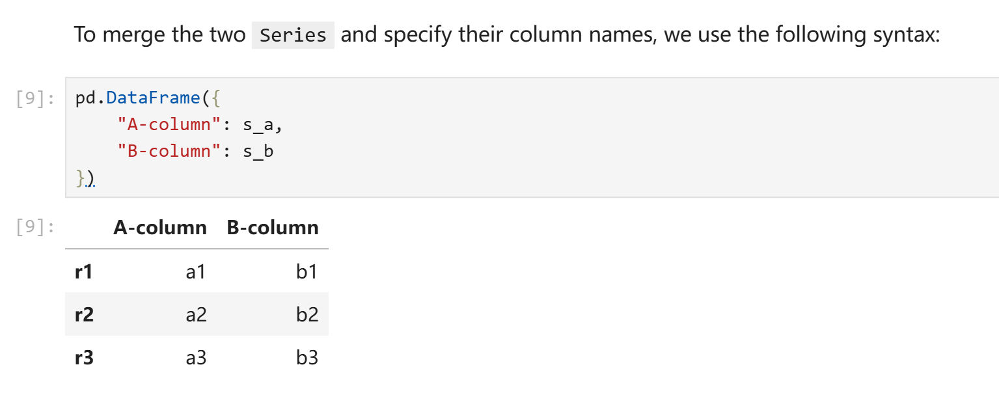

在上述的例子中，`s_a`和`s_b`由以下代码得到：

```python
s_a = pd.Series(["a1", "a2", "a3"], index = ["r1", "r2", "r3"])
s_b = pd.Series(["b1", "b2", "b3"], index = ["r1", "r2", "r3"])
```

之所以index可以设置为非数字的形式，原因在于我们读取数据的时候实际上可以指定csv文件中的其中任意一列为索引。data100中的例子是你可以以美国总统名为索引。（ubc的课程真的很喜欢聊美国总统）

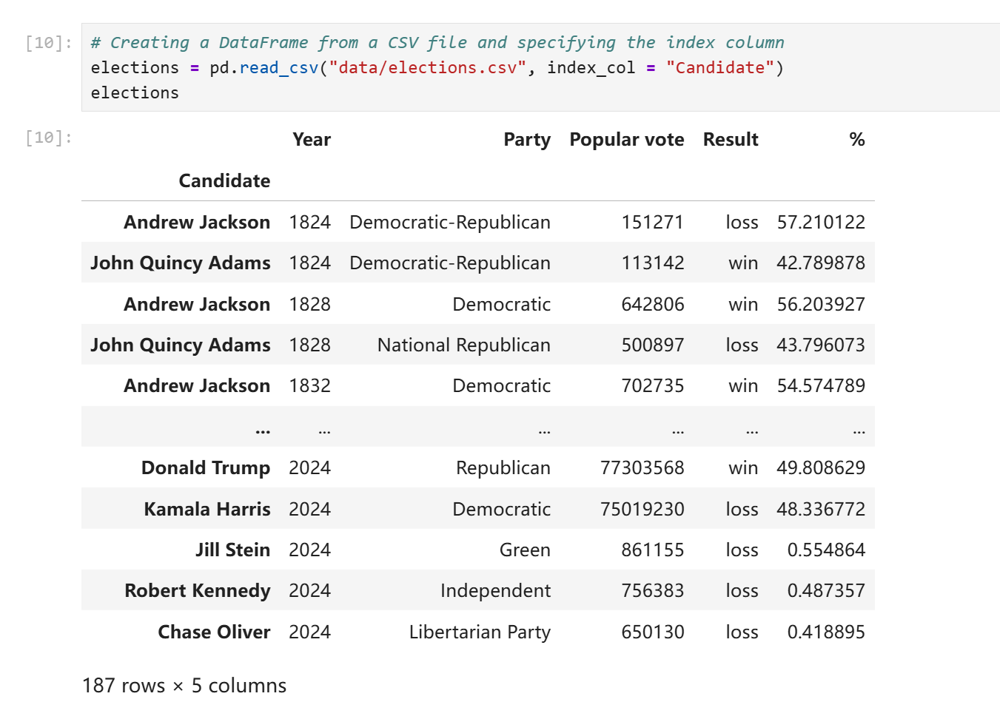

在不明确声明的情况下`read_csv`默认会以数字作为索引。你可以随时修改索引列或者改用默认索引。同时，索引并不要求不重复，多行应用同一个索引在pandas中是合法行为。

```python
elections.reset_index(inplace = True) # Resetting the index so we can set it again
# 上面这行的实际作用就是应用默认的数字索引
# This sets the index to the "Party" column
elections.set_index("Party")
```

DataFrame提供了`index`属性来访问其索引或行号，`columns`属性来访问其列名，`shape`来访问其形状。（和ndarray一致，第一个数字表示行数，第二个数字表示列数。）

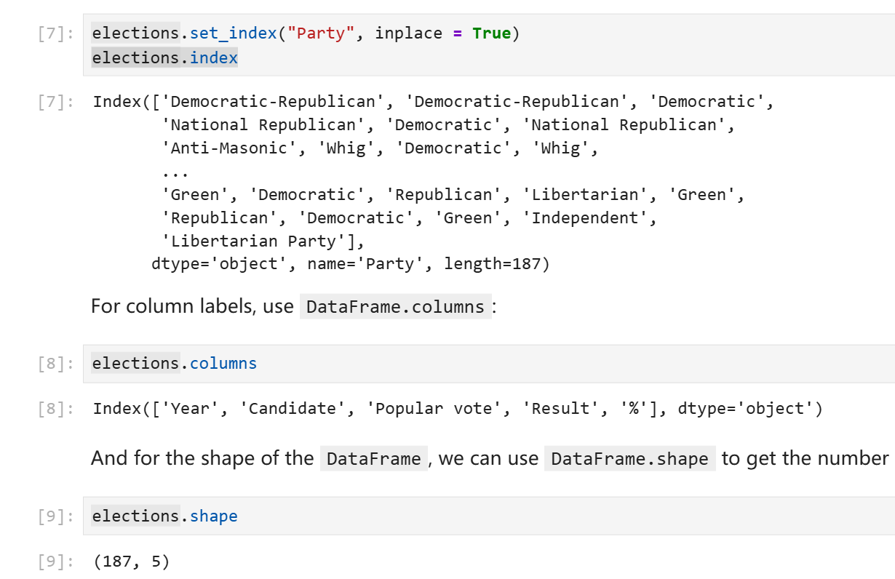

## DataFrame的切片

`head(n)`方法可以让你获得前n行的元素，`tail(n)`方法可以获得后n行的元素，不多赘述。

对于更加复杂的切片，DataFrame提供了`.loc`访问器（注意这不是方法），允许你使用索引、列表，或者切片的写法获取子对象。这个子对象可能是个`pd.Series`也可能是一个`pd.DataFrame`。

自然语言对于描述这类事物显得有点过于贫乏，以下是例子。
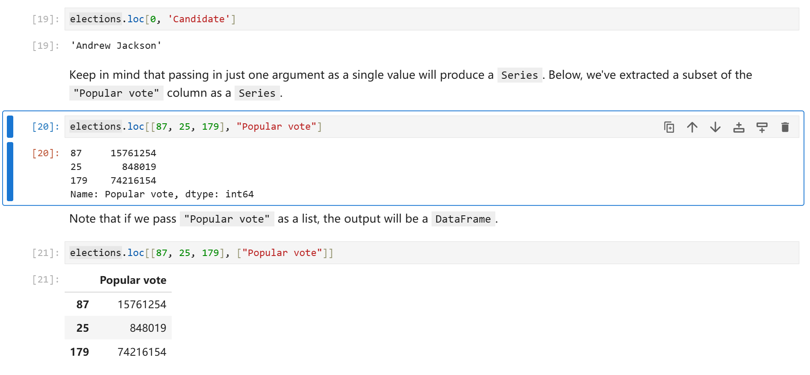

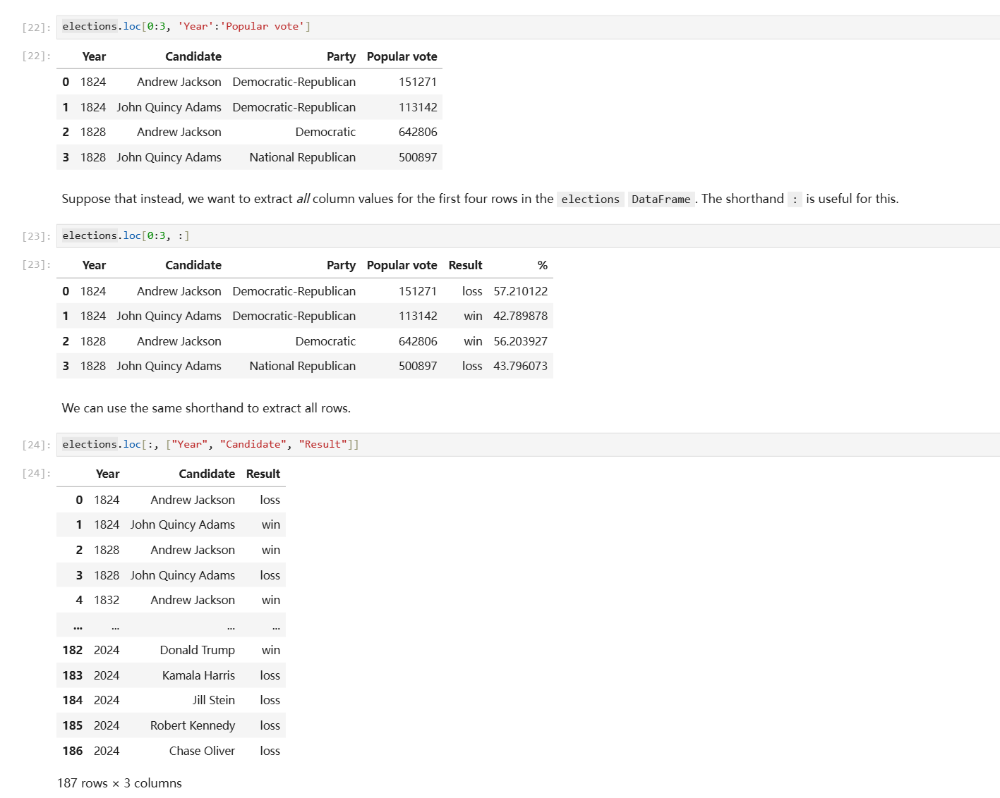

另一个DataFrame切片方式是`.iloc`访问器，它的行为和`.loc`基本一致，唯一的区别就是`.iloc`只支持你用默认的数字做索引来切片。

```python
#elections.loc[[0, 1, 2, 3], ['Year', 'Candidate', 'Party', 'Popular vote']] - Previous Approach
elections.iloc[[0, 1, 2, 3], [0, 1, 2, 3]]
```

注释中的`loc`写法和下方的`iloc`写法含义完全一致。

DataFrame同时还支持你直接使用中括号索引，你可以在中括号中传入行号切片、列名列表，或者单独一个列名。

```python
elections[0:4] # 获取前4行
elections[["Year", "Candidate", "Party", "Popular vote"]] # 或缺指定的列组成的DataFrame
elections["Candidate"] # 获取指定列对应的Series
```

# Pandas II

- 掩码取值
- 增删、修改列
- 实用方法

很多时候我们没有一个直接的方法可以算出索引数字进而获取数据，对此Pandas提供了掩码索引方式。你可以在中括号索引或者`.loc`访问器中传入一个由布尔值组成的列表来获取数据，对应位置为`True`则会取值，对应位置为`False`则不会取值，最后你会得到一个DataFrame或者Series。

```python
# This code pulls census data and loads it into a DataFrame
# We won't cover it explicitly in this class, but you are welcome to explore it on your own
import pandas as pd
import numpy as np
import urllib.request
import os.path
import zipfile

data_url = "https://www.ssa.gov/oact/babynames/state/namesbystate.zip"
local_filename = "data/babynamesbystate.zip"
if not os.path.exists(local_filename): # If the data exists don't download again
    with urllib.request.urlopen(data_url) as resp, open(local_filename, 'wb') as f:
        f.write(resp.read())

zf = zipfile.ZipFile(local_filename, 'r')

ca_name = 'STATE.CA.TXT'
field_names = ['State', 'Sex', 'Year', 'Name', 'Count']
with zf.open(ca_name) as fh:
    babynames = pd.read_csv(fh, header=None, names=field_names)
```

下载所需的csv文件并将其读取为`babynames`。Data100并没有谈及以上代码的语法细节，简单来说以上代码实现了自动下载文件并解压并读取的过程。这不是重点，你可以随时查阅下载脚本的写法。

`babynames`的内容如下：

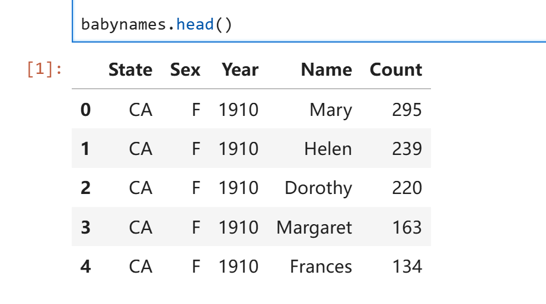
掩码索引：

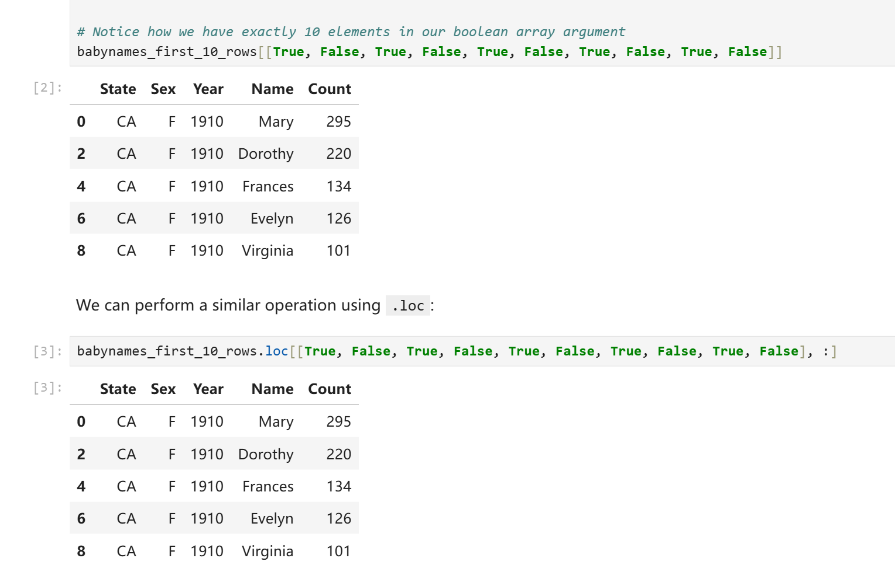

然而我们实际上并不需要手写这些True和False。我们可以用一些神秘技巧来预制这个掩码列表：

```python
logical_operator = (babynames["Sex"] == "F")
```

在上面这行代码中，`babynames["Sex"]`为一个`pd.Series`，即Sex那一列的去了列名的元素。行为和ndarray非常类似，直接使用`babynames["Sex"]`进行条件判断等价于对该Series每个元素进行条件判断并将结果装进一个新的Series，此处即logical_operator。我们可以直接将logical_operator塞进中括号索引中来获取所需内容。

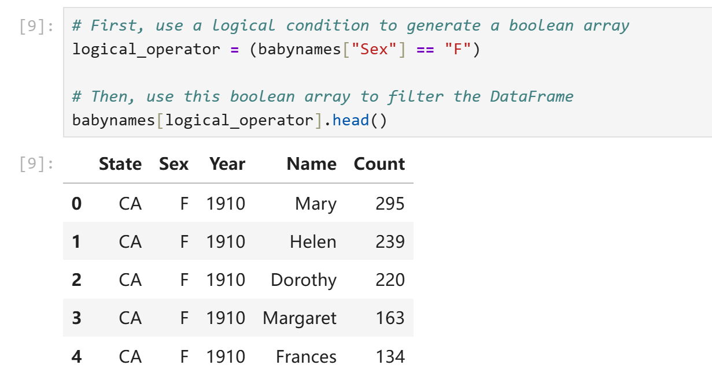

或者使用更简洁的写法：

```python
babynames.loc[babynames["Sex"] == "F"]
```

本质和预制掩码Series没有什么区别。

有时候我们会有一些相对复杂的条件表示需求，最简单的比如我们会要求数值处在一定区间，此时只用大于号或者小于号就解决不了问题了。常见的复合条件运算符如下：

- `~`等价于原生写法`not`。`~logical_operator`即`logical_operator`中所有元素True变False，False变True。（非门）
- `&`等价于原生写法`and`。对应元素均为True才为True，否则为False。（与门）
- `|`等价于原生写法`or`。对应元素均为False才为False，否则为True。（或门）
- `^`没有等价物。当对应元素不同时输出True，否则输出True。（异或门）

实际上和C语言中的位运算符行为很类似。

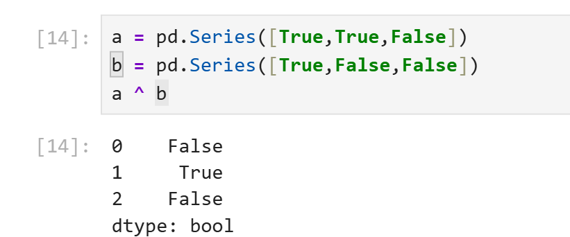

需要注意的是，pandas提供了新的逻辑运算符是想告诉你python的原生逻辑运算符对于`pd.Series`是失效的。当你需要对`pd.Series`进行复合逻辑运算时使用python原生`and`、`or`、`not`会导致报错。

除了以上提到的逻辑运算符，Pandas还提供了一些方法来表示对象元素之间的包含关系。假如我们只需要数字复合一定范围，我们当然只需要两个大小比较就可以解决，但是假如我们想要在一个`pd.Series`中筛选出所有名字在`["Alice", "Bob", "Charlie"]`中的行，使用三个或运算符就太麻烦了。Pandas提供了`isin()`方法可以对每个元素逐个判断其是否在另一个可迭代对象中。

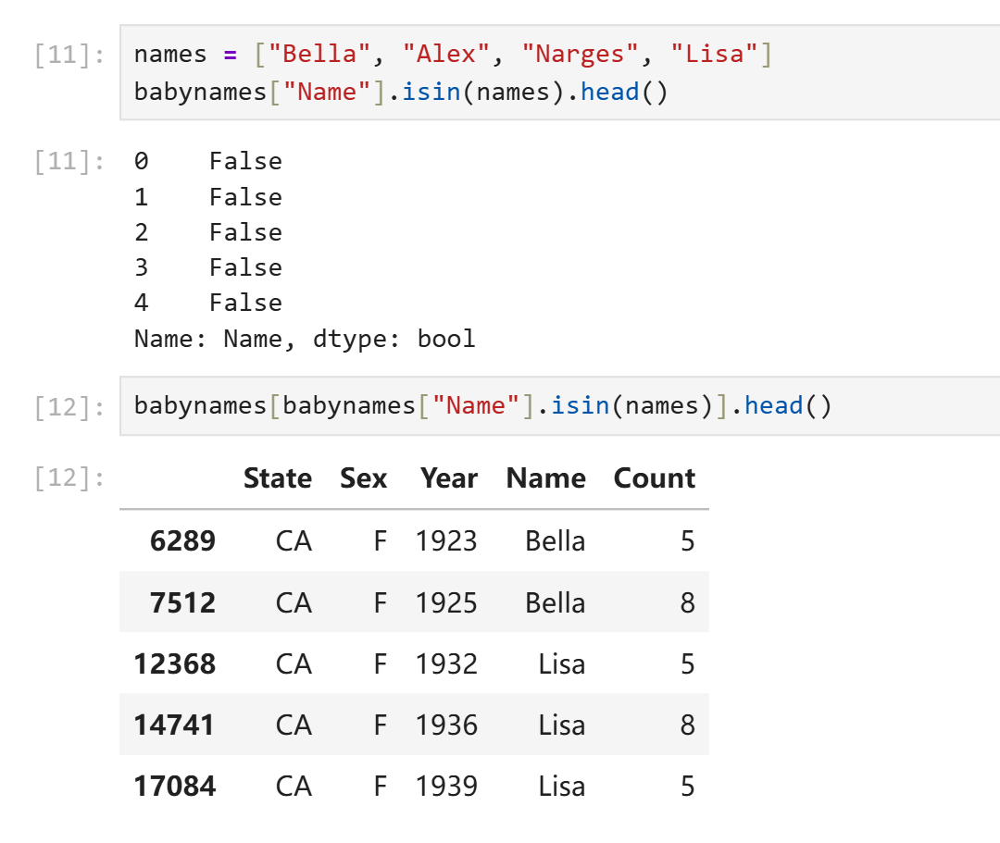

## 增删、修改列

修改某列的内容可以通过对其重新赋值实现。

```python
babynames["name_lengths"] = babynames["name_lengths"] - 1
```

`rename()`方法可以重命名列，传入的是以旧名为key、新名为value的字典。

```python
babynames = babynames.rename(columns={"name_lengths":"Length"})
```

删除元素使用`drop()`方法，需要指定删除的是行`"row"`还是列`"column`，默认删除行。

```python
babynames = babynames.drop("Length", axis="columns")
```

注意到`drop()`和`rename()`方法实际上并不会修改原DataFrame，它只是返回一个删除了修改后的副本。原地修改仍然需要通过赋值实现。

## 实用方法

[Pandas Doc]([API reference — pandas 3.0.0 documentation](https://pandas.pydata.org/docs/reference/index.html))

- `.shape`返回形状元组。
- `.size`返回总元素个数。
- `.describe()`返回一个DataFrame，包含该对象的各种统计数据，如个数、均值等。

```python
a = pd.DataFrame({
    "c1":[1,2,3],
    "c2":['a','b','c']
})
print(a)
print(a.size)
print(a.shape)
print(a.describe(include="all"))
print(a.describe().loc[["mean"],:])
```

输出：

```python
   c1 c2
0   1  a
1   2  b
2   3  c
6
(3, 2)
         c1   c2
count   3.0    3
unique  NaN    3
top     NaN    a
freq    NaN    1
mean    2.0  NaN
std     1.0  NaN
min     1.0  NaN
25%     1.5  NaN
50%     2.0  NaN
75%     2.5  NaN
max     3.0  NaN
       c1
mean  2.0
```

- `.sample()`返回一个对该DataFrame的随机采样得到的子DataFrame。
 	- 直接调用则返回随机一行构成的df。
 	- 传入数字得到指定个数行组成的df。
 	-
- `.value_counts()`用于按值统计各个元素出现的次数。
- `.unique()`返回一个没有重复值的副本。
- `.sort_values()`返回按值排序后的副本。

# Lab01

`%matplotlib inline`在jupyter中可以用来配置notebook让每次matplotlib绘制图像时直接显示在屏幕上而非保存为文件。

`%%time`写在每个cell的第一行可以让该cell自动记录程序运行的cpu用时。

`Ctrl Enter`原地执行当前cell。

`Shift Enter`执行当前cell并移动到下一个cell。

`ESC`指令模式前导键。

- a：在此cell上方创建一个新cell。
- b：在此cell下方创建一个新cell。
- dd：删除该cell。
- z：撤销。
- m：将一个cell转换为markdown格式。
- y：将一个cell转换为code模式。

[numpy review](https://ds100.org/fa17/assets/notebooks/numpy/Numpy_Review.html)，numpy是data100的先修内容，data100提供了简要的复习提纲。

### Question 1

create an array `arr` containing the values 1, 2, 3, 4, and 5 (in that order).

```python
arr = np.array([1, 2, 3, 4, 5])
```

### Question 2

Write a function `summation` that evaluates the following summation for $n \geq 1$:
$$\sum_{i=1}^{n} i^3 + 3 i^2$$

```python
def summation(n):
    temp = np.arange(n) + 1
    square = np.power(temp, 2)
    cubic = np.power(temp, 3)
    return (cubic + 3 * square).sum()
```

Write a function `elementwise_array_sum` that computes the square of each value in `list_1`, the cube of each value in `list_2`, then returns a list containing the element-wise sum of these results. Assume that `list_1` and `list_2` have the same number of elements, do not use for loops.

```python
def elementwise_array_sum(list_1, list_2):
    """Compute x^2 + y^3 for each x, y in list_1, list_2. 
    
    Assume list_1 and list_2 have the same length.
    
    Return a NumPy array.
    """
    assert len(list_1) == len(list_2), "both args must have the same number of elements"
    square = np.power(list_1, 2)
    cube = np.power(list_2, 3)
    return square + cube
```

对于处理更大的数据集，numpy提供的并行写法计算速度显著快于python的原生写法，原因在于numpy对于并行计算做了特殊的优化，而python原生写法优先保障灵活性。

Recall the formula for population variance below:
$$\sigma^2 = \frac{\sum_{i=1}^N (x_i - \mu)^2}{N}$$

```python
def mean(population: np.ndarray):
    """
    Returns the mean of population (mu)
    
    Keyword arguments:
    population -- a numpy array of numbers
    """
    # Calculate the mean of a population
    ...
    return population.sum() / population.size

def variance(population):
    """
    Returns the variance of population (sigma squared)
    
    Keyword arguments:
    population -- a numpy array of numbers
    """
    # Calculate the variance of a population
    ...
    return ((population - mean(population)) ** 2).sum() / population.size
```

Below we have generated a random array `random_arr`. Assign `valid_values` to an array containing all values $x$ in `random_arr` such that $2x^4 > 1$.

```python
np.random.seed(42)
random_arr = np.random.rand(60)
valid_values = random_arr[(2 * (random_arr**4)) > 1]
valid_values
```

### Question3

Consider the function $f(x) = x^2$ for $-\infty < x < \infty$.

Find the equation of the tangent line to $f$ at $x = 0$.
$$
y = 0
$$
Find the equation of the tangent line to $f$ at $x = 8$.
$$
y = 16(x - 8)
$$
Write code to plot the function $f$, the tangent line at $x=8$, and the tangent line at $x=0$.

Set the range of the x-axis to (-15, 15) and the range of the y-axis to (-100, 300) and the figure size to (5,5).

Here is some documentation that may be helpful: [`np.linspace(..)`](https://numpy.org/doc/stable/reference/generated/numpy.linspace.html)

Your resulting plot should look like this (it's okay if the colors in your plot don't match with ours, as long as they're all different colors):

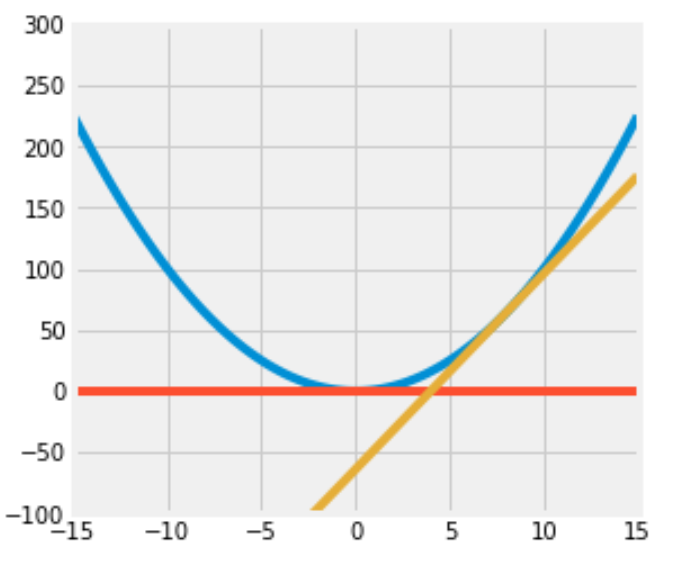

```python
def f(x):
    ...
    return x**2
    
def f_deriv(x):
    ...
    return 2 * x

def plot(f, f_deriv):
    # Hint: Use np.linspace()
    x = np.linspace(-15, 15)
    y = np.concatenate(
        (
            f(x).reshape(-1, 1), 
            (f_deriv(0)*x).reshape(-1, 1),
            (f_deriv(8) * (x - 8)).reshape(-1, 1)
        ), 
        axis = 1
    )
    plt.figure(figsize=(5, 5))
    # plt.axhline(xmin=-15,xmax=15)
    plt.ylim(-100, 300)
    plt.plot(x, y)

plot(f, f_deriv)
```

（太伟大了data100，没有data100我一辈子都不会掌握亲手画图的技能）

### Question4

Data science is a rapidly expanding field and no degree program can hope to teach you everything that will be helpful to you as a data scientist. So it's important that you become familiar with looking up documentation and learning how to read it.

Below is a section of code that plots a three-dimensional "wireframe" plot. You'll see what that means when you draw it. Replace each `# Your answer here` with a description of what the line above does, what the arguments being passed in are, and how the arguments are used in the function. For example,

```
np.arange(2, 5, 0.2)
# This returns an array of numbers from 2 to 5 with an interval size of 0.2
```

```python
from mpl_toolkits.mplot3d import axes3d

u = np.linspace(1.5 * np.pi, -1.5 * np.pi, 100)
# 返回一个从-1.5pi到1.5pi之间左开右闭均匀取100个值得到的np数组。
[x, y] = np.meshgrid(u, u)
# meshgrid的功能是把若干个一维数组分别放到相互正交的坐标轴上，之后广播成相同的形状再按顺序还回去。
# 此处x被横向赋值了y的长度次，y被横向复制了x的长度次。
# 这样做看起来很没有意义，但是形状一致之后我们就可以方便的进行对应位置的并行计算。
squared = np.sqrt(x.flatten() ** 2 + y.flatten() ** 2)
z = np.cos(squared)
# z为对应位置x，y拍平后数值为直角边组成三角形的斜边的长度的余弦值组成的数组。
z = z.reshape(x.shape)
# 把z解压为原样。

fig = plt.figure(figsize = (6, 6))
ax = fig.add_subplot(111, projection = '3d')
# 创建一个6x6的图像并创建一个3d子图像。
ax.plot_wireframe(x, y, z, rstride = 5, cstride = 5, lw = 2)
# 以x、y、z的数值生成线框图，xyz均需要是2D数组。这个地方看起来很匪夷所思。
# xy之所以也必须是2d的，原因在于x与y并不总是等差数列。绘图的时候会按照索引值来找某个点前后左右的点进而绘制线框。明确x,y为绘制线框图提供了极高的自由度。
ax.view_init(elev = 60, azim = 25)
# 显示图像。
plt.savefig("figure1.png")
# 保存图像。
```

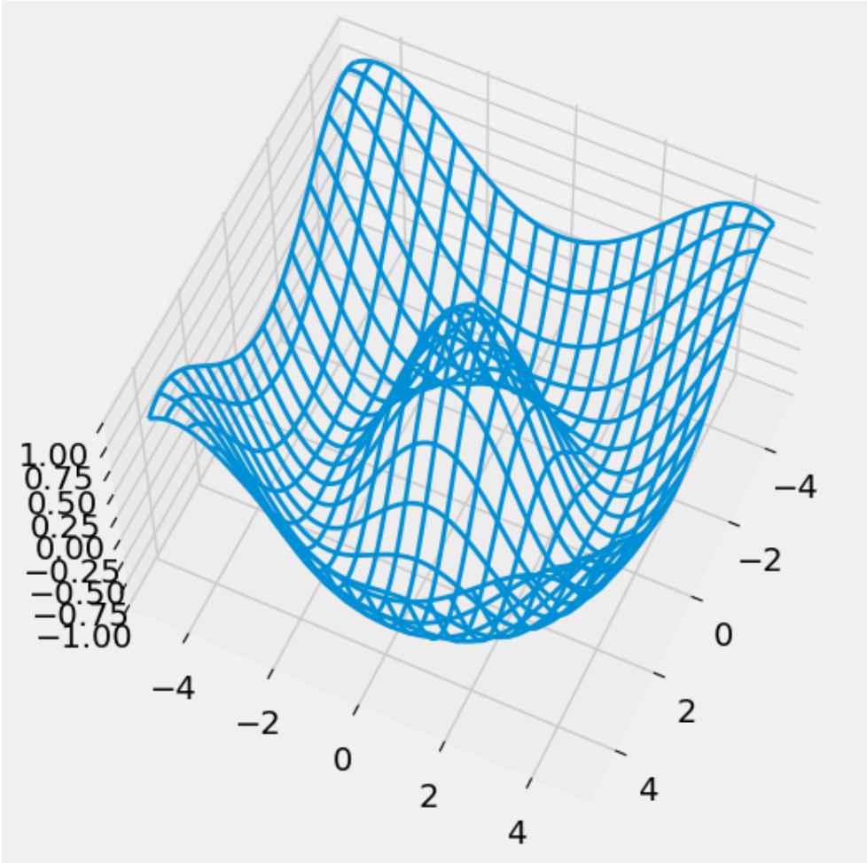

# Homework01

```python
np.arange?
```

在一个函数后面加`?`并运行这个cell可以查看这个函数的官方文档。

## Question 1: Distributions

```python
faces = range(1, 7)
unit_bins = np.arange(0.5, 6.6)
plt.hist(faces, bins=unit_bins, ec='white', density=True, alpha=0.7)
```

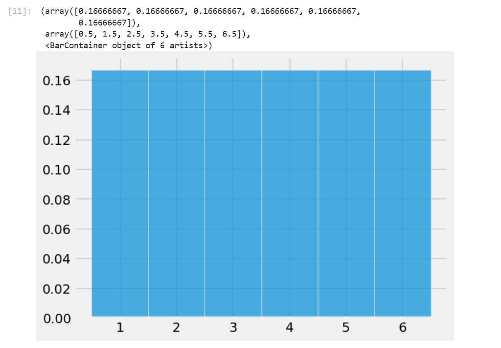

`plt.hist`可以用来绘制柱状图，`bins`参数设置了柱状图的边界（包括第一个柱的左边界和最后一个柱的右边界。`ec`设置柱形图之间的边界颜色，`density`为True时绘制图像的纵坐标表示的将是相对密度，为False时表示的是原始数据。`alpha`参数设置图像透明度。

当输入一个数组时，`plt.hist`会按照你所设定的bins的边界将数组中的元素分类计数，最后绘制出柱状图。

## Question 1a

Define a function `plot_distribution` that takes an array of numbers (integers or decimals) and draws the histogram of the distribution using unit bins centered at the integers and white edges for the bars.

The histogram should be drawn to the density scale, and the opacity should be 75%. The left-most bar should be centered at the integer closest to the smallest number in the array, and the right-most bar should be centered around the integer closest to the largest number in the array.

The display does not need to include the printed proportions and bins. No titles or labels are required for this question. For grading purposes, assign your plot to `histplot`.

If you have trouble defining the function, go back and carefully read all the lines of code that resulted in the probability histogram of the number of spots on one roll of a die. Pay special attention to the bins. Feel free to create a cell to test your function on generic arrays to check for correctness!

**Hint**:
- See `plt.hist()` [documentation](https://matplotlib.org/stable/api/_as_gen/matplotlib.pyplot.hist.html).
- We want to: (1) center each bin at integer values and (2) make sure all the values in the array are captured by the bins.
  - For example, let’s say we have the following input array: `[0.3, 0.7, 1.1, 1.4, 1.9]`.
  - The smallest value is `0.3`; the left endpoint of the leftmost bin (the first bin) should be `-0.5` and the rightmost endpoint of this bin should be `0.5` so that this bin is centered at the integer `0`.
  - This first bin above captures `0.3`. The second bin will be centered at `1` (between `0.5` and `1.5`) and captures `0.7`, `1.1`, and `1.4`.
  - We can continue in this manner until all values are captured by our bins.
- What is the left endpoint of the left-most bar? What is the right endpoint of the right-most bar? You may find `min()`, `max()`, and `round()` helpful.
- Please keep in mind your function should be implemented so that it works for _any_ generic array of numbers (integers or decimals), not just the `faces` array in the cell below.

```python
def plot_distribution(arr):
    # Define bins
    unit_bins = np.arange(round(min(arr))-0.5,round(max(arr))+0.6)
    # Plot the data arr using unit_bins, assign the plot to histplot
    histplot = plt.hist(arr, bins = unit_bins, density=True, ec='white', alpha=0.75)
    return histplot
faces = range(1, 10)
histplot = plot_distribution(faces)
```

## Question 1b

> Given the study description and hypotheses outlined above, select the statement that most accurately describes the hypothesis test we conducted. Answer this question by entering the letter corresponding to your answer in the variable `q1bi` below.
>
> **A.** The hypothesis test is two-sided. The null hypothesis is rejected when the average serum cholesterol of patients with heart disease is significantly higher or lower than that of patients without heart disease. \
   **B.** The hypothesis test is one-sided.  The null hypothesis is rejected when the average serum cholesterol of patients with heart disease is significantly higher than that of patients without heart disease. \
   **C.** The hypothesis test is two-sided because the test statistic, the difference in means, is symmetrically distributed. In other words, the two halves of the distribution closely resemble each other, so the test is two-sided. \
   **D.** The hypothesis test is two-sided because we are comparing the average serum cholesterol of two different groups.
>
> Answer in the following cell. Your answer should be a string, either `"A"`, `"B"`, `"C"`, or `"D"`.

答案选A。假说检测就是说当我们观察到某个数据在分别附有两个不同的标签时数值存在显著差异，我们规定原假设是指假设我们所观察到的差异只不过是偶然，然后我们打乱标签，多次统计不同标签对应数据的均值之差，之后再和我们最初观察到的数据对比，猜测假说正确的可能性。

这边花了好大篇幅在讲独立性检测？战术略过。

## Question 1d

Now, we begin the permutation test by generating an array called `differences` that contains simulated values of our test statistic from **10,000 permuted samples**. Remember, we are computing the difference between the average cholesterol levels of patients with heart disease and without heart diseases, where labels have been assigned at random (i.e., in a world where the null hypothesis is true, so disease status is arbitrary and should have no effect on cholesterol).

**Note**: Most of the code below for this problem is already filled for you. In summary, this code first combines the cholesterol values from both groups into one array. Then, it repeatedly (10,000 times) shuffles this combined data to randomly reassign cholesterol values into two new simulated groups of the same original sizes. For each shuffle, it calculates the difference in means between the two simulated groups and stores it.

**Reminder**: Data 100 does **not** support the `datascience` library, so you should instead use the appropriate functions from the `NumPy` library. Some suggested references: Lab 01 (for a quick `NumPy` tutorial), `NumPy` array indexing/slicing [documentation](https://numpy.org/doc/stable/user/basics.indexing.html), `np.random.choice` [documentation](https://numpy.org/doc/stable/reference/random/generated/numpy.random.choice.html) (in particular, the `size` and `replace` parameters), and `np.append` [documentation](https://numpy.org/doc/stable/reference/generated/numpy.append.html).

```python
np.random.seed(100) # Do not modify this line.

differences = np.array([]) 
repetitions = 10000
all_cholestrol = np.append(non_disease_chol, disease_chol)

for i in np.arange(repetitions):
    shuffled_cholesterols = np.random.choice(all_cholestrol, size=len(all_cholestrol), replace=False)
    
    sim_non_disease_chol = shuffled_cholesterols[:len(non_disease_chol)]
    sim_disease_chol = shuffled_cholesterols[len(non_disease_chol):]
    
    sim_difference = np.mean(sim_non_disease_chol) - np.mean(sim_disease_chol)
    
    differences = np.append(differences, sim_difference)

differences
```

## Question 1e

```python
plot_distribution(differences)
```

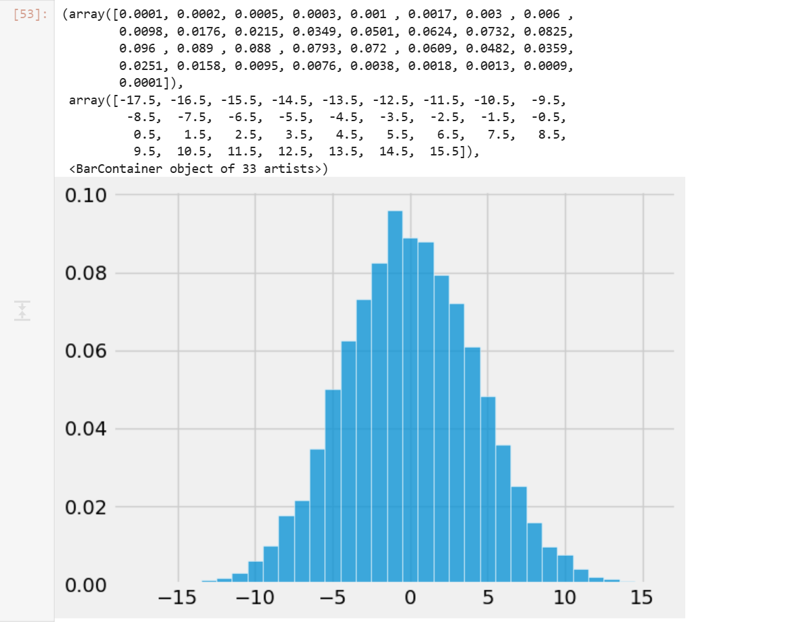

## Question 1f

Compute `empirical_p`, the empirical p-value based on `differences`, the empirical distribution of the test statistic, and `observed_difference`, the observed value of the test statistic.

```python
empirical_p = np.mean(differences <= observed_difference)
empirical_p
```

_经验P值_的计算公式实际上非常直接，就是计算模拟计算得到的数据中比观测数据更极端的数据出现的概率。

# Lab2a

[Lab 2A Walkthrough - Pandas Review](https://www.youtube.com/watch?v=MLUNk_D7KW0&list=PLQCcNQgUcDfoWO3WVtznI7CBJmtNUqbAN&t=6s)

Data100为lab2a提供了一个walkthrough视频，把内容基本过了一遍。

### Question 1a

For a `DataFrame` `d`, you can add a column with `d['new column name'] = ...` and assign a `list` or `array` of values to the column. Add a column of integers containing 1, 2, 3, and 4 called `rank1` to the `fruit_info` table, which expresses **your personal preference** about the taste ordering for each fruit (1 is tastiest; 4 is least tasty). There is no right order, it is completely your choice of rankings.

```python
fruit_info['rank1'] = [1, 2, 3, 4]
```

### Question 1b

You can also add a column to `d` with `d.loc[:, 'new column name'] = ...`. As above, the first parameter is for the rows, and the second is for columns. The `:` means changing all rows, and the `'new column name'` indicates the name of the column you are modifying (or, in this case, adding).

Add a column called `rank2` to the `fruit_info` table, which contains the same values in the same order as the `rank1` column.

```python
fruit_info['rank2'] = fruit_info.loc[:, 'rank1']
```

### Question 2

Use the `.drop()` method to drop both the `rank1` and `rank2` columns you created. Make sure to use the `axis` parameter correctly. Note that `drop` does not change a table but instead returns a new table with fewer columns or rows unless you set the optional `inplace` argument.

**Hint:** Look through the [documentation](https://pandas.pydata.org/pandas-docs/stable/reference/api/pandas.DataFrame.drop.html) to see how you can drop multiple columns of a `DataFrame` at once using a list of column names.

```python
fruit_info_original = fruit_info.drop(['rank1', 'rank2'], axis = 'columns')
```

### Question 3

Use the `.rename()` method to rename the columns of `fruit_info_original` so they begin with capital letters. Set this new `DataFrame` to `fruit_info_caps`. For an example of how to use rename, see this linked [documentation](https://pandas.pydata.org/pandas-docs/stable/reference/api/pandas.DataFrame.rename.html).

```python
fruit_info_caps = fruit_info_original.rename(
 {x:x.capitalize() for x in fruit_info_original.columns},
 axis = 'columns'
)
```

`pd.rename`改名需要传入一个dict表示由原名到新名的映射，同时需要指定改名的轴。

### Question 4a

Use `.loc` to select `Name` and `Year` **in that order** from the `babynames` table.

```python
name_and_year = babynames.loc[:, ["Name", "Year"]]
```

### Question 4b

Now repeat the same selection using the plain `[]` notation.

```python
name_and_year = babynames[['Name', 'Year']]
```

### Question 5

Using a boolean array, select the names in Year 2000 (from `babynames`) that have larger than 3000 counts. Keep all columns from the original `babynames` `DataFrame`.

```python
result = babynames.loc[(babynames["Count"] > 3000) & (babynames["Year"] == 2000)]
```

### Question 6a

Add a column to `babynames` named `First Letter` that contains the first letter of each baby's name.

Hint: you can index using `.str` similarly to how you'd normally index Python strings. Or, you can use `.str.get` [(documentation here)](https://pandas.pydata.org/docs/reference/api/pandas.Series.str.get.html).

```python
babynames["First Letter"] = babynames["Name"].str.get(0)
```

### Question 6b

In 2022, how many babies had names that started with the letter "A"?

```python
babynames_2022 = babynames[babynames["Year"] == 2022] 
just_A_names_2022 =  babynames_2022[babynames_2022["First Letter"] == "A"]
number_A_names = just_A_names_2022["Count"].sum()
```

注意`babynames_2022`中不存在重名，重名婴儿个数已经统计进了Count列。

# Homework 2a

> You may notice that we did not write `zipfile.ZipFile('data.zip', ...)`. Instead, we used `zipfile.ZipFile(dest_path, ...)`. In general, we **strongly suggest having your filenames hard coded as string literals only once** in a notebook. It is very dangerous to hardcode things twice because if you change one but forget to change the other, you can end up with bugs that are very hard to find.

代码智慧 +1

Homework2a开头讲了一大堆原始数据加载的内容，以下大致总结：

```python
import zipfile
my_zip = zipfile.ZipFile(dest_path, 'r') # Read .zip file at dest_path, which is data.zip
list_names = my_zip.namelist() # Create list of names of contents in data.zip
```

`zipfile.ZipFile`可以直接读取zip文件到一个`zipfile.Zipfile`对象中，无需物理解压。

```python
data_dir = Path('.') # Create a path to current working directory
my_zip.extractall(data_dir) # Extract all contents from data.zip
```

真正解压文件。解压出来的结果会放入`data_dir`。

```python
def head(filename, lines=5):
    """
    Returns the first few lines of a file.
    
    filename: the name of the file to open
    lines: the number of lines to include
    
    return: A list of the first few lines from the file.
    """
    from itertools import islice
    with open(filename, "r") as f: # Open file for reading
        return list(islice(f, lines)) # Return first five lines of the file as a list
```

朴素的任意文本文件head读取函数写法。

```python
# Path to the directory containing data
dsDir = Path('data')
bus = pd.read_csv(dsDir/'bus.csv', encoding='ISO-8859-1')
ins2vio = pd.read_csv(dsDir/'ins2vio.csv')
ins = pd.read_csv(dsDir/'ins.csv')
vio = pd.read_csv(dsDir/'vio.csv')

# This code is essential for the autograder to function properly. Do not edit
bus.loc[:, ["latitude", "longitude"]] = bus.loc[:, ["latitude", "longitude"]].apply(lambda x: np.round(x, 2))
ins_test = ins
```

读取csv文件。相较于os中使用`path.join()`方法拼接路径，pathlib提供了`Path`类并重载了__truediv__操作符，使得你可以直接在python中使用类似linux的路径语法来表示路径。（os库中并没有建立针对路径的类，而是直接使用字符串来表示路径。）

需要注意的是虽然os库中使用字符串来表示路径而pathlib兼容os库，Path类并不直接继承str类，而是通过实现__fspath__协议的方式使自己可以用来表示路径。

### Question 1a

Examining the entries in `bus`, is the `bid` unique for each record (i.e., each row of data)? Your code should compute the answer, i.e., don't just hard code `True` or `False`.

**Hint**: Use `value_counts()` (documentation [here](https://pandas.pydata.org/docs/reference/api/pandas.Series.value_counts.html)) or `unique()` (documentation [here](https://pandas.pydata.org/docs/reference/api/pandas.Series.unique.html)) to determine if the `bid` series has any duplicates.

```python
is_bid_unique =  (bus["bid"].unique() == bus["bid"]).all()
```

### Question 1b

We will now work with some important fields in `bus`.

1. Assign `top_names` to a `NumPy` array or list containing the top 7 most frequently used business names, from most frequent to least frequent.
2. Assign `top_addresses` to a `NumPy` array or list containing the top 7 addresses where businesses are located, from most popular to least popular.

**Hint 1**: You may find `pd.Series.value_counts` helpful (documentation [here](https://pandas.pydata.org/docs/reference/api/pandas.Series.value_counts.html)).

**Hint 2**: You'll need to get the names and addresses, NOT the counts associated with each. Some way to **reset the index** would come in handy. If you're unsure how to do this, try looking through the class notes or using a search engine. Part of the goal of this course is to develop independent thinking in the context of the data science lifecycle, which can involve a fair bit of exploring and reading documentation. It may be a bit annoying at first, but you’ll get the hang of it. We’re here to help guide you on that path if you ever need support!

```python
top_names = bus.value_counts("name").index[:7].to_numpy()
top_addresses = bus.value_counts("address").index[:7].to_numpy()
```

### Question 2a

How many restaurants are in each ZIP code?

In the cell below, create a **Series** where the index is the postal code, and the value is the number of records with that postal code. The `Series` should be in descending order of count. Do you notice any odd/invalid ZIP codes?

```python
zip_counts = bus.value_counts("postal_code")
print(zip_counts.to_string())
```

### Question 2b

Import a list of valid San Francisco ZIP codes by using `pd.read_json` to load the file `data/sf_zipcodes.json`, and store them as a **Series** in `valid_zip_codes`. As you may expect, `pd.read_json` works similarly to `pd.read_csv` but for JSON files (a different file format you'll learn more about in HW 3) that you can read more about [here](https://pandas.pydata.org/docs/reference/api/pandas.read_json.html). **Make sure that the resulting series (not a data frame!) is zero-indexed, with each value being a unique zip code.** If you are unsure of what data type a variable is, remember you can do `type(some_var_name)` to check!

```python
valid_zip_codes = pd.Series(pd.read_json(dsDir/"sf_zipcodes.json")["zip_codes"])
```

 Construct a `DataFrame` containing only the businesses that **DO NOT** have valid ZIP codes.

```python
invalid_zip_bus = bus[~(bus["postal_code"].isin(valid_zip_codes))]
```

### Question 2c

In the previous question, many of the businesses had a common invalid postal code that was likely used to encode a MISSING postal code. Do they all share a potentially "interesting address"? For that purpose, in the following cells, we will construct a series that counts the number of businesses at each `address` that have this single likely MISSING postal code value.

Let's break this down into steps:

#### Part 1

Identify the single most common missing postal code and assign it to `missing_postal_code`. Then create a `DataFrame`, `bus_missing`, to store only those businesses in `bus` that have `missing_postal_code` as their postal code.

**Hint**: All ZIP codes in the US are _positive_ numbers

```python
missing_postal_code = invalid_zip_bus.value_counts("postal_code").index[0]
bus_missing = bus[bus["postal_code"] == missing_postal_code]
```

(年度解密游戏（大雾）)

这里注意我们需要的是postal_code名而不是最大的postal_code出现次数，需要访问index属性。

#### Part 2

Using `bus_missing`, find the number of businesses at each address (which would all share the same postal code). Specifically, `missing_zip_address_count` should store a `Series` with addresses as the indices and the counts as the values.

```python
missing_zip_address_count = bus_missing.value_counts("address")
```

这里应该直接统计`bus_missing`中不同address的数量而不是`bus`中名字和`bus_missing`名字匹配的行中不同address的数量，一个business可以有多个address，使用名字匹配会导致一个business被多次匹配。

看着很简单，问题在于花了很长时间都没理解题目想让我做什么事情。英语太烂这块。

### Question 2e

Examine the `invalid_zip_bus` `DataFrame` we computed in Question 2c and look at the businesses that DO NOT have the special MISSING ZIP code value. Some of the invalid postal codes are just the full 9-digit code rather than the first 5 digits. **Create a new column named `postal5` in the original `bus` `DataFrame`, which contains only the first 5 digits of the `postal_code` column.**

Then, for any of the `postal5` ZIP code entries that were not a valid San Francisco ZIP code (according to `valid_zip_codes`), the provided code will set the `postal5` value to `None`.

**Hint:** You will find `str` accessors particularly useful. They allow you to use your usual Python string functions in tandem with a `DataFrame`. Refer to the [Pandas II course notes](https://ds100.org/course-notes/pandas_2/pandas_2.html#:~:text=babyname_lengths%20%3D%20babynames%5B%22Name%22%5D.str.len()) for examples.

**Do not modify the provided code! Simply add your own code in place of the ellipses.**

```python
bus['postal5'] = None
bus['postal5'] = bus['postal_code'].apply(lambda x: x[:5])

bus.loc[~bus['postal5'].isin(valid_zip_codes), 'postal5'] = None
# Checking the corrected postal5 column
bus.loc[invalid_zip_bus.index, ['bid', 'name', 'postal_code', 'postal5']]
```

上面的写法用了一种力大砖飞的俺寻思能行写法，本质上是逐元素应用python函数，虽然可以工作，但是pandas实际上提供了更加方便的写法。

```python
bus['postal5'] = bus['postal_code'].str[:5]

bus.loc[~bus['postal5'].isin(valid_zip_codes), 'postal5'] = None
# Checking the corrected postal5 column
bus.loc[invalid_zip_bus.index, ['bid', 'name', 'postal_code', 'postal5']]
```

使用pandas提供的str访问器的优点是pandas会自动处理异常值，更加安全高效。

### Question 2f

Finally, use the `postal5` column to create a `DataFrame`, `bus_valid`, that only contains the rows of `bus` where a `postal5` zip code exists. You may find the `.isna()` function useful here.

```python
bus_valid = bus[~bus['postal5'].isna()]
bus_valid
```

### Question 3a

The column `iid` probably corresponds to an inspection ID. Write an expression (i.e., a line of code) that evaluates to `True` or `False` based on whether all the inspection IDs are unique. Your code should compute the answer, i.e., don't just hard code `True` or `False`.

```python
is_ins_iid_unique = (ins['iid'].isin(ins['iid'].unique())).all()
```

### Question 3b

We want to extract `bid` from each row of the `ins` `DataFrame`. If we look carefully, the column `iid` of the `ins` `DataFrame` appears to be composed of two numbers, and the first number looks like a business ID.  

Create a new column called `bid` in the `ins` Dataframe containing just the business ID. You will want to use `ins['iid'].str` operations. (Python's in-built `split` method could come in use; read up on the documentation [here](https://pandas.pydata.org/docs/reference/api/pandas.Series.str.split.html)!) Also, be sure to convert the type of this column to `int`.

**Hint**: Similar to an earlier problem where we used `astype("string")` to convert a column to a string, here you should use `astype` to convert the `bid` column into type `int`. **No Python `for` loops or list comprehensions are allowed.** This is on the honor system since our autograder isn't smart enough to check, but if you're using `for` loops or list comprehensions, you're doing the HW incorrectly.

```python
ins['bid'] = ins['iid'].str.split('_',expand=True).iloc[:, 0].astype(int)
```

### Question 3c

What is the type of the individual `ins['date']` entries? You may want to grab the very first entry and use the `type` function in Python.

```python
ins_date_type = type(ins['date'])
```

Rather than the type you discovered in Part 1, we want each entry in `pd.TimeStamp` format. You might expect that the usual way to convert something from its current type to `TimeStamp` would be to use `astype`. You can do that, but the more typical way is to use `pd.to_datetime` (documentation [here](https://pandas.pydata.org/docs/reference/api/pandas.to_datetime.html)). Using `pd.to_datetime`, create a new `ins['timestamp']` column containing `pd.Timestamp` objects. These will allow us to do date manipulation with much greater ease in parts III and IV.

**Note:** You may encounter a `UserWarning` if you do not specify the date format when using pd.to_datetime. To resolve this, consider specifying the `format` using the string `'%m/%d/%Y %I:%M:%S %p'`. This format indicates that the datetime we are inputting to convert is in the form of `Month`/`Day`/`Year` `Hour` (12-hour clock)/`Minute`/`Second` `AM`/`PM`. Read [here](https://pandas.pydata.org/docs/reference/api/pandas.to_datetime.html) for more details.

```python
format_string = '%m/%d/%Y %I:%M:%S %p'
ins['timestamp'] = pd.to_datetime(ins['date'], format=format_string)
ins['timestamp']
```

What are the earliest and latest dates in our inspection data?  

```python
earliest_date = ins['timestamp'].min()
latest_date = ins['timestamp'].max()
print("Earliest Date:", earliest_date)
print("Latest Date:", latest_date)
```

没有经过格式化的时间不能直接比较大小。

We probably want to examine the inspections by year. Create an additional `ins['year']` column containing just the year of the inspection. Consider using `pd.Series.dt.year` to
do this.

In case you're curious, the documentation for `TimeStamp` data can be found at [this link](https://pandas.pydata.org/docs/reference/api/pandas.Timestamp.html#pandas.Timestamp).

```python
ins['year'] = ins['timestamp'].dt.year
```

### Question 4a

First, create a new column, `first_char` that contains the first character of the address string of each restaurant in `bus_valid`. **Again, do not use for loops or list comprehensions in your solution**.

```python
bus_valid["first_char"] = bus_valid['address'].str[0]
```

### Question 4b

Unfortunately, not all of the addresses in `bus_valid` start with a number. Create a new `DataFrame` `bus_digits` that only contains the rows of `bus_valid` where the restaurant's address starts with a digit between 1 and 9.

**Note: Do not include rows in which the first digit of the address is a 0.**

_Hint_: You may find the `s.str.isnumeric()` `Series` method useful here.

```python
bus_digits = bus_valid[bus_valid['first_char'].str.isnumeric() & bus_valid['first_char'] != 0]
```

虽然note里提到不要包括地址以0开头的行，但是实际上数据集中根本没有以0开头的行。

### Question 4c

Plot a histogram that shows the frequency of each possible first digit among the addresses in `bus_digits`. Like you did in Homework 1, create bins of unit length that are centered at each of the digits and assign it to `bins_arr`.

**Note**: You only need to define `digits_arr` and `bins_arr`. The code necessary to plot the histogram has already been provided for you.

**Hint**: Make sure the `digits_array` has data type `int`. You can check the type of the object in a `Series` by looking at the `dtype` attribute. More information [here](https://pandas.pydata.org/docs/reference/api/pandas.Series.dtype.html). How can you change the content of the series to a specific data type?

**Hint:** To create bins of unit length that are centered at each of the digits, you might not want to start at the original starting and ending points. Where should you start instead?

```python
digits_arr = pd.Series(range(1, 10), dtype=int) 
bins_arr = pd.Series(np.arange(0.5, 9.6))

# DO NOT CHANGE BELOW
benford = np.array([0.301, 0.176, 0.125, 0.097, 0.079, 0.067, 0.058, 0.051, 0.046]) # Array of proportions under Benford's Law
plt.hist(digits_arr, bins = bins_arr, density = True, alpha = 0.5, color = "blue", label = "Empirical Dist") # Plot digits_arr, the empirical distribution
plt.bar(np.arange(1, 10), height = benford, width = 1, alpha = 0.5, color = "red", label = "Benford's Law") # Plot the theoretical distribution under Benford's Law
plt.xlabel("Digit")
plt.ylabel("Probability")
plt.title("Overlaid Plot of Empirical Distribution vs Benford's Law")
plt.legend();
```

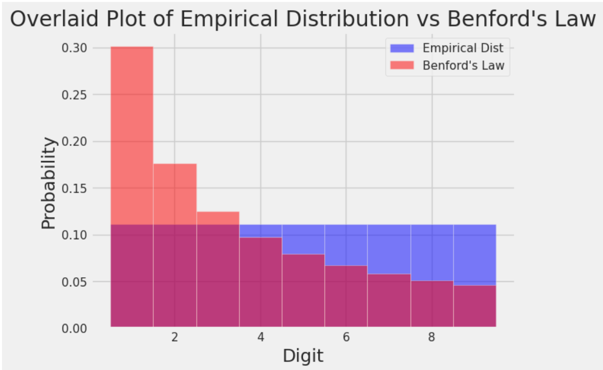

本福特定律，在很多数据集中出现的数字的首位数字并不是均匀分布的。

[What Is Benford's Law? Why This Unexpected Pattern of Numbers Is Everywhere | Scientific American](https://www.scientificamerican.com/article/what-is-benfords-law-why-this-unexpected-pattern-of-numbers-is-everywhere/)

### Question 5a

Create a new `DataFrame` `bus_coords`, which includes only the rows of `bus_valid` where both the latitude and longitude values are not missing.

**Hint:** Missing values for latitude and longitude values are the _same_ as the most frequent missing value you found in **Question 2c**!

**Hint:** You do not need to consider the scenario where a phone number is missing!

```python
bus_coords = bus_valid[(bus_valid['latitude']>-9999) | (bus_valid['longitude']>-9999)]
```

### Question 5b

To be close to Fisherman’s Wharf, find the **three restaurants** in the `bus_coords` `DataFrame` that are furthest north, breaking ties by prioritizing restaurants that are furthest east. Return the `name`, `address`, and `postal5` (columns in that order) of the two restaurants as a `DataFrame` and assign it to `top3`. Here is an [article](https://www.britannica.com/science/latitude) that succinctly explains latitude and longitude.

**Hint:** Feel free to reference the [sort_values documentation](https://pandas.pydata.org/docs/reference/api/pandas.DataFrame.sort_values.html) to see how you can sort by multiple values.

```python
top3 = bus_coords[
    bus_coords["latitude"]
        .isin(bus_coords["latitude"]
            .sort_values()[:3]
             )
    ].sort_values(
        by='longitude',
        ascending=False)[
            [
                'name',
                'address',
                'postal5'
            ]
        ][:3]
```

boss关这一块。

虽然这些题看起来很简单，但是真正尝试自己做（尽可能少的借助ai）时还是觉得有点难度。好在基本不用查文档，写着写着就get到设计的底层逻辑了。

# Pandas III

[pandas.DataFrame.groupby — pandas 3.0.0 documentation](https://pandas.pydata.org/pandas-docs/stable/reference/api/pandas.DataFrame.groupby.html)

```python
import pandas as pd
from rich import print

randomdf = pd.DataFrame(
    {
        "age": [25, 30, 22, 35, 28],
        "city": ["New York", "London", "Paris", "Tokyo", "Sydney"],
        "salary": [60000, 75000, 55000, 90000, 70000],
        "is_active": [True, False, True, True, False],
    }
)

print(randomdf[["age", "is_active"]].groupby("is_active").mean())
```

以上我们随便举了一个例子。输出结果如下：

```python
                 age
is_active           
False      29.000000
True       27.333333
```

假如你使用nvim对`.groupby`进行跳转到定义，你会发现该方法的返回值是一个`DataFrameGroupBy`，而这个dfgb类竟然无法跳转到定义。本质上，这说明了`DataFrameGroupBy`的底层实现是比一般理解的类要更加复杂的。

`groupby()`虽然从行为上看好像是将一个DataFrame分为了若干个子DataFrame，但是在底层实现上`DataFrameGroupBy`主要包含两个东西，原始数据df的引用，以及一个Grouper对象。分组的过程并不是创建了子df，而是将分组键值转化为了整数索引存储在了Grouper中。比如若分组键值为`['B', 'A', 'B', 'C']`,则Grouper中存储的整数索引即为`[1, 0, 1, 2]`。这样的计算时间复杂度为$o(n)$。只有对这个`DataFrameGroupBy`真正调用方法时，计算才会开始。

在`DataFrameGroupBy`的方法中，`.agg()`表示用特定方法聚合subDataFrame。它可以接受一个字符串，也可以接受一个字典。

```python
# What is the minimum count for each name in any year?
babynames.groupby("Name")[["Count"]].agg("min").head()
```

将`babynames`对`Name`进行分组后只取`Count`列并求各组的最小值。

常见的`.agg()`方法传参如下：

- `.agg("sum")`
- `.agg("max")`
- `.agg("min")`
- `.agg("mean")`
- `.agg("first")`
- `.agg("last")`

`.agg()`中直接传入sum、min等函数同样合法，表示的是python原生函数，也可以传入np.sum等np函数。此处用引号括起来特指pandas的对应函数。通常来说我们会使用pandas提供的函数，因为它与pandas的功能相性更贴合，底层使用C语言编写所以计算速度也很快。

```python
babynames_new.groupby("Name").agg({"First Letter":"first", "Year":"max"}).head()
```

分组之后对`First Letter`求first项，对`Year`求max项，这样我们可以从babynames_new中得到不重复的人名列表。之所以我们要同时写入"First Letter"和"Year"，原因是agg聚合只会保留明确要求聚合的列，虽然"First Letter"和"Year"对本DataFrame的功能本质是一致的，这样写可以在输出结果中同时保留这两列信息。

`.agg()`实际上可以传入任何函数，表示对Series中的元素依次调用该函数。除了使用`.agg()`之外，`.mean()`和`.max()`等常见方法可以直接在`DataFrameGroupBy`对象中使用。

```python
def ratio_to_peak(series):
    return series.iloc[-1] / max(series)

#Using .groupby() to apply the function
rtp_table = f_babynames.groupby("Name")[["Year", "Count"]].agg(ratio_to_peak)
rtp_table.head()
```

`ratio_to_peak`函数计算一个列最后一个元素与该列最大值的比值。

```python
rtp_table = rtp_table.rename(columns = {"Count": "Count RTP"})
```

`DataFrameGroupBy`对象可以使用`rename()`方法重命名元素。

除了使用方法直接聚合分组之外，`DataFrameGroupBy`实际提供了一些方法可以查看对象中的具体分组。`.groups`属性存储了dfgb的分组详情，`get_group()`方法可以直接获取一个子df。

一些常用的dfgb方法：

- `.mean()` [documentation](https://pandas.pydata.org/docs/reference/api/pandas.core.groupby.DataFrameGroupBy.mean.html#pandas.core.groupby.DataFrameGroupBy.mean): creates a new `DataFrame` with the mean value of each group
- `.sum()` [documentation](https://pandas.pydata.org/docs/reference/api/pandas.core.groupby.DataFrameGroupBy.sum.html#pandas.core.groupby.DataFrameGroupBy.sum): creates a new `DataFrame` with the sum of each group
- `.max()` [documentation](https://pandas.pydata.org/docs/reference/api/pandas.core.groupby.DataFrameGroupBy.max.html#pandas.core.groupby.DataFrameGroupBy.max) and `.min()` [documentation](https://pandas.pydata.org/docs/reference/api/pandas.core.groupby.DataFrameGroupBy.min.html#pandas.core.groupby.DataFrameGroupBy.min): creates a new `DataFrame` with the maximum/minimum value of each group
- `.first()` [documentation](https://pandas.pydata.org/docs/reference/api/pandas.core.groupby.DataFrameGroupBy.first.html#pandas.core.groupby.DataFrameGroupBy.first) and `.last()`  [documentation](https://pandas.pydata.org/docs/reference/api/pandas.core.groupby.DataFrameGroupBy.last.html#pandas.core.groupby.DataFrameGroupBy.last): creates a new `DataFrame` with the first/last row in each group
- `.head(n)` [documentation](https://pandas.pydata.org/docs/reference/api/pandas.core.groupby.DataFrameGroupBy.head.html) and `.tail(n)` [documentation](https://pandas.pydata.org/docs/reference/api/pandas.core.groupby.DataFrameGroupBy.tail.html): creates a new `DataFrame` with the first/last `n` rows in each group
- `.size()` [documentation](https://pandas.pydata.org/docs/reference/api/pandas.core.groupby.DataFrameGroupBy.size.html#pandas.core.groupby.DataFrameGroupBy.size): creates a new **`Series`** with the number of entries in each group
- `.count()` [documentation](https://pandas.pydata.org/docs/reference/api/pandas.core.groupby.DataFrameGroupBy.count.html#pandas.core.groupby.DataFrameGroupBy.count): creates a new **`DataFrame`** with the number of entries, excluding missing values. （统计每个分组中每个列中不同元素的种类数）

`groupby.filter`方法允许你以分组为单位从dfgb对象中筛选元素，它会接受一个输入一个DataFrame输出一个bool值的函数，随后只保留一个dfgb对象中在这个函数作用后结果为True的subDataFrame。

```python
elections.groupby("Year").filter(lambda sf: sf["%"].max() < 45).head(9)
```

我们可以依据多个列的元素对一个DataFrame进行分组（`.groupby()`中传入一个列表），不过假如是出于可视化的目的，一般会使用透视表。

```python
babynames_pivot = babynames.pivot_table(
    index="Year",     # the rows (turned into index)
    columns="Sex",    # the column values
    values=["Count", "Name"], 
    aggfunc="max",      # group operation
)
babynames_pivot.head(6)
```

`pd.merge`方法可以将两个DataFrame以一定方式拼接起来。

```python
merged = pd.merge(left = elections, right = babynames_2022, \
                  left_on = "First Name", right_on = "Name")
merged.head()
# Notice that pandas automatically specifies `Year_x` and `Year_y` 
# when both merged DataFrames have the same column name to avoid confusion

# Second option
# merged = elections.merge(right = babynames_2022, \
    # left_on = "First Name", right_on = "Name")
```

# Data Cleaning and EDA

数据清洗指对原始数据进行预处理来促进后续分析，EDA泛指探索一个新的数据集的过程。

数据清洗的一个核心原则是让数据显得更加“矩形”。常见的矩形数据有表格(table)和矩阵(matrix)。

常见的原始数据文件类型有很多，本节会涉及csv、tsv和json。

```python
pd.read_csv("data/elections.csv").head(5)
```

Pandas库为csv文件提供了非常方便的文件读取方法。对于tsv，我们只需要适当修改分隔符参数即可读取。

```python
pd.read_csv("data/elections.txt", sep='\t').head(3)
```

csv和tsv基本上都是相当直接的表格状矩形数据，但是很多时候我们从网络服务api中能直接得到的是json文件，因为http请求和响应通过json格式传递信息。

pandas实际上也提供了json文件的读取方式：

```python
pd.read_json('data/elections.json').head(3)
```

但是除此之外，我们还可以使用python原生方法加载json文件。

```python
import json

# Import the JSON file into Python as a dictionary
with open(congress_file, "rb") as f:
    congress_json = json.load(f)

type(congress_json)
```

得到的结果是一个python dict。

一个容易想到的问题是，`pd.DataFrame`是一个相当”矩形“的数据结构，但是json文件看起来不那么矩形，尤其是直接从api中调用得到的原始json，其中包含了很多响应本身的信息，这些信息会导致`pd.read_json()`无法直接工作。

解决方法是我们使用python原生方法读取所需要的那部分json数据，然后通过`pd.DataFrame`的从字典读取数据的构造函数来转换为DataFrame。

```python
congress_df = pd.DataFrame(congress_json['members'])
```

数据集的一个很重要的性质是“时效性”。很多时候我们会需要处理数据集中的时间信息。Pandas提供了专门的类和方法用来管理时间。

```python
calls["EVENTDT"] = pd.to_datetime(calls["EVENTDT"])
```

将某列转换为datetime对象。

```python
calls["EVENTDT"].dt.month.head()
```

访问月份。

```python
calls["EVENTDT"].dt.dayofweek.head()
```

访问星期几。

```python
calls.sort_values("EVENTDT").head()
```

datetime对象可以排序。

## EDA Demo 1: Flu in the United States

```python
with open("data/flu/ILINet.csv", "r") as f:
    i = 0
    for row in f:
        print(repr(row)) # print raw strings
        i += 1
        if i > 3:
            break
```

使用python原生方法读取文件的时候遍历每一行时会将最后的换行符也读进去。打印原始字符串可以将换行符以'\n'的形式打印出来而不是进行一次换行。

```python
ili = pd.read_csv("data/flu/ILINet.csv", header=1) # row index
```

有的数据集会在开始的若干行放一些其他信息，我们会需要以正确的位置作为表头。

```python
ili['week_start'] = pd.to_datetime(
    (ili['YEAR'] * 100 + ili['WEEK']).astype(str) + '0', 
    format='%Y%W%w'
)
ili.sample(3)
```

转换为datetime对象。

```python
f, ax = plt.subplots(1, 1, figsize=(12, 7))
sns.lineplot(ili, x='week_start', y='AGE 0-4', hue='REGION', ax=ax);
```

绘图。

## \[BONUS] EDA Demo 2: Mauna Loa CO2 Data – A Lesson in Data Faithfulness

```python
co2 = pd.read_csv(
    co2_file, header = None, skiprows = 72,
    sep = r'\s+'       #delimiter for continuous whitespace (stay tuned for regex next lecture))
)
```

读取数据是不读取header、跳过72行，并将分隔符定位白空格。

```python
# 1. Drop missing values
co2_drop = co2[co2['Avg'] > 0]
```

丢弃缺失的数据。

```python
# 2. Replace NaN with -99.99
co2_NA = co2.replace(-99.99, np.nan)
```

将一些缺失值替换为pandas的nan对象。

# Lab 2B

```python
# Run this cell to print sub-DataFrames of a groupby object; no further action is needed.
for n, g in elections[elections["Year"] >= 1980].groupby("Party"):
    print(f"Name: {n}") # By the way, this is an "f string", a great feature of Python
    display(g)
```

dfgb对象可以遍历。n为组名，g为子DataFrame。

## Question 1a

Using `groupby.agg` or one of the shorthand methods (`groupby.min`, `groupby.first`, etc.), create a `Series` object `best_result_percentage_only` that returns a `Series` showing the entire best result for every party, sorted in decreasing order. Your `Series` should include only parties that have earned at least 10% of the vote in some election. Your result should look like this:

```python
Party
Democratic 61.344703 
Republican 60.907806 
Democratic-Republican 57.210122 
National Union 54.951512 
Whig 53.051213 
Liberal Republican 44.071406 
National Republican 43.796073 
Northern Democratic 29.522311 
Progressive 27.457433 
American 21.554001 
Independent 18.956298 
Southern Democratic 18.138998 American Independent 13.571218 
Constitutional Union 12.639283 
Free Soil 10.138474 
Name: %, dtype: float64
```

```python
best_result_percentage_only = elections[elections["%"]>=10] \
        .groupby("Party") \
                                .max() \
                                .sort_values("%", ascending=False) \
                                ["%"]
```

## Question 1b  

Repeat Question 1a. However, this time, your result should be a `DataFrame` showing all available information (all columns) rather than only the percentage as a `Series`.

This question is trickier than Question 1a. Make sure to check the `pandas` lecture slides if you're stuck! It's very easy to make a subtle mistake that shows Woodrow Wilson and William Taft both winning the 2020 election.

在这个问题中我们仍然需要筛选出每个政党支持率最高的数据，但是我们需要同时罗列支持率最高时年份、候选人等信息，agg方法只能按series聚合，似乎不能直接一次筛选出一行信息。

但是问题在于data100的答案按理是很简洁的，索引值变化按理不是手动修改索引列的结果，而是groupby的副产物。

基于俺寻思能行的脑回路得到的解法：

```python
best_result = elections[elections["%"]>=10].sort_values("%", ascending=False).groupby("Party", sort=False).agg("first")
```

`groupby()`必须要传入`sort=False`否则会打乱一开始的降序排列。工作原理是先排序后分组，这样我们就不用折腾子df内取行的问题。

### filter review

```python
# Run this cell to keep only the rows of parties that have 
# elected a president; no further action is needed.
winners_only = (
    elections
        .groupby("Party")
        .filter(lambda x : (x["Result"] == "win").any())
)
winners_only.tail(5)
```

传入一个布尔函数筛选groupby中符合条件的子df。

## Question 1c

Using `filter`, create a `DataFrame` object `major_party_results_since_1988` that includes all election results starting after 1988 (exclusive) but only shows a row if the Party it belongs to has earned at least 1% of the popular vote in ANY election since 1988.

For example, despite having candidates in 2004, 2008, and 2016, no Constitution party candidates should be included since this party has not earned 1% of the vote in any election since 1988. However, you should include the Reform candidate from 2000 (Pat Buchanan) despite only having 0.43% of the vote, because in 1996, the Reform candidate Ross Perot exceeded 1% of the vote.

For example, the first three rows of the table you generate should look like:

|     |   Year | Candidate         | Party       |   Popular vote | Result   |         % |
|----:|-------:|:------------------|:------------|---------------:|:---------|----------:|
| 139 |   1992 | Andre Marrou      | Libertarian |       290087   | loss     | 0.278516  |
| 140 |   1992 | Bill Clinton      | Democratic  |       44909806 | win      | 43.118485 |
| 142 |   1992 | George H. W. Bush | Republican  |       39104550 | loss     |  37.544784|

_Hint_: The following questions might help you construct your solution. One of the lines should be identical to the `filter` examples shown above.

1) How can we **only** keep rows in the data starting after 1988 (exclusive)?
2) What column should we `groupby` to filter out parties that have earned at least 1% of the popular vote in ANY election since 1988?
3) How can we write an aggregation function that takes a sub-DataFrame and returns whether at least 1% of the vote has been earned in that sub-DataFrame? This may give you a hint about the second question!

```python
results_after_1988 = elections[elections["Year"] > 1988]
major_party_results_since_1988 = results_after_1988.groupby("Party").filter(lambda x: (x["%"] > 1).any())
```

## Question 2

Using `.str.split`, create a new `DataFrame` called `elections_with_first_name` with a new column `First Name` that is equal to the Candidate's first name.

See the `pandas` `str` [documentation](https://pandas.pydata.org/docs/reference/api/pandas.Series.str.split.html) for documentation on using `str.split`.

```python
elections_with_first_name = elections.copy()
elections_with_first_name["First Name"] = elections_with_first_name["Candidate"].str.split(expand=True).iloc[:, 0]
```

split最好expand，这样方便获取第一列的元素。

## Question 3

Using the `pd.merge` [(docs)](https://pandas.pydata.org/docs/reference/api/pandas.DataFrame.merge.html) function described in the lecture, combine the `babynames_2022` table with the `elections_with_first_name` table you created earlier to form `presidential_candidates_and_name_popularity`. Your resulting `DataFrame` should contain all columns from both of the tables.

```python
presidential_candidates_and_name_popularity = pd.merge(babynames_2022, elections_with_first_name,left_on="Name", right_on="First Name", how="inner") 
```

`pd.merge`的行为就是对两个df各自指定一个列，元素相同的行就横向拼在一起，不相等的情况由how参数决定取舍。

## Question 4

Using `presidential_candidates_and_name_popularity`, create a table, `party_result_popular_vote_pivot`, whose index is the `Party` and whose columns are their `Result`. Each cell should contain the total number of popular votes received. `pandas`' `pivot_table` documentation is [here](https://pandas.pydata.org/docs/reference/api/pandas.pivot_table.html).

You may notice that there are `NaN`s in your table from missing data. Replace the `NaN` values with 0. You may find `.pivot_table`'s `fill_value=` argument helpful. Or, you can use `pd.DataFrame.fillna` [(documentation here)](https://pandas.pydata.org/docs/reference/api/pandas.DataFrame.fillna.html).

```python
party_result_popular_vote_pivot = presidential_candidates_and_name_popularity.pivot_table(
    index = "Party",
    columns = "Result",
    values = "Popular vote",
    aggfunc = "sum", 
    fill_value=0,
)
```

# Homework 2B

## Question 1: Inspecting the Inspections

### Question 1a

To better understand how the scores have been allocated, let's examine how the maximum score varies for each type of inspection.

Create a `DataFrame` object `ins_score_by_type`, indexed by all the inspection types (e.g., New Construction, Routine - Unscheduled, etc.), with a single column named `max_score` containing the highest score received. Additionally, order `ins_score_by_type` by `max_score` in descending order.

**Hint:** You may find the `rename` ([documentation](https://pandas.pydata.org/docs/reference/api/pandas.DataFrame.rename.html)) to be useful!

```python
ins_score_by_type = ins[["score", "type"]].groupby("type").agg("max").rename(columns={"score": "max_score"})
```

### Question 1b

There are a large number of inspections with a score of -1. These are probably missing values. Let's see what types of inspections have scores and which do not (score of -1).

- First, define a new column `Missing Score` in `ins` where each row maps to the string `"Yes"` if the `score` for that business is -1 and `"No"` otherwise.

- Then, use `groupby` to find the number of inspections for every combination of `type` and `Missing Score`. Store these values in a new column `Count`.

- Finally, sort `ins_missing_score_group` by descending `Count`s.
The result should be a `DataFrame` that looks like the one shown below.

**Hint**: You may find the `map` ([documentation](https://pandas.pydata.org/docs/reference/api/pandas.DataFrame.map.html)) useful for defining `Missing Score`!

**Note:** Again, as mentioned in Lab 2B, if you define the `agg_func` in any problem that involves `pivot_table` or `agg` in any problem that involves `groupBy`, you might encounter the following error: <br>

`FutureWarning: The provided callable <built-in function (the function that you want to use)> is currently using DataFrameGroupBy.(the function you want to use). In a future version of pandas, the provided callable will be used directly. To keep current behavior, pass the string (the function you want to use) instead.`

Do not panic! You can safely ignore this message for this semester. However, if you would like to avoid seeing the warning entirely, follow the instructions provided in the warning and pass the string version of the function you want to use instead. For example, if you want to use `np.min`, write `"min"` instead of `np.min`.

```python
ins['Missing Score'] = ins["score"].map(lambda x: "Yes" if x == -1 else "No")   
ins["Count"] = pd.Series([1] * len(ins))
ins_missing_score_group = ins.pivot_table(
    index = ["type", "Missing Score"],
    values = "Count",
    aggfunc = "sum"
).sort_values(by="Count", ascending=False)
ins_missing_score_group
```

依旧是基于俺寻思能行的解法。这个解法写出来实在让人感觉不忍直视，后来发现pandas提供了`to_frame`方法可以将Series转化为DataFrame。以下是更简洁的解法。其中`size()`方法本质上和`agg("size")`没有区别。

```python
ins['Missing Score'] = ins["score"].map(lambda x: "Yes" if x == -1 else "No")   
ins_missing_score_group = ins.groupby(["type","Missing Score"]).size().to_frame(name="Count")
ins_missing_score_group = ins_missing_score_group.sort_values(by="Count", ascending=False)

ins_missing_score_group
```

### Question 1c

Using `groupby` to perform the analysis above gave us a `DataFrame` that wasn't the most readable at first glance. There are better ways to represent the information above that take advantage of the fact that we are looking at combinations of two variables. It's time to pivot (pun intended)!

Create a `DataFrame` that looks like the one below, and assign it to the variable `ins_missing_score_pivot`.

You'll want to use the `pivot_table` method of the `DataFrame` class, which you can read about in the `pivot_table` [documentation](https://pandas.pydata.org/docs/reference/api/pandas.DataFrame.pivot_table.html).

- Once you create `ins_missing_score_pivot`, add another column titled `Proportion Missing`, which contains the proportion of missing scores within each `type`.

- Then, sort `ins_missing_score_pivot` in descending order of `Proportion Missing`. Reassign the sorted `DataFrame` back to `ins_missing_score_pivot`.

**Hint:** Consider what happens if no values correspond to a particular combination of `Missing Score` and `type`. Looking at the documentation for `pivot_table`, is there any function argument that allows you to specify what value to fill in?

```python
ins_missing_score_pivot = ins[["type", "Missing Score"]].pivot_table(
    index = "type",
    columns = "Missing Score", 
    aggfunc="size",
    fill_value=0
) 

ins_missing_score_pivot['Proportion Missing'] = ins_missing_score_pivot["Yes"] / (ins_missing_score_pivot["Yes"] + ins_missing_score_pivot["No"])

ins_missing_score_pivot
```

统计组合出现次数用size方法聚合。count方法统计的是非空的元素个数。

### Question 2a

We'll start by creating a new `DataFrame` called `ins_named`. `ins_named` should be exactly the same as `ins`, except that it should have the name and address of every business, as determined by the `bus` `DataFrame`.

**Hint**: Use the `DataFrame` method `merge` to join the `ins` `DataFrame` with the appropriate portion of the `bus` `DataFrame`. See the [documentation](https://pandas.pydata.org/pandas-docs/stable/user_guide/merging.html) for guidance on how to use `merge` function to combine two `DataFrame` objects.

```python
ins_named = pd.merge(
    ins, bus[["bid", "name", "address"]], 
    how="inner",
    left_on="bid",
    right_on="bid"
) 
```

### Question 2b

Look at the 10 businesses in `ins_named` with the lowest scores. Order `ins_named` by each business's minimum score in ascending order. Use the business names in ascending order to break ties. The resulting `DataFrame` should look like the table below.

This one is pretty challenging! Don't forget to rename the `score` column.

**Hint**: The `agg` function can accept a dictionary as an input. See the `agg` [documentation](https://pandas.pydata.org/docs/reference/api/pandas.core.groupby.DataFrameGroupBy.agg.html). Additionally, when thinking about what aggregation functions to use, ask yourself: "_What value would be in the `name` column for each entry across the group? Can we select just one of these values to represent the whole group?_"

As usual, **YOU SHOULD NOT USE LOOPS OR LIST COMPREHENSIONS**. Try to break down the problem piece by piece instead, gradually chaining together different `pandas` functions. Feel free to use more than one line!

```python
ten_lowest_scoring = ins_named.rename(columns={"score":"min score"})[["bid", "name", "min score"]].groupby(["bid"]).agg({"name":"first", "min score": "min"}).sort_values(by="min score").iloc[:10, :]
```

（实际比预想的要简单...）

### Question 3a

Consider the chained `pandas` statement below:

`q3a_df = ins_named[ins_named["name"].str.lower().str.contains("taco")].groupby("bid").filter(lambda sf: sf["score"].max() > 95).agg("count")`

We can decompose this statement into three parts:

```
temp1 = ins_named[ins_named["name"].str.lower().str.contains("taco")]
 
temp2 = temp1.groupby("bid").filter(lambda sf: sf["score"].max() > 95)
 
q3a_df = temp2.agg("count")
```

For each line of code above, write one sentence describing what the line of code accomplishes. Feel free to create a cell to see what each line does. In total, you'll write three sentences.

An example answer will look like the following: "`temp1` creates a ... `temp2` transforms `temp1` by ... Finally, `q3a_df` results in a `DataFrame` that ... "

_将ins_named中name列转小写后包含taco的行提取出来以bid列元素分组，之后筛选出最大分数>95的所有分组，最后将得到的分组统计bid外元素的非空元素个数并聚合。_

### Question 3b

Consider `temp1`, `temp2`, and `q3a_df` from the previous problem. What is the granularity of each `DataFrame`? Explain your answer in no more than three sentences.

_temp1是taco店的信息_
_temp2是评分较高的taco店_
_q3a_df是高分taco店的店铺数_

## Question 4: Missing Inspections

### Question 4a

First, create a new `Boolean` column `recent reinspection?` that indicates whether a follow-up inspection occurred within 62 days inclusive (~2 months) of an initial inspection. Remember that `day difference` is assigned a filler value of -1 if initial inspections did not have any follow-up inspections within one year.

```python
reinspections['recent reinspection?'] = (reinspections["day difference"] <= 62) & (reinspections["day difference"] >= 0)
```

### Question 4b

To simplify our analysis, we will assign `routine score`s to buckets. Buckets are similar to the bins of a histogram. Each bucket contains all scores that fall in a particular range. Below we have defined the function `bucketify` and used `bucketify` to create a new column in `reinspections` called `score buckets` using the `map` function.

```python
# Just run the cell, Do not edit
def bucketify(score):
    if score < 65: 
        return '0 - 65'
    elif score < 70:
        return '65 - 69'
    elif score < 75:
        return '70 - 74'
    elif score < 80:
        return '75 - 79'
    elif score < 85:
        return '80 - 84'
    elif score < 90:
        return '85 - 89'
    elif score < 95:
        return '90 - 94'
    else:
        return '95 - 100'
        
reinspections['score buckets'] = reinspections['routine score'].map(bucketify)

reinspections.head(5)
```

To continue our analysis, remove all rows whose `score buckets` contain less than 120 rows. Assign `reinspections_filtered` to this new `DataFrame`.

```python
reinspections_filtered = reinspections[reinspections["score buckets"].isin((reinspections.groupby("score buckets").size() >= 120).index)]
```

### Question 4c

To conclude our analysis, use `reisnpsections_filtered` to generate a `DataFrame` with the **proportion** of initial inspections within each bucket that were reinspected within 62 days, along with the total **count** of initial inspections included in each bucket. Sort this `DataFrame` by **ascending** counts. Assign this new `DataFrame` to `reinspection_proportions`.

```python
reinspections_groups = reinspections_filtered[["score buckets", "recent reinspection?"]].groupby("score buckets")
reinspection_proportions = reinspections_groups.size().to_frame(name="count")
reinspection_proportions["proportion"] = (reinspections_groups.agg(lambda x: x[x == True].sum()))
reinspection_proportions["proportion"] = (reinspection_proportions["proportion"]).div((reinspection_proportions["count"]))
reinspection_proportions = reinspection_proportions.iloc[1:, [-1, 0]]
reinspection_proportions.columns = pd.MultiIndex.from_tuples([('recent reinspection?', 'proportion'), ('recent reinspection?', 'count')])
reinspection_proportions
```

最俺寻思的一集。布尔值比例实际上可以通过计算均值实现，此外多级索引可以通过`agg`方法的字典方式进行创建。

更精简的实现如下：

```python
reinspection_proportions = reinspections_filtered.groupby("score buckets").agg({"recent reinspection?": ["mean", "count"]}).rename(columns={"mean": "proportion"}).sort_values(("recent reinspection?", "count")).iloc[1:]
```

免去了很多中间变量。

## Question 5: Open-Ended Question

**SETUP**: You are a data scientist working for the [San Francisco Department of Public Health](https://www.sf.gov/departments--department-public-health). Your manager has been allocated a small budget to address the health inspection scores of the restaurants in **one** neighborhood in San Francisco. Neighborhoods are defined by their postal code `postal5`.

**TASK**: Your task is to recommend **one neighborhood** (`postal5`) where funding would have the biggest **impact**.

> Food for thought: Assume your manager has a ChatGPT Pro subscription and could easily ask the question above without reaching out to you for help. What's your added value over their ChatGPT Pro subscription?

> Also, you might be wondering, what is the definition of "impact"? This is up to you to define and defend. There is no single correct answer. Remember that a major part of data science is defining what success actually means.

> Finally, you might also think about where restaurant inspection scores actually come from. Is an inspection score a ground truth about food safety, or an approximation? Does a particular score mean the same thing for two different restaurants? How might the public health department have decided on the inputs to the inspection score? Could there be bias in how scores are recorded? These kinds of questions may be helpful to think about as you define "impact".

For this task, you may use:

- The `reinspections` and `bus` `DataFrame`s.
- Any `pandas` syntax covered in class.
- (Optional) External resources (e.g., AI/LLMs, websites, datasets, or other Python libraries/packages).

Important exception to existing course policies: **<u>FOR THIS QUESTION ONLY</u>**, you are allowed to [vibe code](https://en.wikipedia.org/wiki/Vibe_coding). In other words, the code you use to generate responses can be generated by a large-language model (LLM), like Gemini or ChatGPT. However, the most important component of this question is not the code—it's the presentation and persuasiveness of your results. **If you copy-and-paste default output from an LLM on this question, there is a good chance that your submission will look identical or near-identical to many other students**. While we expect many answers to this question to have similarities, obvious default output will receive no credit. Spend time thinking about the presentation of your results.

> Remember that Gemini Pro is free for students for one year, so long as you [sign up before October 6th](https://gemini.google/students/)!

> **Disclaimer**: As Data Science students, you should be aware of important limitations and broader considerations when it comes to the use of LLMs.
>
> - LLMs do not guarantee factual accuracy and they are known to hallucinate (generate fabricated or misleading information).
> - LLMs are trained on large datasets that can reflect and reproduce biases in race, gender, culture, and ideology.
> - The use of LLMs may involve the sharing of sensitive and personal information,

**Your recommendation should consist of the following**:

1. A **single** `pandas` `DataFrame` that could be printed on a single sheet of paper in a standard sized font. As a starting point, you might like to think about summary statistics that reflect your chosen definition of "impact". But remember, this question is open-ended and the contents of the `DataFrame` are ultimately **up to you**.
2. A **write up of 6–10 sentences** stating your definition of "impact", your recommended neighborhood, and an explanation of why you think your chosen neighborhood has the highest potential for impact. Your explanation must reference the contents of your `DataFrame`. Make it obvious and clear why the contents of your `DataFrame` support your recommendation.

> Keep in mind that your manager is interested in your recommendation and the evidence you collected to support that recommendation. Don't spend more than a sentence or two explaining how you generated your `DataFrame` (e.g., no need to write "I used the X library to construct the Y column of my DataFrame.").

> Focus on answering your manager's question, rather than explaining the detailed steps needed to answer the question (e.g., "The Y column of my DataFrame shows Z, which is why neighborhood 12345 has the greatest potential for impact.").

> **IMPORTANT**: If you have any questions, please read through the [**FAQS**](https://docs.google.com/document/d/1Dcfyl7MjmR6wKgsCxbL31Bz82JMb6w9g68EcK0dpYuc/edit?usp=sharing) first. If you can't find the answer to your question there, feel free to ask your question on Ed.

大概总结一下，我们现在有一小笔预算来改善sf的某一个社区的餐厅卫生检查分数，我们的任务是找到资助带来的效果最显著的社区。可能会用到的工具包括`reinspections`DataFrame和`bus`DataFrame。

按照data100的说法，我们现在需要明确我们手头的数据的“颗粒度”。`bus`DataFrame代表的是一系列餐厅的信息，包括名称、地址、所处城市、邮政编码、经纬度等；`ins`DataFrame代表的是不同类型的餐厅在各个日期下检查的得分，其中iid由bid和日期组成，在前面的问题中我们获得了`ins_named`即通过`bus`DataFrame为`ins`标注上了餐厅名称；`reinspections`DataFrame聚焦于`ins`中日常不定期检查和后续复检之间的关联，我们可以看到随机检查得分越高的餐厅被后续复查的概率就越低。`reinspections`DataFrame只包含不定期检查的数据，假如我们想要获得后续复查的数据，我们只能从`ins`中获取。

我们既然要寻找提升效果最好的社区，这就意味这我们不能只聚焦于单个餐厅。从`ins`中我们可以看到一个餐厅分数的长期变化情况，但是检查本身就会干预分数的变化。检查行为本身鼓励餐厅获取高分，而给予资助的行为也是激励餐厅获取高分。我们可以从检查行为与餐厅得分的关系中尝试预测资助后餐厅得分走向。假如一个餐厅在接受了检查之后快速提升分数，我们有理由认为它在接受一定的资助之后也能提升分数。

或许我们可以先从简单的分析方法入手。比如假如我们从所有社区中选择平均分数最低的社区投入资金。我们只挑选reinspections中近期复检过的企业。但是reinspections中没有企业的邮政编码信息，所以首先我们需要将reinspections与bus进行merge，随后对每个邮政编码组按照分数均值从小到大排列。

```python
reins_postal = pd.merge(
    reinspections[reinspections["recent reinspection?"]],
    bus[["bid", "postal_code"]],
    how="inner",
    left_on="bid",
    right_on="bid",
)

reins_avg = (
    reins_postal[["postal_code", "routine score"]]
    .groupby("postal_code")
    .agg("mean")
    .sort_values("routine score", ascending=True)
)

display(reins_avg)
```

最后我们发现94116编码的社区平均分最低。

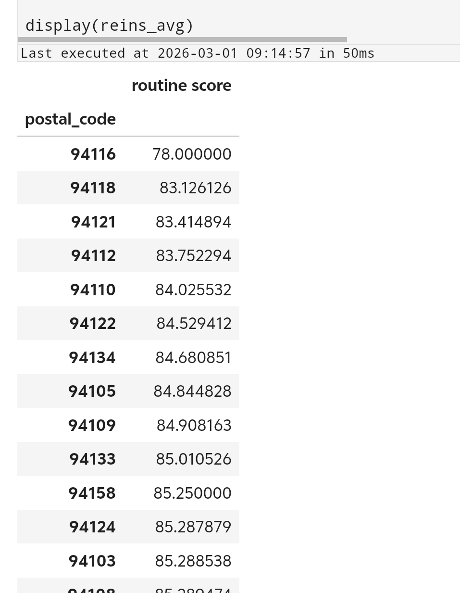

至于更复杂的方法，本来打算折腾的，然而在data100上拖的时间太久了，只能被迫鸽了。

