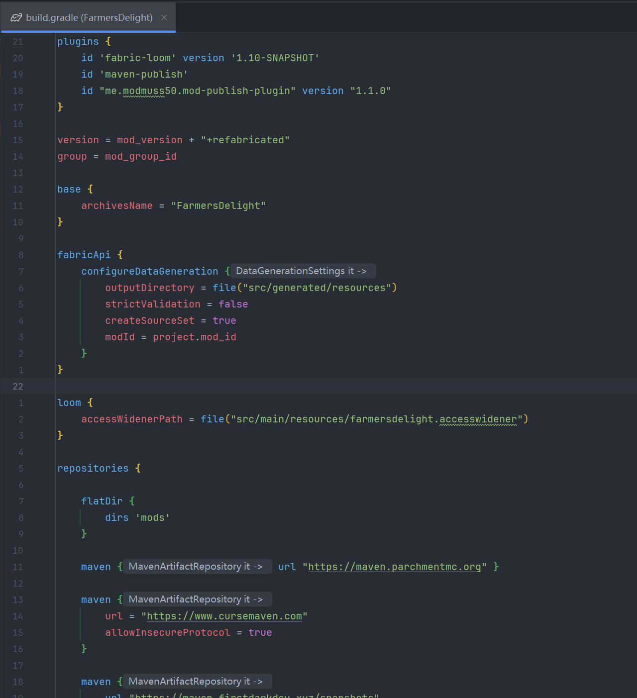
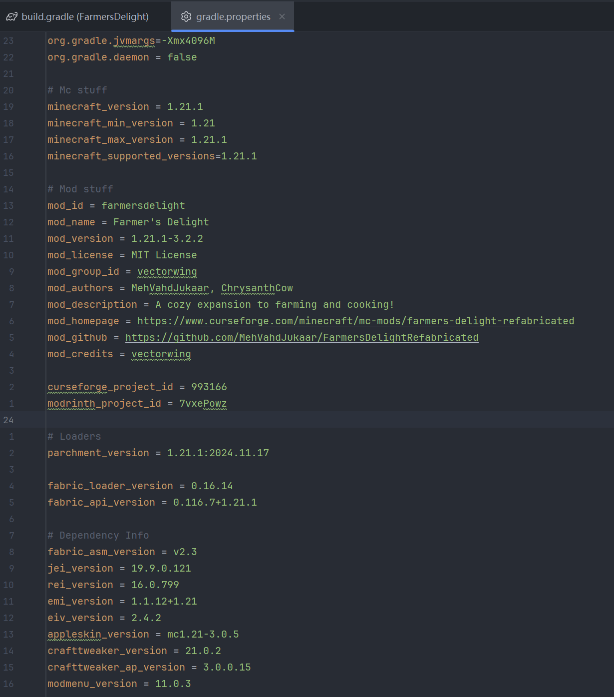
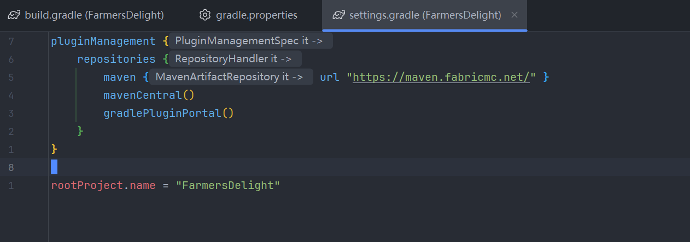

我一直很想做mc模组，但是奈何java开发经验约等于0。今天终于决定开始认真研究fabric模组开发，之后也应该会一直更新fabric学习笔记。

程序员森呸们都说，读代码就是学习写代码最好的方式，于是今天第一弹先来研究一下FarmersDelightRefabricated的文件结构与代码组成。FarmersDelightRefabricated即农夫乐事：重织版，是经典模组农夫乐事的fabric端移植版。

🔗参考链接：

[FarmersDelightRefabricatedGithub主页](https://github.com/MehVahdJukaar/FarmersDelightRefabricated)

[fabric文档](https://docs.fabricmc.net/develop/)

[mcmod页面](https://www.mcmod.cn/class/14196.html)

---

## 文件结构

```sh
📁 .
├── 📁 build
│   ├── 📁 classes
│   ├── 📁 datagen
│   ├── 📁 generated
│   ├── 📁 loom-cache
│   ├── 📁 reports
│   ├── 📁 resources
│   └── 📁 tmp
├── 📄 build.gradle
├── 📄 changelog.md
├── 📁 gradle
│   └── 📁 wrapper
├── 📄 gradle.properties
├── 📄 gradlew
├── 📄 gradlew.bat
├── 📄 LICENSE
├── 📄 README.md
├── 📁 run
│   ├── 📁 config
│   ├── 📁 data
│   ├── 📁 downloads
│   ├── 📁 logs
│   ├── 📁 mods
│   ├── 📄 options.txt
│   ├── 📁 resourcepacks
│   ├── 📁 resources
│   ├── 📁 saves
│   └── 📄 usercache.json
├── 📄 settings.gradle
└── 📁 src
    ├── 📁 generated
    └── 📁 main
```

如上是进入根目录后`lt -L 2`得到的，所以并没有展开到底，大多数代码文件都没有被包含在以上展示的内容中。不过我们可以先来就此分析一下一个fabric模组的主体结构。

### Gradle构建文件

决定了项目如何编译以及有哪些依赖。

#### Gradle文件：`build.gradle`

最核心的文件，定义了一个模组的版本、名称、依赖关系、服务端还是客户端等基本信息。



#### Gradle文件：`gradle.properties`

配置文件，存放Minecraft版本、模组基本信息、fabric loader版本、依赖模组的名称和版本。



#### Gradle文件：`settings.gradle`

定义项目名称。



#### Gradle文件：`gradlew & gradlew.bat`

一键编译模组的脚本。运行`./gradlew build`后即使电脑上没有安装gradle也可以编译。

#### Gradle文件：`gradle/wrapper`

存放让上面的脚本可以正常工作的小程序。

---

### src源文件

#### 核心目录：`src/main`

模组的主体，包含所有.java代码以及贴图、模型等资源。

```sh
📁 .
├── 📁 java
│   └── 📁 vectorwing
│       └── 📁 farmersdelight
│           ├── 📁 client
│           ├── 📁 common
│           ├── 📁 data
│           ├── ☕ FarmersDelight.java
│           ├── 📁 integration
│           └── 📁 refabricated
└── 📁 resources
    ├── 📁 assets
    │   ├── 📁 emi
    │   │   └── 📁 recipe
    │   └── 📁 farmersdelight
    │       ├── 📁 atlases
    │       ├── 📁 blockstates
    │       ├── 📁 lang
    │       ├── 📁 models
    │       ├── 📁 particles
    │       ├── 📁 sounds
    │       ├── 📄 sounds.json
    │       └── 📁 textures
    ├── 📁 data
    │   └── 📁 farmersdelight
    │       ├── 📁 create
    │       ├── 📁 damage_type
    │       ├── 📁 loot_modifiers
    │       ├── 📁 loot_table
    │       ├── 📁 neoforge
    │       ├── 📁 recipe
    │       ├── 📁 scripts
    │       ├── 📁 structure
    │       ├── 📁 tags
    │       ├── 📁 weapon_attributes
    │       └── 📁 worldgen
    ├── 📄 fabric.mod.json
    ├── 📄 farmersdelight.accesswidener
    ├── 📄 farmersdelight.mixins.json
    └── 🖼️ icon.png
```

#### java目录：`src/main/java`

所有的Java代码所在地。

#### 素材资源目录：`src/main/resources`

素材所在地。

- `src/main/resources/assets`存放贴图、模型、语言、声音文件。
- `src/main/resources/data`存放合成表、战利品、标签。
- `src/main/resources/fabric.mod.json`记录模组id、名称、入口类等。

---

#### 生成资源目录：`src/generated`

使用代码生成的游戏数据。

```sh
📁 .
└── 📁 resources
    └── 📁 data
        ├── 📁 c
        │   └── 📁 tags
        ├── 📁 create
        │   └── 📁 tags
        ├── 📁 createaddition
        │   └── 📁 tags
        ├── 📁 farmersdelight
        │   ├── 📁 advancement
        │   ├── 📁 enchantment
        │   ├── 📁 loot_table
        │   ├── 📁 recipe
        │   └── 📁 tags
        ├── 📁 minecraft
        │   └── 📁 tags
        ├── 📁 neoforge
        │   ├── 📁 data_maps
        │   └── 📁 tags
        ├── 📁 origins
        │   └── 📁 tags
        ├── 📁 sereneseasons
        │   └── 📁 tags
        └── 📁 tconstruct
            └── 📁 tags
```

以上是`src/generated`目录下的4级文件树，仍然没有展开到底。展开到底后是各种.json文件。

---

### run

当你点击 IDE 里的“运行游戏”时，它会把这里当成一个独立的 Minecraft 根目录。

#### 存档目录：<big>`run/saves`</big>

存档。

#### 运行日志目录：<big>`run/logs`</big>

崩溃或调试时的日志。

#### 配置目录：<big>`run/config`</big>

模组配置文件，可以包含本模组以及独立根目录的其他模组的测试文件。

#### 模组目录：<big>`run/mods`</big>

调试时想要加载的其他模组，比如jei。

```sh
📁 .
├── 📁 config
│   ├── 📁 fabric
│   │   └── 📄 indigo-renderer.properties
│   ├── 📄 farmersdelight-client.json
│   ├── 📄 farmersdelight-common.json
│   └── 📄 modmenu.json
├── 📁 data
│   └── 📄 fabricDefaultResourcePacks.dat
├── 📁 downloads
│   └── 📄 log.json
├── 📁 logs
│   ├──  debug.log
│   ├──  latest.log
│   └── 📁 telemetry
├── 📁 mods
├──  options.txt
├── 📁 resourcepacks
├── 📁 resources
├── 📁 saves
│   └── 📁 'New World'
│       ├── 📁 advancements
│       ├── 📁 data
│       ├── 📁 datapacks
│       ├── 📁 DIM-1
│       ├── 📁 DIM1
│       ├── 📁 entities
│       ├── 🖼️ icon.png
│       ├── 📄 level.dat
│       ├── 📄 level.dat_old
│       ├── 📁 playerdata
│       ├── 📁 poi
│       ├── 📁 region
│       ├── 🔒 session.lock
│       └── 📁 stats
└── 📄 usercache.json
```

---

### 编译产物build

每次编译后gradle自动生成的文件夹，存放编译时的各种临时文件。此文件夹可以随时删除，下次编译的时候会自动生成。

---

# 如何正确地看待一个fabric模组的文件结构？

从上面的简要分析中，你会意识到一个问题：即使是一个看起来其貌不扬的模组，它的文件结构也复杂到了相当逆天的水平。对于我们这种人类程序员来说，我们很难做到手动修改每一个地方来实现功能。一个正常的想法是：这样的模组项目真的是人能组织起来的？

答案是还真不是，这就是java带给我的自信。真实情况是：一个fabric模组看起来结构非常复杂，但是对于其中的绝大多数文件，你其实根本无需去改动。

- **Gradle文件**：除非你要修改版本号或者添加依赖，否则基本无需修改。
- **"."开头的隐藏文件**：无视。
- **src/main**：实际的工作区，这里的文件才是你创造的。

所以，一个模组开发者眼里应该只有两条路：

> 1. **src/main/java**: 编写**逻辑**的地方（方块怎么运作、按键有什么反应）。
> 2. **src/main/resources**: 存放**数据**的地方（方块长什么样、叫什么名字、材质贴图）。

如果你想添加一个东西：

> 先思考怎么注册。

如果你想添加json（配方、loot、模型）：

> 使用Data generation系统。

如果你想修改原版机制：

> 使用mixin。

---

# 举个例子01

> （站在FarmersDelightRefabricated开发者视角）我想做一个厨锅。

## Q1：厨锅是一个方块，但是对于厨锅物品，我有必要自己去写“检测右键、计算坐标、放置方块”等方块的基本属性吗？

答案：不需要。因为Minecraft所有的**背包里的**方块都是`BLockItem`的实例。你只需要继承自`BLockItem`就可以自动获得它的一切特征。

所以，我（开发者）先在`/src/main/java/xxx/farmersdelight/common/item/`目录下新建一个`CookingPotItem.java`，然后写入：

```java
package vectorwing.farmersdelight.common.item;
```

再写入：

```java
public class CookingPotItem extends BlockItem
```

代表`CookingPotItem`直接继承自`BlockItem`。

## Q2：物品可以有一个绿色的条（bar）来表示耐久。我的厨锅没有耐久，但是我也想用这个bar来表示里面装了多少饭，怎么实现呢？

答案：劫持原版的原版的ui机制，让它直接为自己服务。从本质上来说，是原版的代码提供了接口类，使得程序员可以将自己的特殊实现塞进去。

我（开发者）：我希望我的厨锅条有以下逻辑：

### 1. 只在厨锅内部装了东西的时候才显示

所以我写：

```java
 @Override
 public boolean isBarVisible(ItemStack stack) {
  return getServingCount(stack) > 0;
 }
```

### 2. Bar的长度能反映内部装了多少东西

所以我写：

```java
 @Override
 public int getBarWidth(ItemStack stack) {
  return Math.min(1 + 12 * getServingCount(stack) / 64, 13);
 }
```

## 3. 不管里面装了多少东西，Bar都只是蓝色的

所以我写：

```java
 @Override
 public int getBarColor(ItemStack stack) {
  return BAR_COLOR;
 }
```

## Q3：我想

先别急，接下来能做的事情已经不是仅凭写这个java代码就能完成的了。我（开发者）意识到我做的东西是一个方块，而一个方块远远不止是一个物品栏中的物品那么简单。

我（开发者）还需要做这些事情：

1. 注册。我只是写了**厨锅作为物品存在时的部分属性**，我需要让这个厨锅**存在**。
2. 处理它的**方块属性**。我需要在`/src/main/java/xxx/farmersdelight/common/block/`下写点什么。
3. 添加tooltip。我需要在`/src/main/java/xxx/farmersdelight/client/`下写点什么。
4. ...

所以，我（开发者）写了：

```sh
  8192 B                   ┌─ ☕ CookingPotRecipeBuilder.java
  8192 B                ┌─ 📁 builder
  8192 B             ┌─ 📁 data
  4096 B             │     ┌─ ☕ CookingPotRecipeBookTab.java
  4096 B             │  ┌─ 📁 recipebook
  4096 B             │  │  ┌─ ☕ CookingPotRecipeBookComponent.java
  4096 B             │  │  ├─ ☕ CookingPotTooltip.java
  8192 B             │  │  ├─ ☕ CookingPotScreen.java
 16384 B             │  ├─ 📁 gui
 20480 B             ├─ 📁 client
  4096 B             │        ┌─ ☕ CookingPotEmiRecipeHandler.java
  4096 B             │     ┌─ 📁 handler
  8192 B             │     │  ┌─ ☕ CookingPotEmiRecipe.java
  8192 B             │     ├─ 📁 recipe
 12288 B             │  ┌─ 📁 emi
  4096 B             │  │     ┌─ ☕ CookingPotDisplay.java
  4096 B             │  │  ┌─ 📁 display
  8192 B             │  │  │  ┌─ ☕ CookingPotCategory.java
  8192 B             │  │  ├─ 📁 categories
 12288 B             │  ├─ 📁 rei
  4096 B             │  │  ┌─ ☕ CTCookingPotRecipeBookTab.java
  8192 B             │  │  │  ┌─ ☕ CookingPotRecipeHandler.java
  8192 B             │  │  ├─ 📁 handlers
  8192 B             │  │  │  ┌─ ☕ CookingPotRecipeManager.java
  8192 B             │  │  ├─ 📁 managers
 20480 B             │  ├─ 📁 crafttweaker
 45056 B             ├─ 📁 integration
  4096 B             │     ┌─ ☕ CookingPotItem.java
  4096 B             │  ┌─ 📁 item
  8192 B             │  │  ┌─ ☕ CookingPotRecipe.java
  8192 B             │  ├─ 📁 crafting
     0 B             │  │     ┌─ ☕ CookingPotSupport.java
       -             │  │  ┌─ 📁 state
 12288 B             │  │  ├─ ☕ CookingPotBlock.java
  8192 B             │  │  │     ┌─ ☕ CookingPotItemHandler.java
  8192 B             │  │  │  ┌─ 📁 inventory
     0 B             │  │  │  │  ┌─ ☕ CookingPotMealSlot.java
  4096 B             │  │  │  │  ├─ ☕ CookingPotResultSlot.java
  8192 B             │  │  │  │  ├─ ☕ CookingPotMenu.java
 12288 B             │  │  │  ├─ 📁 container
 24576 B             │  │  │  ├─ ☕ CookingPotBlockEntity.java
 45056 B             │  │  ├─ 📁 entity
 57344 B             │  ├─ 📁 block
 69632 B             ├─ 📁 common
143360 B          ┌─ 📁 farmersdelight
143360 B       ┌─ 📁 vectorwing
143360 B    ┌─ 📁 java
143360 B ┌─ 📁 main
143360 B 📁 src
```

我们先暂时不尝试完全理解每个文件在干什么，但是一个很明显的特征，所有的这些文件无一例外存放在`src/main/java/vectorwing/farmersdelight/`中。所以，尽管看起来文件很复杂，你只需要知道一点：每一个java文件的功能就是做好一件事，有的负责处理物品逻辑，有的负责处理方块逻辑，有的负责处理物品槽逻辑，等等。

所谓的文件目录，本质上就是对于java模块按照功能进行分类。这样看来，一个java模组的结构就一目了然了。程序员只需要事先思考好要实现的东西是什么，有哪些功能，如何分类这些功能，一个模组的文件结构就建立起来了。

回到`CookingPotItem.java`，完整版如下：

```java
package vectorwing.farmersdelight.common.item;

import net.minecraft.core.component.DataComponents;
import net.minecraft.nbt.CompoundTag;
import net.minecraft.util.Mth;
import net.minecraft.world.inventory.tooltip.TooltipComponent;
import net.minecraft.world.item.BlockItem;
import net.minecraft.world.item.ItemStack;
import net.minecraft.world.item.component.CustomData;
import net.minecraft.world.level.block.Block;
import vectorwing.farmersdelight.client.gui.CookingPotTooltip;
import vectorwing.farmersdelight.common.block.entity.CookingPotBlockEntity;

import java.util.Optional;

public class CookingPotItem extends BlockItem
{
 private static final int BAR_COLOR = Mth.color(0.4F, 0.4F, 1.0F);

 public CookingPotItem(Block block, Properties properties) {
  super(block, properties);
 }

 @Override
 public boolean isBarVisible(ItemStack stack) {
  return getServingCount(stack) > 0;
 }

 @Override
 public int getBarWidth(ItemStack stack) {
  return Math.min(1 + 12 * getServingCount(stack) / 64, 13);
 }

 @Override
 public int getBarColor(ItemStack stack) {
  return BAR_COLOR;
 }

 @Override
 public Optional<TooltipComponent> getTooltipImage(ItemStack stack) {
  ItemStack mealStack = CookingPotBlockEntity.getMealFromItem(stack);
  return Optional.of(new CookingPotTooltip.CookingPotTooltipComponent(mealStack));
 }

 private static int getServingCount(ItemStack stack) {
  ItemStack mealStack = CookingPotBlockEntity.getMealFromItem(stack);
  return mealStack.getCount();
 }
}
```

## Q4：为什么不讲import部分？

import是ide的事情，程序员很难也没必要自己去写import。

## Q5：后面两个没讲的方法是做什么的？

分别是用来处理tooltip信息和内部物品信息。因为会牵扯到其他java模块，所以暂时不讨论。
