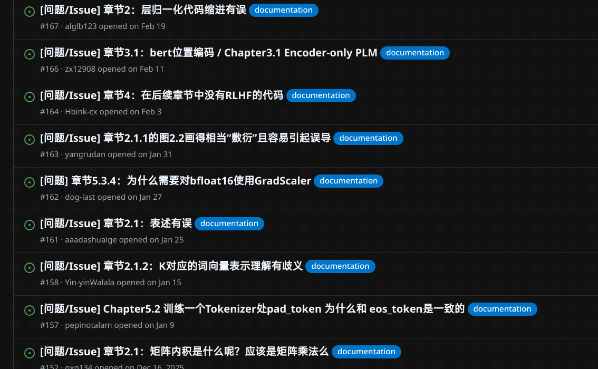
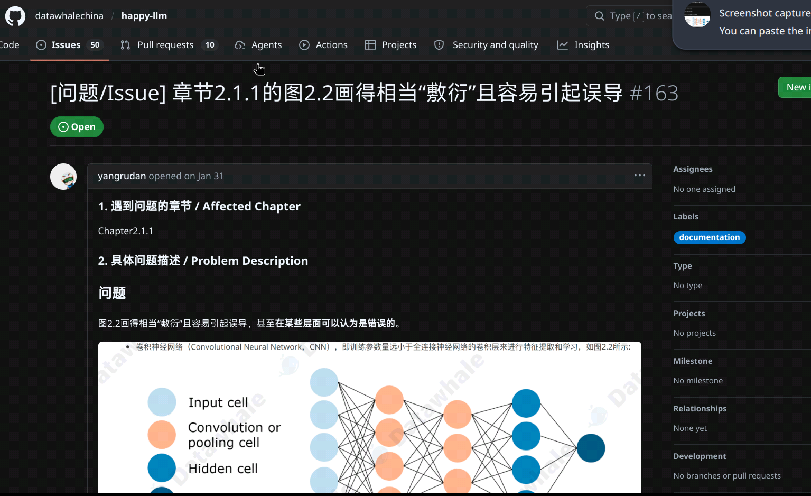
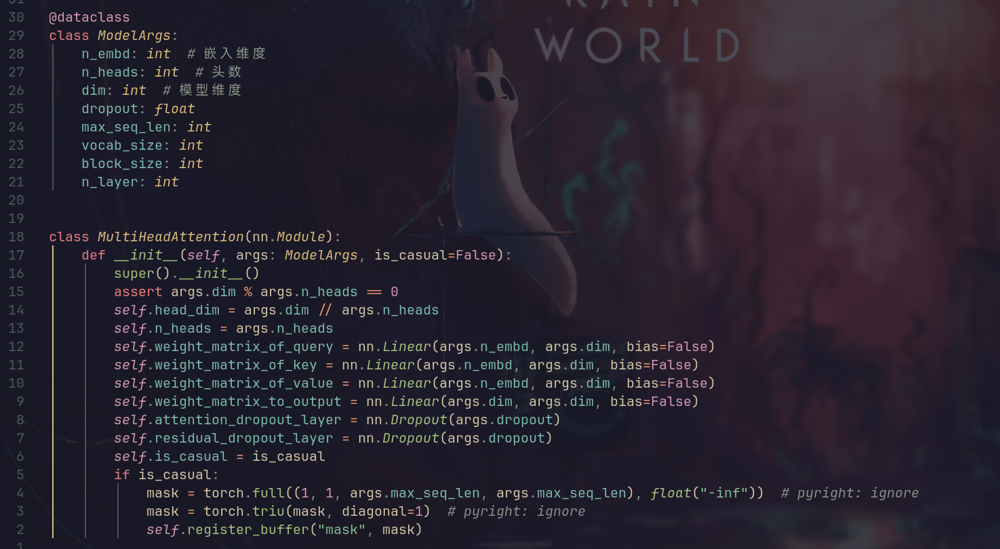
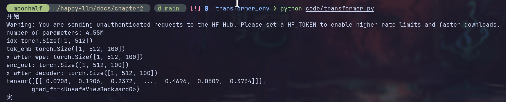
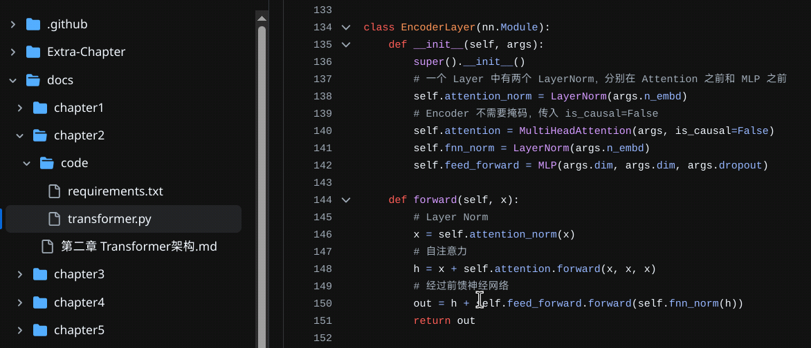
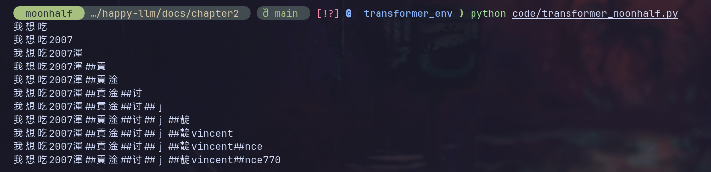

# 前言

在我导推荐了几个月之后终于开坑happy-llm，之后可能还会开CS336的坑。

我个人的写作习惯是倾向于认为文字应该越易懂越好，所以学术性以及数学性可能相对欠缺。

本篇要素如下：

- nlp基本概念
- Transformer架构
  - 注意力机制
    - 多头注意力
    - 掩码自注意力
  - encoder
  - decoder
  - embedding
  - 位置编码

# 参考链接

[github](https://github.com/datawhalechina/happy-llm/tree/main)

# 环境准备

[参考链接](https://github.com/datawhalechina/happy-llm/blob/main/docs/%E5%AD%A6%E4%B9%A0%E4%B8%8E%E7%8E%AF%E5%A2%83%E5%87%86%E5%A4%87.md)

Happy-LLM以教程阅读为主，代码实践为辅。课程设计者建议按照章节分别准备依赖。（然而python的科学计算库经常出现各种各样的环境依赖问题，建议直接给claude code提需求让它给你配环境）

# 第一章 NLP 基本概念

> 注：本章纯概念性文本，copy了一些纲要性的内容。知道什么是nlp的可以直接跳过。

NLP，即**N**atural **L**anguage **P**rocessing，表示自然语言处理，是一种让计算机理解、解释和生成人类语言的技术。

NLP的任务如下：

- 中文分词。中文没有像英文那样的分隔，所以需要额外的步骤将连续的中文文本划分为有意义的词汇序列。

```sh
输入：雍和宫的荷花开的很好。

正确切割：雍和宫 | 的 | 荷花 | 开 | 的 | 很 | 好 | 。
错误切割 1：雍 | 和 | 宫的 | 荷花 | 开的 | 很好 | 。 （地名被拆散）
错误切割 2：雍和 | 宫 | 的荷 | 花开 | 的很 | 好。 （词汇边界混乱）
```

- 子词划分，将词汇进一步划分为更小的单位。
- 词性标注，为每个单词分配一个词性标签。
- 文本分类，将文本自动分配给若干个预定义的类别中。
- 实体识别，自动识别文本中具有特定意义的实体，并分类为预定义的标签。
- 关系抽取，识别实体之间的语义关系。
- 文本摘要，生成一段简洁准确的摘要，来概括原文的主要内容。
- 机器翻译，使用计算机程序将一种自然语言（源语言）自动翻译成另一种自然语言（目标语言）。
- 自动问答，使计算机能够理解自然语言提出的问题，并根据给定的数据源自动提供准确的答案。

文本表示的目的是将人类语言的自然形式转化为计算机可以处理的形式。在 NLP 中，文本表示涉及到将文本中的语言单位（如字、词、短语、句子等）以及它们之间的关系和结构信息转换为计算机能够理解和操作的形式，例如向量、矩阵或其他数据结构。

一种基础且强大的文本表示方法为向量空间模型，将文本转换为高维空间中的向量来实现文本的数学化表示。

N-gram是一种基于统计的语言模型。核心思想是基于马尔可夫假设，即一个词的出现概率仅依赖于它前面的N-1个词。这里的N代表连续出现单词的数量，可以是任意正整数。例如，当N=1时，模型称为unigram，仅考虑单个词的概率；当N=2时，称为bigram，考虑前一个词来估计当前词的概率；当N=3时，称为trigram，考虑前两个词来估计第三个词的概率，以此类推N-gram。

N-gram的优点是实现简单、容易理解，在许多任务中效果不错。尽管存在局限性，N-gram模型由于其简单性和实用性，在许多 NLP 任务中仍然被广泛使用。在某些应用中，结合N-gram模型和其他技术（如深度学习模型）可以获得更好的性能。

Word2Vec是一种流行的词嵌入（Word Embedding）技术，由Tomas Mikolov等人在2013年提出。它是一种基于神经网络NNLM的语言模型，旨在通过学习词与词之间的上下文关系来生成词的密集向量表示。

相比于传统的高维稀疏表示（如One-Hot编码），Word2Vec生成的是低维（通常几百维）的密集向量，有助于减少计算复杂度和存储需求。Word2Vec模型能够捕捉到词与词之间的语义关系，比如”国王“和“王后”在向量空间中的位置会比较接近，因为在大量文本中，它们通常会出现在相似的上下文中。

ELMo（Embeddings from Language Models）实现了一词多义、静态词向量到动态词向量的跨越式转变。首先在大型语料库上训练语言模型，得到词向量模型，然后在特定任务上对模型进行微调，得到更适合该任务的词向量。

# 第二章：Transformer架构

> 注：本章节的代码实现和文档介绍有**相当多的疏漏**，并且代码规范比较难评（光是示例代码的变量命名就给我看力竭了，我后续的代码示例重新用相对清晰的变量命名重写了一遍）。我尽可能多的参考了issue来减少错误，但是不保证完全正确。



```bash
conda create -n transformer_env python=3.10
conda run -n transformer_env pip install torch --index-url https://download.pytorch.org/whl/cu128
conda run -n transformer_env pip install transformers
conda run -n transformer_env pip install 'httpx[socks]'
```

环境配置如上，直接使用happy-llm的requirements.txt会遇到一些小问题，如果你有网络代理的话需要安装httpx\[socks]才能正常从huggingface上下载模型。

从 计算机视觉（Computer Vision，CV）为起源发展起来的神经网络，其核心架构有三种（经典首字母缩写）：前馈神经网络FNN（Feedforward Neural Network）（以多层感知机为最常见的形式）、卷积神经网络CNN（Convolutional Neural Network）、循环神经网路RNN（Recurrent Neural Network？）


此处注意：



详见[此链接](https://github.com/datawhalechina/happy-llm/issues/163)，因为不是本章节重点所以本文暂时略过。


> RNN以及RNN的衍生架构LSTM具有捕捉时序信息、适合序列生成的优点，然而具有限制计算机并行计算能力、难以捕捉长序列相关关系的缺点。

> 针对这样的问题，Vaswani 等学者参考了在 CV 领域被提出、被经常融入到 RNN 中使用的注意力机制（Attention）（注意，虽然注意力机制在 NLP 被发扬光大，但其确实是在 CV 领域被提出的），创新性地搭建了完全由注意力机制构成的神经网络——Transformer，也就是大语言模型（Large Language Model，LLM）的鼻祖及核心架构，从而让注意力机制一跃成为深度学习最核心的架构之一。

（直接copy了happy-llm的原文，感觉没有什么能精简的。）

（依旧copy）

> 注意力机制有三个核心变量：**Query**（查询值）、**Key**（键值）和 **Value**（真值）。我们可以通过一个案例来理解每一个变量所代表的含义。例如，当我们有一篇新闻报道，我们想要找到这个报道的时间，那么，我们的 Query 可以是类似于“时间”、“日期”一类的向量（为了便于理解，此处使用文本来表示，但其实际是稠密的向量），Key 和 Value 会是整个文本。通过对 Query 和 Key 进行运算我们可以得到一个权重，这个权重其实反映了从 Query 出发，对文本每一个 token 应该分布的注意力相对大小。通过把权重和 Value 进行运算，得到的最后结果就是从 Query 出发计算整个文本注意力得到的结果。

（以下是我对attention的一些很可能不太正确的理解）

现在，我们手头有一个Query代表我们的问题，又有一大堆Key分别映射到Value。我们希望通过一些奇妙的方法，来获取Query的“解答”。

我的一个理解是：解答的本质就是获取Query在Values中的语境义。

比如，Values为`The apple is tasty, I like it`，Keys为每个词的语法标签，此时我们抛出一个Query：`it`。我们期待获取什么样的结果呢？注意，此处的每个词在程序中的存在形式都是词向量。作为人类读者，我们知道此处`it`是指`apple`，所以我们会希望得到一个和apple高度相似的词向量。本质上我们就是在找it在这句话中的语境义。

那么，怎么实现呢？此处，Query、Key以及Value都是词向量，因此我们可以比较他们的差距：我们直接求Q和K的点积，并认为点积的数值即代表了两者之间的语义相似程度。其中Q是查询值矩阵，第一维度是token，第二维度是每个token的语义向量；K，V同理。对所有key求取语义相似程度，之后通过softmax转换为和为1的权重，我们就得到了注意力机制的基本公式：
$$
attention(Q,K,V) = softmax(qK^T)v
$$
以上公式经过一些变形可以得到实际使用的注意力公式：
$$
attention(Q,K,V) = softmax(\frac{QK^T}{\sqrt{d_k}})V
$$
其中$QK^T$算出的矩阵中$[i, j]$处的元素表示第$i$个Query与第$j$个Key之间的相似程度，即该矩阵描述了每个Query与每个Key之间的相似程度。

因此，$QK^T$中每一列对应于相同的Key，每一个行对应于相同的Query，而$V$中每一行对应于一个Value，每一列元素代表一种语义特征。

根据矩阵的运算规律，我们可以将attention最终结果第$i$行行向量的意义描述如下：该行对应于第$i$个Query，其中第$j$个元素表示的是一个语义特征大小，该语义特征大小是由**每个Value的此语义的特征数值大小，乘以对应Key与第i个Query之间相似程度，算得的积求和**得到的。

换言之，我们以Query和Key之间的相似程度为权重求取了对应的Value的加权均值，得到了一个融合Value，我们可以认为：这个融合Value在一定程度上代表了Query在Values中的语境义。

> 之所以分母有个$\sqrt{ d_{k} }$，原因是$qk^T$结果的每个乘积项都是一个随机数。我们假设一开始$q, k$的每个元素均服从均值为0，方差为1的分布，则$q_{i}\cdot k_{i}$也满足均值为0，方差为1（注意这是向量点乘，结果是一个标量）。这就使得$qk^T$这一点乘结果的方差变成了$d_{k}$。此时使方差回归到1的措施就是对其除以标准差。

```python
'''注意力计算函数'''
def attention(query, key, value, dropout=None):
    '''
    args:
    query: 查询值矩阵
    key: 键值矩阵
    value: 真值矩阵
    '''
    # 获取键向量的维度，键向量的维度和值向量的维度相同
    d_k = query.size(-1) 
    # 计算Q与K的内积并除以根号dk
    # transpose——相当于转置
    scores = torch.matmul(query, key.transpose(-2, -1)) / math.sqrt(d_k)
    # Softmax
    p_attn = scores.softmax(dim=-1)
    if dropout is not None:
        p_attn = dropout(p_attn)
        # 采样
     # 根据计算结果对value进行加权求和
    return torch.matmul(p_attn, value), p_attn
```

以上算法能工作的基础就在于：我们认为词向量的每个维度确实能代表一个语义特征，并且存在某种线性关系，比如某个维度表示一个词的“水果程度”，该数值越大，该词语义与水果越有关。并且我们相信总能通过若干个

因此，我们实际上需要先转换对“词” 的理解方式：我们用词向量的方式展开了一个词的语义，因此我们需要认为词向量才是对语义的绝对正确描述，字面意义的词只不过是一个符号。而又因为是词“向量“，所以向量的所有运算法则同样适用于词向量，也就同样适用于对于自然语言语义的描述。

### 自注意力

如我们前文所提到的，attention将query计算为了融入语境的新向量。当我们想要处理一段自然语言文本，而我们初始状况下只知道每个词最泛化的含义（经过embedding层得到），此时我们就可以以这段文本自身同时作为Query、Key和Value来计算attention，算出每个字在本文段中具体的语境义。

> 通过自注意力机制，我们可以找到一段文本中每一个 token 与其他所有 token 的相关关系大小，从而建模文本之间的依赖关系。​在代码中的实现，self-attention 机制其实是通过给 Q、K、V 的输入传入同一个参数实现的：

```python
# attention 为上文定义的注意力计算函数
attention(x, x, x)
```

transformer中的自注意力还需要掩码自注意力的技巧，后面会提及。

### 多头注意力

词向量的维度非常的多，而我们希望经过训练后，这些维度会分化从而可以表示不同的语义特征，因此，假如我们直接将Query和Key在所有维度上求匹配程度并据此计算融合的Value，本质上我们对于所有特征的重视程度是相同的，但是事实上我们完全有理由认为不同特征对于结果的贡献在不同的情景下可能不同。因此，我们需要一些方法在适当的情况下对一些特征更加重视，而在另一些情况下对另一些特征更加重视。

所以，实现措施非常简单：我们把特征向量的维度分成几块，分别计算注意力，之后再把所有注意力结果拼起来，过一个线性层。让线性层负责学习什么情景下对哪些特征更加重视。

```python
@dataclass
class ModelArgs:
    n_embd: int  # 嵌入维度
    n_heads: int  # 头数
    dim: int  # 模型维度
    dropout: float
    max_seq_len: int
    vocab_size: int
    block_size: int
    n_layer: int


class MultiHeadAttention(nn.Module):
    def __init__(self, args: ModelArgs, is_causal=False):
        super().__init__()
        assert args.dim % args.n_heads == 0
        self.head_dim = args.dim // args.n_heads
        self.n_heads = args.n_heads
        self.weight_matrix_of_query = nn.Linear(args.n_embd, args.dim, bias=False)
        self.weight_matrix_of_key = nn.Linear(args.n_embd, args.dim, bias=False)
        self.weight_matrix_of_value = nn.Linear(args.n_embd, args.dim, bias=False)
        self.weight_matrix_to_output = nn.Linear(args.dim, args.dim, bias=False)
        self.attention_dropout_layer = nn.Dropout(args.dropout)
        self.residual_dropout_layer = nn.Dropout(args.dropout)
        self.is_causal = is_causal
        if is_causal:
            mask = torch.full((1, 1, args.max_seq_len, args.max_seq_len), float("-inf"))  # pyright: ignore
            mask = torch.triu(mask, diagonal=1)  # pyright: ignore
            self.register_buffer("mask", mask)

```



以上是构造函数部分。`is_causal`表示掩码注意力，我们过会再说。

不理解其中的内容也没关系，我们来逐段分析`forward()`方法。

```python
def forward(self, query: torch.Tensor, key: torch.Tensor, value: torch.Tensor):
 batch_size, sequence_length, _ = query.shape

 x_query = self.weight_matrix_of_query(query)
 x_key = self.weight_matrix_of_key(key)
 x_value = self.weight_matrix_of_value(value)

 x_query = x_query.view(batch_size, sequence_length, self.n_heads, self.head_dim)
 x_key = x_key.view(batch_size, sequence_length, self.n_heads, self.head_dim)
 x_value = x_value.view(batch_size, sequence_length, self.n_heads, self.head_dim)

 x_query = x_query.transpose(1, 2)
 x_key = x_key.transpose(1, 2)
 x_value = x_value.transpose(1, 2)
```

在注意力计算之前，我们先分别对Query、Key和Value过一个线性层，原因在于我们有理由认为对于Query、Key以及Value的处理方式需要有所区别（比如同样是`apple`，我们可能会希望Key更倾向于描述特征供人检索，Query侧重描述正在搜索的内容，Value则侧重描述本词的语义），而我们希望让模型通过学习学到这个区别。经过三个不同的线性层，我们得到了x_query、x_key以及x_value。

其中Query、Key和Value在输入的时候都是一个三维张量：第一维度是batch，表示批次，原因在于我们会希望并行计算多个请求；第二维度是词序列，第三个维度是词的词向量。

在此之后，我们将它们通过`torch.view`分别转换为另一种视图（内存上保持不变，但是形式上变成其他形状的tensor）：第一维度长batch_size，依然表示各个批次；第二维度依然表示词序列。而对于词向量，我们知道词向量的每个维度表示不同的语义特征，而我们希望进行多头注意，所以我们将词向量分块，第三维度表示分块数，也就是各个注意力头，第四维度表示每个注意力头所处理的语义特征区间。

转换视图后，对调词序列维度与分头维度`transpose(1, 2)`。这么做的原因在于，如我们介绍attention时所分析的，计算Query和Key的相似程度本质上就是求$QK^T$，而推导时我们假设$Q$和$K$均为二维矩阵，第一维度是词序列，第二维度是词向量。因此，此处转置将词序列和词向量调整到最后两个维度，方便后期进行矩阵乘法。

> pytorch中`torch.matmul()`只对最后两个维度做矩阵乘法，前面的维度全部看作批次。

```python
attention_scores = (torch.matmul(x_query, x_key.transpose(2, 3))) / math.sqrt(self.head_dim) 
attention_scores = F.softmax(attention_scores.float(), dim=-1).type_as(x_query)
attention_scores = self.attention_dropout_layer(attention_scores)
output = torch.matmul(attention_scores, x_value)
```

以上代码实现注意力公式$attention(Q,K,V) = softmax(\frac{QK^T}{\sqrt{d_k}})V$，推导参考前文。其中对注意力权重额外进行了dropout，用于避免过拟合。

现在我们得到了`output`，这是一个第一维度为批次，第二维度为注意力头，第三维度对应的词序列，第四维度为融合的Value的Tensor。但是我们希望得到的结果是**第二维度为词序列，第三维度为融合value，不再有第四维度**。因此，接下来我们需要将不同注意力头的结果进行整合。

整合方式很简单，我们先把二三维度转置回去，第二维度恢复为词序列，第三维度恢复为注意力头，之后直接通过`torch.view`转换视图把三四维度拍平为一个维度，再过一个线性层，我们就得到了最后的结果。

```python
output = (
 output.transpose(1, 2).contiguous().view(batch_size, sequence_length, -1)
)
output = self.weight_matrix_to_output(output)
output = self.residual_dropout_layer(output)
return output
```

线性层在机器学习中担负“学习”的职责，其他的矩阵计算都不会受到反向传播的影响，而线性层会根据结果调整自身。只要有线性层，我们就需要控制它的过拟合。因此，在多头注意力中，每个线性层输出结果在经过一系列”well formed”（可能不严谨，但是我觉得线性层相比于其他计算显的比较魔法）的计算之后，我们需要对其进行dropout来控制过拟合。

### 掩码自注意力

在自注意力的基础上使用掩码遮蔽本词之后的文本，即只在历史文本的语境下解读本词。

本质上是在说，人在说话或者写作都有一定的时序性（显然人做不到并行地说出一整句话，也做不到并行地阅读一整篇文章），这就使得自然语言组织信息有赖于前后的因果关系。

我们通过多头注意力可以算出每个词在当前语境下的语境义，某种意义上来说经过多次注意力计算，我们已经得到了“答案“。这个以词序列为第一维度、词向量为第二维度的矩阵就是我们的答案，可惜这不是人类能理解的答案。所以我们必须要将其转换为自然语言，这就意味着我们需要模仿人类的时序性思维。

但模仿这种时序性思维并不意味着我们需要放弃并行计算。多头注意力实例化中有这样的控制流：

```python
if is_causal:
 mask = torch.full((1, 1, args.max_seq_len, args.max_seq_len), float("-inf"))  # pyright: ignore
 mask = torch.triu(mask, diagonal=1)  # pyright: ignore
 self.register_buffer("mask", mask)
```

回顾前文，$QK^T$中，第$i$行的第$j$个元素表示$q_{i}$和$k_{j}^T$的点积，该元素之后会用于表示$v_{j}$在融合Value的权重。假如我们简单粗暴的省略归一化和softmax（这样抛开数量级不谈依然可以表示融合的语义），第$i$行第$j$列元素应该计算为$\sum^{n}_{t=1}q_{i}k_t{^T}v_{tj}$，其中n为词序列长度，$q_{i},k_{t}$均为行向量。

假如对于$q_{i}$我们只希望参考$j \leq i$部分的$v_{i}$，本质上我们在希望对$j > i$的部分$v_{j}$参考的权重为0，而又因为这个权重是经过softmax计算得到的，所以我们希望对应位置的注意力权重算出来是负无穷（即当$j>i时，q_{i}k_j{^T}的值应当为-inf$），这样softmax算出来才能为0。

比如，假如$QK^T$为：
$$
\begin{bmatrix}
1 & 2 & 3 \\
4 & 5 & 6  \\
7 & 8 & 9
\end{bmatrix}
$$
每个元素由Query的一个词与Key的一个词算出，因此矩阵长宽均为词序列长度。（因为是自注意力，所以Query和Key的词序列长度显然应该一致）

我们希望得到的就应该是：
$$
\begin{bmatrix}
1 &  -\infty   & -\infty \\
4 & 5 & -\infty  \\
7 & 8 & 9
\end{bmatrix}
$$
在前面的代码中，`register_buffer`的作用是表示这是一个与模型相关的张量（其他的线性层是`nn.Linear`而不是单纯的`Tensor`），会与模型一起保存和移动。我们创建了一个上三角矩阵（不含主对角线），元素为`-inf`。在之后的attention计算中，只需要给$QK^T$加上这个mask，我们就能得到想要的矩阵。

```python
scores = torch.matmul(xq, xk.transpose(2, 3)) / math.sqrt(self.head_dim)
if self.is_causal:
 assert hasattr(self, "mask")
 scores = scores + self.mask[:, :, :seqlen, :seqlen]
scores = F.softmax(scores.float(), dim=-1).type_as(xq)
scores = self.attn_dropout(scores)
output = torch.matmul(scores, xv)
```

综上，完整的注意力代码实现如下：

```python
@dataclass
class ModelArgs:
    n_embd: int
    n_heads: int
    dim: int
    dropout: float
    max_seq_len: int
    vocab_size: int
    block_size: int
    n_layer: int


class MultiHeadAttention(nn.Module):
    def __init__(self, args: ModelArgs, is_causal=False):
        super().__init__()
        assert args.dim % args.n_heads == 0
        self.head_dim = args.dim // args.n_heads
        self.n_heads = args.n_heads
        self.weight_matrix_of_query = nn.Linear(args.n_embd, args.dim, bias=False)
        self.weight_matrix_of_key = nn.Linear(args.n_embd, args.dim, bias=False)
        self.weight_matrix_of_value = nn.Linear(args.n_embd, args.dim, bias=False)
        self.weight_matrix_to_output = nn.Linear(args.dim, args.dim, bias=False)
        self.attention_dropout_layer = nn.Dropout(args.dropout)
        self.residual_dropout_layer = nn.Dropout(args.dropout)
        self.is_causal = is_causal
        if is_causal:
            mask = torch.full((1, 1, args.max_seq_len, args.max_seq_len), float("-inf"))  # pyright: ignore
            mask = torch.triu(mask, diagonal=1)  # pyright: ignore
            self.register_buffer("mask", mask)

    def forward(self, query: torch.Tensor, key: torch.Tensor, value: torch.Tensor):
        batch_size, sequence_length = query.shape

        x_query = self.weight_matrix_of_query(query)
        x_key = self.weight_matrix_of_key(key)
        x_value = self.weight_matrix_of_value(value)

        x_query = x_query.view(batch_size, sequence_length, self.n_heads, self.head_dim)
        x_key = x_key.view(batch_size, sequence_length, self.n_heads, self.head_dim)
        x_value = x_value.view(batch_size, sequence_length, self.n_heads, self.head_dim)

        x_query = x_query.tranpose(1, 2)
        x_key = x_key.tranpose(1, 2)
        x_value = x_value.tranpose(1, 2)

        attention_scores = (torch.matmul(x_query, x_key.tranpose(2, 3))) / math.sqrt(
            self.head_dim
        )
        if self.is_causal:
            assert hasattr(self, "mask")
            attention_scores = (
                attention_scores + self.mask[:, :, :sequence_length, :sequence_length]  # pyright: ignore
            )
        attention_scores = F.softmax(attention_scores.float(), dim=-1).type_as(x_query)
        attention_scores = self.attention_dropout_layer(attention_scores)
        output = torch.matmul(attention_scores, x_value)

        output = (
            output.transpose(1, 2).contiguous().view(batch_size, sequence_length, -1)
        )
        output = self.weight_matrix_to_output(output)
        output = self.residual_dropout_layer(output)
        return output
```

## Transformer

在 Transformer 中，使用注意力机制的是其两个核心组件——Encoder（编码器）和 Decoder（解码器）。在分析各部分的具体实现之前，我们不妨先来看看一个transformer的组成要素：

- Input Embedding层，将自然语言转换为词向量
  - 通过查表（没错，就是朴实无华的直接查表）由词汇编码查找对应的词向量。
  - 得到的是一个静态向量，通常代表的是一个词最笼统最泛化的意思。
  - 虽然查找表一开始是随机生成的，但可以通过训练学习到词汇语义。
- 位置编码层，为词向量添加位置信息
  - 直接往词向量叠加一个正余弦函数
    - 虽然听起来很魔法但是确实能工作。
    - 可以方便的计算词之间的相对位置。
- Encoder，由n个Encoder layer构成。
  - 每个Encoder layer包括一个注意力层和一个前馈神经网络（分别有一个前置的归一化层）。
    - 采用残差连接方式向前传播。
  - 负责将泛化的词向量根据上下语义转换为更贴合语境的词向量。在多个encoder layer中，语义随着encode的次数增加而不断建立更加深层次的联系。（莫名想到了时序电路设计中的蕴含表化简法）
- Decoder，由若干个Decoder layer组成。
  - 接受一个`[<BOS>, A, B, C]`这样的序列，返回一个`[A, B, C, <EOS>]`。最后lm-head会读取`<EOS>`位置的输出。可以看到，输出的A是依据`[<BOS>]`预测出的结果，输出的B是根据`[<BOS>, A]`预测的结果。第$i$位的输出向量，本质上是对$i+1$个词的预测。因此，我们最后只需要取最后一项就可用于预测下一个token。
  - 每个Decoder层包含两个注意力层和一个fnn层：
    - 一个掩码自注意力层，根据某词的前文调整该词向量。
    - 一个多头注意力层（注意，并非自注意力层），以encoder的输出为key和value，进一步确保所有输出结果都合乎输入语境。
- lm-head，最后的线性层。
  - 由Decoder的加工结果算出原始打分（logits，此事在triton自学日志中亦有记载）
  - 只取序列中的最后一个词计算打分，因为一次forward只输出一个token。

happy-llm中的transformer是一个极度精简的模型，不能用于自动对话，只能根据前文给出续写，尽管如此，后续的分析仍然以之为准。一次transformer的向前传播，大致可以归结为以下步骤：

- tokenizer将原始文本进行分词，将词汇替换为对应的大词表索引值
  - 直接调库
- embedding层，将大词表索引值进一步替换为词向量
- 位置编码层，注入位置信息
- encoder加工
- decoder加工
- lm-header计算最终的logits。

### 前置准备

运行happy-llm的示例代码可以得到如下结果：



其中下面日文汉字的“实”是通过"我喜欢快乐地学习大模型"续写得到的。（虽然看起来毫无关联）

经过上述分析，我们在搭建transformer之前需要先制作若干个基本元件：

- 归一化层，用于计算对数据进行归一化。让不同层输入的取值范围或者分布能够比较一致。
- 前馈神经网络，我的理解是线性层plus，比线性层更会学。
- 位置编码层，负责加入位置信息。
- embedding层

我们来依次进行实现。

#### Layer Norm

$$
\widetilde{Z_j} = \frac{Z_j - \mu_j}{\sqrt{\sigma^2 + \epsilon}}
$$
归一化的原理类似我们前面attention公式中的$\sqrt{ d_{k} }$，但是此处我们还有额外的巧思：我们有理由认为，归一化也是可以学习的，均值0方差1的归一化未必就是最好的归一化，我们选择让模型自己来学习怎么归一化最合适。（本质就是给一般的归一化又加了个线性层）

注意此处happy-llm原文表述存在问题，参考[此链接](https://github.com/datawhalechina/happy-llm/issues/122)。

```python
class LayerNorm(nn.Module):
    def __init__(self, features, eps=1e-6):
        super().__init__()
        self.a_2 = nn.Parameter(torch.ones(features))  # pyright: ignore
        self.b_2 = nn.Parameter(torch.zeros(features))  # pyright: ignore
        self.eps = eps

    def forward(self, x):
        mean = x.mean(-1, keepdim=True)  # mean: [bsz, max_len, 1]
        std = x.std(-1, keepdim=True)  # std: [bsz, max_len, 1]
        return self.a_2 * (x - mean) / (std + self.eps) + self.b_2
```

`nn.Parameter`方式声明tensor成员可以让它参与梯度计算。

#### 前馈神经网络

```python
class MLP(nn.Module):
    def __init__(self, dim: int, hidden_dim: int, dropout: float):
        super().__init__()
        self.weight_matrix_1 = nn.Linear(dim, hidden_dim, bias=False)
        self.weight_matrix_2 = nn.Linear(hidden_dim, dim, bias=False)
        self.dropout = nn.Dropout(dropout)

    def forward(self, x: torch.Tensor):
        return self.dropout(self.weight_matrix_2(F.relu(self.weight_matrix_1(x))))
```

两层线性层堆在一起，隐藏层额外加一个relu激活函数，算完后加一个dropout。本质线性层plus。

#### 位置编码层

即使有掩码注意力，并行计算仍然会导致位置信息的丢失。显然我们不会认为“我喜欢你”和“你喜欢我”是一个含义。但是显卡在矩阵计算的时候管你这那，只会关心词的语义特征而不会关心词的位置。因此，解决方案是把位置信息加入到语义向量中。

依然以“我喜欢你”为例。我们不妨这样理解：人类看待这段话的时候是把它当作有序的列表，而机器则是把它当无序的集合。

人类视角：
$$
 [我， 喜， 欢， 你]
$$
但机器认为：
$$
 \{我， 喜，欢，你\}
$$
下方是一个集合，它的元素没有顺序。

此时我们不妨思考：顺序是什么呢？或许人类视角下每个词需要按照一定的空间顺序排列，但是顺序可以是任何东西，位置可以是顺序，时间可以是顺序，甚至随便某个标号都可以表示顺序。其实顺序只不过是对于某种偏序关系的描述，至于这种关系是什么，对于计算机来说无所谓，我们只需要让相同序号的元素携带相同的某种特征，本质上就是注入了顺序信息。

如果我们想让计算机理解”我喜欢你“，不妨给每个元素加一个上标：
$$
 \{我^1， 喜^2，欢^3，你^4\}
$$
这样，即使元素无序，上标也说明了他们的顺序。这个集合显然和$\{我^4，喜^2，欢^3，你^1\}$不同。

理想的位置信息编码需要有以下特点：

- 方便对**任何长度**的文本进行编码。比如如上直接加位置索引，所有位置的字符都有编码。
- 方便计算**相对位置**。反例比如以位置为种子算随机数，虽然也能表示顺序，但是很难算相对位置。
- 最好能控制**数量级稳定**。反例就是直接加位置索引，第一个词是1，第1000个词就变成1000了。

happy-llm中给出的解决方法是使用正余弦函数进行位置编码。

$$
\begin{align}
PE(pos, 2i) = sin(pos/10000^{2i/d_{model}})\\
PE(pos, 2i+1) = cos(pos/10000^{2i/d_{model}})
\end{align}
$$
（此处happy-llm的公式疑似latex写错了，我已修正，具体表现为原文的latex公式没有begin和end导致上下公式出现了连等）

其中$pos$为一个词在句中的位置，2i或2i+1表示的是特征维度索引，奇数维度使用正弦，偶数维度使用余弦。以下照搬happy-llm的说明。

注：此处happy-llm原文表述出现错误，本文截取的是没有问题的部分。参考[本链接](https://github.com/datawhalechina/happy-llm/issues/123)。

> 我们以一个简单的例子来说明位置编码的计算过程：假如我们输入的是一个长度为 4 的句子"I like to code"，我们可以得到下面的词向量矩阵 $\rm x$ ，其中每一行代表的就是一个词向量， $\rm x_0=[0.1,0.2,0.3,0.4]$ 对应的就是“I”的词向量，它的pos就是为0，以此类推，第二行代表的是“like”的词向量，它的pos就是1：
>
> $$
\rm x = \begin{bmatrix}
0.1 & 0.2 & 0.3 & 0.4 \\
0.2 & 0.3 & 0.4 & 0.5 \\
0.3 & 0.4 & 0.5 & 0.6 \\
0.4 & 0.5 & 0.6 & 0.7
\end{bmatrix}
$$
>
> ​则经过位置编码后的词向量为：
>
> $$
\rm x_{PE} = \begin{bmatrix}
0.1 & 0.2 & 0.3 & 0.4 \\
0.2 & 0.3 & 0.4 & 0.5 \\
0.3 & 0.4 & 0.5 & 0.6 \\
0.4 & 0.5 & 0.6 & 0.7
\end{bmatrix} + \begin{bmatrix}
\sin(\frac{0}{10000^0}) & \cos(\frac{0}{10000^0}) & \sin(\frac{0}{10000^{2/4}}) & \cos(\frac{0}{10000^{2/4}}) \\
\sin(\frac{1}{10000^0}) & \cos(\frac{1}{10000^0}) & \sin(\frac{1}{10000^{2/4}}) & \cos(\frac{1}{10000^{2/4}}) \\
\sin(\frac{2}{10000^0}) & \cos(\frac{2}{10000^0}) & \sin(\frac{2}{10000^{2/4}}) & \cos(\frac{2}{10000^{2/4}}) \\
\sin(\frac{3}{10000^0}) & \cos(\frac{3}{10000^0}) & \sin(\frac{3}{10000^{2/4}}) & \cos(\frac{3}{10000^{2/4}})
\end{bmatrix} = \begin{bmatrix}
0.1 & 1.2 & 0.3 & 1.4 \\
1.041 & 0.84 & 0.41 & 1.49 \\
1.209 & -0.016 & 0.52 & 1.59 \\
0.541 & -0.489 & 0.895 & 1.655
\end{bmatrix}
$$
>
> 这样的位置编码主要有两个好处：
>
> 1. 使 PE 能够适应比训练集里面所有句子更长的句子，假设训练集里面最长的句子是有 20 个单词，突然来了一个长度为 21 的句子，则使用公式计算的方法可以计算出第 21 位的 Embedding。
> 2. 可以让模型容易地计算出相对位置，对于固定长度的间距 k，PE(pos+k) 可以用 PE(pos) 计算得到。因为 Sin(A+B) = Sin(A)Cos(B) + Cos(A)Sin(B), Cos(A+B) = Cos(A)Cos(B) - Sin(A)Sin(B)。

可以看到，注入位置信息的方法就是简单粗暴的把正余弦函数函数值加到矩阵上。对于这么做为什么能工作，我的理解是：注入位置信息其实怎么加入对于机器来说根本无所谓，因为位置信息和语义信息本质是相互独立的分布。只要是相互独立的分布，我们就有理由相信经过足够多的训练之后机器会学习到两者的独立性。而又因为绝对相位与语义本质无关，所以机器对于位置编码的理解会聚焦于相对相位差。

比如，依然是”我喜欢你“和”你喜欢我“。显然，无论这句话位于整个文段的什么位置，”我喜欢你”中“你”的位置编码相位一定超前于“我“，后者反之。而绝对位置的随机分布导致绝对相位的均值为0，因此，机器学习到了相对位置对语义的影响。

代码实现如下。位置信息注入发生在embedding之后，所以处理的对象是一个第一维度为batch，第二维度为词序列，第三维度为词向量的张量。通过广播机制对所有批次添加位置编码。

```python
class PositionalEncoding(nn.Module):
    def __init__(self, args: ModelArgs) -> None:
        super().__init__()
        position_code = torch.zeros(args.block_size, args.n_embd)
        position_index = torch.arange(0, args.block_size).unsqueeze(1)
        div_term = torch.exp(
            torch.arange(0, args.n_embd, 2) * -(math.log(10000) / args.n_embd)
        )  
        position_code[:, 0::2] = torch.sin(position_index * div_term) 
        position_code[:, 1::2] = torch.cos(position_index * div_term)[
            :, : position_code[:, 1::2].shape[1]
        ]
        position_code = position_code.unsqueeze(0)
        self.register_buffer("position_code", position_code)

    def forward(self, x: torch.Tensor):
        x = x + self.position_code[:, : x.size(1)]
        return x
```

#### embedding层

如我们前文所说，embedding层做的事情就是通过查表得到词向量。实现非常简单，直接调用`nn.Embedding`做transformer的成员即可。之后具体实现transformer的时候再说。

### Encoder & Decoder

现在让我们来组装transformer最关键的元件：Encoder和Decoder。

一个Encoder由若干个EncoderLayer组成，而一个EncoderLayer包含一个注意力层和一个前馈神经网络，注意力层和前馈神经网络之前都需要归一化。

EncoderLayer实现如下：

```python
class EncoderLayer(nn.Module):
    def __init__(self, args: ModelArgs):
        super().__init__()
        self.attention_norm_layer = LayerNorm(args.n_embd)
        self.attention = MultiHeadAttention(args)
        self.fnn_norm_layer = LayerNorm(args.n_embd)
        self.feed_forward = MLP(args.dim, args.dim, args.dropout)

    def forward(self, x: torch.Tensor):
        norm_x = self.attention_norm_layer(x)
        h = x + self.attention(norm_x, norm_x, norm_x)
        norm_h = self.fnn_norm_layer(x)
        output: torch.Tensor = h + self.feed_forward(norm_h)

        return output
```

此处需要使用到**残差连接**的思想，在返回时额外加上原始值来解决深度网络的梯度丢失。

我们来举个例子说明此事：$x$通过一个层的计算之后得到了$F(x)$，而我们返回$x+F(x)$，记作$y$。反向传播时，从深层传来了$\frac{\partial L}{\partial y}$。那么对于$F$来说，它分到的损失为$\frac{\partial L}{\partial y}$。这个数值与计算时不添加$x$时实际是一致的，所以$F$正常进行学习；而继续将误差传给上一层时，假如不添加$x$，传给上一层的误差就是$\frac{\partial L}{\partial y}F'(x)$，假如$F'(x)$非常小，越浅的层越容易出现梯度消失，导致根本无法学习。但是添加了$x$之后，传递给上一层的误差就变成了$(1 + F'(x))\frac{\partial L}{\partial y}$，只要$F'(x)$大多数时候控制在很接近0的范围内，传递给上一层的误差就不会缩水。

这里还是不得不吐槽一下happy-llm此处的残差连接实现也是错误的。残差连接加上的应该是未归一化的x，但是这里先一步进行了`attention_norm`。以及此处不应该使用`forward`方法进行计算。



有了EncoderLayer之后，Encoder实现就是拼积木了。

```python
class Encoder(nn.Module):
    def __init__(self,args: ModelArgs):
        super().__init__()
        self.layers = nn.ModuleList([EncoderLayer(args) for _ in range(args.n_layer)])
        self.norm = LayerNorm(args.n_embd)

    def forward(self, x:torch.Tensor):
        for layer in self.layers:
            x = layer(x)
        return self.norm(x)
```

一个Decoder同样由若干个DecoderLayer组成。如我们前文所分析的，DecoderLayer中有两个注意力层和一个前馈神经网络，分别进行层归一。同样需要注意残差连接问题。

```python
class DecoderLayer(nn.Module):
    def __init__(self, args:ModelArgs):
        super().__init__()
        self.attention_norm_layer_1 = LayerNorm(args.n_embd)
        self.mask_attention = MultiHeadAttention(args, is_causal=True)
        self.attention_norm_layer_2 = LayerNorm(args.n_embd)
        self.attention = MultiHeadAttention(args, is_causal=False)
        self.fnn_norm_layer = LayerNorm(args.n_embd)
        self.feed_forward = MLP(args.dim, args.dim, args.dropout)

    def forward(self, x:torch.Tensor, encoder_output:torch.Tensor):

        norm_x_1 = self.attention_norm_layer_1(x) 
        x_2 = x + self.mask_attention(norm_x_1, norm_x_1, norm_x_1)
        norm_x_2 = self.attention_norm_layer_2(x_2)
        h = x_2 + self.attention(norm_x_2, encoder_output, encoder_output)
        norm_h = self.fnn_norm_layer(h)
        output = h + self.feed_forward(norm_h)

        return output
```

DecoderLayer的向前传播方法需要接受Encoder的输出结果作为第二层多头注意力的Key和Value。

组装Decoder：

```python
class Decoder(nn.Module):
    def __init__(self, args):
        super(Decoder, self).__init__()
        self.layers = nn.ModuleList([DecoderLayer(args) for _ in range(args.n_layer)])
        self.norm = LayerNorm(args.n_embd)

    def forward(self, x: torch.Tensor, encoder_output: torch.Tensor):
        for layer in self.layers:
            x = layer(x, encoder_output)
        return self.norm(x)
```

### 组装transformer

所有组件都准备好了。现在只需要组装transformer即可。

```python
class Transformer(nn.Module):
    def __init__(self, args: ModelArgs):
        super().__init__()
        assert args.vocab_size is not None
        assert args.block_size is not None
        self.args = args
        self.transformer = nn.ModuleDict(
            dict(
                weight_embedding=nn.Embedding(args.vocab_size, args.n_embd),
                weight_positional_encode=PositionalEncoding(args),
                drop=nn.Dropout(args.dropout),
                encoder=Encoder(args),
                decoder=Decoder(args),
            )
        )
        self.lm_head = nn.Linear(args.n_embd, args.vocab_size, bias=False)
        self.apply(self._init_weights)

    def _init_weights(self, module):
        if isinstance(module, nn.Linear):
            torch.nn.init.normal_(module.weight, mean=0.0, std=0.02)
            if module.bias is not None:
                torch.nn.init.zeros_(module.bias)
        elif isinstance(module, nn.Embedding):
            torch.nn.init.normal_(module.weight, mean=0.0, std=0.02)
```

按照原计划进行构造函数设计并初始化权重。

```python
def forward(self, index: torch.Tensor, targets=None):
 _, sequence_length = index.size()
 assert sequence_length <= self.args.block_size

 token_embedded = self.transformer.weight_embedding(index)
 positional_encoded_embedded = self.transformer.weight_positional_encode(
  token_embedded
 )  
 x = self.transformer.drop(positional_encoded_embedded)
 encoder_output = self.transformer.encoder(x)
 decoder_output = self.transformer.decoder(x, encoder_output)
 
 if targets is not None:
  logits = self.lm_head(decoder_output)
  loss = F.cross_entropy(
   logits.view(-1, logits.size(-1)), targets.view(-1), ignore_index=-1
  )
 else:
  logits = self.lm_head(decoder_output[:, [-1], :])
  loss = None
 return logits, loss
```

前向传播方法。这里github仓库中有好几个issues认为此处encoder和decoder不应该是输入同一个`x`，我个人的理解是此处做法实际是对的，本章的transformer设计来就是只能给同一个序列做续写的。优化掉了原示例代码中的降低代码可读性的注释。

现在，transformer搭建完成了。

## 运行测试

```python
def main():
    args = ModelArgs(
        n_embd=100,
        n_heads=10,
        dim=100,
        dropout=0.1,
        max_seq_len=512,
        vocab_size=1000,
        block_size=1000,
        n_layer=6,
    )
    text = str(input())
    tokenizer = BertTokenizer.from_pretrained("bert-base-chinese")
 transformer = Transformer(args)
    for _ in range(10):
        inputs_token = tokenizer(
            text,
            return_tensors="pt",
            max_length=args.max_seq_len,
            truncation=True,
            padding="max_length",
        )
        args.vocab_size = tokenizer.vocab_size
        input_ids = inputs_token["input_ids"]
        logits, loss = transformer(input_ids)
        predicted_ids = torch.argmax(logits, dim=-1).item()  # pyright:ignore
        text += tokenizer.decode(predicted_ids)
        print(text)


if __name__ == "__main__":
    main()

```

依旧优化了一下happy-llm的代码，让它可以接受一个输入的文本，随后补全10个字符。效果如下：



输出的内容毫无逻辑可言，原因也很简单：我们还没有进行训练，所以现有的输出完全基于初始的随机权重分布。happyllm后面的章节会讲到如何训练模型，本篇完。
