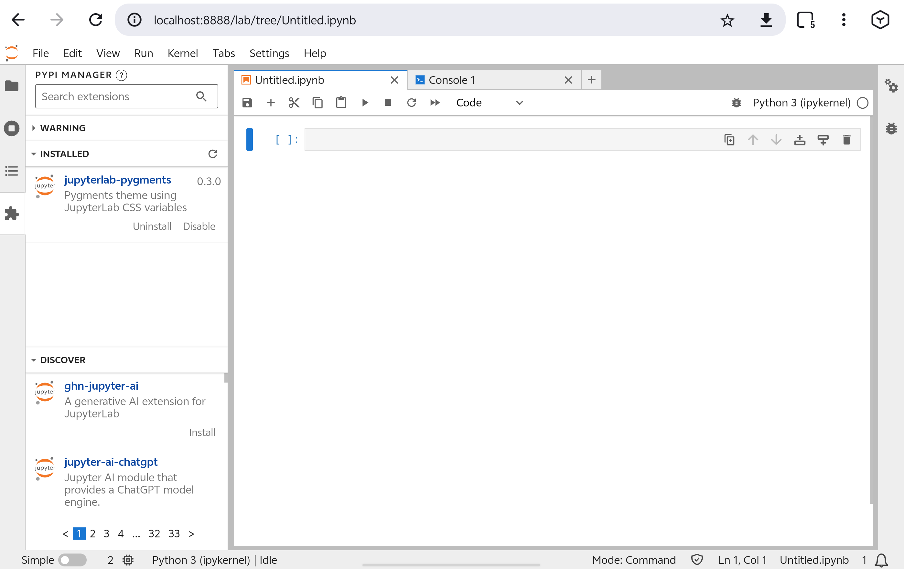
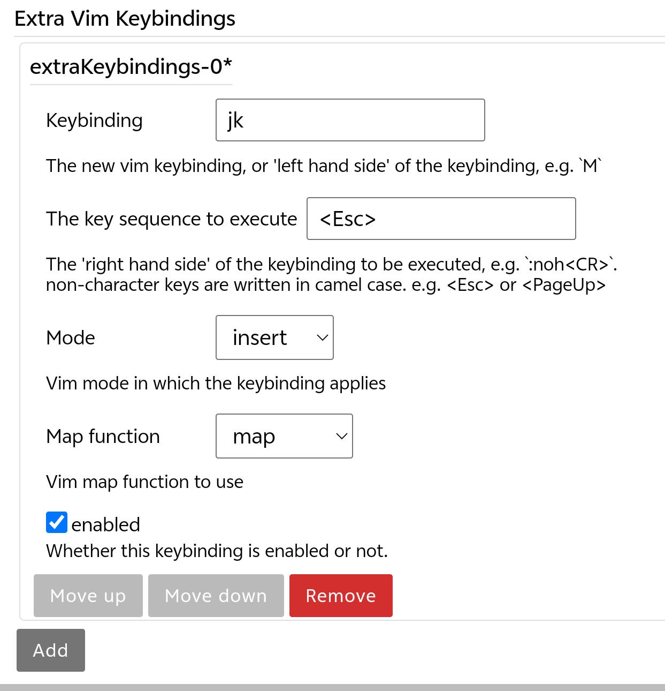
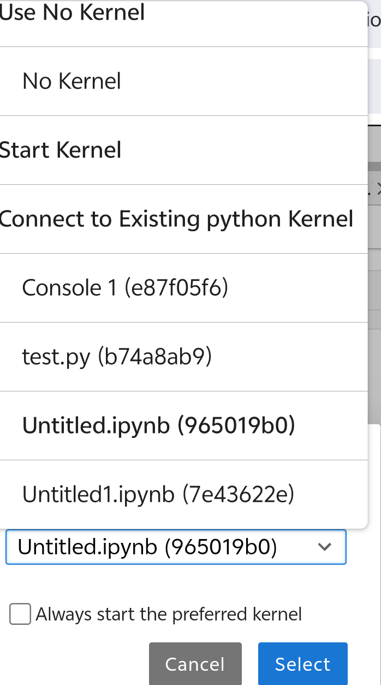
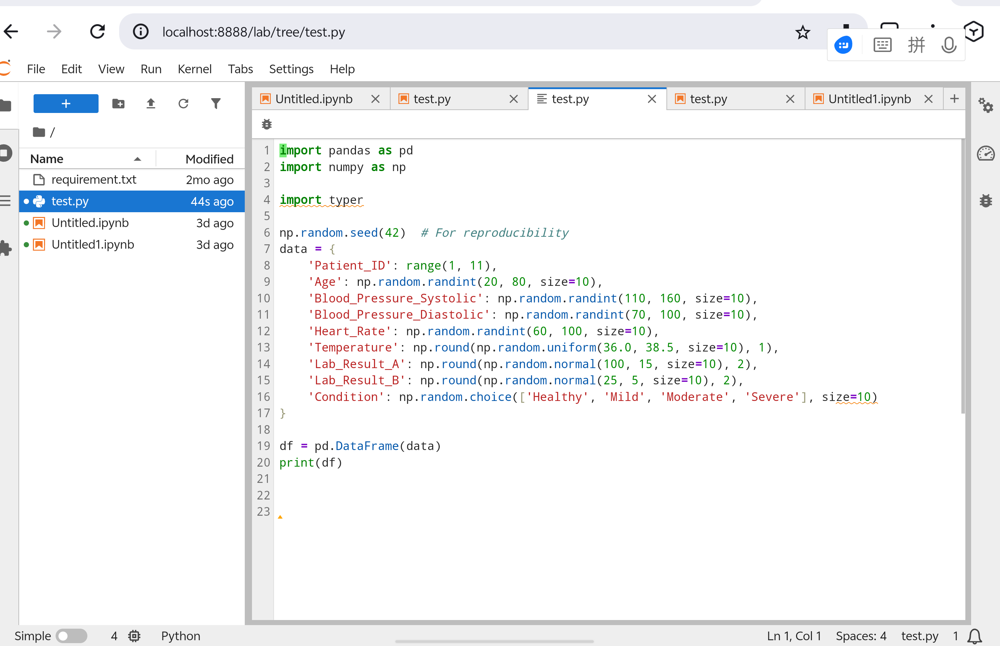
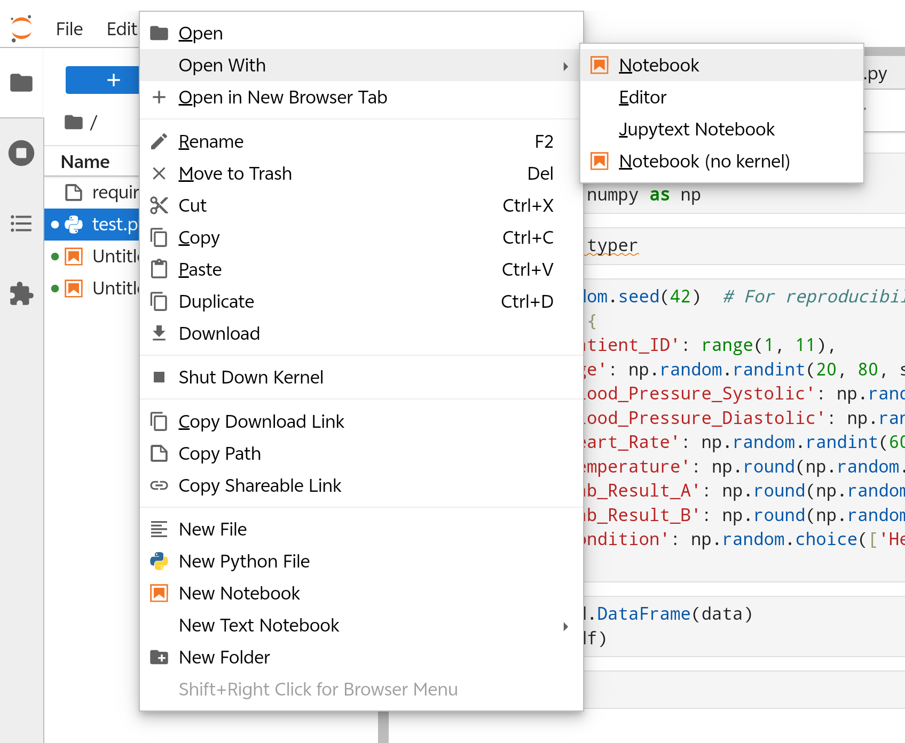
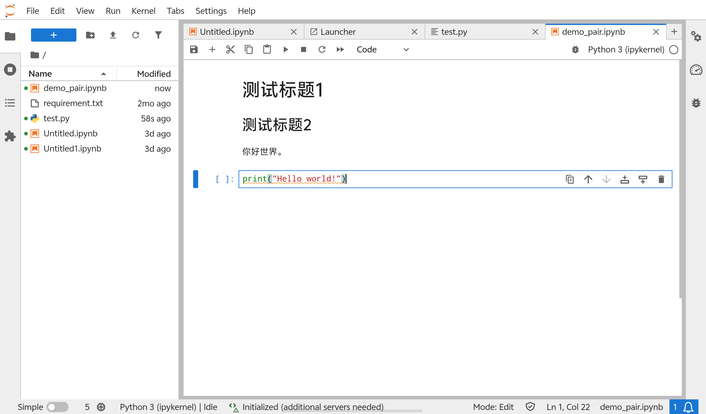
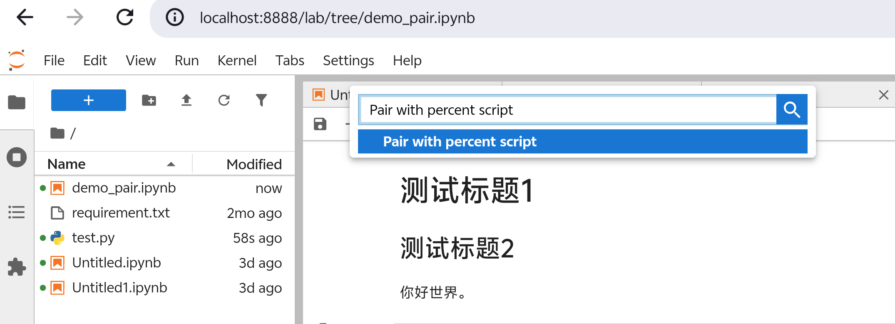
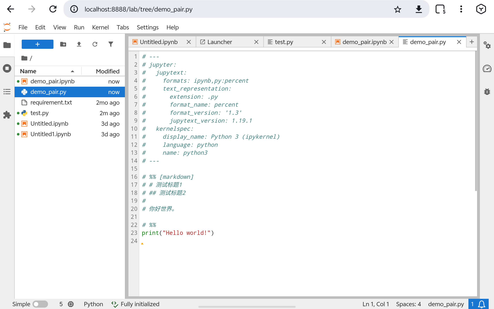
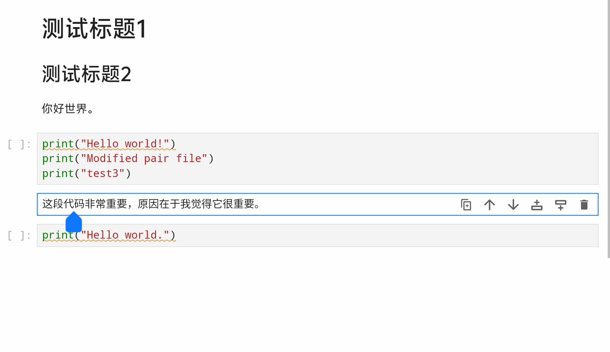

最近相当长一段时间在自学数据科学和机器学习，但是一直都在凑合着用白板jupyterlab，使用体验上非常的一言难尽。jupyterlab的自动补全和语法诊断设计的非常没有眼力见，要么不按按键就不提示，要么全时段疯狂提示。总之，今天终于决定好好研究一下这个东西到底怎么配置。
# 参考链接：

[jupyter doc](https://docs.jupyter.org/en/latest/)

[jupytext github](https://github.com/mwouts/jupytext)
# Jupyter lab由什么组成？

用过jupyterlab的人都知道，jupyterlab就像一个运行在网页里的ide，但是在处理`.ipynb`文件时会将`.ipybn`文件中的若干个json文件解包为一个个独立的cell，每个cell中的代码可以单独运行。当运行代码cell时，jupyter会将代码发送到后端的*kernel*中。kernel是一个独立的进程，专门负责解释运行代码并维护运行时的状态。

之所以需要kernel存在，原因在于jupyterlab实际上并不只面向python设计。C++、Java和Python传统语言御三家都有对应的jupyter kernel，这样一套前端就可以适配多种后端。

在具体使用上，jupyterlab会在本地运行一个web服务器进程。在启用了jupyterlab之后需要在浏览器中访问指定端口来显示前端界面。此外，白板jupyterlab可以通过加装插件来拓展功能。Jupyterlab的插件管理难度约等于vscode，多数的jupyterlab插件通过python的包管理器就能安装（比如pip、conda、uv），同时jupyter lab其实内置有一个插件市场，使用起来也很方便。

# 尝试配置 jupyterlab

```sh
pip install jupyterlab 
```

一行指令就安装好了。之后在终端中输入`jupyter lab`就可以在浏览器中使用lab了。一般来说会直接窗口跳转到浏览器，使用wsl或者远程连接的时候可能需要自己手动访问对应端口。

打开之后界面如下：



如果不提的话很多人可能一辈子都不知道jupyterlab竟然还有插件市场。只要点击install就可以安装插件，非常的方便。

既然是用来写python的，那么首先我们就应该先来安装vim插件（雾）。直接在插件市场中搜索vim就能找到`axlair-jupyterlab-vim`插件，但是接下来我们需要配置它的按键映射。在Settings、Settings Editor中左侧罗列了所有插件的信息，右侧则罗列了配置项。

依旧是jk映射esc。



然而，经过了若干时间的摸索也没有搞定如何在jupyterlab中改用vim模式切换标签页的映射。只能说现在的情况也算基本够用了。

此外还添加了`jupyter-server-resource-usage`、`jupyterlab-execute-time`、`jupyter-lsp-jupyterlab-lsp`。

# 注册kernel

当我们在激活了一个虚拟环境的情况下启动jupyterlab，jupyterlab就会使用当前环境的python作为kernel。但是，jupyterlab本质上是一个相当复杂的web应用，虽然装起来很方便，假如每一个环境都装一个jupyterlab，我们会浪费很多的磁盘空间。

jupyterlab在设计上实际鼓励程序员只用一个虚拟环境存放jupyterlab服务本体。对于其他想要使用jupyterlab的虚拟环境，则使用ipykernel来将当前环境注册为一个kernel。这样我们每次只需要启动jupyterlab服务本体然后使用目标环境的kernel即可。

先激活某个你想注册为kernel的环境，然后下载ipykernel：

```sh
pip install ipykernel
```

随后执行：

```sh
python -m ipykernel install --user --name=this_is_a_name --display-name="A random kernel"
```

`--user`参数表示将配置装在当前用户的目录下，`--name`用来指定唯一标识符，`--display-name`用来指定jupyterlab中看到的kernel名称。

之后回到jupyterlab的环境启动jupyterlab，进入界面之后可以在任意一个ipynb文件的右上角选择你刚注册的kernel。

对于conda环境有一个jupyter插件`nb_conda_kernels`，可以自动扫描所有安装了ipykernel的conda环境并显示在jupyterlab上。（后记：似乎不安装ipykernel的环境也会被扫描）



ipykernel注册的kernel本质是一个kernel的配置，在jupyter语句下kernel的真实意义是一个运行中的python进程，不止包含注册时的环境信息，还包含内存信息。可以将注册kernel看做创建一个工厂，每个运行的kernel为实例。

打开jupyterlab的kernel选项卡，其中no kernel模式下因为没有使用任何内核，代码不会运行；Connect to Existing Kernel表示直接连接到一个已经在运行的kernel实例。每个notebook默认情况下都有自己独立的kernel，连接之后两个notebook会共享一个kernel，这样我们就不用重复加载大数据集或者中断长时间运行任务。
# Jupytext

[jupytext github](https://github.com/mwouts/jupytext)

> Have you always wished Jupyter notebooks were plain text documents? Wished you could edit them in your favorite IDE? And get clear and meaningful diffs when doing version control? Then, Jupytext may well be the tool you're looking for!

```python
pip install jupytext
```

jupytext的核心功能是将`.ipynb`文件和`.py`文件或`.md`等纯文本文件双向同步。一方面jupytext拓展了jupyterlab处理纯文本的原生行为，会解析其中的标识并动态重组为一个notebook对象，一方面jupytext提供了结对保存功能，让你可以将一个`.ipynb`文件和一个`.py`文件绑定之后同步保存，这样实现只用`.ipynb`文件看结果，同时用`.py`文件处理代码和进行版本控制。

在具体的实现上，jupytext提供了网页前端的插件gui可以用来配置配对和用jupytext方式读取py脚本，提供了cli工具来实现批量转换和文件同步（甚至可以将notebook内容pipe给black进行格式化），还提供了python库接口方便你自动化格式转换。

比如，以下是直接在jupyter lab中使用editor查看一个py文件的默认界面：



右键这个文件后可以看到open with中出现了jupytext选项：



此时py文件就会以notebook的形式显示出来。（上图选项板后方）

再比如我们随便创建一个`demo_pair.ipynb`文件：



`Ctrl + Shift + c`输入命令`Pair with percent script`，我们就成功将这个`.ipynb`文件与一个`.py`文件连接起来了。此时保存`.ipynb`文件，左侧文件树中就会出现一个同名的`.py`文件，为该`.ipynb`文件的配对文件。





此时修改这个`.py`文件，`.ipynb`文件中的内容也会被同步修改。（按道理进入ipynb文件时会提示reload，没有提示的话需要手动刷新页面才能看到修改内容）

在以上这个demo中，`.py`文件使用了**Percent Format**，这是一种专门用于jupyter notebook和python之间进行格式转换的标记语言。jupytext实际上支持很多种格式，但是其中percent format兼容性最好（因为资历最老）。大多数ide都对percent format提供支持。

percent format的基本特点是使用`# %%`来分隔单元格。在`# %%`之后我们还可以接上一些补充信息，比如如我们上面例子中声明单元格类型（什么都不写默认code），可以加上一个可选的title，还可以添加一些可选的metadata，用来制作幻灯片、添加tag、以及控制可见性等行为。

比如我们可以写一个花哨的percent format：

```python
# %% 核心代码！！ [markdown] editable=false deletable=false
# 这段代码非常重要，原因在于我觉得它很重要。

# %% 核心代码具体内容 editable=false deletable=false
print("Hello world.")
```

我们就得到了这样的notebook效果：



其中我们新添加的两个代码块不仅点删除键删不掉，甚至无法进入insert状态（按i键没有反应），证明metadata发力了。

除了percent format外，jupytext默认支持light format，这是jupytext自己提出的格式，非常的简洁，没有显式的分隔符，# + 开头或者一个纯注释块得到的就是一个markdown块，一段代码前没有特殊标记得到的就是代码块。优点是方便，缺点是和ide兼容性不够。

以下提供一些jupytext cli的常见用法：

```sh
jupytext --to py:percent notebook.ipynb
```

把`notebook.ipynb`文件转换为`py:percent`格式的py文件。非原地转换。

```sh
jupytext --to notebook script.py
```

将python文件转换为notebook。（md文件同理）

```sh
jupytext --set-formats ipynb,py:percent notebook.ipynb
```

对`notebook.ipynb`文件设置结对，此后保存该文件会生成一个py结对文件。

```sh
# 自动判断方向并同步
jupytext --sync notebook.ipynb

# 也可以对整个文件夹操作
jupytext --sync *.ipynb
```

手动执行同步操作。会自动根据时间戳决定由谁覆盖谁。

```sh
jupytext --pipe black notebook.ipynb
```

对`notebook.ipynb`文件中的代码块进行black格式化。可以将black替换为isort来整理import。

一些和ide搭配使用的其他插件工具因为和本人工作流契合度不够所以暂未涉及。