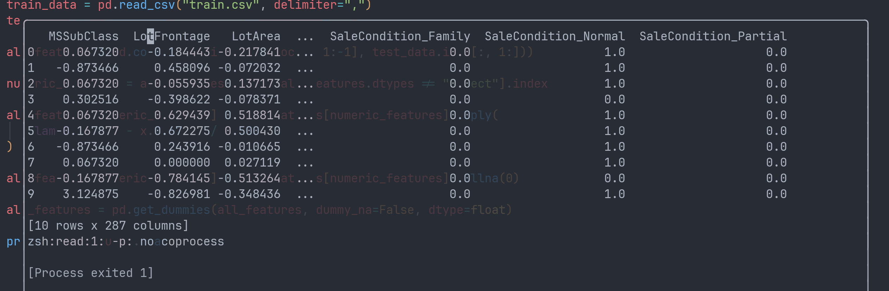
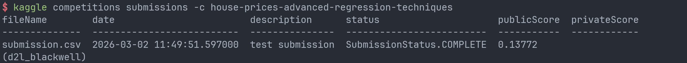
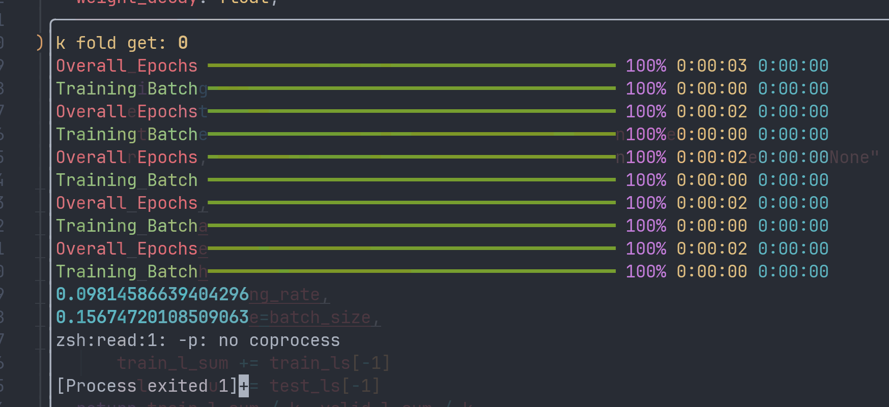

# 参考链接

[kaggle](https://www.kaggle.com/c/house-prices-advanced-regression-techniques)

[kaggle cli](https://github.com/Kaggle/kaggle-cli)

d2l虽然声称是“动手学机器学习”，然而实际上对于学习者真正实践的引导聊胜于无。个人计划做完kaggle之后试试CS231N和EECS498。

kaggle房价预测比赛的具体形式就是给你一定的训练数据让你训练模型，同时提供你一些测试数据。使用训练好的模型读入测试数据并得到预测结果，提交预测结果后根据预测结果的与真实值的误差得到评分。

本比赛提供了4组数据：`train.csv`，用于训练模型；`test.csv`，用于计算预测结果；`data_description.txt`，详细解释了所有column的含义；`sample_submission.csv`，提交示例，里面的内容是对部分数据进行线性回归后能得到的基准结果。

d2l中直接提供了训练数据的下载脚本，实际上登录比赛界面就可以下载。此外，kaggle还额外提供了cli工具下载所需的材料。在配置了kaggle api key之后可以只用一行指令下载所有材料：

```sh
kaggle competitions download -c house-prices-advanced-regression-techniques
```

# 数据清洗

```python
import pandas as pd

train_data = pd.read_csv("train.csv", delimiter=",")
print(train_data.shape)
```

输出结果为`(1460, 81)`。光是各种类型的特征就有80种，对于训练集有额外的一列存储的是对应的售价。测试数据集虽然没有标签，但是可以用来纠正协变量偏移。（我们可以让模型对于出现在测试集中的数据特征额外关心，这样模型按理对于测试集就有更高的适应能力）

随便复制一行训练集的数据：

```python
1,60,RL,65,8450,Pave,NA,Reg,Lvl,AllPub,Inside,Gtl,CollgCr,Norm,Norm,1Fam,2Story,7,5,2003,2003,Gable,CompShg,VinylSd,VinylSd,BrkFace,196,Gd,TA,PConc,Gd,TA,No,GLQ,706,Unf,0,150,856,GasA,Ex,Y,SBrkr,856,854,0,1710,1,0,2,1,3,1,Gd,8,Typ,0,NA,Attchd,2003,RFn,2,548,TA,TA,Y,0,61,0,0,0,0,NA,NA,NA,0,2,2008,WD,Normal,208500
```

可以看到80个特征呈现出一片万物生机勃勃竞发的境界。这里面不只有数字，还有各种类型代称以及缺失值（NA）。然而不幸的是我们的模型只能读取数字信息，所以在训练之前我们需要先清洗数据。

具体的数据清理实践上，d2l给出的方案是首先对所有数值减去其特征的均值并除以标准差，这样我们最后得到的数据方差不变，而均值为0，之后将缺失值替换为0，更方便我们训练模型；对于离散数据，我们使用独热编码对其进行替换，假如某个特征有3种表现类型，我们就直接把它拆成3个特征，每个特征只有“有”或“没有”两种状态。

```python
all_features = pd.concat((train_data.iloc[:, 1:-1], test_data.iloc[:, 1:]))

numeric_features = all_features.dtypes[all_features.dtypes != "object"].index

all_features[numeric_features] = all_features[numeric_features].apply(
    lambda x: (x - x.mean()) / x.std()
)

all_features[numeric_features] = all_features[numeric_features].fillna(0)

all_features = pd.get_dummies(all_features, dummy_na=False, dtype=float)

print(all_features.head(10))
```

`all_features`将训练集和测试集的所有特征统一存放在了一个dataFrame下，`get_dummies`行为是将一个dataFrame中“可分类”的数据转换为“dummy”，即“指标变量”。默认行为只对object类型的列起作用。`pd.concat`默认按照`axis=0`拼接dataFrame。

输出结果如下：



数据清理完了，但是仅仅有dataFrame是不够的，我们需要将数据加载到tensor中才能用于模型训练。在以上的数据中，有接近一半来自训练集，另一半来自测试集。我们需要将它们重新分配给两个tensor。

```python
n_train = train_data.shape[0]

train_features = torch.tensor(all_features[:n_train].values, dtype=torch.float32)
test_features = torch.tensor(all_features[n_train:].values, dtype=torch.float32)
train_labels = torch.tensor(train_data.iloc[:, -1], dtype=torch.float32)

print(train_labels)
print(train_labels.shape[0])
print(train_features.shape[0])
```

`torch.tensor`是torch针对Tensor类提供的工厂函数。虽然理论上我们可以直接使用`torch.Tensor`的构造函数来创建张量，但是对于torch来说Tensor的底层实际上可以有很多种实现方式，而使用原生的构造函数我们只能创建该类的实例。因此，构造函数在torch中地位属于遗产接口，规范的构建Tensor方式是使用工厂函数。

# 训练模型

训练模型需要以下基本步骤：

- 定义模型
- 定义损失
- 定义训练流程

在误差函数选取上，不同地区的房价数量级可能存在差异，导致相同模型处理不同地区房价的误差绝对值大小也会出现差异，所以我们更加关心相对误差大小，即预测值与真实值的比值。在实际操作上，我们计算对数均方根作为误差。

此外，在选取模型上d2l提到了K折交叉验证，简单来说就是把训练集分块，一部分用来检验模型能力，一部分用来训练，只不过负责检验的数据由整个数据集轮流担任。

先尝试跟着d2l走了一遍基本的训练流程：

```python
# %%
import numpy as np
import pandas as pd
import random
from pandas._libs.tslibs import dtypes
from rich import console
import torch
import torch.nn as nn

from rich.console import Console
from rich.table import Column
from rich.theme import Theme
from rich.progress import (
    Progress,
    BarColumn,
    TextColumn,
    track,
    TimeElapsedColumn,
    TimeRemainingColumn,
)
from torch.optim import Optimizer

custom_theme = Theme(
    {
        "info": "cyan",
        "log": "bright_black",
        "warning": "yellow",
        "error": "bold red",
    }
)

global_console = Console(theme=custom_theme, record=True)

text_column = TextColumn("{task.description}", table_column=Column(ratio=1))
bar_column = BarColumn(bar_width=None, table_column=Column(ratio=2))

progress = Progress(
    TextColumn("[progress.description]{task.description}"),
    BarColumn(),
    TextColumn("[progress.percentage]{task.percentage:>3.0f}%"),
    TimeElapsedColumn(),
    TimeRemainingColumn(),
)

# %% 读取数据集

train_data = pd.read_csv("train.csv", delimiter=",")
test_data = pd.read_csv("test.csv", delimiter=",")

# %% 清洗数据

all_features = pd.concat((train_data.iloc[:, 1:-1], test_data.iloc[:, 1:]))

numeric_features = all_features.dtypes[all_features.dtypes != "object"].index

all_features[numeric_features] = all_features[numeric_features].apply(
    lambda x: (x - x.mean()) / x.std()
)

all_features[numeric_features] = all_features[numeric_features].fillna(0)

all_features = pd.get_dummies(all_features, dummy_na=False, dtype=float)

# print(all_features.head(10))

# %% 加载数据

n_train = train_data.shape[0]

train_features = torch.tensor(all_features[:n_train].values, dtype=torch.float32)

test_features = torch.tensor(all_features[n_train:].values, dtype=torch.float32)

train_labels = torch.tensor(train_data.iloc[:, -1], dtype=torch.float32).reshape(-1, 1)

# print(train_labels)
# print(train_labels.shape[0])
# print(train_features.shape[0])

# %% 损失函数
loss = nn.MSELoss()

# %% 输入特征数
in_features = train_features.shape[1]

# %% 定义模型
net = nn.Sequential(
    nn.Linear(in_features=in_features, out_features=256),
    nn.ReLU(),
    nn.Dropout(0.2),
    nn.Linear(256, 256),
    nn.ReLU(),
    nn.Dropout(0.2),
    nn.Linear(256, 1),
)


# %% 对数均方根误差
def lose_rmse(net, features, labels):
    cliped_preds = torch.clamp(net(features), min=1, max=float("inf"))
    rmse: torch.Tensor = torch.sqrt(loss(torch.log(cliped_preds), torch.log(labels)))
    return rmse.item()


# %% 加载数据
def load_array(
    train_features: torch.Tensor, train_labels: torch.Tensor, batch_size: int
):
    num_examples = train_features.shape[0]
    indices = list(range(num_examples))
    random.shuffle(indices)
    for i in range(0, num_examples, batch_size):
        batch_indices = indices[i : min(i + batch_size, num_examples)]
        yield train_features[batch_indices], train_labels[batch_indices]


# %% 定义训练流程
def train(
    net: nn.Module,
    loss,
    train_features: torch.Tensor,
    train_labels: torch.Tensor,
    tust_features: torch.Tensor,
    test_labels: torch.Tensor,
    num_epochs: int,
    weight_decay: float,
    lr: float,
    batch_size: int,
):
    train_ls, test_ls = [], []
    optimizer = torch.optim.Adam(net.parameters(), lr=lr, weight_decay=weight_decay)
    n_batches = (train_features.shape[0] + batch_size - 1) // batch_size
    with progress:
        epoch_task = progress.add_task("[red]Overall Epochs", total=num_epochs)
        batch_task = progress.add_task("[green]Training Batch", total=n_batches)
        for _ in range(num_epochs):
            train_iter = load_array(train_features, train_labels, batch_size)
            progress.reset(batch_task)
            for X, y in train_iter:
                optimizer.zero_grad()
                l: torch.Tensor = loss(net(X), y)
                l.backward()
                optimizer.step()
                # with torch.no_grad():
                # global_console.print(f"[log]batch loss: {lose_rmse(net, X, y)}[/log]")
                progress.advance(batch_task)
            train_ls.append(lose_rmse(net, train_features, train_labels))
            if test_labels is not None:
                test_ls.append(lose_rmse(net, test_features, test_labels))
            progress.advance(epoch_task)

    return train_ls, test_ls


train_ls, test_ls = train(
    net,
    loss,
    train_features,
    train_labels,
    test_features,
    None,
    100,
    0,
    0.01,
    64,
)
global_console.print(train_ls)
global_console.print(test_ls)
```

在D2L的基础上加了rich，给训练过程添加了进度条。100个epoch之后训练集rmse误差在0.1作用，基本没办法继续降低了。

假如我们直接应用现有的模型尝试提交一次kaggle，结果如下：

```python
# %% 计算测试集

preds = net(test_features).detach().numpy().reshape(1, -1)[0]
preds = pd.Series(preds)
submission = pd.DataFrame({"Id": test_data["Id"], "SalePrice": preds})
global_console.print(submission)
submission.to_csv("submission.csv", index=False)
```

```sh
kaggle competitions submit -c house-prices-advanced-regression-techniques -f submission.csv -m "test submission"
```

提交之后的结果：



kaggle的打分方式和我们对于误差的描述一致，都考察预测值与真实值的误差对数方均根值。可以看到的是我们最后的得分是0.138，比训练集最后的误差大的多，原因在于我们的模型没有对测试集中的特征额外重视，模型出现了协变量偏移。假如我们想要修正协变量偏移，我们需要额外训练一个模型用来分类测试集与训练集特征，并让原本的模型对于训练集没有而测试集有的特征给予额外注意。

但是在进一步优化模型之前，我们可能需要先进行K折交叉验证。以下是d2l给出的kfold实现：

```python
def get_k_fold_data(k, i, X, y):
    assert k > 1
    fold_size = X.shape[0] // k
    X_train, y_train = None, None
    for j in range(k):
        idx = slice(j * fold_size, (j + 1) * fold_size)
        X_part, y_part = X[idx, :], y[idx]
        if j == i:
            X_valid, y_valid = X_part, y_part
        elif X_train is None:
            X_train, y_train = X_part, y_part
        else:
            X_train = torch.cat([X_train, X_part], 0)
            y_train = torch.cat([y_train, y_part], 0)
    return X_train, y_train, X_valid, y_valid
```

其中k表示k折的折叠数，k为5就表示将训练集平分为5份；i表示以取第i个折叠作为验证集，其他的所有折叠拼成一个新的训练集；X和y分别表示整个训练集的特征和标签。

以上函数的功能是根据K折的原理分隔数据集，真正应用的时候我们不会只取一个i，而是对所有的分块依次取一遍作为验证集，最后取误差的均值作为模型效果的衡量依据。因此，我们需要重复k次，每次都使用`get_k_fold_data`来获取本轮的训练集和验证集，同时每一次折叠我们都需要创建一个新的网络单独训练和测试。

完整实现如下：

```python
# %% K折交叉验证

def get_k_fold_data(k: int, i: int, X: torch.Tensor, y: torch.Tensor):
    assert k > 1 # 折叠数需要大于1，否则没有验证集
    fold_size = X.shape[0] // k
    X_train, y_train = None, None
    for j in range(k):
        idx = slice(j * fold_size, (j + 1) * fold_size) # 框出一个分块
        X_part, y_part = X[idx, :], y[idx]
        if j == i:
            X_valid, y_valid = X_part, y_part
        elif X_train is None:
            X_train, y_train = X_part, y_part
        else:
            X_train, y_train = (
                torch.cat([X_train, X_part], 0),
                torch.cat([y_train, y_part], 0),
            ) # 把训练集分块拼成一个完整的训练集
    global_console.print(f"[warning]k fold get: {i}[/warning]")
    return X_train, y_train, X_valid, y_valid


def k_fold(
    k: int,
    train_features: torch.Tensor,
    train_labels: torch.Tensor,
    num_epochs: int,
    learning_rate: float,
    weight_decay: float,
    batch_size: int,
):
    train_l_sum, valid_l_sum = 0, 0
    for i in range(k):
        net = get_net()
        data = get_k_fold_data(k, i, train_features, train_labels)
        train_ls, test_ls = train(
            net,
            loss,
            *data,
            num_epochs=num_epochs,
            weight_decay=weight_decay,
            lr=learning_rate,
            batch_size=batch_size,
        )
        train_l_sum += train_ls[-1]
        valid_l_sum += test_ls[-1]
    return train_l_sum / k, valid_l_sum / k


train_l_sum, valid_l_sum = k_fold(5, train_features, train_labels, 100, 0.01, 0, 64)

global_console.print(train_l_sum)
global_console.print(valid_l_sum)
```

输出结果：



从中我们可以看到模型对于验证集的预测误差比训练集的误差高了约60%。这意味着模型存在明显的过拟合现象。假如我们的模型有足够的泛化能力，训练误差与验证误差的差距应该更小。

（但是模型优化的问题懒得折腾了（拖的时间太久了），D2L暂时告一段落。）

最后附上完整代码。

```python
# %%
import numpy as np
import pandas as pd
import random
import torch
import torch.nn as nn

from rich.console import Console
from rich.table import Column
from rich.theme import Theme
from rich.progress import (
    Progress,
    BarColumn,
    TextColumn,
    track,
    TimeElapsedColumn,
    TimeRemainingColumn,
)
from torch.nn.modules import fold
from torch.optim import Optimizer

custom_theme = Theme(
    {
        "info": "cyan",
        "log": "bright_black",
        "warning": "yellow",
        "error": "bold red",
    }
)

global_console = Console(theme=custom_theme, record=True)

text_column = TextColumn("{task.description}", table_column=Column(ratio=1))
bar_column = BarColumn(bar_width=None, table_column=Column(ratio=2))

progress = Progress(
    TextColumn("[progress.description]{task.description}"),
    BarColumn(),
    TextColumn("[progress.percentage]{task.percentage:>3.0f}%"),
    TimeElapsedColumn(),
    TimeRemainingColumn(),
)

# %% 读取数据集

train_data = pd.read_csv("train.csv", delimiter=",")
test_data = pd.read_csv("test.csv", delimiter=",")

# %% 清洗数据

all_features = pd.concat((train_data.iloc[:, 1:-1], test_data.iloc[:, 1:]))

numeric_features = all_features.dtypes[all_features.dtypes != "object"].index

all_features[numeric_features] = all_features[numeric_features].apply(
    lambda x: (x - x.mean()) / x.std()
)

all_features[numeric_features] = all_features[numeric_features].fillna(0)

all_features = pd.get_dummies(all_features, dummy_na=False, dtype=float)

# print(all_features.head(10))

# %% 加载数据

n_train = train_data.shape[0]

train_features = torch.tensor(all_features[:n_train].values, dtype=torch.float32)

test_features = torch.tensor(all_features[n_train:].values, dtype=torch.float32)

train_labels = torch.tensor(train_data.iloc[:, -1], dtype=torch.float32).reshape(-1, 1)

# print(train_labels)
# print(train_labels.shape[0])
# print(train_features.shape[0])

# %% 损失函数
loss = nn.MSELoss()

# %% 输入特征数
in_features = train_features.shape[1]


# %% 定义模型
def get_net():
    net = nn.Sequential(
        nn.Linear(in_features=in_features, out_features=256),
        nn.ReLU(),
        nn.Dropout(0.2),
        nn.Linear(256, 256),
        nn.ReLU(),
        nn.Dropout(0.2),
        nn.Linear(256, 1),
    )
    return net


# %% 对数均方根误差
def lose_rmse(net, features, labels):
    cliped_preds = torch.clamp(net(features), min=1, max=float("inf"))
    rmse: torch.Tensor = torch.sqrt(loss(torch.log(cliped_preds), torch.log(labels)))
    return rmse.item()


# %% 加载数据
def load_array(
    train_features: torch.Tensor, train_labels: torch.Tensor, batch_size: int
):
    num_examples = train_features.shape[0]
    indices = list(range(num_examples))
    random.shuffle(indices)
    for i in range(0, num_examples, batch_size):
        batch_indices = indices[i : min(i + batch_size, num_examples)]
        yield train_features[batch_indices], train_labels[batch_indices]


# %% 定义训练流程
def train(
    net: nn.Module,
    loss,
    train_features: torch.Tensor,
    train_labels: torch.Tensor,
    test_features: torch.Tensor,
    test_labels: torch.Tensor,
    num_epochs: int,
    weight_decay: float,
    lr: float,
    batch_size: int,
):
    train_ls, test_ls = [], []
    optimizer = torch.optim.Adam(net.parameters(), lr=lr, weight_decay=weight_decay)
    n_batches = (train_features.shape[0] + batch_size - 1) // batch_size
    with progress:
        epoch_task = progress.add_task("[red]Overall Epochs", total=num_epochs)
        batch_task = progress.add_task("[green]Training Batch", total=n_batches)
        for _ in range(num_epochs):
            train_iter = load_array(train_features, train_labels, batch_size)
            progress.reset(batch_task)
            net.train()
            for X, y in train_iter:
                optimizer.zero_grad()
                l: torch.Tensor = loss(net(X), y)
                l.backward()
                optimizer.step()
                # with torch.no_grad():
                # global_console.print(f"[log]batch loss: {lose_rmse(net, X, y)}[/log]")
                progress.advance(batch_task)
            net.eval()
            train_ls.append(lose_rmse(net, train_features, train_labels))
            if test_labels is not None:
                test_ls.append(lose_rmse(net, test_features, test_labels))
            progress.advance(epoch_task)
    progress.remove_task(epoch_task)
    progress.remove_task(batch_task)
    return train_ls, test_ls


temp_net = get_net()

train_ls, test_ls = train(
    temp_net,
    loss,
    train_features,
    train_labels,
    test_features,
    None,
    40,
    0.2,
    0.005,
    64,
)
# global_console.print(train_ls)
# global_console.print(test_ls)

# %% K折交叉验证


def get_k_fold_data(k: int, i: int, X: torch.Tensor, y: torch.Tensor):
    assert k > 1
    fold_size = X.shape[0] // k
    X_train, y_train = None, None
    for j in range(k):
        idx = slice(j * fold_size, (j + 1) * fold_size)
        X_part, y_part = X[idx, :], y[idx]
        if j == i:
            X_valid, y_valid = X_part, y_part
        elif X_train is None:
            X_train, y_train = X_part, y_part
        else:
            X_train, y_train = (
                torch.cat([X_train, X_part], 0),
                torch.cat([y_train, y_part], 0),
            )
    # global_console.print(f"[warning]k fold get: {i}[/warning]")
    return X_train, y_train, X_valid, y_valid


def k_fold(
    k: int,
    train_features: torch.Tensor,
    train_labels: torch.Tensor,
    num_epochs: int,
    learning_rate: float,
    weight_decay: float,
    batch_size: int,
):
    train_l_sum, valid_l_sum = 0, 0
    for i in range(k):
        net = get_net()
        data = get_k_fold_data(k, i, train_features, train_labels)
        train_ls, test_ls = train(
            net,
            loss,
            *data,
            num_epochs=num_epochs,
            weight_decay=weight_decay,
            lr=learning_rate,
            batch_size=batch_size,
        )
        train_l_sum += train_ls[-1]
        valid_l_sum += test_ls[-1]
    return train_l_sum / k, valid_l_sum / k


train_l_sum, valid_l_sum = k_fold(10, train_features, train_labels, 20, 0.01, 0, 64)

global_console.print(train_l_sum)
global_console.print(valid_l_sum)

# %% 计算测试集

temp_net.eval()
preds = temp_net(test_features).detach().numpy().reshape(1, -1)[0]
preds = pd.Series(preds)
submission = pd.DataFrame({"Id": test_data["Id"], "SalePrice": preds})
global_console.print(submission)
submission.to_csv("submission.csv", index=False)
```