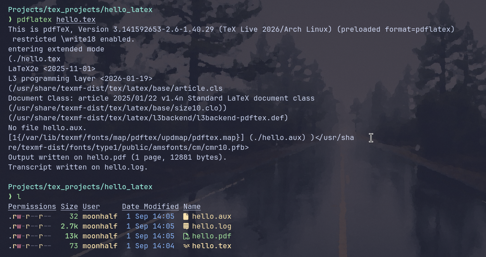
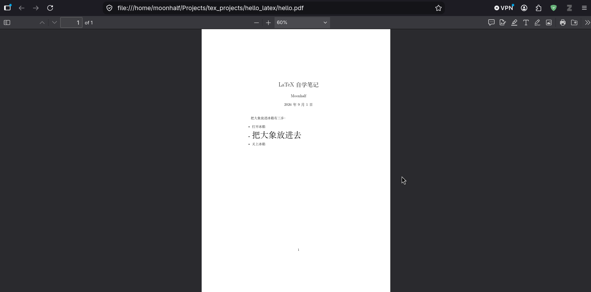
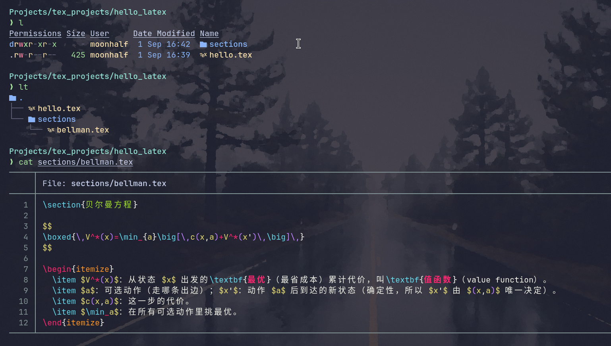
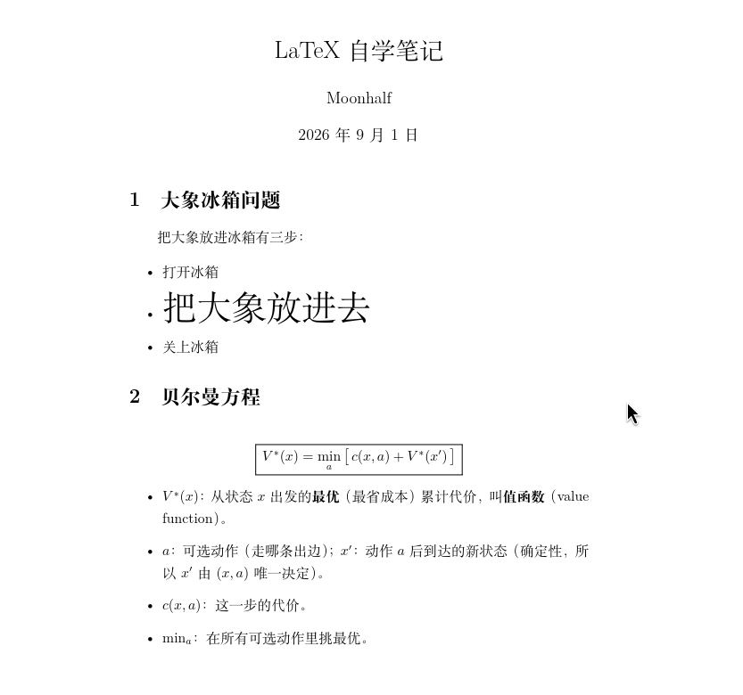
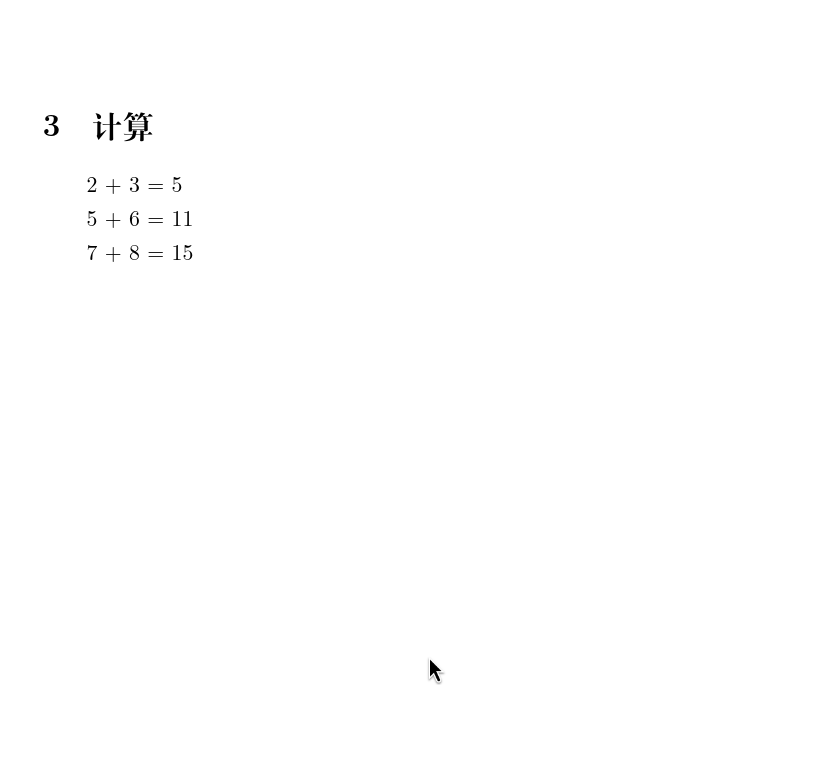

# 为什么需要 LaTeX ？

你的工作需要学术发表，但是你从来没有接受过任何美术训练，如果自己来设计一套优雅的排版，整个过程会非常痛苦。但是如果一个问题很普遍，那么大概率存在一种早就提出来的方法。

于1978年提出的TeX引擎定义了一系列基础的排版原语。通过写这些排版原语，你不止可以做到静态排版描述，还可以包含可执行的排版程序。但是TeX的接口并不友好。TeX类似于汇编语言，它的定位不在于让人写的舒服，而是能尽可能精确的描述排版。

LaTeX的定位则接近编程语言中的高级语言，它提供了更人类友好的接口，但是本质上LaTeX只是一系列TeX的宏包。通过TeX引擎，LaTeX宏会被展开为排版原语，之后执行排版操作得到精美的pdf文件。

作为人类，你应该使用LaTeX或者为了某些需求改进LaTeX，而不是直接上手写TeX。

# Hello LaTeX !

一个 Hello world 级别的`.tex`文件：

```tex
\documentclass{article}

\begin{document}

Hello, World!

\end{document}
```

一个`.tex`文件通常只能写一个`\documentclass`，它的含义是指定文档类型。`\documentclass{article}`中的`article`并不是随意填写的，它代表的是一个文档类，对应于系统中的`article.cls`，一般随TeX发行版一同安装在系统中。此处意味着加载`article.cls`。如果改为`\documentclass{report}`则会加载`report.cls`，其他同理。

`\begin`和`\end`表示的是某种“环境”的起始点和终止点。鉴于LaTeX的编写本质是在处理文本，我们可以这样理解`\begin`和`\end`：它们就像鼠标选中一段文本后得到的选中区。在选中之后，我们可以选择对这段文本执行什么操作，而在LaTeX中，操作的选择步骤就对应于在`{}`中写入`document`。`\begin{document}`和`\end{document}`共同表示：中间的文本会进入最终的pdf。

在一个`.tex`中写多个`document`环境是错误。document表示的是一次LaTeX编译生成的一份完整文档。就像一个cpp程序中只能有一个main函数。

将文件命名为`hello.tex`后使用以下指令进行编译：

```sh
pdflatex hello.tex
```

得到以下文件：



其中`hello.tex`是我们自己写的tex文件，`hello.pdf`是最终的编译产物。`hello.log`表示的是编译日志，只有编译错误的时候会有用；`hello.aux`会保存一些交叉引用和章节编号信息。后两者都可自动重建。

在一些高级编程语言中，编译的中间产物会被默认自动清理，比如`gcc hello.c`中`.c`到`.s`到`.o`到`.out`，`hello.s`和`hello.o`都不会被保留。LaTeX之所以采用保留中间产物的设计，根本原因是历史设计与兼容性遗留。在上世纪70-80年代，顺序执行宏并逐页输出的方式可以节省内存，而虽然现在内存不再是问题，改变编译时机有可能会改变旧文档的排版结果，故而现代实践中并不修改TeX内核。

# 文档结构

LaTeX 文档分为三个部分：文档类声明、导言区、正文区。你可以将他们非常不严谨地类比到 java 中的`package xxx`、`import xxx`和`public class xxx`（`package xxx`的类比事实上并不正确，但是鉴于都是描述本文件的特征勉强保留。后文中GDScript的类比会更准确。）

## 文档类声明

```tex
\documentclass[12pt, a4paper, twocolumn]{article}
```

`[]`中可以写入一些基本的文档类配置项。`12pt`表示基础字号、`a4paper`表示纸张大小、`twocolumn`表示双栏布局。除此之外还可以配置双面打印、草稿模式、默认的公式对齐方向等。

`\command`的形式表示一个指令，`[]`通常表示可选参数，`{}`表示必填参数。

你可以将文档类声明类比为GDScript中每个文件开头的`extends XXXClass`，每个文档都像是对一个文档基类的继承。

## 导言区

引入utf8中文支持：

```tex
\usepackage[UTF8]{ctex}
```

`\usepackage[可选配置]{包名}`的用途是导入宏包。宏不同于我们所理解的Python模块或者C语言头文件，导入宏包不止会引入新的命令，同时还可能影响整个文档的排版。比如`\usepackage{graphicx}`允许你使用`\includegraphics{cat.png}`，而`\usepackage{hyperref}`则会让你的`\ref`引用变成可跳转的超链接。

因为宏包没有命名空间之类的防碰撞设计，不同宏包指令可能出现冲突。

TeX发行版会自带一部分宏包。如果想找到其他的宏包，可以浏览[ctan](https://ctan.org/)。

```tex
\title{LaTeX自学笔记}
\author{Moonhalf}
\date{September 2026}
```

定义文档的基本信息。这三个指令由LaTeX基础格式提供，大多数文档类都可使用。在正文区中使用`\maketitle`将信息显示出来。

## 正文区

`\begin{document}`和`\end{document}`包裹的就是正文。

## 一个简单的例子

```tex
\documentclass{article}

\usepackage[UTF8]{ctex}

\title{LaTeX自学笔记}
\author{Moonhalf}
\date{\today}


\begin{document}

\maketitle

把大象放进冰箱有三步：

\begin{itemize}
  \item 打开冰箱
  \item  { \Huge 把大象放进去}
  \item 关上冰箱
\end{itemize}

\end{document}
```

效果：



# 多文件组织

太长的文章并不利于维护，我们可以通过`\input{}`和`\include{}`将外部TeX文档内容导入。前者的机制是直接将对应的文件插入到此处，后者会在插入内容前后分页，适合独立章节。

因为是直接插入内容的缘故，单独的子文档可以直接写正文，无需写文档类声明和导言。



构建以上的文件结构以及文件内容，之后在hello.tex补全对该文件的引用（顺带补全对数学公式的支持宏包）：

```tex
\documentclass{article}

\usepackage[UTF8]{ctex}
\usepackage{amsmath}
\usepackage{amssymb}
\usepackage{mathtools}

\title{LaTeX自学笔记}
\author{Moonhalf}
\date{\today}


\begin{document}

\maketitle

\section{大象冰箱问题}

把大象放进冰箱有三步：

\begin{itemize}
  \item 打开冰箱
  \item  { \Huge 把大象放进去}
  \item 关上冰箱
\end{itemize}

\input{sections/bellman.tex}

\end{document}
```

效果：



# 宏定义&TeX编程

`\newcommand`用于定义新的命令。

```tex
\newcommand{\hello}{Hello, World!}
```

之后`\hello`会被替换为`Hello, World!`。

```tex
\newcounter{tempcounter}
\newcommand{\add}[2]{
  \setcounter{tempcounter}{#1}
  \addtocounter{tempcounter}{#2}
  #1 + #2 = \thetempcounter
  \setcounter{tempcounter}{0}
}
```

`[2]`表示两个参数，`#1`和`#2`表示对两个参数的引用。定义一个加法公式宏。之后如此使用：

```tex
\add{2}{3}

\add{5}{6}

\add{7}{8}
```

效果：



> 其实有专门的数学计算宏包，此处只做演示。

`renewcommand`可以覆盖一个原本存在的命令。

```tex
\renewcommand{\thesection}{\Roman{section}} 
```

将章节号由阿拉伯数字改为罗马数字。

```tex
\renewcommand{\thesection}{\Roman{section}}
\renewcommand{\thesubsection}{\Alph{subsection}}
\renewcommand{\theparagraph}{\alph{paragraph}}
\setcounter{secnumdepth}{4}
\makeatletter
\@addtoreset{paragraph}{section}
\makeatother
\titleformat{\section}[block]
  {\normalfont\normalsize\centering\hyphenpenalty=10000\exhyphenpenalty=10000}
  {\thesection.}{0.55em}{\MakeUppercase}
\titlespacing*{\section}{0pt}{2.0ex plus 0.4ex minus 0.2ex}{0.9ex}
\titleformat{\subsection}[block]
  {\normalfont\itshape\normalsize\raggedright\hyphenpenalty=10000\exhyphenpenalty=10000}
  {\thesubsection.}{0.5em}{}
\titlespacing*{\subsection}{0pt}{1.5ex plus 0.3ex minus 0.2ex}{0.6ex}
\titleformat{\paragraph}[runin]
  {\normalfont\itshape\normalsize}
  {\theparagraph.}{0.45em}{}
\titlespacing*{\paragraph}{0pt}{0.9ex plus 0.2ex minus 0.1ex}{0.45em}

```

一套相对复杂的段落配置，section序号使用罗马数字，subsection使用大写字母，paragraph使用小写字母。配置了最深标题深度为4，在section计数增加时重置paragraph计数，并调整了一系列格式。此段放于导言区。

其他的语法细节不必纠结了。只要对LaTeX能做的事情有基本的概念，剩下的事情交给AI即可。
