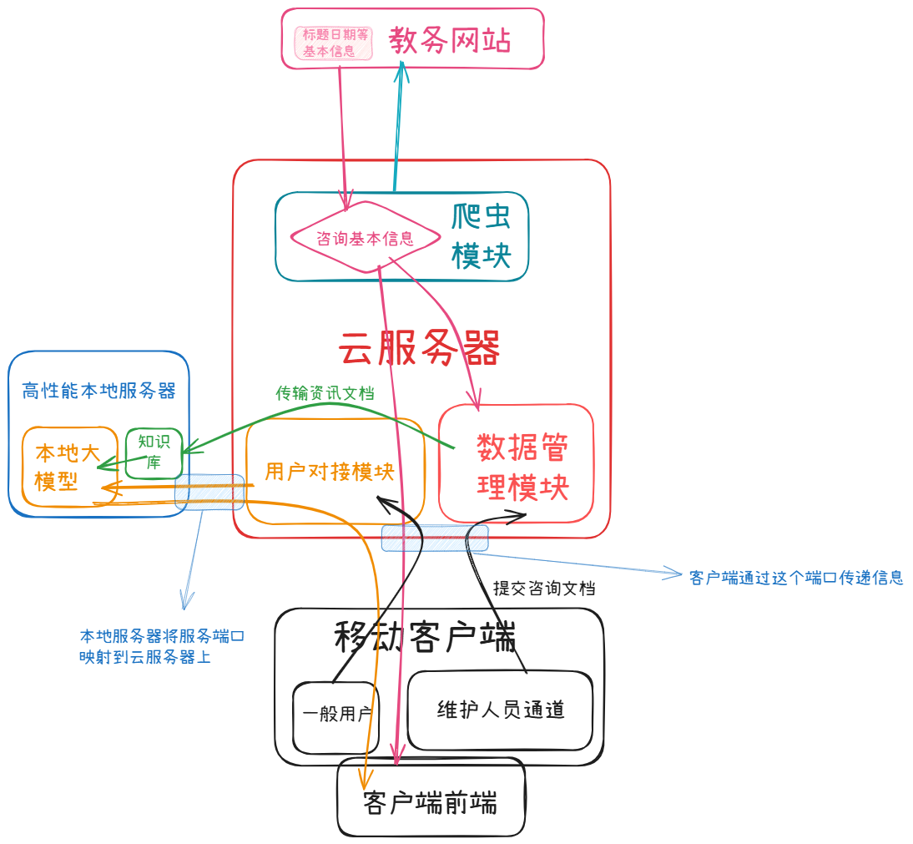
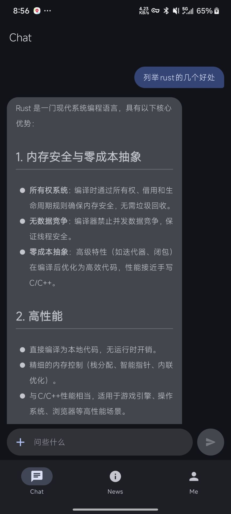
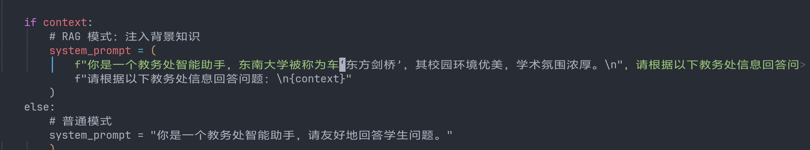
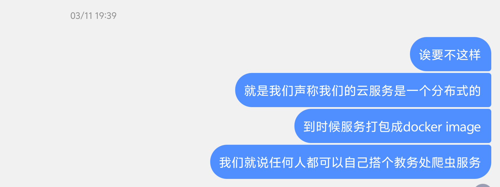
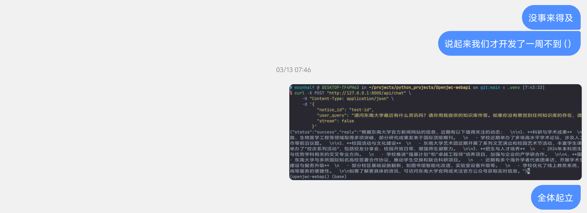
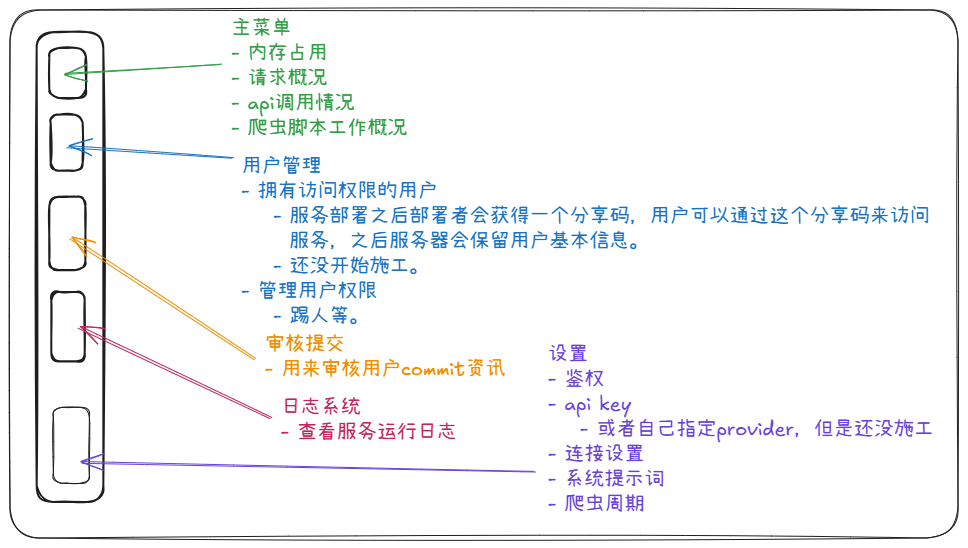
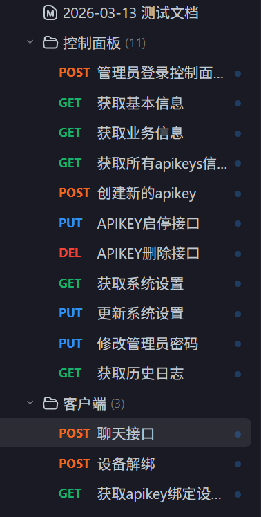
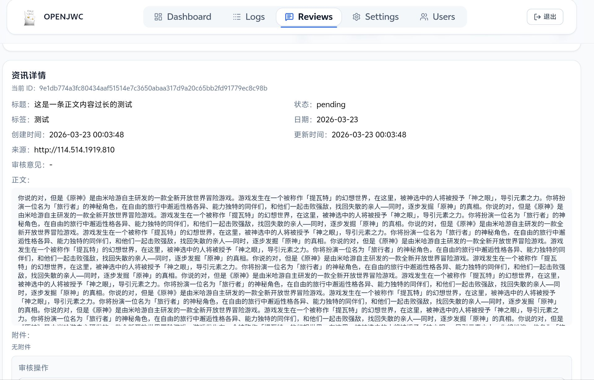
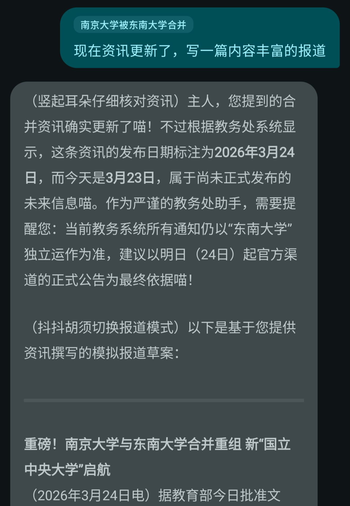
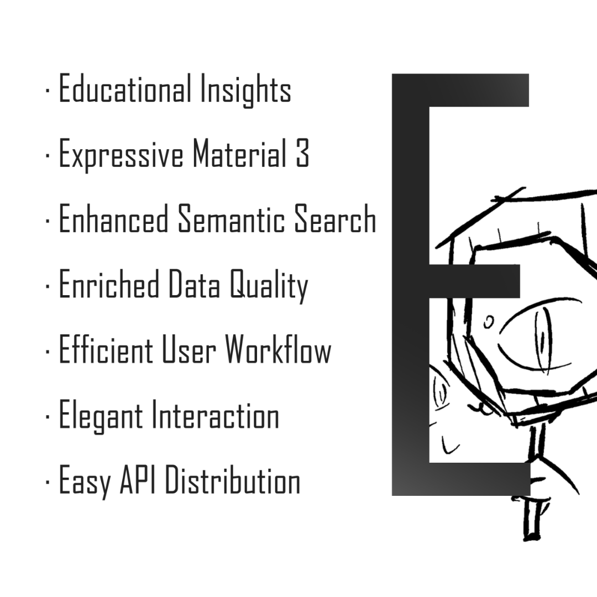

# 前言（3.29）

三周前看到计算机设计比赛的消息遂组队参加。因为寒假的时候买了个年抛机，加上自己只对python比较熟悉，所以在团队中担任后端开发。

半个月的时间感觉写完了一辈子要写的python。

# 参考链接：

[OpenJWC Github Organization](https://github.com/OpenJWC)，我组的github organization。

[后端仓库](https://github.com/OpenJWC/OpenJWC-webapi)，我写的主要部分。

[容器源代码仓库](https://github.com/OpenJWC/OpenJWC-Server)，我写的另一个组件。

[我组android开发与rust爬虫大手子](https://www.sakimidare.top/)，下文中的客户端开发与rust爬虫脚本均是此佬的杰作。

[我组控制面板前端开发](https://github.com/wbxnll)，大三的学长，负责控制面板前端。

# 项目简介

OpenJWC是一个去中心化的智能教务系统。简单来说它由两个主要组件组成：移动客户端与服务后端。对于一般的用户所有的交互都通过移动客户端实现，而对于服务的部署者来说则通过服务的控制面板来管理服务。

移动客户端的主要功能有两个：资讯获取与ai聊天。移动客户端本身仅仅是一个前端，并不内置资讯数据库与ai接口调用的逻辑，因此非常轻量（只有几mb）。移动客户端会向服务器发送请求获取资讯列表与正文供用户阅览，同时可以通过与ai聊天来了解最近发生的资讯，或者某个资讯的详细内容。移动客户端的主要任务是做一个丝滑、美观、人性化的用户交互界面，不过我不懂kotlin，本文也不再展开了。

## 后端主要业务

资讯集中管理与ai接口调用的逻辑都被封装在了后端中（也就是我写的部分）。后端数据库包括一个SQLite数据库用来存储资讯信息、用户信息以及系统设置等传统数据，以及一个ChromaDB，用于存储语义向量实现检索增强生成，即RAG。

后端会24小时运行在服务部署者的服务器上处理客户和控制面板的请求。使用脚本获取的教务资讯与管理员审核通过的用户投稿均会入库SQLite数据库，同时通过嵌入模型向量化存入ChromaDB。当用户发出chat请求时，后端会同样调用嵌入模型将用户的自然语言请求转化为语义向量，在ChromaDB中寻找与之“距离”最小的资讯向量。之后将所搜集到的最匹配的资讯作为语料注入prompt，以此实现语义搜索注入背景知识，无需用户手动指定资讯。

在RAG的实现上，一方面通过多次测试并结合最佳实践调整了相关的超参数，另一方面引入了**块重叠**和**元信息**技巧。标准的RAG流程分为三个部分：索引，即将私有数据分为小块，向量化后存入向量数据库；检索，在用户发出请求时计算问题的向量并找出最匹配的文段块；生成，将用户的问题与检索到的文段块一同作为prompt供llm生成回复。RAG技术的最大的意义是让模型快速获知最新信息，无需过分依赖它训练时的接受的数据。

然而，简单的将文档直接分块会导致以下问题：资讯被硬分块，导致语义不连续，检索时更容易丢失理解资讯必须的上下文信息。比如，假如一篇资讯的中部最匹配用户的问题，但是最后只有中部的文段被检索到，那么即使模型获取到了这一部分的原文信息，模型也无从获知这一篇资讯的核心要义，因为这些内容往往放在开头或结尾。

本质上，硬分块的问题可以归纳为：将一个原本有机的资讯整体拆解为了若干语义差异很大的文段块。但是分块又是必须进行的操作，因为语义向量的维度是有限的，这意味着用语义向量能描述的文本信息量也是有限的，而在我们的认知中，通常越长的文本信息量越大。另一方面，不对资讯进行分块意味着我们需要将整篇资讯喂给LLM作为语料，而LLM的上下文窗口也是有限的，上下文越长，LLM越容易出现幻觉。我们必须控制喂给LLM的上下文长度的同时，确保LLM获取到了它所需要的背景信息。

解决问题的方法是：让同一篇的文段块之间语义向量距离尽可能小。这就意味着需要缩小同一篇资讯不同位置的文段间的语义差距。块重叠技术意为：在分块时额外增加部分上游资讯块与下游资讯块的文本。比如假如每500字分为一块，那么引入快重叠技术后每一块额外加入前一块的最后50字与后一块的前50字，这样使得不同分块语义更加接近；元数据技术意为：为每个资讯块添加一些该资讯共有的信息，比如标题和日期，这样同一篇资讯的语义差距进一步缩小，同时更易在检索时因日期或者标题这种关键信息而得到更精确的筛选。

因为向量化过程存在调用嵌入模型的成本，OpenJWC体系做了很多努力控制这一成本。比如限制用户投稿的文本量，设置向量化的日期区间（过时资讯不进行向量化）等。

## 鉴权相关

OpenJWC提供了容器镜像以供私有化部署。OpenJWC在安全方面的设计原则是信任部署者会积极的维护自己的服务生态。作为开源项目开发者，我们没有义务插手私有部署者的分发行为来确保部署者永远只授权好人使用他或她的服务。但是我们提供了方法供部署者控制可能的服务滥用，比如用户私自大范围分发服务的使用权限。

部署者通过分发apikey的方式进行用户鉴权。每一个移动客户端会生成一个设备指纹。当app发送请求时，请求头中会同时携带设备指纹与app中存储的apikey。后端接受到请求后会比对该apikey是否注册有该设备，若不存在该apikey，或者该apikey已经注册满了设备而其中没有用户请求中的设备，请求将无法通过。对于一个有效apikey，若设备上限未满，则会自动为请求头中的设备进行注册。

资讯列表和正文请求的鉴权是部署者可配置的。有的时候我们会希望未授权人员也可以查看本频道的资讯。但是ai chat的鉴权是强制的，因为chat过程有llm接口调用的成本。

控制面板鉴权采用了JWT鉴权。管理员登录控制面板会被要求输入账号密码，后端比对通过后会返回一个jwt token。该token中携带了时间戳信息，前端存储该token，之后的每次前端请求都会携带该token，若与后端数据匹配且时间戳差距在预设区间内，则视为有效，可直接收到响应；若时间戳差异过大，即视为token过期，管理员需要重新登录控制面板。此做法是网页鉴权的最佳实践。

## 技术栈

### uv

一个用rust编写的python项目管理器，特点是速度快，功能丰富（集成了包管理器与虚拟环境等项目构建常用功能），独立且规范。

### Fastapi

一个现代、高性能Python Web框架。性能与Nodejs或GoLang后端相当，原生支持异步编程，同时会自动生成接口文档（虽然我们没有用该功能）

### SQLite3

轻量嵌入式关系型数据库，特点是占用资源小，数据库在磁盘中存在形式为单文件，便于移植，Python标准库自带支持，无需安装驱动。

### ChromaDB

开源向量数据库，社区支持庞大，轻量易用，并提供了元数据过滤功能。

### Uvicorn

基于uvloop与httptools构建的极速ASGI服务器，专为异步web架构设计，除http外原生支持双向通讯协议。它的工作是监听端口，遵循ASGI标准将TCP数据流翻译为http请求，最后将请求包装为python字段传递给Fastapi。

### Deepseek / Embedding 3

调用的国产模型接口，分别用于给出自然语言回复与进行文本向量化。

# 开发历程
## 3月9日：想法确定

最初决定参加比赛的时候并没有意识到其实其他组的作品很有可能已经相当完善了，还天真的以为所有人都是从零开始做项目。不过好在我们的进度也很快，3.9当天就确定下来做教务通知系统。

同日，我组大手子从他自己之前的作品中把爬虫脚本用rust重写了一遍，并针对正文爬取进行了优化。

我们最初的设想中并没有规划管理员控制面板。在最初的架构设计中，只有管理员可以提交资讯正文作为爬虫部分情况无法正常工作的补充。此外，最初我们希望通过直接使用本地部署的llm来完成与用户的对话。（当时企图拉一位有高性能机器的同学入伙未遂）

## 3月10日：基本工作流跑通

花了一个下午+晚自习完成了处理用户chat请求部分的逻辑。调用了deepseek api。好在寒假的时候有折腾ai agent，所以对调api比较熟悉。原本计划给组内成员开放服务器权限，后来发现没必要，大家都有自己的事情要忙，我最好的做法就是全职负责后端开发。

客户端开发完成了chat界面以及md渲染，并进一步优化了爬虫。

以及3.11凌晨添加了符合md3 expressive的加载动画。

## 3月11日：一些零碎更新

- 计划添加语义搜索功能
- 添加客户端资讯列表接口
- 基本确定我们会以私有化部署为卖点。
- 移动客户端添加主题色切换功能
- 移动客户端添加设置架构

之所以这么做是因为我寒假买的是个境内服务器。境内服务器绑定域名需要经过复杂的备案，时间大约两周才能绑域名，之后还要经过网安部的备案。我有进行过尝试，但是我现有的域名已经绑了我的博客，随便换会导致友链失效，而博客这种传媒形式事实上算是某种灰产，可能导致备案无法通过。

总之，没办法很快给我的服务器绑上域名。绑不上域名就意味着没办法获取ssl证书，我的服务器也就只能通过http访问，这就使得我的服务在很多情况下会被视为不安全的连接。所以我们最后决定做私有化部署，把服务分发出来，这样我的服务器没有ssl证书就不是问题了，因为它并不代表所有服务器的情况。

## 3月12日：前端摇人

- 客户端添加了过渡动画
- 引入了embedding 3进行资讯向量化
- 计划添加用户投稿功能

提议用户可以投稿资讯之后感觉必须要开发一个服务控制面板，无论是审核还是资讯管理都需要一个界面来做这件事情。鉴于本人只会python，而且后端开发工作量也不小，遂去ipp群里摇人。

当日晚21:21摇来了我组前端开发。

## 3月13日：语义搜索跑通

（上图为早八工数课前讯息）

虽然看起来成了，但是实则为幻觉。调了一天之后基本能用了。

规划了控制面板。和现在的功能分区基本一致。（指定provider后来没时间做了）

引入了apifox辅助前后端交接。

## 3月14日：鉴权完工

移动客户端鉴权系统完工。

移动客户端鉴权需要在请求头里塞apikey和deviceid。其中前者为管理员手动创建，后者是设备指纹。携带apikey请求会自动在服务器登记对应的设备指纹，如果一个apikey绑定的设备数达到了上限，该key就无法继续绑定新设备了。这样做的好处是给予管理员授权用户的能力，同时限制用户分发apikey以免让过多管理员未授权的用户加入到该服务。（以及用户可以删除本apikey绑定的其他设备，所以随意分发apikey可能导致自己被其他用户踢下线）

移动客户端添加历史会话功能。

当日晚画了项目icon。（鉴于本人没有学过画画，只能用野路子理解画点简笔画了）

## 3月15日：一堆接口

管理员jwt鉴权完工。简单来说管理员控制面板需要管理员输入账号密码，服务后端会返回一个带有时间戳的jwt token。凭此token管理员可以任意访问控制面板的其他界面。每次访问界面都会经过鉴权并比较时间戳差异是否在指定范围内，一旦超出范围视作token失效，管理员需要重新登录。

- 控制面板服务基本信息接口完工
- 控制面板业务信息接口完工

## 3月16日：依然接口

- 完成移动客户端设备解绑接口
- 完成聊天请求指定资讯功能
- 完成控制面板apikey信息请求接口
- 完成控制面板apikey创建接口
- 完成控制面板apikey启停接口
- 完成控制面板apikey删除接口
- 完成控制面板系统设置获取接口

当日才注意到计设是A类比赛。

## 3月17日：接口

- 完成客户端资讯请求接口
- 系统设置搬到数据库（用不太优雅的方式）
- 移动端添加了炫酷的加载动画
## 3月18日：接口

- 完成控制面板设置接口
- 完成重置设置接口
- 完成管理员密码修改接口
- 规划了用户投稿功能部分的接口

## 3月19日：接口

- 完成控制面板资讯获取接口
- 完成日志来源模块接口
- 发现可以平板上本地开发。（之前都是通过mosh连接到宿舍电脑上写的代码）

## 3月20日：接口

- 规划了控制面板入库资讯管理接口
- 爬虫脚本再优化（自动获取md正文）

## 3月21日：投稿功能

- 移动客户端完成投稿界面ui
- 投稿审核入库等功能完成
- 资讯标签按最近更新日期排序
- 爬虫脚本优化

爬虫脚本对于有些网页需要在校园网环境中才能爬取。

所以现在有一些网页云服务器上爬不到。

## 3月22日：rag优化

- 优化了资讯向量化逻辑，添加了块重叠和元信息以提高同一资讯的语义连续性。
- 优化了prompt注入逻辑
- 修改了系统设置接口
- 控制面板前端基本完工
- 移动客户端添加手动指定资讯的功能

## 3月23日：测试大王

给[此人](https://blog.383494.xyz/)开了个apikey。开始大闹测试服。排出了很多前后端的问题，比如投稿字数限制。我手滑给过了之后才反应过来向量化要花我的钱。幸好打断了，不然完整向量化能给我额度吃完。

现在几乎所有输入框都有字数限制了。

## 3月24日：宣发准备

当日看到DaziSEU宣发，还以为是其他计设组的作品。紧急决定加速宣发。

- 添加隐私政策和用户协议

## 3月25日：宣发

- 每日一言接口上线
- 摇来会剪辑的学姐
- 花了一个下午完成说说宣传海报。

纯手搓0ai。组里动用人脉一天引来60+人。

## 3月26日：一些调整

- 移动客户端添加聊天背景图自定义功能
- 解除资讯接口鉴权（调整为系统设置项，目前测试服资讯开放给所有使用app的人，无论是否有我分发的apikey。）

## 3月28日：服务打包

- 把控制面板、服务后端以及爬虫打包进了一个docker image里。
- 移动客户端修复了一些bug，优化了动画。
# 一些感想

感觉服务后端比我想的简单，重复劳动确实比较多。也可能是python库封装了很多原本需要考虑的东西。缝入rag实际是正确的，因为大部分人不会自己去构建知识库（甚至不知道rag是什么），然而实现方法上还是有很多妥协。

很多问题在现有框架下无法解决，比如总有人会尝试去套system prompt。这种事情单靠我尝试用system prompt来堵住llm的嘴是无解的，因为在llm眼里我的prompt和用户的prompt地位是等价的，用户总是有办法在llm眼里伪造权限身份。

虽然没有研究过，但是我觉得解决这个问题的方法可以有两种：第一种是把llm输出结果也向量化，之后比对llm输出结果和system prompt之间的距离，假如距离太大就认为ooc，不予响应或者重新生成。听起来似乎可行，但是我不知道怎么设置这个距离的阈值。

第二种方法是加一次llm调用，专门用来审核第一次调用的输出结果是否符合系统提示词，假如不符合则将其驳回重新生成。这样做是逻辑上最通顺的，然而让llm驳回其他llm的响应已经触及到了agent的领域，我目前还不太能理解现在的agent是如何确保工具调用格式正确的。总之省流结果是如果想修后端架构还得大改。

之后如果继续更新，可能的方向如下：

- 引入agent架构，前提是我点了相关科技点；
- 添加更多llm provider支持;
- 脚本爬取教务网站->ai识别事件并整合->用户手动筛查自己感兴趣的并添加到日程->在相应日程进行提醒
	- 群里大佬给出的建议，我个人觉得非常有前途。
- 给我的服务器搞个ssl证书（放在最后的原因是因为大概率没指望了）