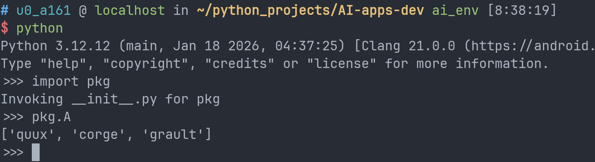
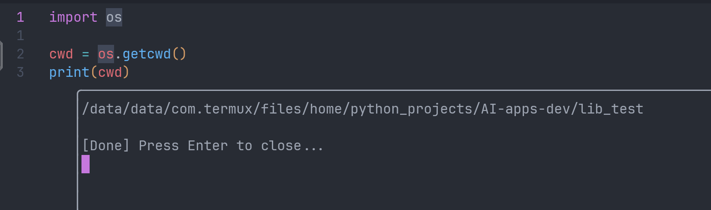
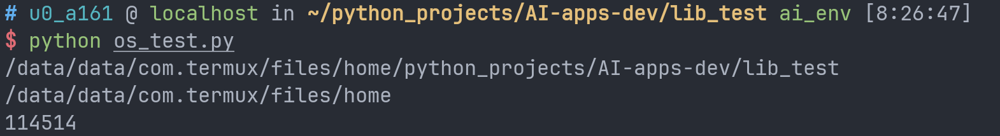
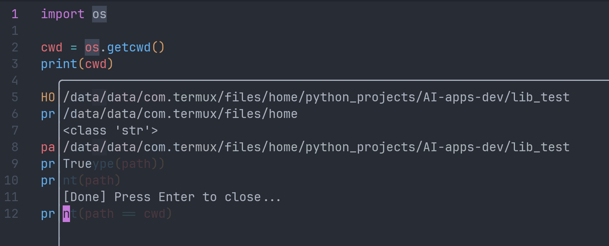
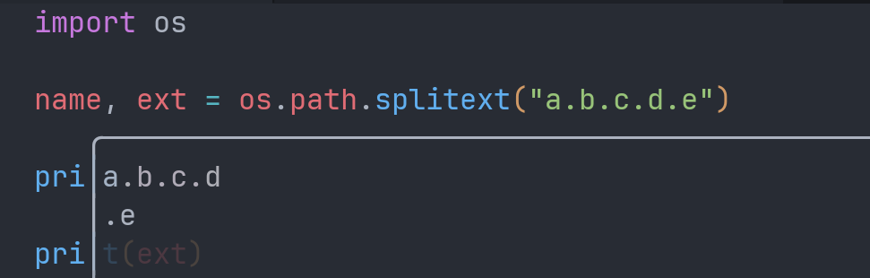
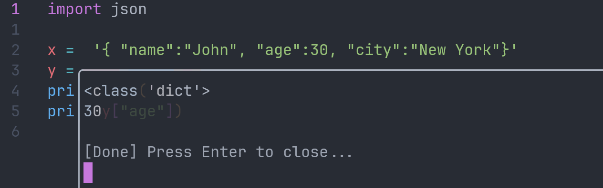
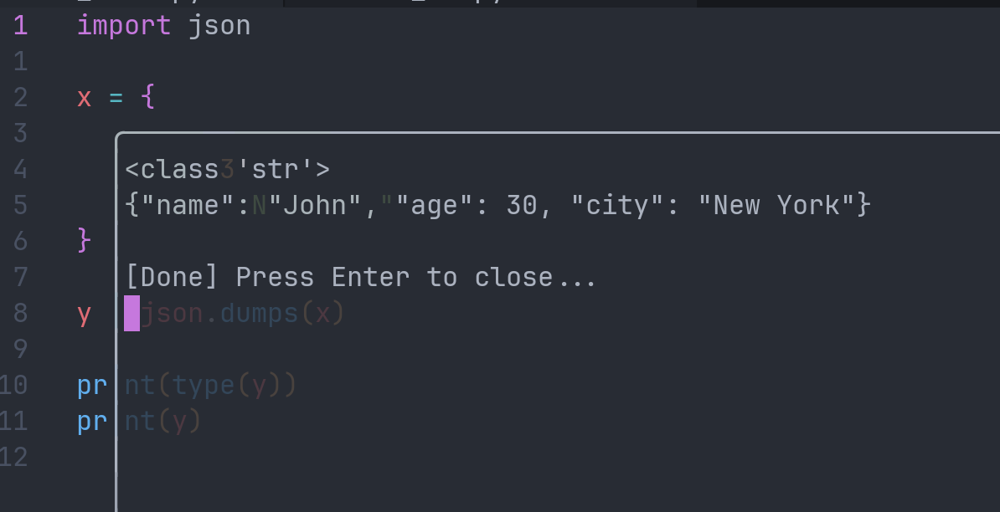
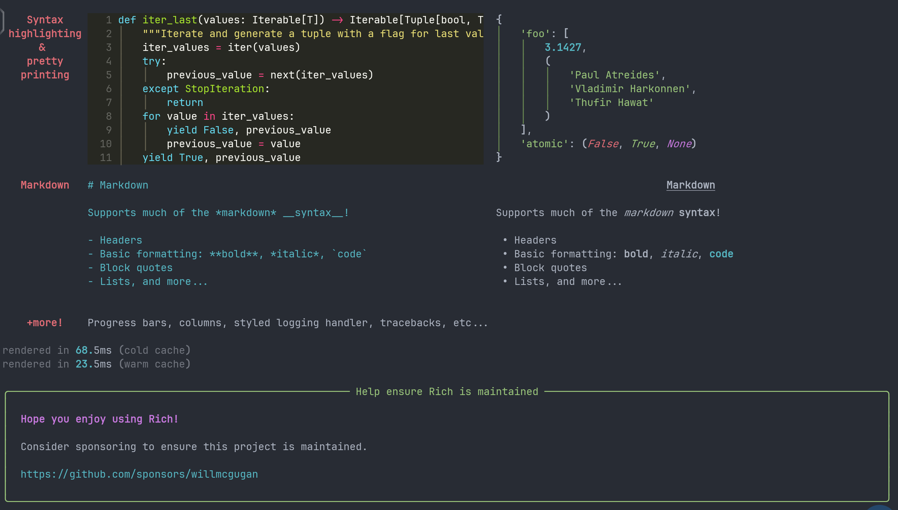

虽然学了很久python，但是我从来没有系统学习过python的项目结构是怎么组织的。主要一般也很少有机会写多文件乃至多目录的python项目。最近突然对ai agent应用有点感兴趣，碰巧自己对这方面的工具确实有需求，顾不上老坑了，速速把新坑端上来罢（喜）

写本文的另一个原因是我觉得自己真的得好好学学cli工具该怎么写。虽然自己很难做到随手搓出一个很精致的图形化应用，但是手搓个cli应用还是应该能做到的。
# 参考链接（本篇要素）：

[awesome-ai-apps](https://github.com/Arindam200/awesome-ai-apps)，最近找到的一个ai工具开发的开源学习库。本篇可能暂时用不到，但是之后*如果填坑*的话应该会参考。

[Python Modules and Packages – An Introduction](https://realpython.com/python-modules-packages/)虽然说是一个"Introduction"，但是内容还挺详细的，所以很多例子干脆照搬了。

[os lib](https://docs.python.org/3/library/os.html)Python os库用来读写文件和执行系统指令。

[json](https://www.w3schools.com/PYTHON/python_json.asp)W3school的Python json库教程。w3school的网上教程其实做的相当不错。

[typer](https://typer.tiangolo.com/)一个用来开发python cli应用的库。平板上写应用基本只能在cli和web之间选一个。

> 写这篇文章的时候我发现typer的tutorial事无巨细地讲了一大堆计算机常识，作为一个python库文档从环境变量和PATH变量开始讲起，写文档的哥们未免有点太敬业了。

[rich](https://rich.readthedocs.io/en/latest/introduction.html)炫酷的终端文本ui库。

[tenacity](https://tenacity.readthedocs.io/en/latest/)添加了一个装饰器，可以方便的定义函数重复执行规则。比如调用api出现网络波动时可以让函数自动重复执行3次。

[requests](https://requests.readthedocs.io/en/latest/)发送HTTP请求。

# Python的文件结构

python中有两个专门服务于模块化编程的术语，模块（python modules）和包（python packages）。简单来说，模块化编程就是把一个大项目分解成若干子任务和模块。把所有东西都塞在一个文件中会导致代码难以维护。

>**Functions**, **modules** and **packages** are all constructs in Python that promote code modularization.

## Python modules

python模块实际上有以下三种定义：

1. 用python写的模块；
2. 用C语言写的模块（头一回知道）；
3. 解释器中的内置模块。

这三个模块的共同点是，他们的内容都可以通过`import`语句访问。

大多数时候我们主要关注python写的模块，它们*are exceedingly straightforward to build*。你不需要有任何特殊的语法标记，只要是没有语法错误的.py文件都是合法的python模块。

举个例子，假如你随便在某个文件目录下创建了一个`mod.py`，内容如下：

```python
s = "If Comrade Napoleon says it, it must be right."
a = [100, 200, 300]

def foo(arg):
    print(f'arg = {arg}')

class Foo:
    pass
```

这个py文件中定义了这些东西（object也指对象，但是类显然不是对象，所以干脆译为东西）：

- `s` (字符串)
- `a` (列表)
- `foo()` (函数)
- `Foo` (类)

假如这个py文件*处在正确的位置*（后面会谈到），那么你就可以通过import来访问这些东西。

```python
>>> import mod
>>> print(mod.s)
If Comrade Napoleon says it, it must be right.
>>> mod.a
[100, 200, 300]
>>> mod.foo(['quux', 'corge', 'grault'])
arg = ['quux', 'corge', 'grault']
>>> x = mod.Foo()
>>> x
<mod.Foo object at 0x03C181F0>
```

### 模块搜索路径

书接上回，我们来看看python执行语句时发生了什么。

当解释器执行了`import mod`语句时，它会在一系列目录中寻找这个`mod.py`这个文件，这一系列目录来源如下：

- 该脚本运行时所处的位置；
- 输入语句时的当前目录，如果以交互模式运行python解释器；
- 环境变量`PYTHONPATH`中的目录；
- python安装时就配置好的安装依赖目录列表。

所有合法的路径都会存储在python的sys内置模块的path变量中。你可以通过如下方式查看搜索路径：

```sh
>>> import sys
>>> sys.path
['', 'C:\\Users\\john\\Documents\\Python\\doc', 'C:\\Python36\\Lib\\idlelib',
'C:\\Python36\\python36.zip', 'C:\\Python36\\DLLs', 'C:\\Python36\\lib',
'C:\\Python36', 'C:\\Python36\\lib\\site-packages']
```

所以，如果你想要你的模块被找到，你可以做以下事情：

- 把模块文件放在你所运动的脚本所在的目录，或者如果你以交互模式运行python解释器，那么就放在你当前的目录。
- 或者确保你的模块处在`PYTHONPATH`中的某个目录。
- 或者把文件放在安装依赖目录中，但是你很可能做不到。

一些奇奇怪怪的方法这里就不展开了。值得一提的是你可以通过访问一个模块的`__file__`属性来获取这个模块的绝对位置，得到的是一个文件夹。


### import语句使用方法

```python
import mod
```

最常用的方法，只是把整个模块塞进了当前符号表，但是mod内的东西还都在mod自己的符号表中，你只能通过`mod.xx`来访问某个mod中的元素。

```python
from mod import xx
```

从mod中直接把一个元素引用到当前符号表，之后不用下标访问也可以直接使用`xx`。你可以将`xx`换成`*`来直接调用mod里的所有东西，但是一般不推荐这么做，容易导致命名冲突。（类似`using namespace std;`)

```python
from mod import xx as yy
```

引用xx的同时起个别名yy。

```python
>>> try:
...     # Non-existent module
...     import baz
... except ImportError:
...     print('Module not found')
...

Module not found
```

你可以使用try来尝试调用某个模块，即使不成功程序也可以继续运行。

### dir函数

`dir()`会返回一个由当前命名空间中名称所组成的列表，默认按照字典序排列。

```python
>>> dir()
['__annotations__', '__builtins__', '__doc__', '__loader__', '__name__',
'__package__', '__spec__']

>>> qux = [1, 2, 3, 4, 5]
>>> dir()
['__annotations__', '__builtins__', '__doc__', '__loader__', '__name__',
'__package__', '__spec__', 'qux']

>>> class Bar():
...     pass
...
>>> x = Bar()
>>> dir()
['Bar', '__annotations__', '__builtins__', '__doc__', '__loader__', '__name__',
'__package__', '__spec__', 'qux', 'x']
```

你也可以传入一个Module参数，这样dir会返回该module自身的命名空间下的名字。

```python
>>> import mod
>>> dir(mod)
['Foo', '__builtins__', '__cached__', '__doc__', '__file__', '__loader__',
'__name__', '__package__', '__spec__', 'a', 'foo', 's']
```

### 将模块当脚本执行

一个module本质上还是.py文件，所以你完全可以使用python解释器直接执行该文件。

依然mod.py：

```python
s = "If Comrade Napoleon says it, it must be right."
a = [100, 200, 300]

def foo(arg):
    print(f'arg = {arg}')

class Foo:
    pass

print(s)
print(a)
foo('quux')
x = Foo()
print(x)
```

运行结果：

```python
C:\Users\john\Documents>python mod.py
If Comrade Napoleon says it, it must be right.
[100, 200, 300]
arg = quux
<__main__.Foo object at 0x02F101D0>
```

然而，这样做又会导致另一个问题：当你import导入这个模块时，这些输出也会被生成：

```python
>>> import mod
If Comrade Napoleon says it, it must be right.
[100, 200, 300]
arg = quux
<mod.Foo object at 0x0169AD50>
```

这些输出之所以会产生，原因在于`import`语句执行时解释器会先完整执行一遍指定的模块，假如你在模块里塞了定义，解释器就会帮你完成定义，但是假如你塞了print，解释器也会同样帮你print出来对应的内容。然而，我们有时会认为这些输出在该模块import导入时并不应该产生。

解决方法如下：在python中有这样一个特殊的双下划线变量`__name__`专门用来存储一个module的名称。当一个module被导入时，它的`__name__`就会被设置为这个module的名称，但是当module被python直接执行时，`__name__`就会被设置为`'__main__'`，据此你可以判断一些函数应该在什么时候运行。

修改后的mod.py：

```python
s = "If Comrade Napoleon says it, it must be right."
a = [100, 200, 300]

def foo(arg):
    print(f'arg = {arg}')

class Foo:
    pass

if (__name__ == '__main__'):
    print('Executing as standalone script')
    print(s)
    print(a)
    foo('quux')
    x = Foo()
    print(x)
```

此时直接用python解释器运行该模块仍然可以得到输出，但是import语句不再会输出了。

```python
>>> import mod
>>> mod.foo('grault')
arg = grault
```

一般来说，就算你的模块独立运行没有什么实际意义，程序员也会设计其独立运行时会执行的脚本来检测它的功能是否符合预期，这种思想被称作单元测试。

比如，假如你有这样的一个用来计算阶乘的模块`fact.py`：

```python
def fact(n):
    return 1 if n == 1 else n * fact(n-1)

if (__name__ == '__main__'):
    import sys
    if len(sys.argv) > 1:
        print(fact(int(sys.argv[1])))
```

你当然可以通过直接`import fact`来访问`fact.fact()`函数，但是你同样可以使用python解释器直接运行`fact.py`，你可以传入一个参数，此时它会返回该数字对应的阶乘。

```python
C:\Users\john\Documents>python fact.py 6
720
```

### 多次导入一个模块

你可以在一个脚本中写多次`import mod`，但是只有第一个会被执行。假如你在这个模块中塞了`print()`语句，那么你也只会看到一条输出。

## Python Packages

如我们前文所言，module仅支持从同一目录中相互导入，这就导致你没办法只使用module来构建复杂的工程。你可能会希望有办法分组组织这些模块。

Packages的作用就是为module命名空间提供一个分层结构。你可以使用点标来访问对应的模块进而访问对应的内容。简单来说，Packages的作用就是把一堆命名空间统一在同一个命名空间之下。

创建package的方法非常直接，你只需要在一个解释器能找到的地方创建一个文件夹然后在里面塞点module或者package就行。


此时`pkg`就成了这两个模块的统一命名空间。对于一个和pkg同级的模块，你可以通过`import pkg.test01`来导入test01模块，或者`from pkg.test01 import foo`来导入其中的类，或者`from .. import .. as ..`，总之module此时的身份就像是pkg的一个成员。

不过，虽然理论上你可以直接`import pkg`，但是这样做并没有把任何pkg下的模块导入本地命名空间。所以会出现以下问题：

```python
>>> pkg.mod1
Traceback (most recent call last):
  File "<pyshell#34>", line 1, in <module>
    pkg.mod1
AttributeError: module 'pkg' has no attribute 'mod1'
>>> pkg.mod1.foo()
Traceback (most recent call last):
  File "<pyshell#35>", line 1, in <module>
    pkg.mod1.foo()
AttributeError: module 'pkg' has no attribute 'mod1'
>>> pkg.mod2.Bar()
Traceback (most recent call last):
  File "<pyshell#36>", line 1, in <module>
    pkg.mod2.Bar()
AttributeError: module 'pkg' has no attribute 'mod2'
```

### Package初始化

包目录下放一个`__init__.py`，其中的代码会在包或者包内模块被导入时先被执行。也就是说它可以用作包的初始化代码。

比如说，我们在pkg文件夹下再放入这样的`__init__.py`文件：

```python
print(f'Invoking __init__.py for {__name__}')
A = ['quux', 'corge', 'grault']
```


此时我们就可以直接`import pkg`并调用`pkg.A`：



`pkg.A`对于包内的模块来说此时就相当于一个全局变量。每一个包内的module都可以通过`from pkg import A`来访问这个变量。

除此之外，`__init__.py`还可以用来自动从包内导入模块。比如，我们前文中未设置`__init__.py`时直接`import pkg`仅仅代表将pkg这个名字纳入了当前字符表，其下的模块都没有成功导入。但是现在我们就可以在`__init__.py`中手动配置导包。

在`__init__.py`中写入以下内容：

```python
print(f'Invoking __init__.py for {__name__}')
import pkg.mod1, pkg.mod2
```

之后再`import pkg`，`pkg.mod1`和`pkg.mod2`就自动被导入了。

```python
>>> import pkg
Invoking __init__.py for pkg
>>> pkg.mod1.foo()
[mod1] foo()
>>> pkg.mod2.bar()
[mod2] bar()
```

### import * from a package

你可以使用通配符一次性导入一个包中的“所有”模块，但是在默认情况下直接输入`from pkg import *`并不会发生任何事情。Python遵循以下规则：如果一个package中的`__init__.py`文件中定义了一个`__all__`列表，它就会被用作指定通配符导入模块时需要导入的模块名。

比如如果你在`__init__.py`中写入这些内容：

```python
__all__ = [
        'mod1',
        'mod2',
        'mod3',
        'mod4'
        ]
```

此时`from pkg import *`就会自动导入这四个module，假如事实上你的package中还有一个mod5.py，通配符导入时就会忽略这个模块。

事实上你同样可以在一个module中定义`__all__`，你可以在里面塞入本模块中的元素，当`from mod import *`时，实际导入的就只有`__all__`列表内的元素。

这样设计的考虑不难理解，程序构建时并不是所有函数都是直接可用的，很多函数的作用都是工具函数，使用`__all__`和`__init__.py`来控制导入内容可以让程序更易于维护且便于使用。

除此之外，包还可以嵌套，你可以在一个包里塞多个子包。在子包内，你可以使用“相对导入”，子包内`..`表示子包的父包，比如pkg中塞了一个`sub_pkg1`和`sub_pkg2`，`sub_pkg1`中的某个模块中`from .. import xx`就等效于`from pkg import xx`，`from ..sub_pkg2 import xx`就等效于从父包中导入另一个子包。

# OS

Python os库实际上是一个相当复杂的库，它提供了大量的方法用来管理文件、目录、输入输出、环境变量。

以下尝试罗列一些主要用法。

```python
import os

cwd = os.getcwd()
print(cwd)
```

`os.getcwd()`方法可以得到你运行脚本时你（而非这个python文件）所处的路径。精确到目录。

某次输出：



```python
import os

cwd = os.getcwd()
print(cwd)

HOME = os.environ["HOME"]
print(HOME)

os.environ["THIS_IS_A_VAR_SET_BY_PYTHON"] = "114514"

os.system("echo $THIS_IS_A_VAR_SET_BY_PYTHON")
```

`os.environ`在官方说法中是一个“mapping”，即一个映射。但是它的行为似乎完全符合一个普通的python dict。你可以通过中括号查表获取对应的环境变量值，也可以用同样的方式添加新的环境变量，只不过这个环境变量只能作用于当前进程。

输出结果：



之后再尝试echo就不会有输出结果了。

出人意料的是，python os库中并没有将路径封装为类，而是直接使用原生的字符串。这意味着你实际上可以直接使用字符串拼接来表示路径，但是因为不同系统路径拼接符并不相同，一般来说出于可移植性的考虑，我们使用`python.path.join()`来自动获取适配当前环境的路径字符串。

```python
import os

cwd = os.getcwd()
print(cwd)

HOME = os.environ["HOME"]
print(HOME)

path = os.path.join(HOME, "python_projects", "AI-apps-dev", "lib_test")
print(type(path))
print(path)

print(path == cwd)
```

输出结果：



```python
import os

cwd = os.getcwd()

print(os.path.basename(cwd))

print(os.path.dirname(cwd))

location = os.path.join(cwd, __file__)

name = os.path.basename(location)

dir = os.path.dirname(location)

print("I am " + name)

print("I am in "+dir)
```

`os.path.basename()`方法可以获取一个路径按分隔符划分得到的最后一个组成，`os.path.dirname()`方法则返回除了最后一个组成的所处路径。假如最后一个成分是目录，则返回其父目录。

结果如下：


```python
import os

name, ext = os.path.splitext("a.b.c.d.e")

print(name)

print(ext)
```

`os.path.splitext`可以用来获取文件名与拓展名。拓展名的定义方式是由`.`分隔得到的最后一部分。

输出结果：



由于os库的内容实在太多，接下来只简单罗列一些写法。

```python
os.path.isfile(path)
os.path.isdir(path)
```

判断路径表示的是一个文件还是一个目录。

```python
os.mkdir("data")
```

在`os.getcwd()`得到的路径下创建一个data目录。

os库中直接写文件或目录名，默认表示在当前工作目录操作，实际上仍然表示的是路径。

```python
os.makedirs(os.path.join('a','b','c'), exist_ok=True)
```

创建一系列目录，行为类似`mkdir -p`。

```python
os.path.exists(path)
```

判断一个路径是否存在。

```python
os.remove("file.txt")   
os.rmdir("folder")      
```

删除文件和空目录。

```python
import shutil
shutil.rmtree("folder")
```

删除非空目录。

```python
os.rename("old.txt", "new.txt")
```

重命名，实际上行为和`mv`一致，你也可以用它来移动文件。

```python
files = os.listdir("data")
```

罗列目录下的文件，得到一个python列表。

```python
os.system("ls")
```

执行系统指令。（自用程序狂喜）

```python
base_dir = os.path.dirname(os.path.abspath(__file__))
```

获取脚本所在目录，用来定位资源位置。

```python
os.exit(0)
```

结束程序。

```python
os.stat("file.txt")
```

获取一个文件的信息，得到一个`os.stat_result`实例。你可以直接通过访问该实例的属性获取对应的信息。

值得注意的是，os库并没有提供一个方便的复制方法。此处罗列两个shutil库中的文件复制方法：

```python
import shutil
shutil.copy2(src, dst)
```

行为类似`cp`，可以复制时间戳。

```python
shutil.copytree("src_dir", "dst_dir")
```

复制整个目录。

# Json

json库实际只负责在脚本内部将json string和python dict之间相互转换，并不负责读取的写入数据。所以此处我们补充一些文件读写的基本知识。

在python中读写文件使用的是python内置函数`open`。一般我们为将读写文件的代码写在`with`内，一旦程序异常崩溃，`with`会帮我们自动关闭文件。一般我们写open函数会传入三个参数：文件目录，读写模式，编码方式。

```python
with open("os_test.py", "r", encoding = "utf-8") as f:
    print(type(f))
    for line in f:
        print(type(line))
        print(line.strip())
```

输出：

```python
<class '_io.TextIOWrapper'>
<class 'str'>
with open("os_test.py", "r", encoding = "utf-8") as f:
<class 'str'>
print(type(f))
<class 'str'>
for line in f:
<class 'str'>
print(type(line))
<class 'str'>
print(line.strip())
<class 'str'>
```

open函数返回的是一个文件对象，这个文件对象的行为和迭代器非常类似，实际上你可以使用next来获取下一行元素，但是一般我们调用它的`readline()`方法来获取下一行的内容，`read()`方法来读取全部内容，以及`readlines`方法来获取所有行的内容并打包进一个list。

写入文件有两种选择，一种是使用`'w'`模式打开文件，但是会导致文件原有内容被清空。另一种是使用`'a'`模式追加写入。两种模式下都使用`write`函数写入内容，但是需要注意的是实际上所有文本文件的换行都是通过转义字符`'\n'`实现的，write函数并不负责另起一行，所以如果想写入多行内容，你需要手动添加`'\n'`。你也可以使用`writelines`方法从一个列表中自动读取并写入内容，但是同样需要补充`'\n'`。

回到json库，前文中我们提到json库并不负责读取数据。json库有四个最常用的方法：`json.loads()`，负责将json string转换为dict；`json.dumps()`，负责将python对象转换为json。除此之外`load()`和`dump()`分别负责处理读写文件。

```python
import json

x =  '{ "name":"John", "age":30, "city":"New York"}'
y = json.loads(x)
print(type(y))
print(y["age"])
```

输出结果：



```python
import json

x = {
  "name": "John",
  "age": 30,
  "city": "New York"
}

y = json.dumps(x)

print(type(y))
print(y)
```

输出结果：



但是实际上你不止可以把dict转化为json string，python中除了class外的对象基本都可以转换为json string。

```python
import json  
  
print(json.dumps({"name": "John", "age": 30}))  
print(json.dumps(["apple", "bananas"]))  
print(json.dumps(("apple", "bananas")))  
print(json.dumps("hello"))  
print(json.dumps(42))  
print(json.dumps(31.76))  
print(json.dumps(True))  
print(json.dumps(False))  
print(json.dumps(None))
```

输出：

```json
{"name": "John", "age": 30}
["apple", "bananas"]
["apple", "bananas"]
"hello"
42
31.76
true
false
null
```

一些读写json文件的示例：

```python
import json

data = {"name": "Tom", "age": 20}

with open("data.json", "w", encoding="utf-8") as f:
    json.dump(data, f, indent=4)
```

写入json文件同时添加4格缩进。

```python
with open("data.json", "r", encoding="utf-8") as f:
    data = json.load(f)
```

读取json。
# Typer

终于可以讲python的实用库了。然而不得不说很多库的注释写的一言难尽，要是所有python库的注释都写的和torch一样详细就好了。

typer可以看做是click库的现代版封装，后者是一个经典的python cli工具开发库，但是其语法相对繁琐，使用了大量的装饰器语法。相较而言，typer的语法更贴近python原生体验一些，上手难度更低。

```python
import typer

def main(name: str):
    print(f"Hello {name}")

typer.run(main)
```


你可以用`typer.run()`来运行一个函数，函数的参数会自动从命令行中接收。

`typer.run()`的工作原理实质是临时创建了一个只包含一个指令的Typer实例，后续会讲到。

一个相对复杂的例子：

```python
import typer

app = typer.Typer()


@app.command()
def hello(name: str):
    print(f"Hello {name}")


@app.command()
def goodbye(name: str, formal: bool = False):
    if formal:
        print(f"Goodbye Ms. {name}. Have a good day.")
    else:
        print(f"Bye {name}!")


if __name__ == "__main__":
    app()
```

此处使用了装饰器语法。`command()`是`Typer`类的一个方法，作用是将一个函数注册进本Typer。当一个Typer实例被调用时，它会先执行一个`get_command`方法，该方法会根据Typer实例子命令的情况返回一个`click.Command`示例，之后Typer示例调用的参数会被传入`click.Command`的`__call__`方法，指令得到执行。

运行效果：


写到这里快速上手部分就结束了，这里我真的不得不再次表扬一下[Typer tutorial](https://typer.tiangolo.com/tutorial/)，这辈子没见过这么面向新手的文档。感觉自己在这里写typer的博客都多余（如果你不知道什么是装饰器，你甚至可以在这个文档里找到装饰器含义的解释）。此外，typer的语法基本就是顺着python原生语法设计的，比如--help显示的内容可以直接读取函数的docstring。可以说typer的实现方式非常的优雅。

# Rich

这是我最想掌握的库，没有人能拒绝亲自设计一套自己的终端ui。Rich库可以定制输出的风格、颜色，并用于显示一些高级内容如表格、markdown，以及语法高亮。

你可以输入以下指令来确认你的rich环境是否工作正常：

```sh
python -m rich
```

效果：




事实上，rich的很多模块支持你直接使用-m方式启动来运行它的demo。

rich能做的事情非常多，同时文档非常详细，复述一遍没有什么意义，此处我来罗列一下rich各个模块的大致用途。

- `rich.console`
	- 提供了一个`Console`类，本质上是在多变的终端环境上套了一个通用的终端渲染系统。
	- rich的终端渲染控制中心。
	- 你可能会需要在程序中用一个专门的模块负责实例化一个`Console`。
- sytle
	- rich的很多输出方式允许你传入style参数来表示颜色以及一些加粗或者斜体这样的特殊属性。
	- [你可以在这里找到支持的颜色](https://rich.readthedocs.io/en/latest/appendix/colors.html#appendix-colors)
	- `rich.style`提供了一个`Style`类，你可以传参时直接传入一个定制好的`Style`实例来表示风格。
	- `rich.theme`提供了一个`Theme`类，一个Theme实例包含了各种情况下style的别名映射。比如你可以给某个style起个别名"info"，这样在这个theme下你就可以直接传入info来表示该风格。
- `rich.markup`
	- `python -m rich.markup`来测试markup功能。
	- 你可以在输出中简单的添加一些标记来为文本添加颜色和风格，而不需要传入style参数或者Style实例。
- `rich.text`
	- `python -m rich.text`来测试其功能。
	- 提供了一个`Text`类，可以用来直接取代任何原本接收字符串的参数，同时提供了一些属性用来设定文本显示的行为，比如居中还是靠左靠右。
- Highlighting
	- rich会自动高亮一些特殊部分。
	- `rich.highlighter`提供了一些类来自定义高亮规则和颜色。（你可以用这种方式打印彩虹文本）
- `rich.pretty`
	- 提供了一些工具来更美观的打印一些python对象。
- `rich.logging`
	- 提供了高度可定制的日志系统。
- `rich.traceback`
	- `python -m rich.traceback`测试功能。
	- 对代码报错提供了语法高亮和格式支持。（太全面了）
- `rich.prompt`
	- `python -m rich.prompt`测试功能。
	- 可以用更优雅的方式实现和用户的交互。
- `rich.columns`
	- `python -m rich.columns`测试功能
	- 按照整齐的列来显示文本或者其他可渲染对象。
- Render Groups
	- `rich.console`中提供了Group类，可以把多个可渲染对象打包起来塞进只接受一个可渲染对象的参数中。
- `rich.markdown`
	- 提供了一个`Markdown`类，可以将markdown格式的字符串转换为可渲染对象。
- `rich.padding`
	- 提供了一个`Padding`类，可以用来给其他的可渲染对象添加空白的周围填充。
- `rich.panel`
	- 提供了一个`Panel`类用来绘制仪表盘。
- `rich.progress`
	- 提供了一些方法绘制进度条。
- `rich.syntax`
	- 提供了代码高亮。
- `rich.table`
	- 提供了一些方法绘制表格。
- `rich.tree`
	- `python -m rich.tree`测试功能。
	- 用来绘制树形图。
- `rich.live`
	- `python -m rich.live`测试功能。
	- 用来实时绘制一些动画。（比如进度条）
- `rich.layout`
	- `python -m rich.layout`测试功能。
	- 用来对屏幕进行分区，定制界面布局。
- Console Protocol
	- 用来定制自定义类的print()输出样式。

[rich doc](https://rich.readthedocs.io/en/latest/index.html)
# Tenacity

提供了各种各样的方法应对原本会raise error的地方，比如多次尝试，或者等待响应。只需要添加一些装饰器就可以工作。

懒得写了，具体的食用方法看官方文档。

# Requests

这才是本篇的重头戏。前面的第三方库大多处理cli的前端，而requests则是用来处理网络请求。几乎所有的线上api服务都必须要通过网络请求实现。就我们的主要目的来说，调用ai api除了发送网络请求外别无他法。

需要声明的是，本人没有系统学习过计算机网络，很可能出现专业术语的使用或者解读错误，请注意甄别。

## 前置知识

在开始使用requests之前，我们有必要了解HTTP的概念。HTTP，**HyperText Transfer Protocol**，即所谓超文本传输协议，它的功能其实很简单：在服务器与客户端之间建立了一个沟通的规范。协议就像一种语言，只有当服务器和客户端都说同一种语言时两者才能相互理解。

HTTP的交互本质上很简单，本质上一次完整的HTTP沟通只分为两步：客户端发送请求，服务器给出响应。客户端发出的请求称为*http request*，服务器发出的响应称为*http response*。而request和response分别遵守一定的格式。

首先，对于request来说，一个完整的http request由四部分组成：

- URL，即**统一资源定位符**，是每个网络资源自身特有的人类可理解的网络地址。具体表现其实就是网址。
- Method，请求方式。常见的请求方式如下：
	- GET：给我看看。（直接获取信息）
	- POST：给你看看。（提交一些信息）
	- 还有很多其他的请求，但是不那么常用。（主要怕说错）
- Header，请求头，声明自己的身份和索要的文件类型。
- Body，请求体，用来上传一些具体的内容。

对于一个http response来说，通常会有以下组成：

- 状态码。比如404 not found。200则表示成功了。
- Headers，响应头，一些备注信息。
- Body，响应体，你真正想要的服务器返回信息。

通常当我们使用浏览器的时候，浏览器就在不断地发送http（或者https）请求。当我们浏览网页的时候，对应的服务器会返回HTML，浏览器进一步将HTML渲染成人类可以观看的网页。而对于api调用，服务器返回的则是纯文本文件json。我们可以轻易地在python中读取json文件的信息。

## 一些尝试

requests库的用法实际上相当符合直觉。比如，请求方法看起来很像一个动词，所以requests库中请求方法的存在形式为函数，而url、header、body均作为参数传入函数。

简单的get方法尝试：

```python
import requests
from rich.pretty import pprint

url = "https://api.github.com/users/python"

response = requests.get(url)

print(type(response))

print(f"status: {response.status_code}")

if response.status_code == 200:
    data = response.json()
    pprint(data)
```

(rich现学现卖..)

输出结果：

```python
<class 'requests.models.Response'>
status: 200
{
│   'login': 'python',
│   'id': 1525981,
│   'node_id': 'MDEyOk9yZ2FuaXphdGlvbjE1MjU5ODE=',
│   'avatar_url': 'https://avatars.githubusercontent.com/u/1525981?v=4',
│   'gravatar_id': '',
│   'url': 'https://api.github.com/users/python',
│   'html_url': 'https://github.com/python',
│   'followers_url': 'https://api.github.com/users/python/followers',
│   'following_url': 'https://api.github.com/users/python/following{/other_user}',
│   'gists_url': 'https://api.github.com/users/python/gists{/gist_id}',
│   'starred_url': 'https://api.github.com/users/python/starred{/owner}{/repo}',
│   'subscriptions_url': 'https://api.github.com/users/python/subscriptions',
│   'organizations_url': 'https://api.github.com/users/python/orgs',
│   'repos_url': 'https://api.github.com/users/python/repos',
│   'events_url': 'https://api.github.com/users/python/events{/privacy}',
│   'received_events_url': 'https://api.github.com/users/python/received_events',
│   'type': 'Organization',
│   'user_view_type': 'public',
│   'site_admin': False,
│   'name': 'Python',
│   'company': None,
│   'blog': 'https://www.python.org/',
│   'location': None,
│   'email': None,
│   'hireable': None,
│   'bio': 'Repositories related to the Python Programming language',
│   'twitter_username': None,
│   'public_repos': 90,
│   'public_gists': 0,
│   'followers': 29714,
│   'following': 0,
│   'created_at': '2012-03-11T15:56:37Z',
│   'updated_at': '2026-02-09T14:43:33Z'
}
```

requests库内置了json解码方法，`.json()`会将一个`requests.models.Response`实例的响应体部分由json转换为python dict并返回。所以我们在上述data中看不到状态码和响应头。

Github api可以用来查看仓库信息、用户信息，获取热门仓库，和方便进行自动化开发。

使用post方法的尝试：

```python
import requests
from rich.pretty import pprint

url = "https://httpbin.org/post"

my_data = {
    "name":"Moonhalf",
    "age":114514,
    "message":"Hello world!"
}

response = requests.post(url, data=my_data)

print(type(response))

print(f"status: {response.status_code}")

if response.status_code == 200:
    data = response.json()
    pprint(data)
```

`httpbin.org`是一个专门用来测试http请求的网站。

对于llm api的调用本质上也就是发送http请求，文档中一般会给出调用api所需要的header、url以及body的具体格式。