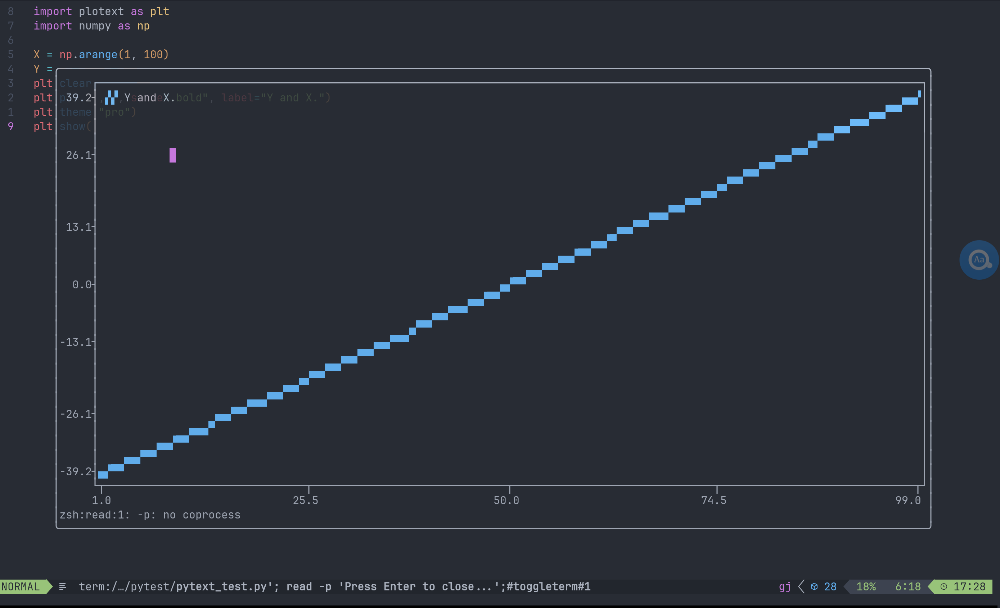
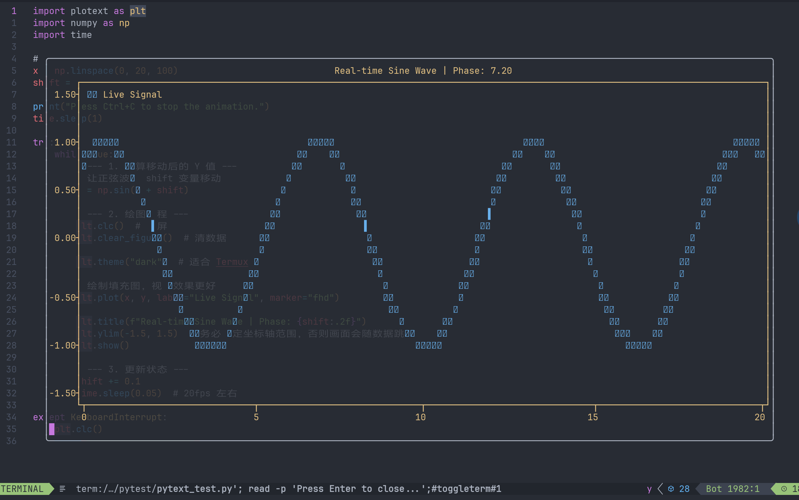

# 参考链接

[plotext](https://github.com/piccolomo/plotext)

最近迫于生计不得不开始学习机器学习，然而因为自己一贯喜欢用neovim写代码，用jupyter lab感觉非常的难受。但是由于termux是一个纯文本终端，我又没办法把图像直接显示在终端中。总之，最后找到了一个神奇的python库可以让我这种懒人直接在终端中查看图片，具体的实现方法就是用unicode字符拼成一个糊的一比的轮廓。不过，如果只是看一个图像的趋势的话也基本够用了。


# 简单的使用方法：

安装指令：

```sh
pip install plotext
```

随便的一个测试代码：

```python
import plotext as plt
import numpy as np

y = np.sin(np.linspace(0, 10, 100))
plt.plot(y)
plt.title("Sine Wave via Plotext")
plt.show()
```

运行效果：


以下是纯人工无添加的基于本人能工智人之力的introduction翻译：

**用之前要知道的头几件事：**:

- 默认情况下，**图像尺寸**会随着终端大小自动调整， 不过你也可以用`plotsize()`方法手动修改。[plotsize使用指南](https://github.com/piccolomo/plotext/blob/master/readme/settings.md#plot-size).
- 使用`subplots()`和`subplot()`方法可以创建**子图像**。[subplots使用指南](https://github.com/piccolomo/plotext/blob/master/readme/subplots.md#subplots).
- 多数的绘图函数中的`marker`参数可以用来指定绘图的“marker”（废话）（总之就是这个图像的线条格式）。[marker使用指南](https://github.com/piccolomo/plotext/blob/master/readme/aspect.md#markers)。 你可以使用一些比较高精度的线条格式，如`hd`，`fhd`，更极端一点的有`brailla`。
- `color`参数可以设定绘图**颜色**。[color使用指南](https://github.com/piccolomo/plotext/blob/master/readme/aspect.md#colors).
- 你可以分别使用`sin()`方法和`square()`方法来快速生成**正弦和方波图像**。[实用函数](https://github.com/piccolomo/plotext/blob/master/readme/utilities.md#useful-functions).
- 你可以使用`title()`，`xlabel()`，`ylabel()`方法来为图像添加**标签**。[label使用指南](https://github.com/piccolomo/plotext/blob/master/readme/aspect.md#plot-labels)，同时你也可以通过设定绘图函数`label`参数的方式添加**图像说明**[plot legend使用指南](https://github.com/piccolomo/plotext/blob/master/readme/basic.md#multiple-data-sets).
- 你可以使用`axes_color()`, `canvas_color()`, `ticks_color()`, `ticks_style()`方法来调整**图像颜色**和**坐标轴以及其刻度的颜色**，[color使用指南](https://github.com/piccolomo/plotext/blob/master/readme/aspect.md#colors)，或者直接使用`theme()`方法，[theme使用指南](https://github.com/piccolomo/plotext/blob/master/readme/aspect.md#themes)。
- 使用`grid()`, `horizontal_line()` or `vertical_line()`方法来添加**线条**。[plot-line使用指南](https://github.com/piccolomo/plotext/blob/master/readme/aspect.md#plot-lines)
- 使用`xaxes()`, `yaxes()`方法来添加和移除**坐标轴**，或者直接使用`frame()`，[plot-line使用指南](https://github.com/piccolomo/plotext/blob/master/readme/aspect.md#plot-lines)
- 使用`xfrequency()`, `xticks()`, `yfrequency()`和`yticks()`来改变**刻度**[axe-ticks使用指南](https://github.com/piccolomo/plotext/blob/master/readme/settings.md#axes-ticks)
- 和`matplotlib`类似，图像只有在`show()`被调用的时候才会**显示**。
- 如果你想要图像**交互式显示**，不要使用`show()`，而是使用`interactive(True)`方法。[canvas-utilities](https://github.com/piccolomo/plotext/blob/master/readme/utilities.md#canvas-utilities)（这个东西的用途是在python shell中一边改一边输出图像，不是让你的图像本身可以交互）
- 使用`savefig(path)`来**保存图像**。[canvas-utilities](https://github.com/piccolomo/plotext/blob/master/readme/utilities.md#canvas-utilities)
- 分别使用`clear_figure()`, `clear_data()`和`clear_color()`来**清除**图像、数据和颜色。[clearing-functions](https://github.com/piccolomo/plotext/blob/master/readme/utilities.md#clearing-functions)
- 使用`clear_terminal()`方法在绘图前后**清空屏幕**。[clearing-funtions](https://github.com/piccolomo/plotext/blob/master/readme/utilities.md#clearing-functions).
- doc容器中存放了所有的pytext方法和绘图函数的文档。[utilities.md](https://github.com/piccolomo/plotext/blob/master/readme/utilities.md#docstrings)

# 一些使用例

```python
import plotext as plt
import numpy as np

X = np.arange(1, 100)
Y = X * 0.8 - 40
plt.clear_figure()
plt.plot(X, Y, style="bold", label="Y and X.")
plt.theme("pro")
plt.show()
```



```python
import plotext as plt
import numpy as np

X = np.random.normal(0, 1, 2000).reshape(1000, 2)
w = np.array([2, -3.4])
Y = np.matmul(X, w) + 4.2
print(Y)
Y += np.random.normal(0, 0.01, 1000)

plt.theme("pro")
plt.plotsize(100, 30)
plt.scatter(X[:, 1], Y, marker="dot", label="synthetic data")
plt.title("Linear model synthetic data")
plt.ylabel("label")
plt.xlabel("features")
plt.show()
```


动态图像（强行clc()+show()实现动态效果）

```python
import plotext as plt
import numpy as np
import time

# 准备初始数据
x = np.linspace(0, 20, 100)
shift = 0

print("Press Ctrl+C to stop the animation.")
time.sleep(1)

try:
    while True:
        # --- 1. 计算移动后的 Y 值 ---
        # 让正弦波随 shift 变量移动
        y = np.sin(x + shift)

        # --- 2. 绘图流程 ---
        plt.clc()  # 清屏
        plt.clear_figure()  # 清数据

        plt.theme("dark")  # 适合 Termux

        # 绘制填充图，视觉效果更好
        plt.plot(x, y, label="Live Signal", marker="fhd")

        plt.title(f"Real-time Sine Wave | Phase: {shift:.2f}")
        plt.ylim(-1.5, 1.5)  # 务必固定坐标轴范围，否则画面会随数据跳变
        plt.show()

        # --- 3. 更新状态 ---
        shift += 0.1
        time.sleep(0.05)  # 20fps 左右

except KeyboardInterrupt:
    plt.clc()
    print("Animation stopped.")
```



显示本地图片（都用终端显示了，效果这块就只能委屈一下了）

```python
import plotext as plt

image_path = "./5pebbles.png"

plt.image_plot(image_path)

plt.frame(False)  # 去掉边框
plt.xticks(None)  # 去掉刻度
plt.yticks(None)  # 去掉刻度
plt.canvas_color("none")  # 背景透明
plt.show()

```


图取自[bilibili](https://www.bilibili.com/video/BV1t8411z7Rn/?spm_id_from=333.1387.favlist.content.click&vd_source=31ba3d75fa2995f7e1b776de7a637bd4)，侵删。