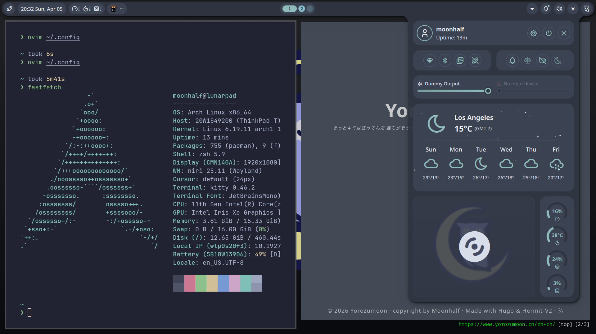

# 前言

一年以来我一直在我的平板上用termux写代码。这样做的原因是平板便携性和续航能力远强于又大又重的游戏本。另一方面，没有哪个laptop比平板更加配得上laptop这个头衔，平板真的能做到平稳而舒适地放在lap的top上。多亏有termux，我可以在几乎任何时间任何地方写代码，而且强行习惯了linux cli风格的工作环境。

然而，这套工作流有几个显著的缺点使得我不得不尝试探索新的方案：

- jvm语言写起来太痛苦。
	- 光是环境配置就够折磨的了。
	- nvim社区插件对jvm语言的支持度并不尽如人意。
	- jvm项目很多时候会和图像打交道。
		- 你不能指望我用纯文本终端写android应用。
- termux是纯文本终端。
	- 纯文本属性导致你没办法在终端中看图片。除非你再折腾一个窗口管理器然后反复切屏，或者在平板上跑一个桌面环境。但是就我的体验来说都不是很好的方案。
		- 机器学习很多时候需要看图片。
	- 不是很现代的终端ui。
- 跑不了docker。
- 不是一个真正的电脑，没有完整的linux内核，即使有proot也做不到很多linux原本可以做到的事情。
- 甚至跑不了conda。（虽然可以用miniforge）

以及一个潜在的解决方案——用树莓派代替电脑——存在的问题：

- 性能太烂。4G内存你能指望它做什么。
- 还是arm架构。很多x86上能直接跑的程序在树莓派上跑不了。（除非自己想办法交叉编译）
- 不好带。没有电池导致必须有插座才能跑。
- 还是没法显示图像。除非用平板当树莓派屏幕。（但是这不是纯折磨自己吗..）

其实最大的问题还是可视化，termux纯文本终端看不了图片非常痛苦。我一直计划补完cs61b，之后还想推我一直想学的cs61c、jyyos以及cs231n和eecs498。机器学习需要看图不多说了，cs61c疑似有个project是自己用模拟程序搓个cpu，会有图形界面。cs61b则是用nvim写作业非常痛苦。

总之，前天购买了thinkpad，于今日到货。计划刷上archlinux并搞一套桌面环境方便日后研究神秘科技。

# 又前言（4.5）

archlinux环境配的差不多了，整体配下来的感受就是非常的丝滑，几乎没有遇到报错，要装的所有东西pacman基本都能装，再不济yay或者flatpak也能装，全程几乎没有去手动克隆代码库编译，比在termux上装东西方便了不知道多少。

可能在古法编程时代archlinux真的是一个很有门槛的发行版，arch要求使用者对于linux系统工作的原理有相当的理解。现在其实同样如此，只不过有ai帮助，学概念性的东西几乎不用怎么费力了。
# 参考链接

[bilibili](https://www.bilibili.com/video/BV1L2gxzVEgs/?spm_id_from=333.337.search-card.all.click&vd_source=31ba3d75fa2995f7e1b776de7a637bd4)，b站随便找的教程，因为我对刷入linux完全没有概念，我觉得最好还是能看看整个流程到底是怎么一回事之后再尝试自己做。

[archlinux wiki](https://wiki.archlinux.org/)，可能会参考，但是大概率是遇到问题去问ai。

[distrochooser](https://distrochooser.de/zh-hans)，虽然测出来最适合的是debian，但是还是决定装archlinux。

[niri配置](https://www.sakimidare.top/posts/niri-manual/)，此博客的背后是一个超级计算机大手子。

[tty&shell](https://harkerhand.cn/Shell/)，后来刷到的一篇博客。背后是另一个巨佬。

#  一些概念

## .iso文件

光盘映像文件，最初按照ISO 9660标准设计，目的是为了完整复刻光盘上的所有数据。安装linux发行版必须去发行版官网下载对应的iso文件，其中包含了以下linux系统运行的必需组件：

- Bootloader，引导加载程序，电脑开机后读取的第一个程序，用于启动Linux内核。
- Linux内核。
- 一个小型的临时文件系统。
- 压缩的文件系统，在使用模式下实时解压读取。
- 安装程序。

之所以称作“光盘映像文件”是因为早年U盘还没有出现的时候，光盘是唯一的通用移动介质，所有的电脑固件里也都写入了如何读取光盘结构。因此光盘映像是所有计算机硬件的通用语言，即使现在有U盘了也必须要模拟光盘的结构。

.iso文件的另一特性是在线读取，假如你想使用一个Linux发行版，你甚至不需要把它从U盘安装到电脑硬盘，而是可以直接从U盘启动进入桌面（如果有桌面的话），原理是系统会在内存中创建一个虚拟磁盘，所有的修改都会存储在内存中，关机即消失。

## Boot Menu

在重启电脑后多次敲击F1或F12可进入。可以配置启动方式。通过配置启动方式我们可以让电脑启动时优先进入linux系统。

## 磁盘分区

win系统或者android系统几乎不用关系磁盘分区的事情，但是archlinux要求你必须手动完成分区。分区的意义是功能隔离，不同分区可以根据功能使用不同的文件系统。

UEFI固件在电脑启动之后会寻找efi分区中的.efi文件，其中存放的是bootloader，即启动引导程序。我们需要手动分出一个512MB的EFI分区用来在电脑启动之后引导启动Linux内核。

Swap分区称作交换空间或虚拟内存。当内存快满了的时候linux会将暂时不用的数据放到虚拟内存中，以及电脑休眠状态下内存中的信息会全量存储在虚拟内存中。因此，虚拟内存容量通常需要大于等于物理内存。

根分区用于存放操作系统、软件，以及全部的个人文件。

## Btrfs

一个相对先进的文件系统，支持系统快照、子卷等功能，可以方便你在把系统玩崩了之后回档。

### 挂载mounting

windows系统下分区有各自的盘符（比如C盘），但是linux下文件系统是一个单一的文件树。并不是所有物理存储设备或者其分区都天然的与你的文件树有关联。btrfs的一大作用正是把你的访问请求重定向到挂载的分区目录中。

手动挂载的好处是你可以把分区挂在任何你觉得合适的地方（虽然通常建议遵循最佳实践），此外，挂载的分区才会引入你的文件系统，意味着你可以在同一个磁盘上装多个系统，只要你不挂在其他系统的分区，它们就不会打架。

umount卸载不止是断开连接，它更大的作用是刷新缓存，强行把内存中缓存的快要写入磁盘但还没写入的数据冲到磁盘中，确保数据落地磁盘。

### 子卷subvolume

分区的大小是固定的，但是子卷的大小是不固定的。在btrfs文件系统下你可以在一个分区中随意创建任意数量的子卷，它们只代表一个逻辑分区。

你可以把子卷挂载到任意路径，并设置某个子卷的大小上限。此外，你可以给某个子卷单独保存快照，只要挂载快照子卷，系统就自动回滚。非常优雅的回档方式。

## 分区相关指令（一些也不是指令）

```sh
lsblk
```

显示块设备的名称、编号、尺寸、类型以及挂载点（即挂载的目录路径）。

```sh
cfdisk <path_to_mountpoint>
```

拥有tui的可视化分区工具。不同分区工具本质上做的是同一件事情，只是这个工具比较易用。

```sh
mkfs...
```

Make Filesystem，格式化一个分区并装入文件系统。

```sh
/dev 
```

linux语境下万物皆文件。硬件设备（或者分区）会被自动抽象为一个硬件节点放在/dev目录下（虽说访问硬件分区需要挂载，但是如果你甚至没办法找到硬件，那么你连索敌都做不到）。/dev的全称为Devices。（没错我一直以为是development的缩写..）

```sh
/mnt 
```

Mount的缩写。临时挂载文件系统的标准位置。一个/dev目录下的设备还不是一个目录，需要你手动把它挂载到/dev目录下。

```sh
mount /dev/<device_name> /mnt
```

把一个设备挂载到/mnt目录。

## fstab

**F**ile **S**ystem **Tab**le。挂载并不是理所当然自动进行的（很多我原本以为理所当然的事情在archlinux中都不成立）。你需要保存当前的挂载状态，之后在每次开机的时候让linux内核去读取并自动进行挂载。

在你手动完成了挂载之后，运行以下指令自动扫描挂载状态并存入fstab。

```sh
genfstab -U /mnt >> /mnt/etc/fstab
```

## arch-chroot

chroot表示**Ch**ange **Root**。在没有运行chroot时，你实际上并没有进入硬盘盘中的linux系统，而是在usb闪存盘中的临时系统。通过chroot，你可以将根目录挪到电脑的硬盘中，之后才能进行安装GRUB和引导程序的事情。

```sh
arch-chroot /mnt
```

## archlinux-keyring

官方包有开发者的私钥签名。在archlinux-keyring包中则存有系统的公钥。只要私钥和公钥对齐时你才能安全的下载包。私钥错误意味着该包并非Arch官方发布，公钥错误意味着你下载的iso文件可能过期了，你需要手动更新这个包。

```sh
pacman -Sy archlinux-keyring
```
## pacstrap

一个shell脚本。用来安装一系列基础工具。在运行pacstrap之前，你的硬盘里是没有linux内核的。iso文件中的linux内核只能在你安装系统的时候给你提供临时环境。

```sh
pacstrap -K /mnt base base-devel linux linux-firmware intel-ucode btrfs-progs networkmanager vim sudo
```

## Pacman

**Pac**kage **Man**ager的缩写（起名的人家里该请高人了），archlinux的系统级包管理器。pacman的设计理念是keep it simple and stupid。简单来说，它的特性如下：

- 软件包本质上就是一个zstd压缩后的压缩包，解压即安装；
- 滚动更新，系统没有大版本号，所有东西全部最新；
- 所有配置都由用户完成。（此处stupid的疑似是pacman）；
- 速度极快，底层使用C语言编写。

不同于apt等包管理器，pacman的使用没有install这样的子指令，而是以大写字母指定行为，小写字母调整参数。

- -S，表示Sync。从远程仓库同步包并本地安装。
- -R，表示Remove。卸载包。
- -Q，表示Query。在本地已经安装的包里找东西。
- -U，表示Upgrade。

一些基本用法：

安装某个包。S是同步Sync的缩写，假如该软件包已经安装，则会尝试重新安装。

```sh
sudo pacman -S ...
```

查看自己手动装的包。

```sh
pacman -Qe
```

卸载一个包和它未被其他包使用的依赖，最大程度保持系统干净。

```sh
sudo pacman -Rs ...
```

全系统更新，俗称滚系统。刷新软件包数据库并将所有已安装且有新版本的软件包更新到最新版。

```sh
sudo pacman -Syu
```

有的时候因为依赖处理不当，滚系统的时候可能会把系统滚崩，俗称滚挂。然而现在是ai时代了，只要每一步都和ai问清楚在做什么一般不太容易滚挂。

## AUR & yay

pacman虽然稳定但是其软件包由arch官方审核发布，有的时候我们会需要使用一些社区应用。AUR全称即Arch User Repository。不同于pacman直接分发二进制文件打包，AUR分发的是PKGBUILD脚本，安装AUR软件时会下载脚本并在电脑上现场编译安装。

yay是一个AUR助手，可以自动处理AUR的搜索、下载、依赖和编译。

一些常用指令：

更新整个系统，包括官方包和AUR。

```sh
yay -Syu
```

卸载包。

```sh
yay -Rs ...
```

查找手动安装的包。

```sh
yay -Qe
```

清理垃圾。

```sh
yay -Sc # 清理缓存
```

```sh
yay -Yc # 清除不再需要的孤立依赖
```

yay安装是我配置arch过程中少有的需要自己克隆仓库编译安装的。安装参考如下：

```sh
sudo pacman -S --needed git base-devel
git clone https://aur.archlinux.org/yay.git
cd yay
makepkg -si
```

唯一的小坑是可能yay安装的时候因为网络问题访问不到`aur.archlinux.org`，需要先好网络代理，或者从已经配好网络代理的机器上克隆然后移到arch中。

# 配置参考

安装archlinux过程是一遍看bilibili那个教程，一遍问ai怎么做，如果两边口径不同就停下来检查。两三个小时就装好了，没遇到什么困难。

图形界面配置很大程度参考了[这篇博客](https://www.sakimidare.top/posts/niri-manual/)，也装上了niri窗口管理器。但是需要注意的是niri窗口管理器的交互逻辑很大程度参考了vim。如果不习惯vim的话可能用起来会需要时间适应（KDE其实也挺好的）。我没提到基本就是照搬了这个博客。

配置的源代码也懒得贴了。一些和大手子配置不同的是没有装dolphin文件管理器，装了alacritty终端模拟器，但是后来改用了kitty。文件管理器我用的是yazi，改用kitty的原因是kitty对tui的一些特殊字符的支持更好，同时支持图像显示，alacritty虽然轻量但是只支持文字显示。yazi的特点是交互逻辑非常vim并且速度很快（根本就是tui工具），我对新电脑的最大期待就是仍然尽可能多的在终端干活。

因为是从头开始配置的，浏览器我装的是qutebrowser。这也是一个非常vim的浏览器，几乎一些原本需要鼠标点击的操作都可以通过键盘完成，并且有和vim类似的模式切换。此外，qutebrowser原生支持广告屏蔽，支持用户脚本和和pdf查看，并且可以通过`config.py`深度定制。代价是不支持为chrome或者edge开发的插件（或者说根本就没有插件系统）。之后可能会研究一下qutebrowser的配置方法。

安装微信和QQ用的是flatpak。后来了解到这种安装方法实际上规避了很多用yay安装的坑。总之，没有遇到任何问题，一切就顺利跑起来了。



后面可能还要再配置一下obsidian，换个壁纸。以及不知道为什么Noctalia说我在los angeles，之后也要调一下。