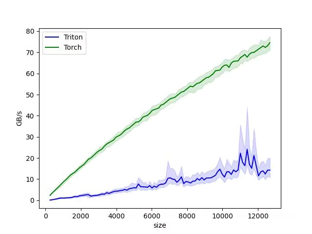

在经过了大约半个月的环境配置过程，终于成功在华为服务器上搭建起了vllm和triton开发环境，可以正式开始研究triton算子的写法了。但是我对triton算子没有任何概念，索性花了点时间逐行研究triton-ascend的官方文档示例代码。

本文参考链接如下：

[Triton Ascend](https://gitcode.com/Ascend/triton-ascend)

[01-vector-add教程](https://gitcode.com/Ascend/triton-ascend/blob/master/docs/sources/getting-started/tutorials/01-vector-add.md)

文章写完之后突然意识到triton语境下数据缓存的位置实际是显存而非传统意义的内存。文中可能会出现显存内存不分的情况，意会即可。

---

# 向量相加 （Vector Addition）

在本节中，我们将使用 Triton 编写一个简单的向量相加的程序。
在此过程中，你会学习到：

- Triton 的基本编程模式。
- 用于定义 Triton 内核的`triton.jit`装饰器（decorator）。

计算内核:

```python
import torch
import torch_npu

import triton
import triton.language as tl


@triton.jit
def add_kernel(x_ptr,  # 指向第一个输入向量的指针。
               y_ptr,  # 指向第二个输入向量的指针。
               output_ptr,  # 指向输出向量的指针。
               n_elements,  # 向量的大小。
               BLOCK_SIZE: tl.constexpr,  # 每个程序应处理的元素数量。
               # 注意：`constexpr` 将标记变量为常量。
               ):
    # 不同的数据由不同的“process”来处理，因此需要分配：
    pid = tl.program_id(axis=0)  # 使用 1D 启动网格，因此轴为 0。
    # 该程序将处理相对初始数据偏移的输入。
    # 例如，如果有一个长度为 256, 块大小为 64 的向量，程序将各自访问 [0:64, 64:128, 128:192, 192:256] 的元素。
    # 注意 offsets 是指针列表：
    block_start = pid * BLOCK_SIZE
    offsets = block_start + tl.arange(0, BLOCK_SIZE)
    # 创建掩码以防止内存操作超出边界访问。
    mask = offsets < n_elements
    # 从 DRAM 加载 x 和 y，如果输入不是块大小的整数倍，则屏蔽掉任何多余的元素。
    x = tl.load(x_ptr + offsets, mask=mask)
    y = tl.load(y_ptr + offsets, mask=mask)
    output = x + y
    # 将 x + y 写回 DRAM。
    tl.store(output_ptr + offsets, output, mask=mask)
```

# 如何理解？

## 1. 什么是“计算内核”？

通常的python程序运行在cpu上，程序的执行方式是串行（一行一行执行）。

但是在npu/gpu上，计算核心的组成和cpu上完全不同。npu/gpu上的核心功能远比cpu简单，但是核心数量远远大于cpu，适合用来处理大量的简单计算。为了快速计算，我们需要让核心并行计算，即几千个核心同时进行计算。这时的程序逻辑就和cpu上有所区别。

### 计算内核（kernel）

我们没有办法通过一个巨大的程序控制全局，而是通过发射kernel的方式明确每个npu/gpu小核心的工作内容。kernel就是你送给小核心的指令。发射一次kernel，所有的指定核心就会按照你给出的指令进行同样的计算操作，而他们之间的区别就在于操作的内存地址有所不同。

---

## 2. @triton.jit装饰器在干什么?

显然，你的python程序没办法直接跑在npu/gpu上。npu/gpu核心功能本身就很简单了，而你的python程序则是跑在cpu上的。所以，你需要方法把python程序代码解读为npu/gpu能懂的语言。

在写`def add_kernel()`前为它加上`@triton.jit`装饰器后，在你运行这个python程序时，这段`add_kernel`函数就会被编译为npu/gpu能懂的二进制机器码，并将这个npu/gpu能直接读懂的指令放在某个地方，等待调用。

当你真正调用`add_kernel`这个函数时，系统实际上并不会在cpu上执行这个函数的函数体，而是通过驱动程序直接使用刚才编译好的二进制机器码。

说白了，就是把这段python程序变成npu上能高速运行的二进制程序。

---

## 3. 行业黑话

### `x_ptr`、`y_ptr`、`output_ptr`

向量的起始地址。向量在内存中的存储是连续的，因此我们只需要一个起始地址就可以描述这个向量中所有元素的位置。

---

### `BLOCK_SIZE:tl.constexpr`

在这里，注释中出现了一个“程序”的概念。此处的“程序”如果代入我们通常对“程序”的理解，在这个上下文中会显得非常违和。所以，我们需要先来明确npu语境下“程序”的概念。

### 什么是Triton语境下的“程序”?

在 Triton 的代码逻辑里：

> **一个“程序（instance）” = 你的内核函数被复制并运行的其中一次“副本”。**

举个例子：

- 假如总数据量为1024。
- 你规定了一个block_size，让一个“副本”每次只能处理128个数据。
- 所以根据代码，你最后算出来你需要启动8个副本。
- 你创建了8个副本，核心就会自动来取走你创建的副本，一旦一个副本完成，多余的核心就会立刻投入接下来的副本的工作。

用一个形象比喻：

- 考试总共要做1024道题（数据量）。
- 参加考试的考生有4个（核心数）。
- 一个卷子只能放128道题（你规定的block_size）。
- 你打印了8张卷子（程序），每个卷子有128道题。
- 考生每个人各自拿走了1张卷子，做完一张后自动再取剩下的卷子。

### 为什么要固定block_size？

比如，你可能会认为，直接一张卷子印256道题不就没有中间调度的问题了吗？或者随便多少道题只要最后完成就行。

但是，在triton的语境下，规定好block_size之后，编译器就可以针对这个任务包大小对生成的二进制机器码进行疯狂优化。将block_size定为常量可以大幅提升运算效率。

---

### `pid = tl.program_id(axis = 0)`

别忘了，我们在写的东西是一个**kernel**。我们最后会把这同一个kernel发送给所有的核心，但是这些核心最后需要去处理不同内存地址上的向量，这样才能实现并行计算的目的。

这些核心之间唯一有区别的地方，就在于它们被分配到的`program_id`不同。因此，通过program_id，你实际上做的事情是告诉核心根据它正在进行的程序id去随机应变。而我们此处的“随机应变”就是让核心根据程序id去操作相应的内存地址。

---

### `block_start = pid * BLOCK_SIZE`

任务块的起始点。在本代码情景下，你要操作的内存是一大片连续内存空间，所以将它分块后你需要让核心先知道自己所处理的那一块数据的一个“锚点”在哪，再根据“锚点”位置通过偏移量明确操作的具体位置。

---

### `offsets = block_start + tl.arange(0, BLOCK_SIZE)`

`tl.arange(0, BLOCK_SIZE)`直接生成一个0到BLOCK_SIZE的序列，加上block_start对序列中的每个数字添加一个起始值，最后得到了一个偏移量向量，代表了这一批任务的具体内存偏移。

---

### `mask = offsets < n_elements`

Mask的含义是“掩码”。简单来说，这里offsets是一个向量，而n_elements则是一个数字。根据torch、triton、numpy等数据科学工具常见的神奇的**广播**机制，n_elements被直接复制了若干个而组成了一个和offsets大小一致的向量，最后mask得到的也是一个向量，但是内容是offsets中对应元素与n_elements比较结果的布尔值。

比如，假如`offsets = [1,2,3]`，`n_elements = 3`，那么最后`mask`就得到`[True,True,False]`。

通过这种方式，我们可以确保核心工作不越界。比如，假如你的向量有1000个数据要处理，但是你设置的BLOCK_SIZE大小却是128，1000除不尽128，那么最后一个块就只会计算掩码中为true的部分，保证不去越界计算向量外的内存。

---

### `x = tl.load(x_ptr + offsets, mask=mask)`

x_ptr为第一个向量的起始地址，offsets为偏移量向量。显然，这里也通过广播机制得到了一个向量，而这个向量信息的含义就是核心要读取的信息在内存中的绝对地址。`mask = mask`通过关键字传值的方式将我们前面计算过的掩码传入load函数的mask参数。最后返回得到的x即为符合mask掩码约束的x_ptr+offsets部分的内存对应的信息组成的新向量。mask为false的部分信息被自动填充为0.0。

---

## 这段代码做了什么？

定义了一个函数，它会在运行时直接转换为二进制机器码。它提供了若干参数，分别允许你去控制输入的两个向量的起始地址，输出向量的地址，向量的大小，以及过程中的BLOCK_SIZE。

调用这个函数，程序就会在你指定的内存地址分别读取向量大小个数的数据，并分别相加，最后存入输出向量的地址。只不过，这些操作是通过npu而非cpu完成的。

---

# torch add

创建一个辅助函数用于：

- 生成 z 张量；
- 用适当的 grid/block sizes 将上述内核加入队列。

```Python
def add(x: torch.Tensor, y: torch.Tensor):
    # 需要预分配输出。
    output = torch.empty_like(x)
    n_elements = output.numel()
    # 启动网格表示并行运行的内核实例的数量。
    # 可以是 Tuple[int]，也可以是 Callable(metaparameters) -> Tuple[int]。
    # 在本case中，使用 1D 网格，其中大小是块的数量：
    grid = lambda meta: (triton.cdiv(n_elements, meta['BLOCK_SIZE']), )
    # NOTE:
    #  - 每个 torch.tensor 对象都会隐式转换为其第一个元素的指针。
    #  - `triton.jit` 函数可以通过启动网格索引来获得可调用的 NPU 内核。
    #  - 不要忘记以keywords的方式传递meta-parameters。
    add_kernel[grid](x, y, output, n_elements, BLOCK_SIZE=1024)
    # 返回 z 的句柄。
    return output
```

## 这段代码又是干什么的？

这是一个**宿主端**的代码。简单来说，torch开发者需要能进行并行计算来实现业务逻辑，但是他们并不想去关心你底层实现的逻辑。因此，作为triton开发者，你需要做的是把这个功能封装为一个极其简单易用同时兼顾安全性的函数，供客户随时调用。

我们来逐行分析这段代码：

---

### `output = torch.empty_like(x)`

调用torch库，在npu显存上为output挖了一个和x一样大小的坑，让output存入这个坑的地址。

如果你不挖这个坑，你前面写的add_kernel就不知道该把运算结果存到哪个位置，而python函数通常要返回运算值而非算完之后随便扔在某个地方。

---

### `n_elements = output.numel()`

让`n_elements`存入`output`的大小。

---

### `grid = lambda meta: (triton.cdiv(n_elements, meta['BLOCK_SIZE']), )`

这行代码是这个函数中相对复杂的一段。它的作用是**动态决定需要启动的程序数**。

`grid`的类型是一个lambda函数，在后文中，它被通过一种邪门的写法传入了add_kernel中。你可能注意到了，grid并非写入圆括号当中，而是写在方括号中。我们后文中会提及这种写法的意义。总之，这是一种一般python程序中不会涉及到的写法。

`triton.cdiv`是**ceiling division**的缩写，即向上取整。

这个时候，你可能就会有疑问：meta是个什么东西？你先别急，我们先看后面一句代码。

---

### `add_kernel[grid](x, y, output, n_elements, BLOCK_SIZE=1024)`

这段代码即调用了我们前文写的add_kernel函数。

在这个lambda函数中，meta的类型是一个字典。在你发射kernel时，它里面装的就是你所传递的**元参数**。在我们写的add函数中，x、y均为Torch中的Tensor数据类型，传参时会隐式转换为内存地址。而output在我们前文中也已经提前挖好坑了。

但这里，我们通过了一些邪门的方法额外传入了一个grid函数。下面我就来解释一下这种写法的含义。

#### `meta`

triton的开发者预料到了你需要有办法去根据特殊情景决定启动的程序数量，所以他们提供了一种方式让你可以获取客户在使用你封装好的函数时的传参情况。

什么方式呢？在你使用`@triton.jit`装饰好的函数时，triton会捕捉到你传入的参数，构成一个**字典**。比如，在我们上文写出的add_kernel函数中，这个字典大概长成这样：

```python
meta = {
 "x_ptr" : <address>
 "y_ptr" : <address>
 "output_ptr" : <address>
 "n_elements" : <numble>
 "BLOCK_SIZE" : <numble>
}
```

系统在进行运算之前，会先生成这个字典，然后暗中调用一个lambda函数，将这个字典作为参数传入，根据得到的结果进而决定最后启动的程序个数。

你通常没办法直接调用这个字典，不过幸运的是，你可以去决定系统暗中调用的lambda函数的形式，而这个lambda函数传入的参数正是triton生成的参数字典。

因此，我们在前面定义lambda函数grid为`lambda meta: (triton.cdiv(n_elements, meta['BLOCK_SIZE']), )`，意义就是在add_kernel生效之前读取传入的参数字典，根据参数字典中BLOCK_SIZE的值计算出需要的最少启动程序数，然后系统通过这个返回值最终决定启动的程序数。

---

### `return output`

返回`output`这个生成的tensor。

---

使用上述函数计算两个 `torch.tensor` 对象的 element-wise sum，并测试其正确性：

```Python
torch.manual_seed(0)
size = 98432
x = torch.rand(size, device='npu')
y = torch.rand(size, device='npu')
output_torch = x + y
output_triton = add(x, y)
print(output_torch)
print(output_triton)
print(f'The maximum difference between torch and triton is '
      f'{torch.max(torch.abs(output_torch - output_triton))}')
```

这是一段测试代码。x、y分别是使用torch生成的随机向量。`output_torch`为直接使用torch内置方法计算得到的向量和，`output_triton`为使用我们自定义函数计算得到的向量和，最后打印两者的最大残差。

理论上来说，如果程序正确，`output_torch`和`output_triton`应该输出完全一致。

Out:

```bash
tensor([0.8329, 1.0024, 1.3639,  ..., 1.0796, 1.0406, 1.5811], device='npu:0')
tensor([0.8329, 1.0024, 1.3639,  ..., 1.0796, 1.0406, 1.5811], device='npu:0')
The maximum difference between torch and triton is 0.0
```

"The maximum difference between torch and triton is 0.0" 表示Triton和PyTorch的输出结果一致。

但是，如果你真正去衡量torch方法与triton方法之间的计算速度，你会发现triton方法算出来的速度基本与torch方法持平，甚至更慢一点。原因很简单，torch经过了长期的优化，这种基础算子的计算速度基本已经达到了物理极限，而我们自己写的triton算法在调用npu显存数据上要花费额外的时间。

triton算子真正的优势区间在于写“融合算子”。同样的操作，pytorch的每一步操作都要单独去显存拉取一次数据，操作多起来之后这一步拉取操作就会显著影响运行速度。而通过写triton算子直接操作显存，一次拉取数据之后直接计算得到结果，这样就可以规避中间不必要的额外拉取用时。

---

# 如何测试运行速度？

因为异步运算的缘故，torch和time模块这样基于CPU的计时方法无法测量NPU中的真正用时。我们需要使用triton提供的专业基本测试工具`triton.testing.do_bench`来测试计算效率。

在下列实例代码中，我们采用带宽吞吐量为依据衡量torch和triton的运行速度差异。

```python
import matplotlib

# 强制使用 'Agg' 后端，这个后端专门用于不弹窗直接生成图片文件
matplotlib.use("Agg")
import matplotlib.pyplot as plt

import torch

import torch_npu

import triton
import triton.language as tl


@triton.jit
def add_kernel(
    x_ptr,  # 指向第一个输入向量的指针。
    y_ptr,  # 指向第二个输入向量的指针。
    output_ptr,  # 指向输出向量的指针。
    n_elements,  # 向量的大小。
    BLOCK_SIZE: tl.constexpr,  # 每个程序应处理的元素数量。
    # 注意：`constexpr` 将标记变量为常量。
):
    # 不同的数据由不同的“process”来处理，因此需要分配：
    pid = tl.program_id(axis=0)  # 使用 1D 启动网格，因此轴为 0。
    # 该程序将处理相对初始数据偏移的输入。
    # 例如，如果有一个长度为 256, 块大小为 64 的向量，程序将各自访问 [0:64, 64:128, 128:192, 192:256] 的元素。
    # 注意 offsets 是指针列表：
    block_start = pid * BLOCK_SIZE
    offsets = block_start + tl.arange(0, BLOCK_SIZE)
    # 创建掩码以防止内存操作超出边界访问。
    mask = offsets < n_elements
    # 从 DRAM 加载 x 和 y，如果输入不是块大小的整数倍，则屏蔽掉任何多余的元素。
    x = tl.load(x_ptr + offsets, mask=mask)
    y = tl.load(y_ptr + offsets, mask=mask)
    output = x + y
    # 将 x + y 写回 DRAM。
    tl.store(output_ptr + offsets, output, mask=mask)


@triton.testing.perf_report(
    triton.testing.Benchmark(
        x_names=["size"],  # 作为x轴变化的参数
        x_vals=[128 * i for i in range(2, 100)],  # 测试从 256 到 12800 的不同大小
        line_arg="provider",
        line_vals=["triton", "torch"],  # 对比这两家
        line_names=["Triton", "Torch"],
        styles=[("blue", "-"), ("green", "-")],
        ylabel="GB/s",  # 用带宽吞吐量作为指标
        plot_name="vector-add-performance",
        args={},
    )
)
def benchmark(size, provider):
    x = torch.rand(size, device="npu", dtype=torch.float32)
    y = torch.rand(size, device="npu", dtype=torch.float32)
    # 预热显存分配
    quantiles = [0.5, 0.2, 0.8]

    if provider == "torch":
        ms, min_ms, max_ms = triton.testing.do_bench(lambda: x + y, quantiles=quantiles)
    if provider == "triton":
        output = torch.empty_like(x)
        grid = lambda meta: (triton.cdiv(size, meta["BLOCK_SIZE"]),)

        # 封装一下 lambda 方便测速
        def call_triton():
            add_kernel[grid](x, y, output, size, BLOCK_SIZE=1024)

        ms, min_ms, max_ms = triton.testing.do_bench(call_triton, quantiles=quantiles)

    # 返回吞吐量计算 GB/s
    def gbps(ms):
        # 读x(4 bytes) + 读y(4 bytes) + 写output(4 bytes) = 12 bytes
        return 12 * size / ms * 1e-6

    return gbps(ms), gbps(max_ms), gbps(min_ms)


# 运行 benchmark
benchmark.run(print_data=True, show_plots=False, save_path="./bench_result")

```

在使用这个测试工具之前，你需要先确保安装了`matplotlib`、`pandas`、`numpy`等基本数据科学库。最后你可以得到由matplotlib生成的性能测试图表。

在本代码中，实际进行加法计算的用时非常少，大部分的用时都在信息搬运上，而带宽正描述的是这一行为的速率。通过运行这段代码，我们就成功得到了torch原生写法与我们自己写的triton算子之间的性能差异图表。


