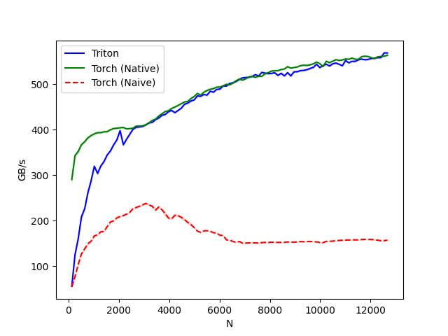

# 融合 Softmax （Fused Softmax）

在本节中，我们将使用 Triton 编写一个融合的 softmax 操作的程序。
在此过程中，你会学习到：

- 内核融合对于带宽受限操作的优势。
- Triton 中缩减操作。

## 使用原生 PyTorch 对 X 逐行进行 Softmax 计算

```Python
import torch
import torch_npu

import triton
import triton.language as tl

def naive_softmax(x):
    """
    我们减去最大元素以避免溢出。Softmax 对于这种偏移是不变的。
    """
    # 读取 MN 个元素；写入 M 个元素
    x_max = x.max(dim=1)[0]
    # 读取 MN + M 个元素；写入 MN 个元素
    z = x - x_max[:, None]
    # 读取 MN 个元素；写入 MN 个元素
    numerator = torch.exp(z)
    # 读取 MN 个元素；写入 M 个元素
    denominator = numerator.sum(dim=1)
    # 读取 MN + M 个元素；写入 MN 个元素
    ret = numerator / denominator[:, None]
    # 总计：读取 5MN + 2M 个元素；写入 3MN + 2M 个元素
    return ret
```

### 什么是"Softmax"？

在大模型开发中，softmax是一个非常重要的算法。它的作用是把绝对的分数转化为相对概率。

举个简单的例子，假如某段对话中，大模型对下一个应该吐出的字，心里经过计算得到应该为`猫`、`狗`、`猪`，分数分别为10分，5分，20分。大模型需要在这三个字之间摇骰子选出一个。这时候我们就需要将分数转化为对应的概率。

将分数转化为概率的方法可以有很多种，在这里我们所采用的方式是：以每个元素分数的指数为权重决定最后概率。我们先求得每个元素的e指数，之后对e指数求和，然后计算每个元素e指数与总和的比值，最后得到概率。通过e指数，我们可以拉大差距，让最高分者有更大的可能成为答案，同时保留其他元素出现的可能。x-x_max的作用是防止e指数算出来结果过大导致溢出。根据数学推导，可以得知这里采用x和x-x_max计算得到的概率是相同的。

---

### 内核融合的目的

当在 PyTorch 中以原生方式实现时，计算`y=naive_softmax(x)`需要从 DRAM 中读取 5MN+2M 个元素，并写回 3MN+2M 个元素。显然这是非常低效的；我们更希望使用一个自定义的“融合”内核，它只需读取一次 X，并在芯片上完成所有必要的计算。
这样一来只需读取和写回 2MN 个字节，因此我们可以期望理论上的加速比大约为 4 倍（即 (8MN+4M)/2MN）。

`torch.jit.script`旨在自动执行这种“内核融合”，但它仍然远未达到理想状态。

#### DRAM

显存。在triton算子开发的语境下，内存有着严密的**层级**关系。不同层级的内存有着不同的功能。其中DRAM即显存的地位类似总仓库，通常有几十个G，但是庞大的存储空间对应的代价是极慢的读写速度。torch原生语句出于通用性考虑，每次读写都以DRAM为对象，但是在一些复杂的操作中就会使得出现过多理论上不必要的读写操作。triton算子提高性能的本质也就是将对DRAM的读写操作压缩到最少。

除了DRAM，triton算子开发中还有一个相当重要的概念就是SRAM，即共享内存。这就是triton语句中默认的读写位置。triton编译器会帮你自动管理这个层级的内存，而这个层级的特点就是虽然空间很小，但是读写速度很快。

在我们的triton算子开发过程中，我们通过`tl.load`来从DRAM中拉取数据，并通过`tl.store`来将数据写入DRAM。其余的变量操作本质都是在SRAM和寄存器中操作。

---

## 计算内核

softmax 内核工作原理如下：每个计算单元（program）以程序数量为跨度加载输入矩阵X的一组行数据，执行归一化处理后，将结果写入输出矩阵Y。
注意：Triton 的一个重要限制是每个块必须具有 2 的幂次数的元素，因此，如果我们要处理任意可能的输入形状，需要在内部「填充」每一行，并适当保护内存操作。

```Python
@triton.jit
def softmax_kernel(output_ptr, input_ptr, input_row_stride, output_row_stride, n_rows, n_cols, BLOCK_SIZE: tl.constexpr):
    # 程序起始行
    row_start = tl.program_id(0)
    row_step = tl.num_programs(0)
    for row_idx in tl.range(row_start, n_rows, row_step):
        # 步长表示我们需要对指针增加多少以推进 1 行
        row_start_ptr = input_ptr + row_idx * input_row_stride
        # 块大小是大于 n_cols 的下一个二的幂，因此我们可以适配
        # 单个块中的行
        col_offsets = tl.arange(0, BLOCK_SIZE)
        input_ptrs = row_start_ptr + col_offsets
        # 将行加载到 SRAM 中，使用掩码，因为 BLOCK_SIZE 可能大于 n_cols
        mask = col_offsets < n_cols
        row = tl.load(input_ptrs, mask=mask, other=-float('inf'))
        # 为了数值稳定性而减去最大值
        row_minus_max = row - tl.max(row, axis=0)
        # 请注意，Triton 中的指数运算速度很快，但是是近似的。
        numerator = tl.exp(row_minus_max)
        denominator = tl.sum(numerator, axis=0)
        softmax_output = numerator / denominator
        # 将输出写回 DRAM
        output_row_start_ptr = output_ptr + row_idx * output_row_stride
        output_ptrs = output_row_start_ptr + col_offsets
        tl.store(output_ptrs, softmax_output, mask=mask)
```

### 这段代码做了什么事情？

我们在前文中谈到了融合算子提高性能的手段是只读取一次DRAM的数据，中间的计算过程全部放在SRAM中进行。但是对于怎么实现的我们尚不得而知。这段代码就是“教科书级别”的Triton Fused Softmax实现方式。

我们来分块解读这段代码：

---

#### 分配任务

```python
row_start = tl.program_id(0)      # 我是第几号工人（PID）
row_step = tl.num_programs(0)     # 总共有多少个工人（Grid Size）
for row_idx in tl.range(row_start, n_rows, row_step):
```

`tl.program_id(0)`表示的就是当前核心被分配到的目标程序id，`tl.num_programs(0)`则是总共的程序数。让行步长设置为程序数，目的就是让遍历所有行的时候不同程序进程不会相互冲突。随后使用for循环遍历所有的从`row_start`到`n_rows`之间步长为`row_step`的行。

比如，假如有1000行数据，但是总共只有n个工人，第i个工人就应该去处理第`n * k + i`个数据，这样不同工人之间处理的数据才不会相互重叠。

---

#### 获取数据

```python
# 算出这一行在内存里的起始地址
row_start_ptr = input_ptr + row_idx * input_row_stride

# 制造一个 [0, 1, ..., BLOCK_SIZE-1] 的索引条
col_offsets = tl.arange(0, BLOCK_SIZE)

# 算出这一行每个元素具体的内存地址
input_ptrs = row_start_ptr + col_offsets

# 制作掩码：只保留真实数据长度以内的部分
mask = col_offsets < n_cols

# 【关键动作】从 HBM 加载到 SRAM
# other=-inf 是为了防止填充部分的 0 干扰求 Max（如果是 0 可能会变成最大值）
row = tl.load(input_ptrs, mask=mask, other=-float('inf'))
```

前面三行代码的作用就是直接生成一个可以覆盖整个行的内存地址向量。虽然我们感觉要处理的数据似乎是呈二维排布的，但是在内存中的真实情况是所有信息都是线性排布的。因此，我们可以直接将每一行的起始地址加上偏移量向量得到这一行每个元素的地址组成的向量。

在这行代码中，`input_row_stride`本质上就代表了你一行元素的个数。

但是这时，有一个很关键的问题就是，BLOCK_SIZE的大小只能是2的整数次幂。为了能让核心一个任务就能处理一行数据，并且过程中不存在内存越界的情况，我们引入“掩码”的概念。将`mask`赋值为一个布尔向量，对应位置在我们目标范围内的元素为true，反之为false。这样，根据mask再调用tl.load函数我们就可以得到这一整行的数据。

---

### 计算数据

```python
# 1. 找最大值 (只读 SRAM)
row_minus_max = row - tl.max(row, axis=0)

# 2. 算指数 (只读 SRAM)
numerator = tl.exp(row_minus_max)

# 3. 求和 (只读 SRAM)
denominator = tl.sum(numerator, axis=0)

# 4. 算除法 (只读 SRAM)
softmax_output = numerator / denominator
```

这里大量使用了数据科学库常见的广播机制，最后实现的效果和pytorch中的原生代码效果一致，只不过计算过程发生在SRAM当中。

---

### 写入数据

```python
# 算出输出的内存地址
output_row_start_ptr = output_ptr + row_idx * output_row_stride
output_ptrs = output_row_start_ptr + col_offsets

# 【关键动作】从 SRAM 写回 HBM
tl.store(output_ptrs, softmax_output, mask=mask)
```

直到最后一步再把数据写入DRAM当中。完成整个kernel运算。

---

# 辅助函数

我们可以创建一个辅助函数，该函数能够将核函数及其元参数加入执行队列，以处理任意给定的输入张量。

```Python
target = triton.runtime.driver.active.get_current_target()
kernels = {}

def softmax(x, stream):
    n_rows, n_cols = x.shape

    # 每次循环迭代的块大小是大于或等于`x`列数的最小二的幂
    BLOCK_SIZE = triton.next_power_of_2(n_cols)
    # 分配输出空间
    y = torch.empty_like(x)

    # 预编译内核以获取寄存器使用情况并计算线程占用情况。
    kernel, num_programs = kernels.get(BLOCK_SIZE, (None, 0))
    if kernel is None:
        num_programs = 32
        kernel = softmax_kernel
        kernels[BLOCK_SIZE] = (kernel, num_programs)

    num_programs = min(num_programs, n_rows)

    kernel[(num_programs, 1, 1)](
        y,
        x,
        x.stride(0),
        y.stride(0),
        n_rows,
        n_cols,
        BLOCK_SIZE
    )
    return y
```

这段代码有几个相对不太容易理解的机制。下面我来一一解答。

### Q1：函数外的target、kernels的作用是什么？

`kernels = {}`注意这种写法在python中代表着创建一个字典。它不是什么triton中特有的语法。在本代码中，kernels字典的key为BLOCK_SIZE，即任务块的大小，而值则为一个存储了kernel函数和启动程序数的元组，代表一种启动程序的方式。

每次我们运行带有`@triton.jit`装饰的函数时，triton都需要依据输入的参数做一系列初始化的工作。多数时候，softmax函数是一个相对常用的函数，假如每次调用这个函数都必须要重新初始化就会导致不必要的性能浪费。所以我们通过memo字典的方式存储记录的方式实现性能优化。

`target`的意义是获取当前设备的硬件信息。在本代码片段中没有被用到。

---

### Q2：kernel.get是做什么的？

查表。在之前的softmax使用过程中，我们很可能已经处理了相同的BLOCK_SIZE场景。这里因为返回的是元组，所以直接赋值两个变量自动解包。如果存储的kernels中没有所需的记录，后面我们就会为之创建一套解决方案。

---

### Q3：看起来kernel只可能为softmax_kernel，这样的话为什么还要多存储一个kernel在memo中呢？

因为softmax_kernel之间也有区别。区别就在于，假如我们为softmax_kernel添加一个`@triton_autotune（）`装饰器，我们调用的kernel函数就会依据情况不同而发生变化，而转化为针对对应参数时的最优BLOCK_SIZE配置版kernel。

通过memo字典，我们直接捕捉这些发生变化的kernel函数，使得遇到相同BLOCK_SIZE时我们无需再次把性能用在自动调优上，进一步实现优化。

---

### Q4：kernel\[...](...)是什么写法？

这是一个非常神奇的写法。

在kernel\[...]的方括号当中写入的是一个元组，其中包含至多三个元素。写成方括号的形式看起来像是在查字典，但是实际上做的事情也确实类似。`launcher = kernel[(100,1,1)]`最后会得到一个配置好的启动器对象。kernel对象的__getitem__方法在triton中被覆写了，让你可以通过这种方式得到一个自定义形状的启动模式。在这里，我们得到了一个一维的由100个程序或进程组成的启动方法。如果你想只写入一个参数，记得python中的一元元组要求必须在元素后加一个逗号，即`(x,)`。

还记得`pid = tl.program_id(0)`吗？这里之所以需要一个参数0，本质上就是因为程序进程的排布方式是三维的。输入0就意味着返回当前程序的第一维坐标。由于我们使用的启动方式就是一维的，只读取第一维坐标就足够区分不同的程序进程了。

之所以程序启动会是一个立体的三维概念，根本上并不是因为显卡中核心是这么排布的，而是方便人类去适配不同的数据结构。比如如果你要处理图像，你可能针对每一个像素点都要开一个程序，这时使用二维方式启动程序并用横纵坐标来标记程序就可以为写代码带来方便。同时，这也会间接带来性能上的优化。

在01_vector_add中，我们在这个方括号中传入了一个lambda函数。这个lambda函数传入的参数就是kernel函数的参数字典。我们可以通过那种方式来动态决定启动程序数，但是在这里，我们本质上使用了memo记忆化搜索的方式来进一步优化性能，使得相同的情景我们无需再将性能用在动态决定启动程序数上。

---

## 单元测试

需要在一个具有不规则行和列数的矩阵上测试处理好的内核，此举可以验证Padding机制是否起作用

```Python
device = torch.npu.current_device()
stream = torch.npu.current_stream(device).npu_stream
torch.manual_seed(0)
x = torch.randn(1823, 781, device='npu')
y_triton = softmax(x, stream)
y_torch = torch.softmax(x, axis=1)
assert torch.allclose(y_triton, y_torch), (y_triton, y_torch)
print(y_triton)
print(y_torch)
print(f'The maximum difference between torch and triton is '
      f'{torch.max(torch.abs(y_triton-y_torch))}')
```

我们上文中编写的帮助函数实际作用是对目标的二维张量的每一行进行softmax计算。在这个例子中，我们生成了一个由随机数构成的张量x，随后分别使用torch原生方法和triton融合算子来对它进行softmax计算，最后测量两结果之间的最大差异。

理论上来说，我们的triton算子和torch原生算子的数学过程是等价的。之所以会出现微小误差实际上是过程中的计算步骤的底层实现方法导致了一些浮点数精度误差。

Out:

```bash
tensor([[0.0002, 0.0017, 0.0009,  ..., 0.0009, 0.0013, 0.0073],
        [0.0001, 0.0004, 0.0006,  ..., 0.0006, 0.0004, 0.0003],
        [0.0007, 0.0002, 0.0006,  ..., 0.0011, 0.0004, 0.0039],
        ...,
        [0.0021, 0.0002, 0.0015,  ..., 0.0012, 0.0014, 0.0022],
        [0.0003, 0.0002, 0.0007,  ..., 0.0005, 0.0006, 0.0007],
        [0.0034, 0.0014, 0.0005,  ..., 0.0007, 0.0016, 0.0028]],
       device='npu:0')
tensor([[0.0002, 0.0017, 0.0009,  ..., 0.0009, 0.0013, 0.0073],
        [0.0001, 0.0004, 0.0006,  ..., 0.0006, 0.0004, 0.0003],
        [0.0007, 0.0002, 0.0006,  ..., 0.0011, 0.0004, 0.0039],
        ...,
        [0.0021, 0.0002, 0.0015,  ..., 0.0012, 0.0014, 0.0022],
        [0.0003, 0.0002, 0.0007,  ..., 0.0005, 0.0006, 0.0007],
        [0.0034, 0.0014, 0.0005,  ..., 0.0007, 0.0016, 0.0028]],
       device='npu:0')
The maximum difference between torch and triton is 1.4901161193847656e-08
```

"The maximum difference between torch and triton is 1.4901161193847656e-08" 表示Triton和PyTorch的输出结果非常接近，肉眼不可区分。

---

# 测试性能

为了对比triton融合算子和torch原生方法的性能，我们再次采用benchmark方法来测量不同数据量下两种算法的带宽吞吐量。顺便的，我们还可以看看torch原生的softmax方法的性能如何。

```python
"""
Fused Softmax
=============
"""

import torch
import torch_npu
import triton
import triton.language as tl
from triton.runtime import driver


def naive_softmax(x):
    """Compute row-wise softmax of X using native pytorch

    We subtract the maximum element in order to avoid overflows. Softmax is invariant to
    this shift.
    """
    # read  MN elements ; write M  elements
    x_max = x.max(dim=1)[0]
    # read MN + M elements ; write MN elements
    z = x - x_max[:, None]
    # read  MN elements ; write MN elements
    numerator = torch.exp(z)
    # read  MN elements ; write M  elements
    denominator = numerator.sum(dim=1)
    # read MN + M elements ; write MN elements
    ret = numerator / denominator[:, None]
    # in total: read 5MN + 2M elements ; wrote 3MN + 2M elements
    return ret


@triton.jit
def softmax_kernel(
    output_ptr,
    input_ptr,
    input_row_stride,
    output_row_stride,
    n_rows,
    n_cols,
    BLOCK_SIZE: tl.constexpr,
):
    # starting row of the program
    row_start = tl.program_id(0)
    row_step = tl.num_programs(0)
    for row_idx in tl.range(row_start, n_rows, row_step):
        # The stride represents how much we need to increase the pointer to advance 1 row
        row_start_ptr = input_ptr + row_idx * input_row_stride
        # The block size is the next power of two greater than n_cols, so we can fit each
        # row in a single block
        col_offsets = tl.arange(0, BLOCK_SIZE)
        input_ptrs = row_start_ptr + col_offsets
        # Load the row into SRAM, using a mask since BLOCK_SIZE may be > than n_cols
        mask = col_offsets < n_cols
        row = tl.load(input_ptrs, mask=mask, other=-float("inf"))
        # Subtract maximum for numerical stability
        row_minus_max = row - tl.max(row, axis=0)

        numerator = tl.exp(row_minus_max)
        denominator = tl.sum(numerator, axis=0)
        softmax_output = numerator / denominator
        # Write back output to DRAM
        output_row_start_ptr = output_ptr + row_idx * output_row_stride
        output_ptrs = output_row_start_ptr + col_offsets
        tl.store(output_ptrs, softmax_output, mask=mask)


target = triton.runtime.driver.active.get_current_target()
kernels = {}


def softmax(x, stream):
    n_rows, n_cols = x.shape

    # The block size of each loop iteration is the smallest power of two greater than the number of columns in `x`
    BLOCK_SIZE = triton.next_power_of_2(n_cols)

    # Allocate output
    y = torch.empty_like(x)

    # pre-compile kernel to get register usage and compute thread occupancy.
    kernel, num_programs = kernels.get(BLOCK_SIZE, (None, 0))
    if kernel is None:
        num_programs = 32
        kernel = softmax_kernel
        kernels[BLOCK_SIZE] = (kernel, num_programs)

    num_programs = min(num_programs, n_rows)

    # Create a number of persistent programs.
    kernel[(num_programs, 1, 1)](
        y, x, x.stride(0), y.stride(0), n_rows, n_cols, BLOCK_SIZE
    )
    return y


device = torch.npu.current_device()
stream = torch.npu.current_stream(device).npu_stream


@triton.testing.perf_report(
    triton.testing.Benchmark(
        x_names=["N"],  # 用作图表 X 轴的参数名
        x_vals=[128 * i for i in range(1, 100)],  # X 轴的具体数值
        line_arg="provider",  # 用作对比不同曲线的参数名
        line_vals=["triton", "torch-native", "torch-naive"],  # 只有这三个值
        line_names=["Triton", "Torch (Native)", "Torch (Naive)"],  # 图例显示的名字
        styles=[("blue", "-"), ("green", "-"), ("red", "--")],  # 曲线颜色和线型
        ylabel="GB/s",  # Y 轴单位：显存吞吐量 (越高越好)
        plot_name="softmax-performance",
        args={"M": 4096},  # 固定 Batch Size 为 4096
    )
)
def benchmark(M, N, provider):
    # 初始化数据 (FP16 或者是 FP32)
    x = torch.randn(M, N, device="npu", dtype=torch.float32)

    # 使用 Quantile 计算分位数，避免偶尔的抖动
    quantiles = [0.5, 0.2, 0.8]

    if provider == "torch-native":
        # 这里的 torch.softmax 是 C++ 深度优化的库函数 (cuDNN/CANN)
        ms, min_ms, max_ms = triton.testing.do_bench(
            lambda: torch.softmax(x, axis=-1), quantiles=quantiles
        )

    if provider == "triton":
        ms, min_ms, max_ms = triton.testing.do_bench(
            lambda: softmax(x, stream), quantiles=quantiles
        )

    if provider == "torch-naive":
        # 这是一个反面教材，速度极慢
        ms, min_ms, max_ms = triton.testing.do_bench(
            lambda: naive_softmax(x), quantiles=quantiles
        )

    # 计算吞吐量 GB/s
    # 公式：(读取量 + 写入量) / 时间
    gbps = lambda ms: 2 * x.numel() * x.element_size() * 1e-9 / (ms * 1e-3)

    return gbps(ms), gbps(max_ms), gbps(min_ms)


# 运行测试
if __name__ == "__main__":
    # 检查是否有 GPU/NPU
    if torch.npu.is_available():
        benchmark.run(print_data=True, show_plots=True, save_path=".")
    else:
        print("未检测到 GPU/NPU，无法运行 Triton 测试。")
```

运行这段代码，我得到了如下图的性能对比图表：



从图中可以看出,我们的triton融合算子和`torch.softmax`在数据量较大的情况下性能基本一致，而使用torch原生方法分步计算的`torch-naive`则性能表现一般。
