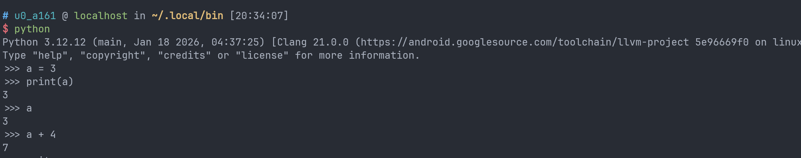
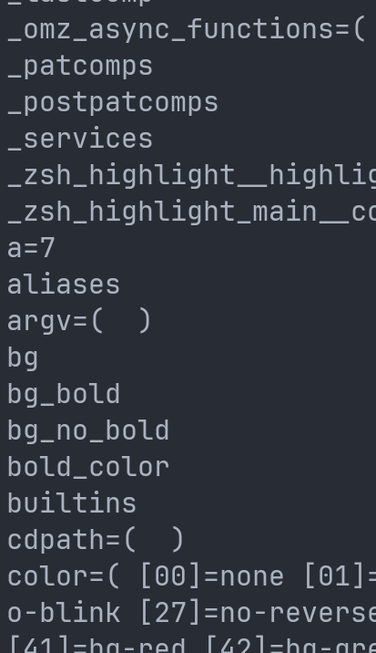
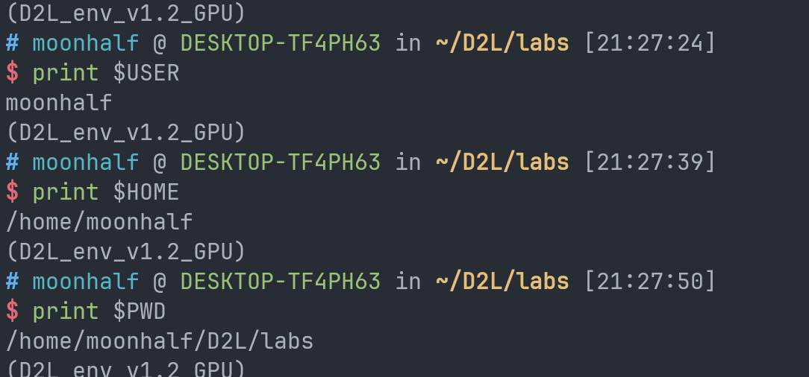
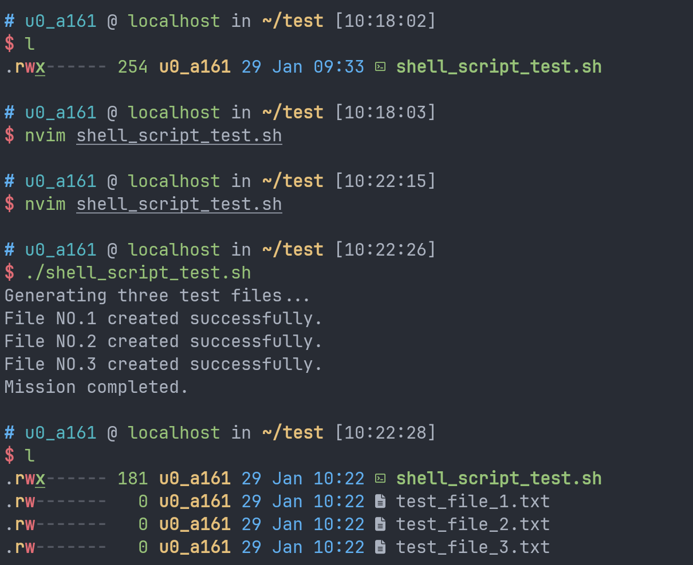
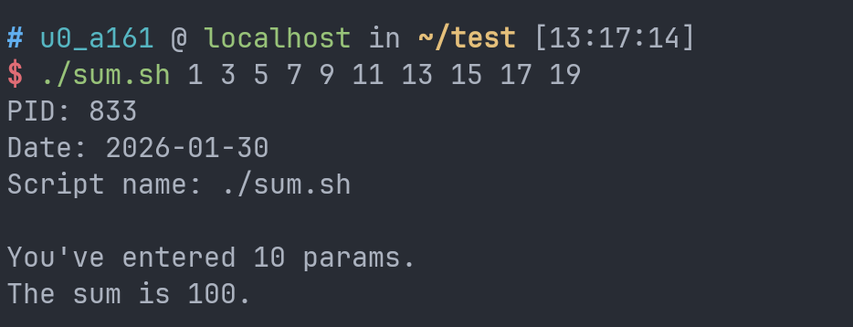
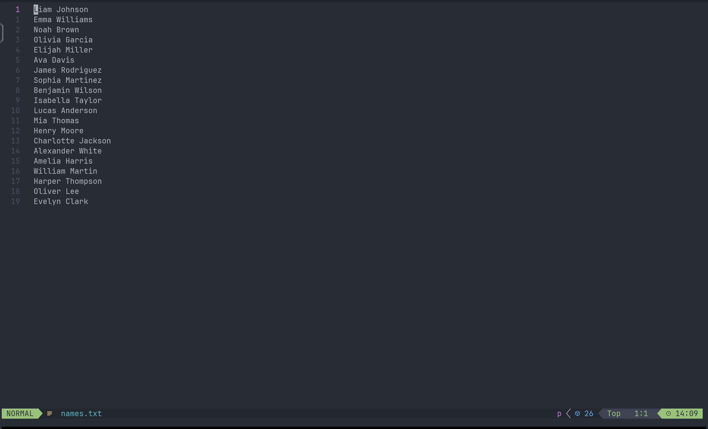
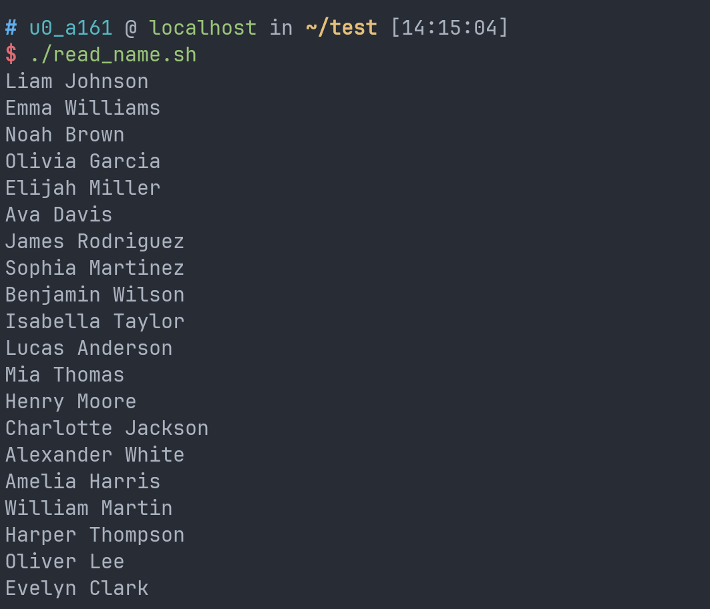

D2L自学日志工程量太大了，学一天给我CPU干烧了，索性学点其他的东西调整一下。因为很长一段时间自己从来没有正经的研究过什么是环境变量以及怎么写shell脚本，遇到这种事情都让ai来完成，最近时常感觉自己的环境有点乱糟糟的。归根结底，这种事情还是要自己知道怎么做的好。

# 参考链接：

[某篇google上随机刷到的博客](https://chihokyo.com/post/6/)

[环境变量wiki](https://zh.wikipedia.org/zh-cn/%E7%8E%AF%E5%A2%83%E5%8F%98%E9%87%8F)

[某个实用工具清单仓库](https://github.com/alebcay/awesome-shell)

# 什么是环境变量？

在回答这个问题之前，我们不妨思考一下：

## 什么是“变量”？

即使折腾了有段时间linux，实话说我很少遇到普通变量。但是它们确实存在。我觉得一个比较正确的看待变量的角度是把shell看做一个和python类似的东西，shell可以输一行指令运行一次，python开启交互模式也可以输一行代码运行一次；shell允许你写复杂的shell脚本，python也允许你组织复杂的工程。只不过前者本质是一个实用工具，后者至少打的旗号是一个编程语言。

我们先用Python举一个简单的例子：



只要你的电脑安装了python，你就可以随时在命令行中输入`python`来进入交互模式。我们可以开始时定义一个变量`a`，然后在接下来的交互中调用它或者修改它。

shell自身的普通变量也有类似的功能，同样一个简单的例子：


你完全可以把shell看做是一个基本只运行交互模式的python。只不过shell的变量有以下特殊的语法规则：

- 定义变量时等号左右不能有空格，比如你必须写`a=3`而不是`a = 3`，虽然后者看起来更加顺眼。
- 调用变量的时候必须在变量名之前加`$`。
- 对变量进行数学计算的时候需要使用两个圆括号括起来。

如果你好奇你的当前环境下有哪些变量，你可以输入`set`指令来查看所有的变量。这里甚至会包含我们刚刚随手写的一个变量a：



## 环境变量

虽然普通变量看起来已经可以做很多事情了，但是它有一个显著的局限：它**只能作用于当前的shell进程**，甚至没办法作用到任何子进程。假如你运行了一个程序，那么这个程序是读取不到你的普通变量的，或者假如你新开了一个窗口，那么新的shell进程中也是不会有原窗口的普通变量。

环境变量虽然也不能直接存活在所有窗口，但是相较于普通变量，环境变量的一个重要特点是允许子进程读取。很多的应用会读取一些通用的环境变量来获取目录结构信息以及用户信息，用户也可以通过修改环境变量来配置一些应用的行为。

在进一步了解环境变量之前，我们最好先来了解一些常用的和变量相关的指令：

```sh
echo $VAR
```

`echo`指令的作用是在你的终端上打印指定的东西。你可以让它打印一个变量的内容，也可以打印字符串。如果你想让你的脚本比较人性化的话你可以考虑多打印一点提示内容。

```sh
export VAR=var
```

声明一个变量为环境变量。如果没有export关键字的话默认为普通变量。

```sh
env
```

查看所有的环境变量。

```sh
unset VAR
```

删除一个变量。

大致就这样。

### 一些常见的环境变量：



- USER：你的名字。如果程序想显示你的名字的时候就会查它。
- HOME：家目录。通常就是你的`~`目录。这是一个路径，存储的形式是字符串。
- PWD：当前路径，即运行脚本时你所处的实际路径。写脚本的时候可能会很有用。


- PATH：这是一个“工具箱搜索清单”，存储的是若干个路径，对应目录下里面装的是可执行文件。当你在命令行里输入一个指令时，系统就会去PATH存储的路径中挨个找你要的名字匹配的可执行文件，找到了就执行，找不到就报错，除非设置了别名。

PATH变量中，不同的目录之间通过冒号隔开。一般的添加PATH路径的方式如下：

```sh
export PATH="$HOME/.local/bin:$PATH"
```

PATH本质是一个字符串，所以用双引号包裹。在想要添加的路径之后补上`:$PATH`来保留原有的PATH路径，如果不加这个的话原有的路径就都没了。

### 如何让一个环境变量可以在所有shell进程中存在？

修改你的shell的**运行时配置文件**，也就是`.xxrc`文件。比如如果你用的shell是bash，那么通常在你的家目录下会有一个`.bashrc`文件。你只需要把你原本在终端中直接输入的`export VAR=var`原封不动地搬到配置文件中就可以了。如果你用的是zsh，那就应该搬到`~/.zshrc`中。

在我前两天配置proot游戏运行环境过程中配置了大量的环境变量，其中一些基本不用修改的环境变量便存放在了`~/.zshrc`中，内容大致如下：

```sh
# ==========================================
# 1. 基础路径与环境
# ==========================================
export PATH=/usr/local/sbin:/usr/local/bin:/usr/sbin:/usr/bin:/sbin:/bin
export DISPLAY=:1
export XDG_RUNTIME_DIR=/tmp

# ==========================================
# 2. Wine WOW64 路径配置
# ==========================================
export WINE_ROOT=$HOME/wine-wow64/wine-11.0-staging-amd64-wow64
export WINEPREFIX=$HOME/.wine
export PATH=$WINE_ROOT/bin:$PATH
# 确保 Wine 能找到它自己的库文件
export LD_LIBRARY_PATH=$WINE_ROOT/lib:$WINE_ROOT/lib/wine/x86_64-unix:$LD_LIBRARY_PATH

# ==========================================
# 3. Audio 修复 (基于之前的测试教训)
# ==========================================
# 解决音频卡顿和死锁的关键：强制通过 TCP 连接宿主 PulseAudio
export PULSE_SERVER=127.0.0.1
# 增加延迟缓冲，解决爆音和因音频同步导致的画面卡顿 (Steam 环境建议 60-100)
export PULSE_LATENCY_MSEC=60

# ==========================================
# 4. Box64 性能与转译优化 (针对 8 Gen 3)
# ==========================================
# 日志级别：0=仅报错, 1=基本信息。平时建议设为 0 或 1，设太高会拖慢 I/O
export BOX64_LOG=1
# 开启大块编译：显著提升 CPU 密集型任务性能 (如游戏逻辑)
export BOX64_DYNAREC_BIGBLOCK=1
# 强内存模型：解决 Unity 引擎和多线程游戏死锁/崩溃问题 (骁龙必须开)
export BOX64_DYNAREC_STRONGMEM=1
# 安全标志位：防止非法指令崩溃
export BOX64_DYNAREC_SAFEFLAGS=1
# Box64 辅助路径
export BOX64_PATH=$WINE_ROOT/bin/
export BOX64_LD_LIBRARY_PATH=$WINE_ROOT/lib/wine/x86_64-unix/:$WINE_ROOT/lib/

# ==========================================
# 5. 图形驱动 (Turnip + Zink)
# ==========================================
# [重要] 请确认此文件路径真实存在，否则无法加载驱动
export VK_ICD_FILENAMES=/root/test/freedreno_icd.aarch64.json

# 强制 Wine/Linux 程序使用 Zink (OpenGL over Vulkan)
export MESA_LOADER_DRIVER_OVERRIDE=zink
export GALLIUM_DRIVER=zink

# Turnip 驱动内存分配修复 (防止显存分配崩溃)
export TU_DEBUG=sysmem

# Zink 优化：延迟描述符更新，可提升部分 DX9/DX11 游戏帧数
export ZINK_DESCRIPTORS=lazy

export WINEDEBUG="-file,-mountmgr,-event"

# ==========================================
# 6. 调试辅助 (可选，平时可注释掉)
# ==========================================
# 显示 DXVK 帧数和显卡信息 (如果你装了 DXVK)
# export DXVK_HUD=fps,devinfo,version
# 显示 Mesa/Zink 帧数 (如果你没用 DXVK)
# export GALLIUM_HUD=fps
```

（看到这么激情洋溢的注释就知道是ai写的了...）

每次进入proot环境，系统会花一点时间打开zsh，这一过程中系统就会首先运行`~/.zshrc`中的shell指令，所以将环境变量写在这里，每次启动shell就会自动添加这些环境变量。

# shell脚本

一个helloworld地位的脚本：

```sh
#!/usr/bin/env bash

echo "Hello world!"
```


shell script虽然定位上被认为是“脚本语言”而非通用型语言，但是脚本语言也是编程语言的一种。python很多时候也不过就是一个高级一点的通用脚本。所以此处你完全可以把`.sh`和`.py`看做是一类东西。

现在我们来拆解一下这个helloworld代码的组成。

## #!/usr/bin/env bash

这个东西的专业术语是**Shebang**，它的作用是告诉系统内核这个文件不是一个可以直接执行的二进制文件，而是一个需要解释器才能运行的脚本文件，`#!`后放的就是解释器的文件路径。

然而，你可能会注意到`#!/usr/bin/env bash`似乎并不是直接代表了一个解释器路径，这里其实是一种常见的变体。`env`是一个存在于`/usr/bin`的二进制文件，它的位置一般来说是稳定不变的，但是在不同人的电脑上，解释器的位置是很有可能变化的。`env`后加一个程序名表示的就是在PATH环境变量中寻找对应的解释器。这样不管解释器在哪，脚本都可以正常运行。

常见的shell script解释器有sh或者dash，属于标准的POSIX shell，功能较少但是速度较快，bash会比较中规中矩，而且一般机器上都会有。zsh会有一些高级特性。

此外，既然Shebang只是规定必须写一个解释器路径，其实我们不止可以写shell script，还可以写python。你只需要把Shebang中的bash换成python，后面的脚本用python语法写，完全可以正常运行。


## chmod +x ...

chmod，即**Ch**ange **Mod**e。脚本写完之后无法直接运行，需要使用chmod为它添加执行权限。三种基本权限即rwx，对应读取权限、写入权限，以及执行权限。对于个人电脑来说我们很少会接触到用户组的概念，所以一般最常见的用法就是`chmod +x <file_name>`来为脚本添加执行权限，或者`chmod -x <file_name>`来取消脚本的执行权限。

# 一些常见的脚本写法

```sh
#!/usr/bin/env bash

echo "Enter a numble:"
read NUMBLE

if [ $NUMBLE -gt 10 ]; then
  echo "The numble is greater than 10."
  exit 1
elif [ $NUMBLE -eq 10 ]; then
  echo "The numble is equal to 10."
  exit 1
else
  echo "The numble is less than 10."
fi 
```

这个简单的例子里涉及了shell script的条件判断写法。在shell script中`-gt`代表大于，`-eq`代表等于，`-lt`表示小于。此外需要注意变量取值必须在变量名前加`$`（比C语言还繁琐是我没想到的）。shell script是一个弱类型语言，无需显示声明类型，所有的变量会默认存储为字符串。

注意中括号和中间的关键字和标识符之间需要留有空格，中括号之后要加分号。shell script对于空格、分号和中括号非常敏感。分支结构最后需要加上`fi`表示结束。

运行效果：


for循环写法：

```sh
#!/usr/bin/env bash

echo "Generating three test files..."

for i in {1..3}; do
  touch "test_file_$i.txt"
  echo "File NO.$i created successfully."
done

echo "Mission completed."
```

创建三个测试用文件（竟然是左闭右闭，简直是异端）。运行结果如下：



在shell script中有一些特殊的变量由系统自动维护，用来获取脚本参数、运行状态和系统id。

- `$0`返回运行的脚本文件名（实际是相对于当前位置的相对路径）
- `$1、$2、...`表示传给脚本的第1～9个参数。
- `${10}`，10及以上需要加花括号。
- `$#`传入的参数个数
- `$@`传入的所有参数，可以使用for循环遍历（即把参数打包成一个类似python元组的东西）
- `$*`把传入的参数看做一个整体的字符串。
- `$?`上一个命令退出情况，0为成功，非0为失败。
- `$$`当前脚本的进程数。

一个求和脚本示例：

```sh
#!/usr/bin/env bash

DATE=$(date "+%Y-%m-%d")

echo "PID: $$"
echo "Date: $DATE"
echo "Script name: $0"
echo ""

echo "You've entered $# params."

ANS=0

for PARAM in "$@"; do
  ANS=$(($ANS + PARAM))
done

echo "The sum is $ANS."
```

结果：




shell的for循环语法和python看起来似乎很相似。比如，你可以这么写：

```sh
for name in Alice Bob Charlie; do
    echo "Hello $name"
done
```

 结果输出：

```sh
Hello Alice
Hello Bob
Hello Charlie
```

shell script中一个更强大的功能是通配符遍历。比如，如果你想罗列一个目录下的所有pdf文件，你可以这么写：

```sh
#!/usr/bin/env bash

count=1
for file in *.pdf; do
  echo "pdf $count: $file"
  count=$(($count + 1))
done
```

效果：


如果你想使用C风格的数值循环，此处记录一下写法，不再实验。

```sh
for ((i=1; i<=5; i++)); do
    echo "次数: $i"
done
```

while循环的一般写法也就是if和for的杂交，也只是记录一下，不再实验。

```sh
count=1
while [ $count -le 5 ]; do
    echo "Count: $count"
    ((count++)) # Bash 中的自增写法
done
```

### 插叙：重定向与管道

在linux命令中，`|`、`>`、`<`可以影响数据的流向，为我们编写脚本和日常使用指令提供了极大的方便。理解这些工具的秘诀在于想象数据像水一样流动。

`>`和`>>`表示**输出重定向**。它们可以把**原本应该打印在屏幕上的内容**存到指定的文件中。其中`>`表示覆写，会清空原有内容；`>>`表示追加写，会在文件末尾接着写。

你应该这样理解：每一个指令都像一个有着通用的输入、输出管道的机器。默认情况下，输出的管道会直接连到你的终端上。现在，我们不希望它把数据直接流到屏幕上，而是流到文件里，所以我们接一个管道把指令输出的东西转移到文件中。

```sh
echo "Hello" > hello.txt
echo "Helloworld" >> hello.txt
```

结果：


内容：

```txt
Hello
Helloworld
```

`echo`指令就像是一个只会接受东西输出东西的发射器，但是它也使用了通用的管道。

一个常见的应用是conda导出环境配置。此处就用到了输出重定向。

```sh
conda env export > environment.yml # 导出环境
```

此外，正常的输出`>`实际是`1>`的缩写。错误输出`2>`和正常输出并不走同一个管道。这意味着有时即使你进行了`>`的重定向，当出现错误时，报错信息还是会流到屏幕上。你需要对报错做额外的处理。

与之相对的，`<`表示输入重定向。比如某些指令默认从屏幕读取输入，你就可以用`<`来将默认的输入方式改为从指定的文件中输入。每次会自动读取一行。

举个例子，我们随便写一个若干行的随机人名文件。



然后编写这样的测试脚本：

```sh
#!/usr/bin/env bash

FILE="$PWD/names.txt"

while read name; do
  echo $name
done <$FILE
```

FILE定义了指定的文件，此处我们默认在names.txt目录下执行该脚本。假如你在一个没有names.txt的目录下执行该脚本，脚本就会报错。

运行效果：



符合预期。

然而，仅有输入输出重定向是不够的。它们只能代表数据加工开始和结束时数据的去向。但是假如数据加工的过程中也有多个步骤，仅仅使用输入输出重定向虽然也可以完成任务，但是免不了要用额外的存储空间缓存数据，并徒增写入和读取的用时。所以，我们为什么不能直接把一个指令的输出喂给另一个指令作为输入呢？

于是便有了管道符号`|`。它的作用就是把左边指令的输出喂给右边的指令作为输入。一些经典的用法如下：

```sh
# 1. 列出当前目录所有文件
# 2. 把结果传给 grep，搜索包含 "txt" 的行
ls | grep "txt"

# 1. 读取一个很长的文件内容
# 2. 把内容传给 head，只看前 10 行
cat large_file.log | head -n 10

# 1. 查找所有正在运行的进程
# 2. 搜索关于 "python" 的进程
ps aux | grep "python"
```

## 函数与递归

虽然shell脚本看起来像是一堆指令堆在一起，但是实际上完全支持函数和递归调用。

一个简单的函数示例：

```sh
#!/usr/bin/env bash

add() {
  echo $(($1 + $2))
}

echo $(add $1 $2)
```


输出结果：


shell函数相较于其他语言的函数有很大的行为差异。首先，shell script中的函数传参只能使用`$i`的形式读取第i个参数。此外，在shell中`return`关键字的用法是返回状态，只能返回0~255之间的整数，通常用0表示成功。而数据输出则使用echo，并在函数调用的时候使用`$(...)`符号捕获输出。这种设计的原因在于shell script本身是非常简陋的，想要返回数值唯一的方法就是把东西打印出来。

`$(...)`符号在shell script中的行为和输出重定向很相似。它的功能就是把一个原本会输出到屏幕的输出重定向给变量。`$VAR`的写法则表示从变量的对应内存中提取数据。两者的功能是不同的。

shell script中定义的变量默认是全局变量，这和一般的程序语言的动态作用域有很大区别。如果我们希望一个变量只作用于函数体内部，我们必须要变量前添加`local`关键字。

shell script完全支持递归，以下是基于shell script的阶乘写法：

```sh
#!/usr/bin/env bash

fact() {
  if [ $1 -le 1 ]; then
    echo 1
  else
    local prev=$(fact $(($1 - 1)))
    echo $(($prev * $1))
  fi
}

echo $(fact $1)
```

输出结果：


一个基于shell script递归的文件树打印脚本：

```sh
#!/usr/bin/env bash

echo_indent() {
  local indent="$1"
  local ans="$2"
  for ((i = 1; i <= indent; i++)); do
    ans="    $ans"
  done
  echo "$ans"
}

list_file_recursive() {
  local dir="$1"
  local indent="$2"
  for item in $dir/*; do
    if [ -d "$item" ]; then
      echo "$(echo_indent $indent "Directory: $item")"
      list_file_recursive "$item" $(($indent + 1))
    else
      echo "$(echo_indent $indent "File: $item")"
    fi
  done
}

list_file_recursive $PWD 0
```

某次输出：


（下方lt为eza输出的文件树，可以当做标准答案。）

# 总结

虽然shell script的功能很多，但是写起来和正经的程序语言比还是有点折磨了。这边推荐把shell script当做python程序的包装器。

以下是我的博客发射器的包装器脚本：

```sh
#!/usr/bin/env bash

set -e

PROJECT_ROOT="$HOME/python_projects/ControlCenter"
VENV_ACTIVATE="$PROJECT_ROOT/venv/bin/activate"
ENTRY_POINT="$PROJECT_ROOT/Entry.py"

if [ ! -d "$PROJECT_ROOT" ]; then
  echo "Error: Project directory not found at $PROJECT_ROOT"
  exit 1
fi

if [ -f "$VENV_ACTIVATE" ]; then
  source "$VENV_ACTIVATE"
else
  echo "Error: Virtual environment not found. Did you run 'python -m venv venv'?"
  exit 1
fi

python "$ENTRY_POINT" "$@"

deactivate
```

功能是自动启动虚拟环境并运行python程序，同时自动传参执行指令。随后结束时自动关闭虚拟环境。至于具体的功能实现则交给代码更便于维护的python程序。