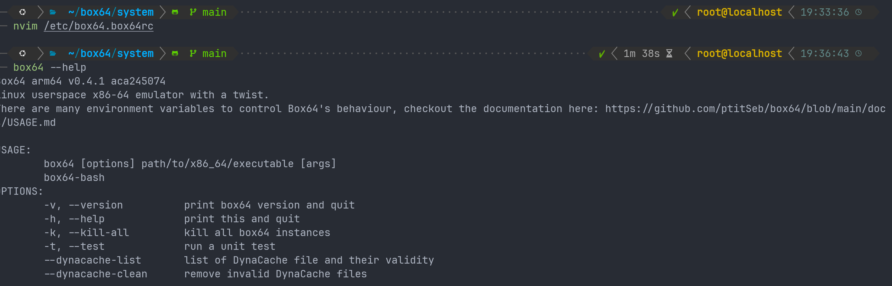
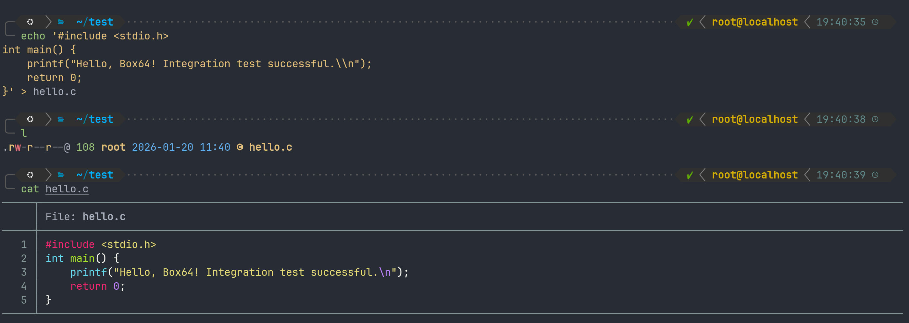
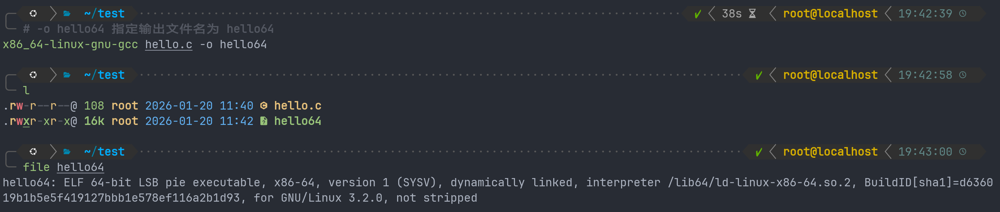
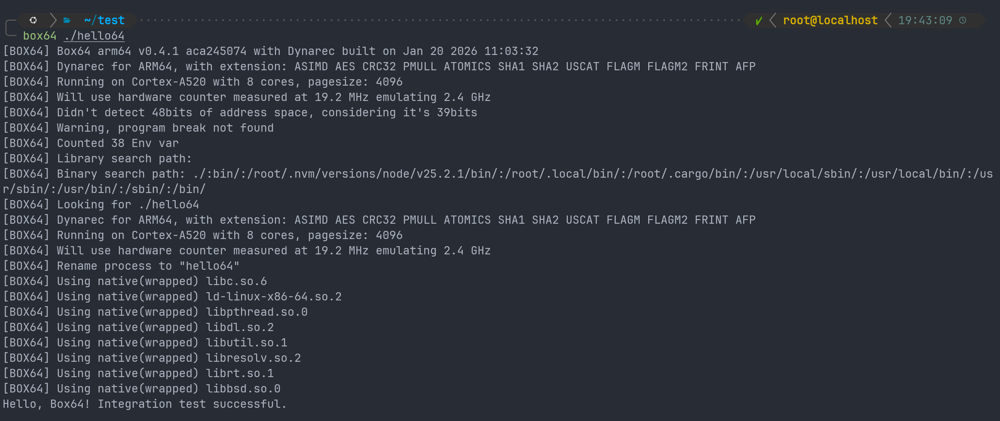
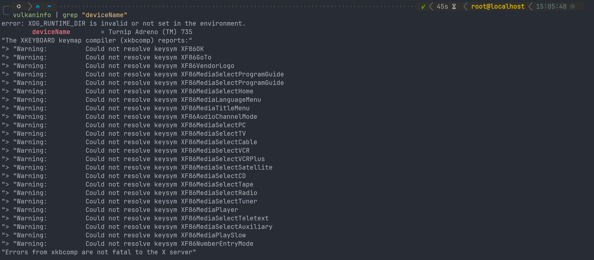
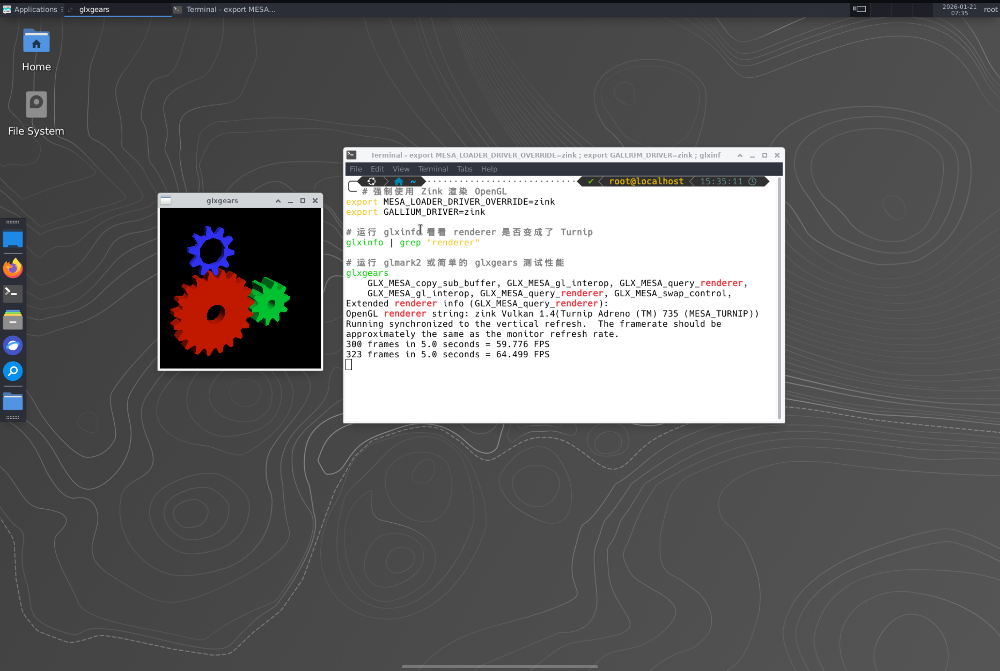

# 参考链接

[box64中文主页](https://github.com/ptitSeb/box64/blob/main/README_CN.md)

[turnip driver](https://github.com/K11MCH1/WinlatorTurnipDrivers/releases/tag/winlator_v25.1_r2)

[mesa3D主页](https://docs.mesa3d.org/install.html)

# 第二阶段：box64部署

基础编译工具链：

```sh
apt-get update
apt-get install -y git cmake build-essential python3 python3-setuptoolsapt-get update
apt-get install -y git cmake build-essential python3 python3-setuptools
```

编译指令：

```sh
# 1. 克隆官方仓库
git clone https://github.com/ptitSeb/box64
cd box64

# 2. 创建构建目录
mkdir build; cd build

# 3. 配置 CMake (关键步骤)
# -DSD8G2=1 : 针对骁龙8Gen2/3架构优化
# -DCMAKE_BUILD_TYPE=RelWithDebInfo : 保持高性能的同时保留调试信息(对崩溃排查很重要)
cmake .. -DSD8G2=1 -DCMAKE_BUILD_TYPE=RelWithDebInfo

# 4. 开始编译 (利用 8s Gen 3 的多核性能，-j8)
make -j8
```

安装二进制文件到系统目录：

```sh
# 1. 安装二进制文件到系统路径 
make install
```

在`~/box64/system`目录下找到了`box64.box64rc`，显然是box64的配置文件。将其复制到`/etc`目录下。

我本来想复制一下这个配置文件的内容，奈何有1000多行，遂放弃。

合影留念：



在推进到第三阶段前，我们先用一个简单的x86_64的Helloworld文件测试一下box64有没有在正常工作。

让我们随便创建一个`hello.c`文件：

```sh
echo '#include <stdio.h> int main() { printf("Hello, Box64! Integration test successful.\\n"); return 0; }' > hello.c
```



安装交叉编译器：

```sh
apt-get update
apt-get install -y gcc-x86-64-linux-gnu file
```

使用x86_64编译链来编译c文件，并使用`file`指令验证它确实是x86_64文件。



测试成功。



# 第三阶段：图形驱动与vulkan支持验证

对于本阶段，我们需要实现的是让proot distro ubuntu知道显卡的存在并去调用显卡进行图像计算。目前ubuntu认为自己处在一个没有显卡的服务器上，所以使用CPU来逐个像素的计算图像。对于一般性的桌面环境来说可能足够了，但是对于游戏来说，这样的性能是远远不够的。

所以我们本步需要做的是：寻找这样一个文件，它不是一个普通的软件，而是一个特定的驱动程序，即动态链接库`.so`文件，并且由于我们环境的特殊性，这个驱动文件必须满足以下条件：

1. 必须使用Android的KGSL接口来管理显卡；
2. 必须使用Glibc编译的版本，这样ubuntu才能正常运行；
3. 必须是二进制文件成品，因为在proot环境下直接编译极其困难（我已经试过了）；

总结关键词：mesa，glibc，turnip，kgsl。这个文件将会是我们的proot环境中mesa+vulkan的全链条实现者。

经过一番探索，我发现自己之前遗漏了两个重要的术语，以下进行补充：mesa是是一个巨大的开源项目，其中包含了多种显卡的驱动，而其中**Freedreno**是专门负责高通Adreno GPU项目的总称。所以，我们需要寻找的并非是一个原生态的mesa驱动，而是找freedreno。

此外，winlator是一个专门用来在android系统上运行win程序的封装好的应用。但是适用于winlator的驱动理论上也可以适用于proot distro。


如图是阶段成功的标志，实际效果是一个旋转的立方体。出现了这个，意味着vulkan驱动的路被完全打通，proot环境可以直接调用你的GPU进行计算并呈现在你的termux x11窗口中。

在正式开始配置之前，我们需要知道proot环境下我们期待图形渲染的工作流是什么。以我们阶段成果vkcube为例，我们来逐步分析它的工作流。

vkcube并不是某个vulkan工具，而是一个调用了vulkan api的程序。当我们运行`vkcube --wsi xcb`时，vkcube作为一个vulkan程序，它会首先读取一个`.json`文件（学名ICD，Installable Client Driver）来确定系统中有哪些驱动程序。这意味着，如果我们希望这个程序能成功运行，它必须知道哪里能找到这个`.json`文件，而想让一个程序可以无视位置地锁定另一个文件意味着我们需要设置环境变量。在vulkan的语境下，这个环境变量即`VK_ICD_FILENAMES`。

确认了驱动程序后，vulkan程序就会直接通过驱动程序来调用显卡进行计算。如果你的驱动程序版本和硬件不匹配，或者根本没有权限访问显卡，那么vulkan程序就无法调用显卡进行计算。

假如一切顺利，图像渲染成功，我们还需要让它呈现在屏幕上。而一个vulkan程序呈现图像的方式是调用vulkan api，通过vulkan wsi(window system integration)来显示窗口。在我们的proot环境下，我们采用了termux x11来显示桌面环境，所以我们希望wsi协商时调用x11(xcb)接口来实现图像显示。

具体的实施方案上，经过了一番寻找，我终于找到了理论上可用的`turnip driver`，链接已经放在文章开头了。K11MCH1维护了一个为winlator做驱动支持的turnip driver仓库，理论上这个驱动程序对于proot环境也同样适用。


我们将其中的`.so`文件随意的下载并放置在某个自己知道的位置。随后，由于作者并没有提供一个直接可用的ICD文件，我们需要自己来写这个文件。 随便在某个你自己知道的目录下创建一个`.json`文件，我对它的命名为`freedreno_icd.aarch64.json`。

```json
{
  "file_format_version": "1.0.0",
  "ICD": {
    "library_path": "/root/test/libvulkan_freedreno.so",
    "api_version": "1.3.255"
  }
}
```

以上代码块中`"/root/test/libvulkan_freedreno.so"`应该被替换为你的实际的`.so`存放目录。可以看到我真的就是随便开了个test目录就放了，这个还是看个人的文件管理习惯吧。

此外我们需要设置环境变量来让这个icd可以被识别，顺便的，我们需要设定一下显示端口来对接wsi。

```sh
# 在proot环境内运行。
export VK_ICD_FILENAMES=/root/test/freedreno_icd.aarch64.json
export DISPLAY=:1
```

此外，这是我使用的proot distro ubuntu桌面环境启动脚本，放在termux宿主机中。原理看注释。

```sh
#!/bin/bash

# --- 1. 环境清理 ---
echo "Cleaning up..."
pkill -9 termux-x11
pkill -9 virgl_test
# 尝试删除端口1相关的锁
rm -f $TMPDIR/.X1-lock 2>/dev/null

# --- 2. 启动服务端 ---
# 注意这里改成了 :1
am start -n com.termux.x11/com.termux.x11.MainActivity
termux-x11 :1 -ac &
virgl_test_server_android &

sleep 3

# --- 3. 进入 PRoot 并启动 ---
# 确保所有 DISPLAY 都指向 :1
proot-distro login ubuntu --shared-tmp --bind /dev --bind /sys --bind ~/share:/share -- /bin/bash -c "
    export DISPLAY=:1
    export XDG_RUNTIME_DIR=/tmp
    
    # 强制重新设置 dbus
    rm -rf /var/run/dbus/pid
    dbus-daemon --system --fork 2>/dev/null
    export \$(dbus-launch)
    
    # 3D 加速相关
    export GALLIUM_DRIVER=virpipe
    export MESA_GL_VERSION_OVERRIDE=4.0

    echo 'Starting XFCE4 on DISPLAY :1...'
    startxfce4
"
```

以上是我能回忆的起来的主要配置过程（因为中间实际上经历了很多的错误尝试，以上是我最后能确定的正确尝试，实际配置可能还需要依据情况做额外的调整）。为了检测我们的配置成果，首先我们需要安装`vulkan-tools`：

```sh
apt install vulkan-tools
```

以下罗列一些可能使用到的检查状态的指令：

```sh
vulkaninfo | grep "deviceName"
```



以上是我未启动桌面环境时输出的信息。其中`XDG_RUNTIME_DIR`是一个proot环境下没有预设的目录。虽然弹出了很多警告，但是都是无害噪音，并不会影响最终运行。

输出信息中最重要的是`deviceName = Turnip Adreno (TM) 735`，表示turnip驱动已经处在了待命状态，并且成功穿透容器访问到了显卡。安卓设备的厂商通常会默认将显卡的详细版本信息隐藏起来，此处`735`版本号出现证明了确实访问到了真正的显卡。

```sh
# 需安装 mesa-utils
MESA_LOADER_DRIVER_OVERRIDE=zink glxinfo | grep "renderer"
```


同样出现了大量无害噪音。其中最关键的信息是`zink Vulkan 1.4(Turnip Adreno (TM) 735 (MESA_TURNIP))`，表示zink成功启动并挂载在turnip上。zink将OpenGL调用翻译为Vulkan调用，此处如果能成功显示意味着你的系统可以高效的渲染OpenGL图像。

```sh
glxinfo | grep "Mesa"
```


显示mesa版本。出现mesa版本号意味着mesa驱动包已经部署。

```sh
glxgears
```

这是一个mesa/glx体系下常用的用来演示和诊断OpenGL支持的小程序，主要功能有：

- 测试X11是否正常工作；
- GLX是否可用；
- OpenGL上下文是否创建；

在此处，由于我们部署了mesa，理论上我们可以用zink来将OpenGL翻译为Vulkan再进一步渲染。具体的实施方法：

```sh
# 强制使用 Zink 渲染 OpenGL
export MESA_LOADER_DRIVER_OVERRIDE=zink
export GALLIUM_DRIVER=zink

# 运行 glxinfo 看看 renderer 是否变成了 Turnip
glxinfo | grep "renderer"

# 运行 glmark2 或简单的 glxgears 测试性能
glxgears
```



理想的输出结果如上。可以看到OpenGL的渲染器显示为zink。不理想的情况是显示为`llvmpipe`，表示此时正在使用CPU来跑图形，图像显示性能远远不比GPU。

glxgears运行成功vkcube也仍然可能运行失败，因为glxgears全链路运行在mesa这个超级聚合物中，而vkcube有很多东西需要自己手动配置，对于显示环境要求也更加严格。但是glxgears可以成功运行意味着mesa已经可以直接访问显卡，证明了访问显卡是可能的。

总之，一切顺利的话，运行`vkcube --wsi xcb`后，你应该可以得到旋转立方。这标志了三阶段的工作顺利结束。
