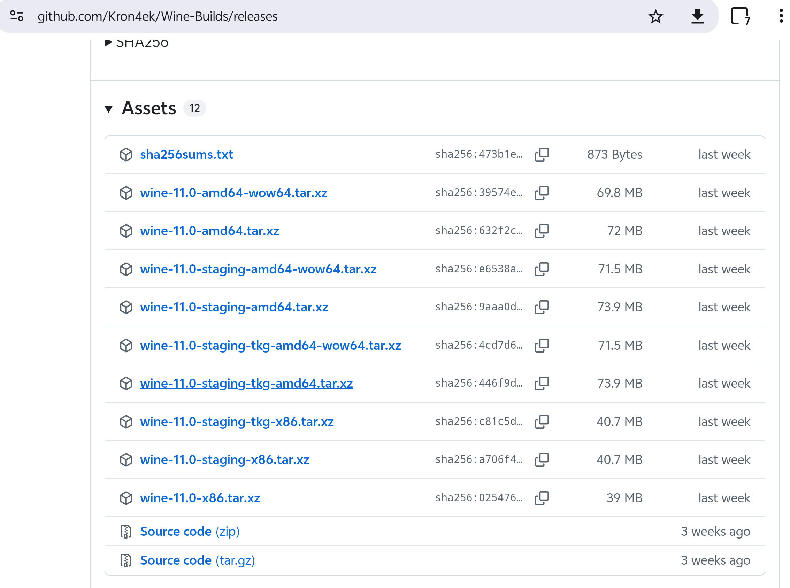
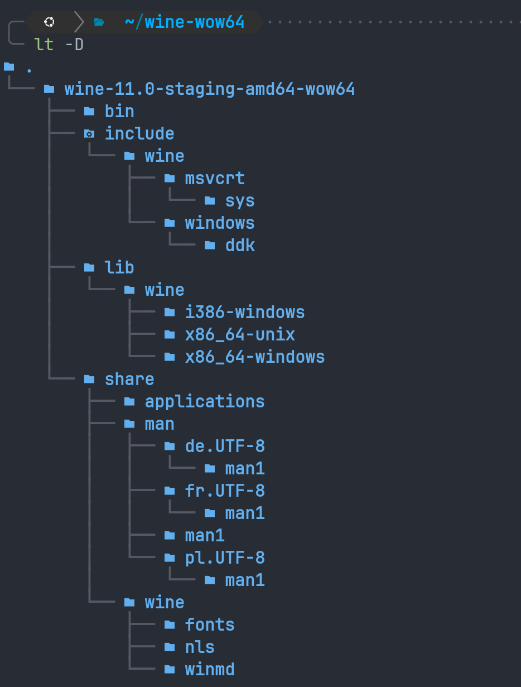
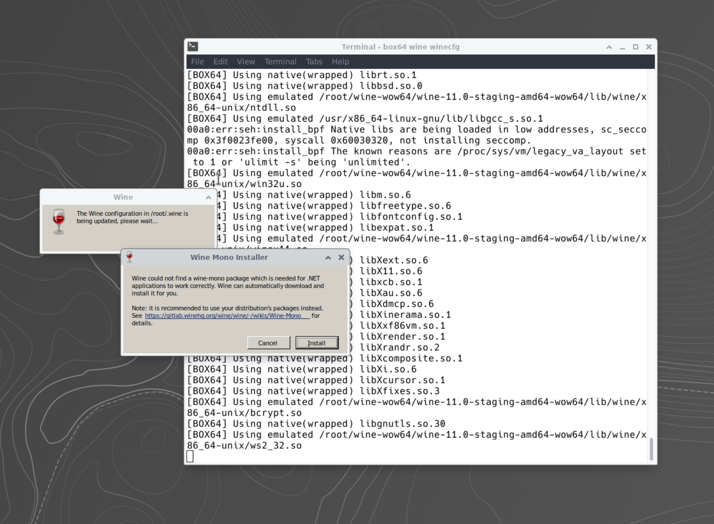
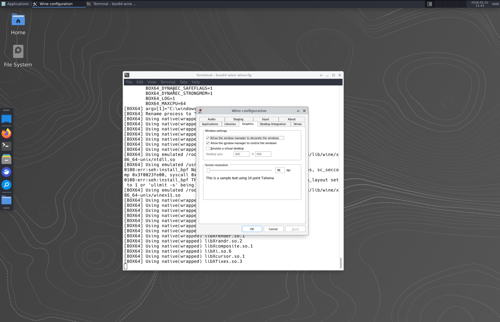
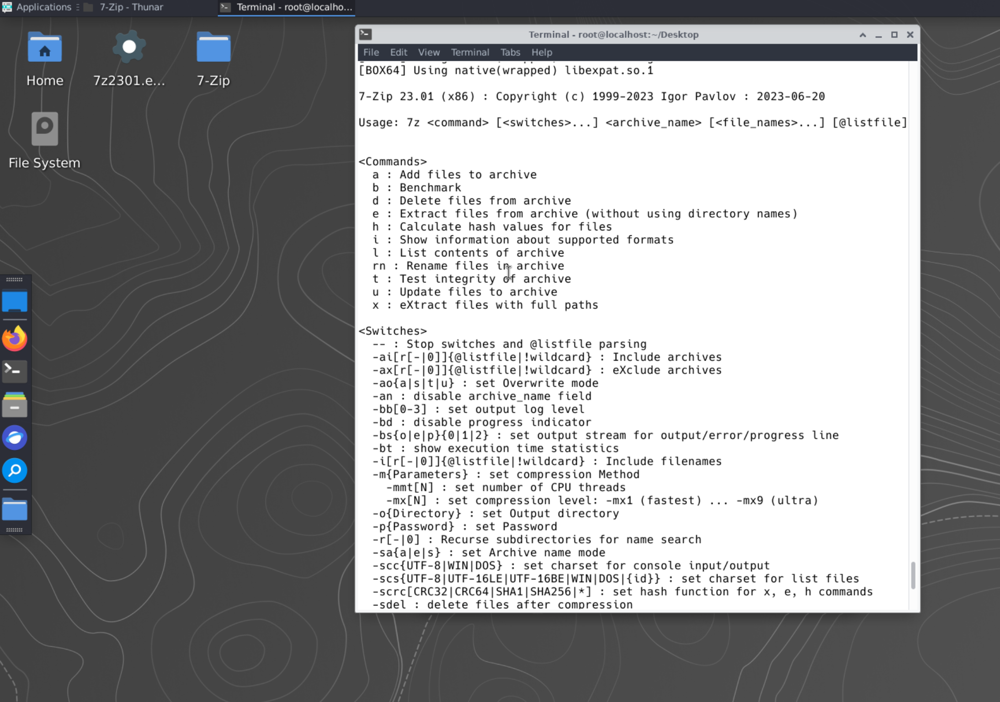
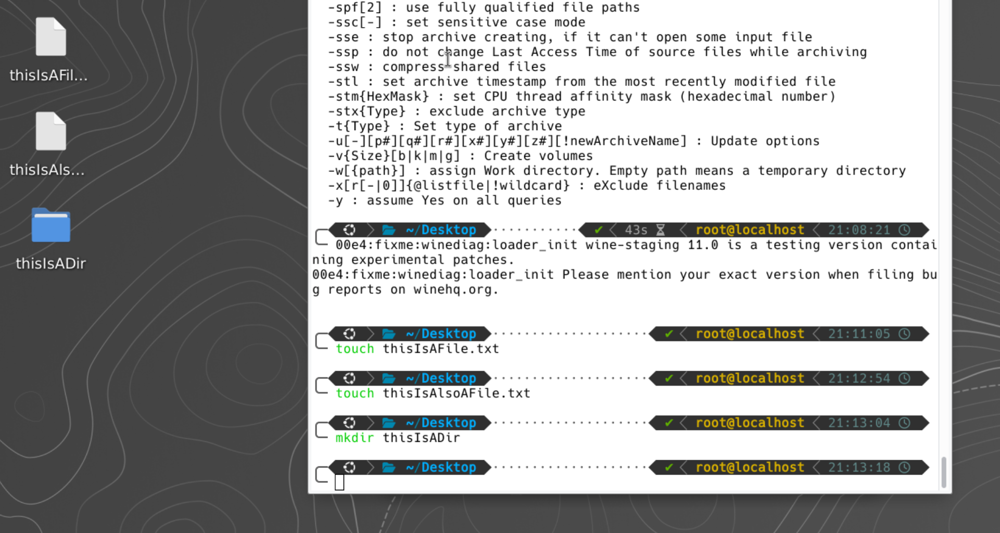
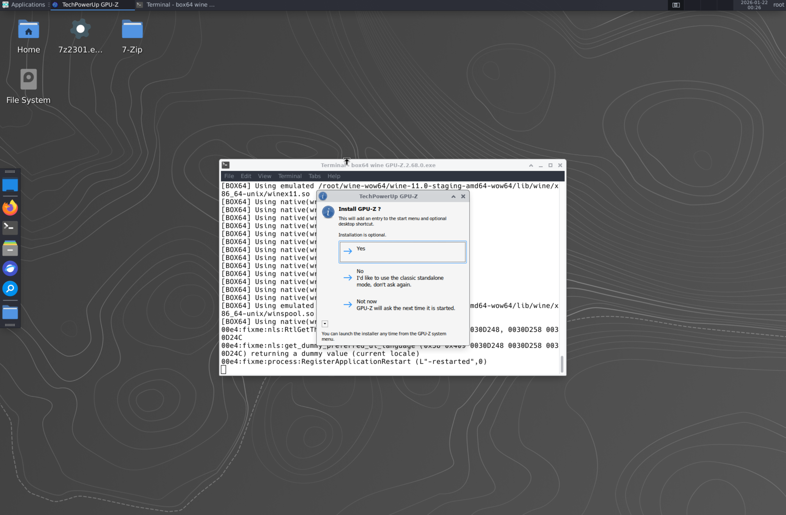
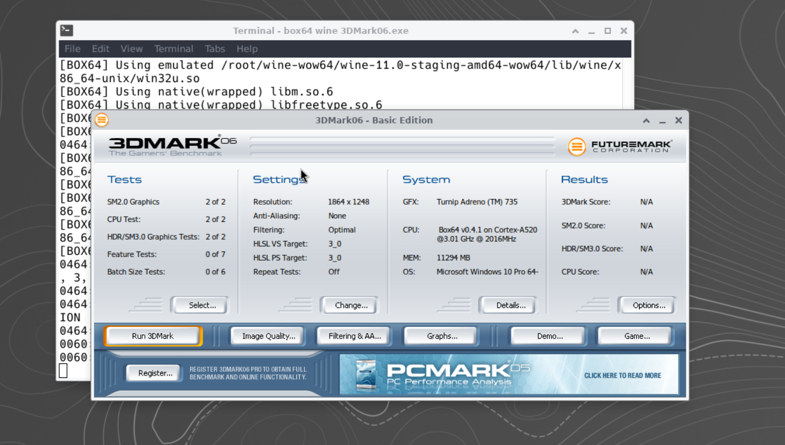
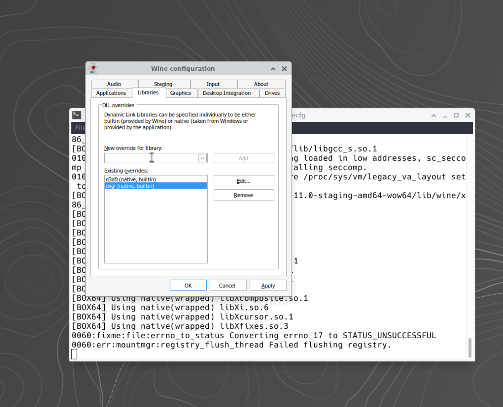
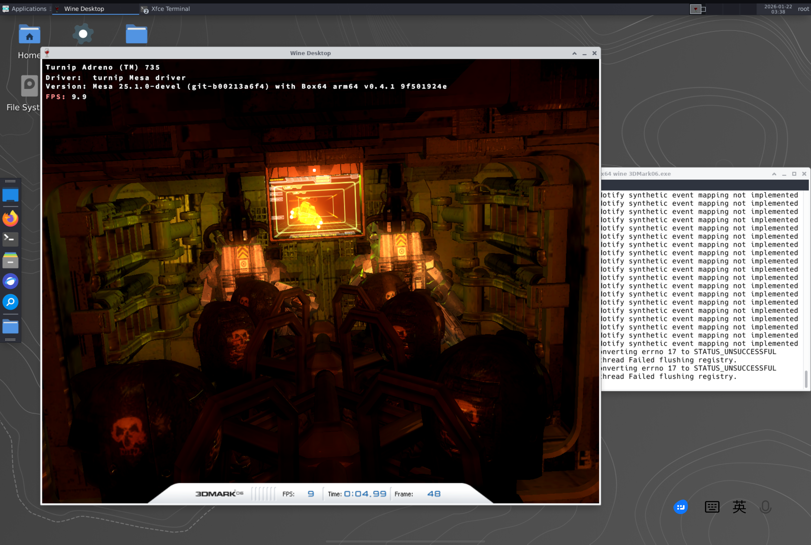

# 参考链接：

[我所使用的wine预编译包](https://github.com/Kron4ek/Wine-Builds)

[GPU-Z](https://www.techpowerup.com/325637/techpowerup-releases-gpu-z-v2-60-0)

[3Dmark6](https://www.techpowerup.com/download/futuremark-3dmark06/)
## 目前进度：

- termux x11 + proot distro ubuntu桌面环境工作正常；
- box64运行x86_64程序成功；
- vulkan驱动正常工作；
	- 运行`glxgears | grep "renderer"`渲染齿轮动画并显示渲染器为`zink`；
	- 运行`vkcube --wsi xcb`可以渲染旋转立方

# 第四阶段：Wine

回顾我们之前的博客，想要在proot环境下运行steam，光有对x86_64和GPU图像渲染的支持是不够的，我们要运行的是一个纯种的win版steam，不仅系统对不上，连cpu位数都对不上。（steam是一个完全的32位应用，而不幸的是我的vivopad3完全不支持32位指令。）

为了能实现我们需要的效果，这里我们先对环境配置工作做一个大致的规划：

- 首先，对于wine的选取，我们不能直接使用`apt install wine`来安装一个通用版的wine，因为官方仓库的wine会安装`lib32`相关的armhf包，这些包在我的机器上无法运行。我们需要的是一个**Wine的·WOW64版的·预编译包**，原因在于一方面我们需要wow64来将32位指令翻译为64位指令，另一方面proot环境极其孱弱，我们需要直接寻找社区维护的arm64预编译包。
- 其次，此阶段应该专注于创造一个纯净的wow64环境。对于第五阶段steam部署，由于proton本身是为x86_64架构的机器设计的，里面包含了很多32位的x86二进制文件（沾了哪个都运行不了），我们到时候会需要使用一些proton的核心组件。
- 对于最终效果的预期，我们希望以以下三个测试点作为阶段性成功的标志：
	1. 基础启动，运行`wine winecfg`可以弹出图形化配置界面；
	2. 32位测试，使用`box64 wine <name>`可以运行某个32位程序；
	3. 图形测试，确认wine可以使用第三阶段的图形链路。

现在，让我们开始寻找wine并部署。



由Kron4ek维护的wine仓库中，我们需要使用的是`wine-11.0-staging-amd64-wow64.tar.xz`，它提供了wow64特性，并且staging分支拥有更多的游戏补丁。


创建了一个专门的`wine-wow64`仓库用来存放wine源文件，使用wget下载release。之后，使用tar解压：




以上是wine的文件结构。

为了让系统识别到wine并让box64能正常翻译，我们需要添加如下环境变量：

```sh
# Wine 的路径 (假设你解压到了 ~/wine-wow64)
export WINEPREFIX=$HOME/.wine
export PATH=$HOME/wine-wow64/wine-11.0-staging-amd64-wow64/bin:$PATH

# 让 Wine 寻找刚才解压出来的库（Wine 自身的依赖库）
export LD_LIBRARY_PATH=$HOME/wine-wow64/wine-11.0-staging-amd64-wow64/lib:$LD_LIBRARY_PATH

# 开启 Box64 的某些特性以提高 Wine 性能
export BOX64_LOG=1             # 初始化阶段看日志很有帮助
export BOX64_DYNAREC_SAFEFLAGS=1 # 提高稳定性
```

以防万一，以下列出完整的`~/.zshrc`开头部分环境变量配置（我用的是zsh）：

```sh
export PATH=/usr/local/sbin:/usr/local/bin:/usr/sbin:/usr/bin:/sbin:/bin
export WINE_ROOT=$HOME/wine-wow64/wine-11.0-staging-amd64-wow64
export WINEPREFIX=$HOME/.wine
export PATH=$WINE_ROOT/bin:$PATH
export LD_LIBRARY_PATH=$WINE_ROOT/lib:$WINE_ROOT/lib/wine/x86_64-unix:$LD_LIBRARY_PATH
export BOX64_LOG=1
export BOX64_DYNAREC_SAFEFLAGS=1
export BOX64_DYNAREC_STRONGMEM=1 
export DISPLAY=:1
export VK_ICD_FILENAMES=/root/test/freedreno_icd.aarch64.json
export MESA_LOADER_DRIVER_OVERRIDE=zink
export GALLIUM_DRIVER=zink
export XDG_RUNTIME_DIR=/tmp
export TU_DEBUG=sysmem
```

接下来，我们进行首次启动与初始化。



一开始尝试直接输入`wine winecfg`提示command not found，后来发现运行的是一个x86_64的二进制文件wine。没关系，我们有box64来引导wine运行。在终端输入`box64 wine winecfg`后得到了如图的结果。

为了一步到位，这里我们选择手动下载`.msi`文件。（使用自动下载大概率会失败，通常会因为下载时间过长而被挂起）

```txt
https://dl.winehq.org/wine/wine-mono/9.4.0/wine-mono-9.4.0-x86.msi
```

这个网址不要直接用wget下载。使用自己的系统浏览器下载速度会快的多。下载完将这个文件传进proot。使用以下指令进行安装：

```sh
box64 wine msiexec /i wine-mono-9.4.0-x86.msi
```

安装完之后进入以下界面，确保图示的两个选项开启。标志测试点A顺利通过。



在进行下一步之前，我们先做一些优化调整。

先为`~/.zshrc`添加以下内容，省得每次都要写box64。

```sh
alias wine='box64 wine'
alias wine64='box64 wine'
```

添加以下内容来精细化box64的寻找目录：

```sh
# 确保 Box64 知道去哪里找 wine 的 x86_64 库
export BOX64_PATH=$HOME/wine-wow64/wine-11.0-staging-amd64-wow64/bin/
export BOX64_LD_LIBRARY_PATH=$HOME/wine-wow64/wine-11.0-staging-amd64-wow64/lib/wine/x86_64-unix/:$HOME/wine-wow64/wine-11.0-staging-amd64-wow64/lib/
```

理论上，我们现在已经完成了wine部分的配置。如果一切顺利，我们此时的环境应当可以在这个只支持64位的机器上运行32位程序。接下来，让我们完成测试点B和C来检验我们的环境配置成果，也只有完成了这两个测试点，我们才能进一步解决最终挑战：部署steam。

对于测试点B，我们来尝试在这个环境下运行**7-zip**，一个既32位又有图形界面的软件，甚至还是一个纯x86程序，简直和我的机器原生环境八字不合。但是，我们可以让它在我们的环境下正常运行。

运行以下指令安装7-zip。

```sh
wget https://www.7-zip.org/a/7z2301.exe
```

```sh
wine 7z2301.exe # 这里假定你已经写入了alias wine="box64 wine"
```


就这样，我们成功在一个既不x86也不32的环境下成功运行了一个和它水火不容的程序。一切都在box64和wine的掌控之下。

由于7-zip本身使用时似乎确实没有图形界面，我们运行`wine 7-zip.exe`后可以得到这样的输出结果，代表它确实可以工作。（7-zip的正常使用需要输入参数，对于一个实质linux的环境我们有更好的工具）。为了演示，我们可以用它来打个包试试。



随便往桌面上扔两个文件和一个文件夹：



然后运行`wine 7z.exe a test.7z ~/Desktop/thisIsAFile.txt ~/Desktop/thisIsAlsoAFile.txt ~/Desktop/thisIsADir/` 。返回了如下结果：


可以看到在7-zip的目录下我们得到了打包好的`test.7z`。证明7z.exe已经可以正常工作了。7-zip之所以可以直接访问像`~/Desktop/thisIsAFile.txt ~/Desktop/thisIsAlsoAFile.txt ~/Desktop/thisIsADir/`这样的路径，原因在于wine的实现方法并不是像虚拟机那样建立完全隔离的硬盘镜像，而是逻辑映射：将linux的根目录/映射为windows的`Z:`盘。在运行指令时，wine会自动将linux风格地址重定向为windows风格的对应地址并让7z运行。由于C盘与Z盘只是一个文件系统的不同挂载点，他们当然可以相互访问。

对于测试点C，我们使用GPU-Z来测试wine内的OpenGL请求是否被正确路由到zink。GPU-Z不能通过wget下载，所以访问GPU-Z下载网站进行下载。（链接在开头）

同样将下载得到的`.exe`文件传入proot环境，运行：

```sh
# 以防万一手动配置一下环境变量，确保zink被强制调用。
export MESA_LOADER_DRIVER_OVERRIDE=zink 
export GALLIUM_DRIVER=zink
```

```sh
wine GPU-Z.2.68.0.exe
```




然而，最终程序运行失败了。报错信息大致如下：

```sh
BOX64] Using emulated /usr/x86_64-linux-gnu/lib/libgcc_s.so.1
0154:err:seh:install_bpf Native libs are being loaded in low addresses, sc_seccomp 0x3f0023fe00, syscall 0x60030320, not installing seccomp.
0154:err:seh:install_bpf The known reasons are /proc/sys/vm/legacy_va_layout set to 1 or 'ulimit -s' being 'unlimited'.
0160:fixme:ntoskrnl:IoCreateDeviceSecure (0000000000C54030, 16, L"\\Device\\GPU-Z-v3", 34, 100, 0, L"D:P(A;;GA;;;SY)(A;;GA;;;BA)", (null), 0000000000A4FC60): semi-stub
0160:fixme:ntoskrnl:IoRegisterShutdownNotification stub: 0000000000C54BF0
0164:fixme:ntoskrnl:MmMapIoSpace stub: 0x00000000000e0000, 131072, 0
0164:fixme:ntoskrnl:MmMapIoSpace stub: 0x000000000000040e, 2, 0
0164:fixme:int:emulate_instruction reg 0x2a, returning 0.
0140:fixme:setupapi:CM_Get_Parent 0030CE0C 0x00000001 0x00000000 stub
0140:fixme:shell:InitNetworkAddressControl stub
0060:fixme:file:errno_to_status Converting errno 17 to STATUS_UNSUCCESSFUL
0060:err:mountmgr:registry_flush_thread Failed flushing registry.
0060:fixme:file:errno_to_status Converting errno 17 to STATUS_UNSUCCESSFUL
0060:err:mountmgr:registry_flush_thread Failed flushing registry.
0060:fixme:file:errno_to_status Converting errno 17 to STATUS_UNSUCCESSFUL
0060:err:mountmgr:registry_flush_thread Failed flushing registry.
```

根据分析，GPU-Z为了读取显卡的频率、温度和底层参数，会装一些windows底层驱动程序，box64无法将这种“试图直接读写硬件寄存器”的内核代码翻译给安卓底层。总之，GPU-Z似乎在本机器上是无解的。

但是这并不代表我们的图形链路是失败的，我们可以用一些其他的benchmark。



总之经过了一些暗箱操作（其实和前面没区别），在虚拟环境中安装了3Dmark6。可以看到wine环境下成功识别到了Turnip Adreno 735，说明 Wine 环境成功地通过 Zink 将 DirectX 调用转换为 Vulkan，并完美识别到了骁龙 8s Gen 3 的核心显卡。

此外，3Dmark6将我的系统识别为了`Microsoft Windows 10`，已经符合了steam及大部分游戏的基础需求。

但是此时又一个新的问题出现：运行3Dmark后黑屏，但是可以esc退出。此时vkcube和glxgears都仍然可以正常工作。

给出的box64日志如下：

```sh
[BOX64] Using native(wrapped) libcups.so.2
0480:fixme:wbemprox:client_security_SetBlanket 799C3954, 001160B0, 10, 0, (null), 3, 3, 00000000, 0
0480:fixme:wbemprox:client_security_Release 799C3954
0480:fixme:wbemprox:enum_class_object_Next timeout not supported
00e0:fixme:d3d:wined3d_guess_card No card selector available for card vendor 0000 (using GL_RENDERER "zink Vulkan 1.4(Turnip Adreno (TM) 735 (MESA_TURNIP))").
vkd3d:00e0:fixme:D3DCompile2VKD3D Ignoring flags 0x1000.
vkd3d:00e0:fixme:D3DCompile2VKD3D Ignoring flags 0x1000.
048c:fixme:d3d:state_linepattern_w Setting line patterns is not supported in OpenGL core contexts.
0060:fixme:file:errno_to_status Converting errno 17 to STATUS_UNSUCCESSFUL
0060:err:mountmgr:registry_flush_thread Failed flushing registry.
```

原因在于目前的工作链路是使用wine自带的wineD3D来将directX指令转换为OpenGL指令，而WineD3D的工作效果并不尽如人意。我们现在需要按照最开始的规划，为虚拟环境部署**DXVK**，直接将directX转换为vulkan。这样效率更高，兼容性理论上也更好。

```sh
wget https://github.com/doitsujin/dxvk/releases/download/v2.7.1/dxvk-2.7.1.tar.gz
```

```sh
tar -xzf dxvk-2.7.1.tar.gz
```


里面大致是这样的结构。我们需要将`x32`中的`d3d9.dll, dxgi.dll`复制到`$WINEPREFIX/drive_c/windows/syswow64/`，将`x64`中的`d3d9.dll, dxgi.dll`复制到`$WINEPREFIX/drive_c/windows/system32/`。


之后我们需要配置函数库覆盖。输入`wine winecfg`打开配置界面，在libraries标签页中添加d3d9和dxgi，确保均为原生优先。



微调环境变量：

```sh
# 强制开启高性能性能，防止 Proot 功耗缩减
export TU_DEBUG=sysmem
# 如果仍然黑屏，可以尝试跳过一些冗余转换
export MESA_VK_WSI_DEBUG=sw
```

再次尝试运行3DMark，测试一二顺利通过（尽管帧数感人），测试三测试CPU时因为使用了很多非常古老的指令，在目前这套激进的方案下非常难以通过，遂放弃。总之，这并不意味着环境有问题，对于大多数现代游戏来说当前的环境配置已经可以让它基本能运行了。




