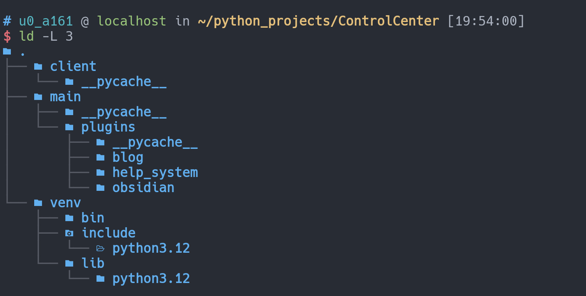
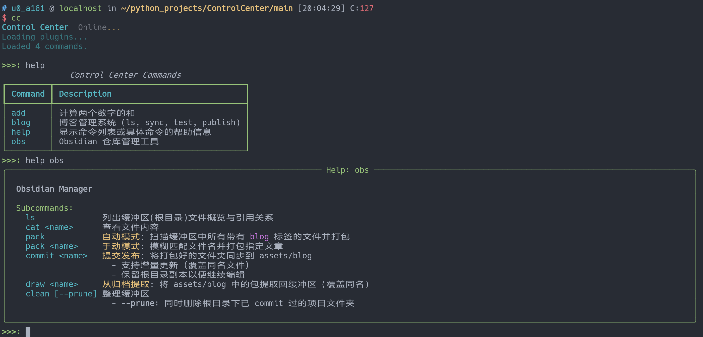
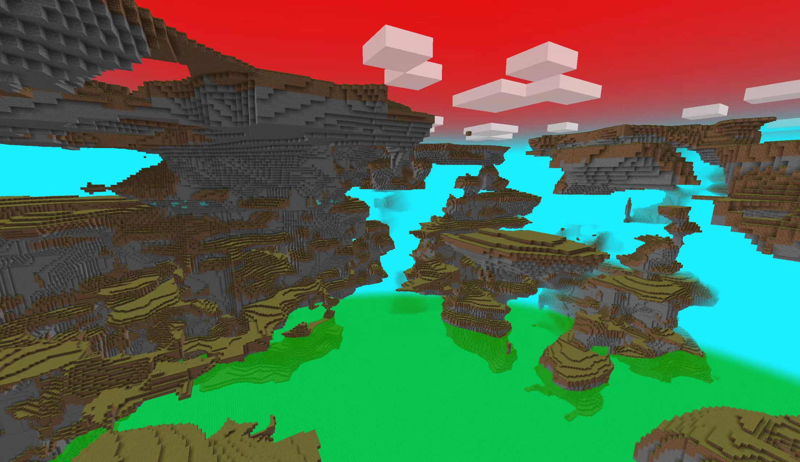

## 平板文件管理辅助系统

由于本人没有比较轻量的轻薄本，平时上课用的都是平板。我最大的心愿就是可以在平板上干所有电脑上能干的事情。比如日常的博客发布，每次都要手动把图片和markdown文件打包起来，然后还要打开电脑，把东西放进去再发布，实在太蠢了。既然文章都是在平板上写的，为什么不在平板上发布呢？

此外还有obsidian的文件管理，之前一直是基于俺寻思能行的文件结构组织obsidian的笔记，导致每写一个随笔第二天就消失在文件的海洋里了。

所以为了让整个流程更加懒狗，我使用vibe coding大法做了一个简单的可加装插件来拓展功能的文件管理系统，文件结构大致如下：

plugins目录下的每个文件夹（比如obsidian）或者单一文件（比如num_add.py）代表了一个插件。这里我暂时只写了4个插件：ob插件，负责管理obsidian文件和打包博客文；blog插件，负责双向同步博客文并发布；num_add，测试用插件；help，用来显示插件描述。

obs插件最后实现的效果是，在使用obsidian写笔记的时候，我可以完全不关心笔记如何整理，只要我进入cc后运行`obs clean`所有的根目录md文件都会被自动收纳进以日期命名的文件夹中。如果我想打包一个博客文，我只需要在这个笔记的标签处写入一个`blog`标签，在运行`obs pack`，它就可以自动打包为一个可以直接移动到博客源文件的文章包。以防你不知道，md文件是纯文本文件，如果想加图片必须和md文件打包在同一个文件夹才行。

总而言之，本质上这就是一个python脚本管理器，我可以通过这个程序集中地管理和运行python脚本。想要拓展功能也非常简单，只需要在插件里塞新内容即可。

## 平板数位板支持

数位板通常接在电脑上用来画画，但是为什么不能把数位板接在平板上来记笔记呢？

我知道这听起来可能很蠢，都用平板了为什么不直接用电容笔。对我来说一个不得不关注的现实情况是：我没有电容笔，但是我有数位板。其次是数位板的手感可能比电容笔要好得多，毕竟电容笔是直接在玻璃板上划拉的。

虽然这个理由对我来说足够充分了，但是对于android设备厂商来说并非如此。在平板上使用数位板在这个世界中是一个小众需求。所以我——没办法，我也没办法让平板和数位板很好的相互支持。所以如果有富哥看到这个文章可以考虑赞助我一个vivo电容笔。

我一开始尝试通过本地运行一个proot distro +termux x11的方式来适配数位板，理论上如果proot distro真的就是一个独立的linux系统，这样做是没问题的，可惜不是。经过一天的折腾最后也没办法让数位板在平板上稳定工作，遂放弃。

可能之后会考虑购入一个电容笔。

## Minecraft模组

模组是有在写的，只不过最近很不巧的和考试周撞了。

目前而言写模组的一个痛点在于我还不太能完全领悟java程序员的心智模型，简单来说就是我完全不知道那些模组开发者是怎么知道什么地方应该放什么文件和写什么代码的。模组不是重头开始写一个应用，而是在大多数开发场景中直接使用模组加载器提供的接口。这可能对于软件工程师是一项基本功，然而我还需要一定的时间适应这种写法。

不过，不写java代码其实也可以实现一些模组的制作。在1.18之后mojang开始推数据驱动，如果只是想改个世界生成、改个配方，或者调整战利品生成，在高版本直接写json数据包就可以实现了。所以最近花了一点点时间做了一个简单（其实是简陋）的新维度模组，大概效果如图：

总之坑已经挖了，之后慢慢填坑吧。我的一个大致构想是学一些基本的模组写法，之后尝试用写模组的方式来开发整合包，自己写模组来整合一些简单的小功能。

## termux x11游戏环境适配

在平板上玩移动游戏很常见，在电脑上玩steam游戏也很常见，那我们为什么不能在平板上玩电脑游戏呢？

总之通过proot distro + termux x11，我在平板上上配置了一个ubuntu系统+桌面环境。我希望的效果是能在这个环境下运行steam游戏。然而目前看来这可能会是有点难度的事情。在x86架构的linux电脑上运行游戏不难，在windows系统上运行游戏也不难，但是这是一个arm64架构的·平板的·看起来像linux发行版但是实际不是的·一个环境，想要运行游戏难度就有点大了。

暂时没有成功。

## 树莓派qq机器人

树莓派已经吃灰了几个月了，但是平时感觉真的很难抽出时间折腾。只能说先把flag立了，至于实现有缘再说。不过早晚要实现的，不然树莓派白买了。

## 寒假要做点什么？

可能把D2L学了，如果有时间可能会把cs61b顺带学了（因为感觉自己实际上写代码还是写的太少了，还是想要多手写一点代码来保持手感）。

